# Práctica de Configuración de VLANs y VTP

## 1. Configuración de los puertos entre switches como troncal (trunk) y desactivación de DTP

### SW1
```plaintext
SW1>en
SW1#conf t
SW1(config)#int g0/1
SW1(config-if)#switchport mode trunk
SW1(config-if)#switchport nonegotiate
SW1(config-if)#do sh int g0/1 sw
````


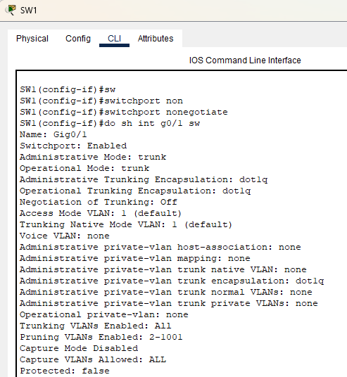

### SW2

```plaintext
SW2>en
SW2#conf t
SW2(config)#int range g0/1-2
SW2(config-if-range)#switchport mode trunk
SW2(config-if-range)#switchport nonegotiate
SW2(config-if-range)#do sh int g0/1 sw
SW2(config-if-range)#do sh int g0/2 sw
```


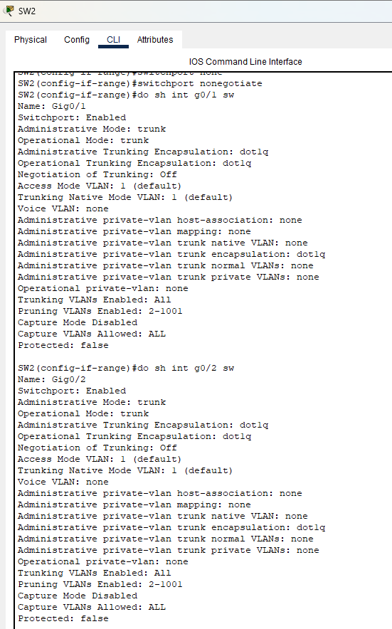

### SW3

```plaintext
SW3>en
SW3#conf t
SW3(config)#int g0/1
SW3(config-if)#switchport mode trunk
SW3(config-if)#switchport nonegotiate
SW3(config-if)#do sh int g0/2 sw
```


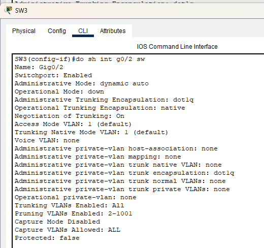

---

## 2. Configuración de SW1 en dominio VTP CCNA y creación de VLANs

### SW1

```plaintext
SW1>en
SW1#conf t
SW1(config)#vtp domain CCNA
SW1(config)#vlan 10
SW1(config-vlan)#vlan 20
SW1(config-vlan)#vlan 30
SW1(config)#do sh vtp status
```


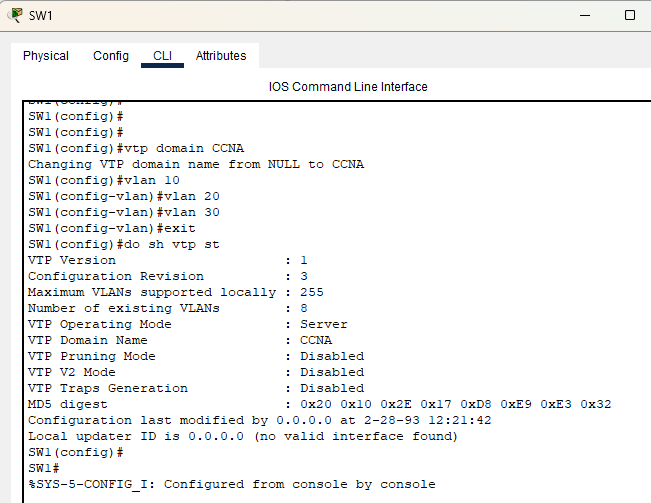

### SW2 y SW3

```plaintext
SW2(config)#do sh vtp status
SW2(config)#do sh vlan brief

SW3(config)#do sh vtp status
SW3(config)#do sh vlan brief
```

**Imagenes:**

* SW2 VLANs: 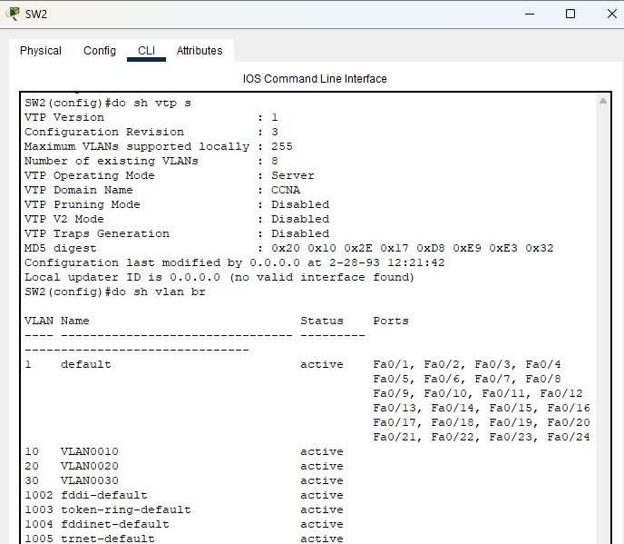
* SW3 VLANs: 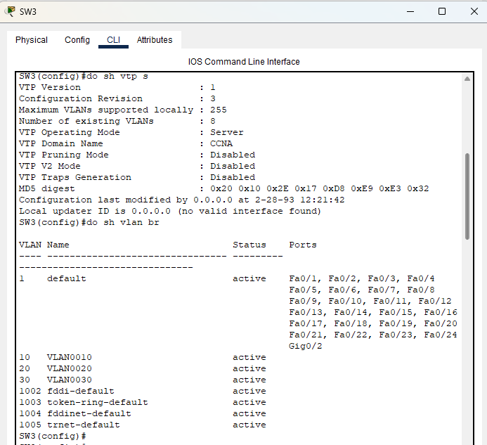

---

## 3. Configuración de SW2 en modo VTP Transparent y creación de VLAN40

```plaintext
SW2>en
SW2#conf t
SW2(config)#vtp mode transparent
SW2(config)#vlan 40
SW2(config)#int range f0/1-2
SW2(config-if-range)#switchport mode access
SW2(config-if-range)#switchport access vlan 40
```


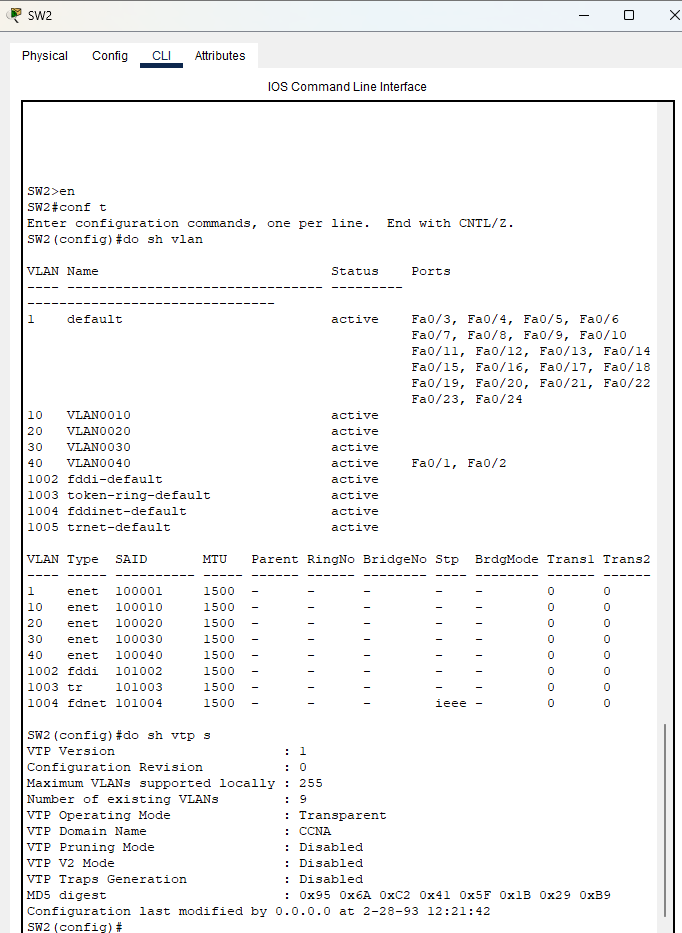

> VLAN40 solo existe en SW2 y no se propaga.

---

## 4. Configuración de SW3 en modo VTP Client y prueba de VLAN50

```plaintext
SW3>en
SW3#conf t
SW3(config)#vtp mode client
SW3(config)#vlan 50
SW3(config)#do sh vlan brief
SW3(config)#do sh vtp status
```


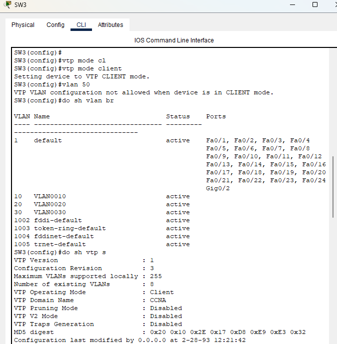

> VLAN50 no se puede crear; SW3 solo recibe VLANs del servidor (10, 20, 30).

---

## 5. Configuración de puertos de acceso para hosts en las VLAN correctas

### SW1

```plaintext
SW1>en
SW1#conf t
SW1(config)#int range f0/1-2
SW1(config-if-range)#switchport mode access
SW1(config-if-range)#switchport access vlan 10

SW1(config)#int f0/3
SW1(config-if)#switchport mode access
SW1(config-if)#switchport access vlan 20
```


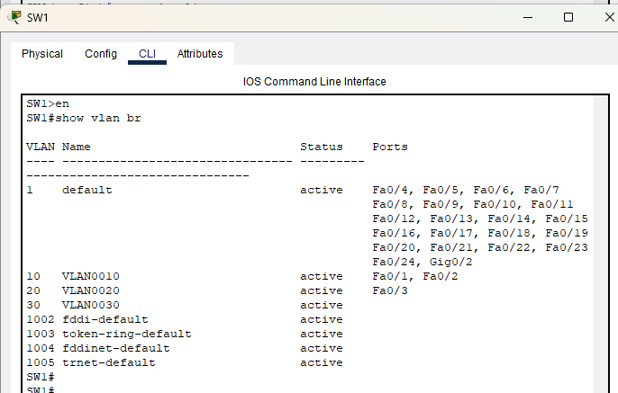

### SW2

```plaintext
SW2>en
SW2#conf t
SW2(config)#int range f0/1-2
SW2(config-if-range)#switchport mode access
SW2(config-if-range)#switchport access vlan 40
```


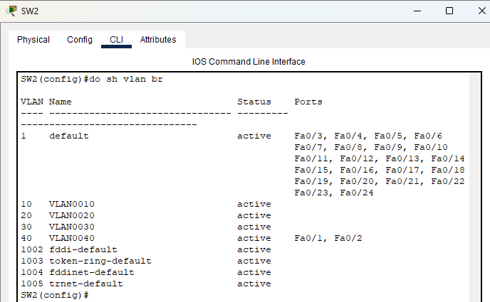

### SW3

```plaintext
SW3>en
SW3#conf t
SW3(config)#int f0/1
SW3(config-if)#switchport mode access
SW3(config-if)#switchport access vlan 10

SW3(config)#int range f0/2-3
SW3(config-if-range)#switchport mode access
SW3(config-if-range)#switchport access vlan 30

SW3(config)#int f0/4
SW3(config-if)#switchport mode access
SW3(config-if)#switchport access vlan 20
```


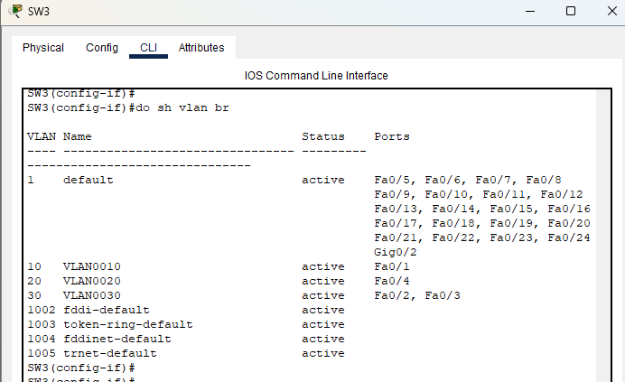

---

## ✅ Resumen de la topología final

| Switch | Modo VTP    | VLANs disponibles | Puertos de acceso configurados                   |
| ------ | ----------- | ----------------- | ------------------------------------------------ |
| SW1    | Server      | 10, 20, 30        | Fa0/1-2 → VLAN10, Fa0/3 → VLAN20                 |
| SW2    | Transparent | 10, 20, 30, 40    | Fa0/1-2 → VLAN40                                 |
| SW3    | Client      | 10, 20, 30        | Fa0/1 → VLAN10, Fa0/2-3 → VLAN30, Fa0/4 → VLAN20 |

**Imagen de topología:**

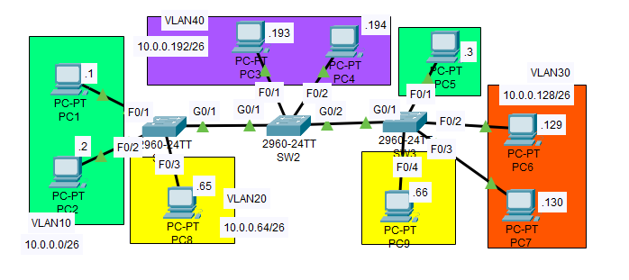


