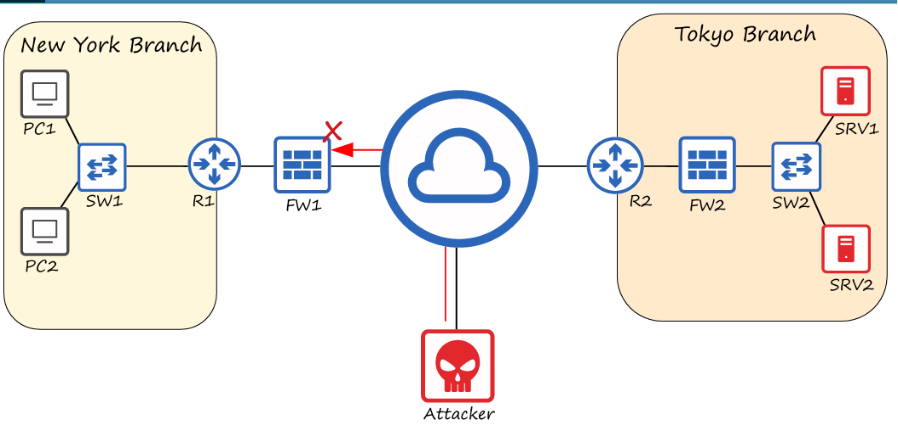
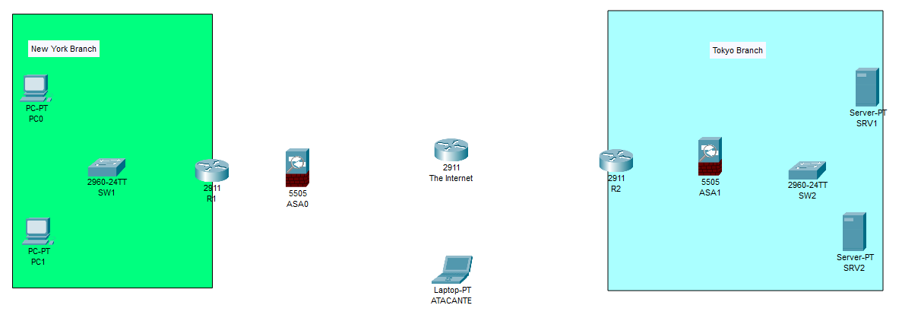
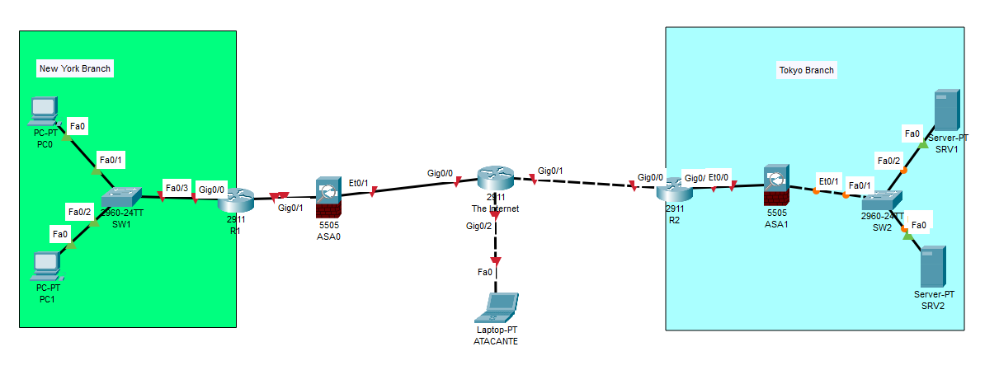

👨‍💻 Laboratorio: Creación de Topología de Red en Packet Tracer

📋 Instrucciones del Laboratorio

Este laboratorio práctico se enfoca en la construcción de una topología de red básica en Cisco Packet Tracer. 

El objetivo es familiarizarse con los dispositivos y sus interconexiones.

Dispositivos Necesarios:
Routers: 2x Cisco 2911

Switches: 2x Cisco 2960

Firewalls: 2x Cisco 5505

PCs: 2x PCs de escritorio

Servidores: 2x Servidores

Laptop: 1x Laptop (simulará a un atacante)

Pasos para la Conexión:
Abre Packet Tracer y arrastra todos los dispositivos al área de trabajo.

Utiliza la herramienta "Automatically Choose Connection Type" (el ícono del rayo) para conectar los dispositivos.

Organiza los dispositivos siguiendo la topología mostrada en el video.

📸 Documentación del Proceso

Topologia a Armar.

Paso 1: Antes de Conectar
(Aquí debes insertar tu imagen de los dispositivos sin conexión. Por ejemplo: 

Paso 2: Topología Final

eflexión del Laboratorio
En este laboratorio, aprendi a usar la herramienta de conexión automática de Packet Tracer.

identifique los dispositivos clave en una red y su rol en la interconexión.

Confirme que no se necesita ninguna configuración en este punto para que los dispositivos se conecten físicamente.