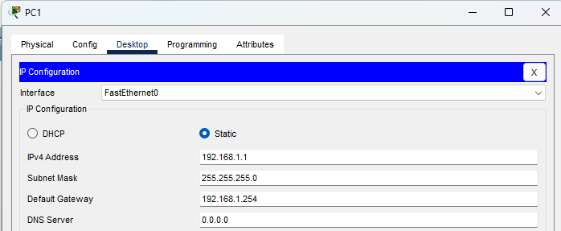
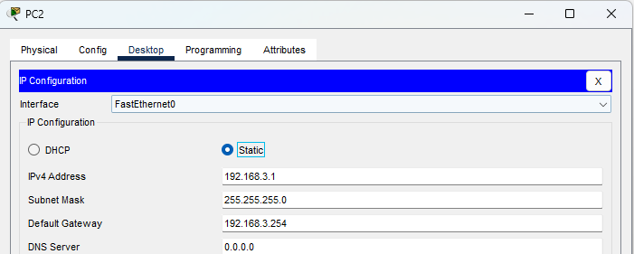
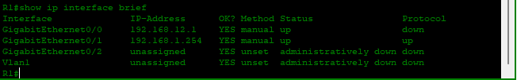
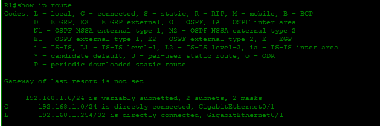
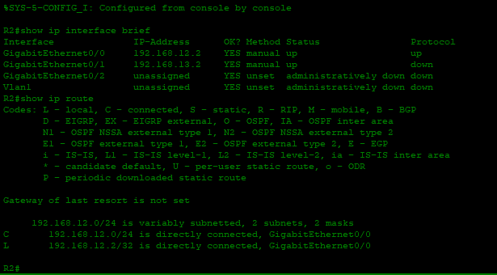
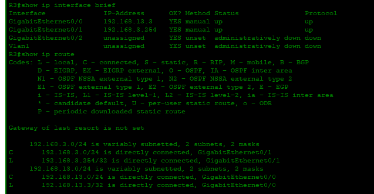
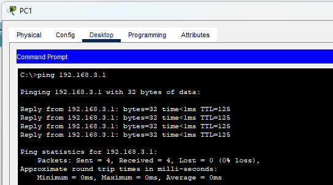
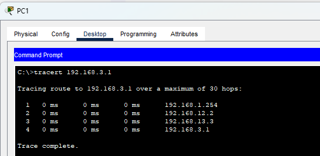

# Día 1 — Configuración y Ruteo Estático (CCNA)

## Objetivo
Documentación paso a paso de la configuración completa realizada para habilitar comunicación entre **PC1** (red 192.168.1.0/24) y **PC2** (red 192.168.3.0/24) usando **rutas estáticas** en los routers R1, R2 y R3. 

## Topología
La topología utilizada se resume en la siguiente imagen y en la tabla de direccionamiento. Los dispositivos no tenían configuraciones previas.


## Plan de direccionamiento

| Dispositivo / Host | Interfaz / Rol | Dirección IP / Máscara |
| ------------- |:-------------:| ------------- |
| PC1 | Interfaz LAN | **192.168.1.10 / 255.255.255.0** (Gateway: **192.168.1.254**) |
| R1 | G0/1 (hacia LAN PC1) | **192.168.1.254 / 255.255.255.0** |
| R1 | G0/0 (hacia R2) | **192.168.12.1 / 255.255.255.0** |
| R2 | G0/0 (hacia R1) | **192.168.12.2 / 255.255.255.0** |
| R2 | G0/1 (hacia R3) | **192.168.13.2 / 255.255.255.0** |
| R3 | G0/0 (hacia R2) | **192.168.13.3 / 255.255.255.0** |
| R3 | G0/1 (hacia LAN PC2) | **192.168.3.254 / 255.255.255.0** |
| PC2 | Interfaz LAN | **192.168.3.10 / 255.255.255.0** (Gateway: **192.168.3.254**) |

---

## Configuración realizada (paso a paso)

### 1) Configuración de los PCs
Se configuraron las IP estáticas y gateway en cada PC.

**PC1 (ya configurado):**
* IP: `192.168.1.10`
* Máscara: `255.255.255.0`
* Puerta de enlace: `192.168.1.254`



**PC2 (ya configurado):**
* IP: `192.168.3.10`
* Máscara: `255.255.255.0`
* Puerta de enlace: `192.168.3.254`



> Nota: No se configuraron los switches (solo se conectaron físicamente los hosts a los puertos del switch).

---

### 2) Configuración de R1 (comandos aplicados)
Se accedió a R1 y se aplicaron los siguientes comandos (modo privilegiado/configuración global/interfaz):

```

enable
configure terminal
hostname R1
no ip domain-lookup

interface GigabitEthernet0/0
description Link to R2
ip address 192.168.12.1 255.255.255.0
no shutdown

interface GigabitEthernet0/1
description LAN PC1
ip address 192.168.1.254 255.255.255.0
no shutdown

end
write memory

```

**Comprobaciones en R1:**
* `show ip interface brief`
* `show ip route`




---

### 3) Configuración de R2 (comandos aplicados)

```

enable
configure terminal
hostname R2
no ip domain-lookup

interface GigabitEthernet0/0
description Link to R1
ip address 192.168.12.2 255.255.255.0
no shutdown

interface GigabitEthernet0/1
description Link to R3
ip address 192.168.13.2 255.255.255.0
no shutdown

end
write memory

```

**Comprobaciones en R2:**
* `show ip interface brief`
* `show ip route`



---

### 4) Configuración de R3 (comandos aplicados)

```

enable
configure terminal
hostname R3
no ip domain-lookup

interface GigabitEthernet0/0
description Link to R2
ip address 192.168.13.3 255.255.255.0
no shutdown

interface GigabitEthernet0/1
description LAN PC2
ip address 192.168.3.254 255.255.255.0
no shutdown

end
write memory

```

**Comprobaciones en R3:**
* `show ip interface brief`
* `show ip route`



---

### 5) Rutas estáticas configuradas
Se añadieron rutas estáticas en cada router para que el tráfico entre 192.168.1.0/24 y 192.168.3.0/24 pueda atravesar la cadena R1 → R2 → R3.

**En R1 (se alcanzó 192.168.3.0 vía R2):**
```

configure terminal
ip route 192.168.3.0 255.255.255.0 192.168.12.2
end
write memory

```

**En R2 (se añadieron rutas hacia ambas LANs no conectadas directamente):**
```

configure terminal
ip route 192.168.1.0 255.255.255.0 192.168.12.1
ip route 192.168.3.0 255.255.255.0 192.168.13.3
end
write memory

```

**En R3 (se alcanzó 192.168.1.0 vía R2):**
```

configure terminal
ip route 192.168.1.0 255.255.255.0 192.168.13.2
end
write memory

```

> Consejo: las rutas configuradas son específicas y garantizan que cada router conozca las redes no directamente conectadas a él.

---

## Verificación (pasos que se ejecutaron y resultados)

1. Desde **PC1**:
   * `ping 192.168.1.254` → respuesta local (gateway).
   * `ping 192.168.3.10` → **OK** (PC2 respondía).
   * Captura del ping:  
     

2. Desde **R1**:
   * `show ip route` → se observó la ruta estática hacia 192.168.3.0/24.
   * `ping 192.168.3.10` → **OK**.

3. Desde **R3**:
   * `show ip route` → se observó la ruta estática hacia 192.168.1.0/24.
   * `ping 192.168.1.10` → **OK**.

4. Trazado de ruta (opcional):
   * `traceroute 192.168.3.10` desde R1 o PC1 para verificar pasos R1 → R2 → R3.  
     

---

## Listas de comandos rápidos (resumen)

### Comandos útiles en routers (ejemplos)
* `enable`  
* `configure terminal`  
* `hostname R1`  
* `interface GigabitEthernet0/0`  
* `ip address 192.168.12.1 255.255.255.0`  
* `no shutdown`  
* `ip route 192.168.3.0 255.255.255.0 192.168.12.2`  
* `show ip route`  
* `show ip interface brief`  

### Pasos ordenados ejecutados
1. Configurar IPs en PC1 y PC2 (gateway correcto).  
2. Configurar interfaces y direcciones en R1, R2, R3.  
3. Añadir rutas estáticas en R1, R2 y R3.  
4. Verificar con `show` y `ping`.  
5. Documentar resultados y capturas.


---

## Notas y recomendaciones finales

> **Importante:** Si alguna de las comprobaciones falla, revisar en orden:
> 1. Conectividad física (cables / puertos del switch).  
> 2. Configuración IP en PC (IP, máscara, gateway).  
> 3. Estado de interfaces (`show ip interface brief`).  
> 4. Tabla de rutas (`show ip route`) en cada router.

**Resumen:** La topología quedó configurada con las IPs indicadas, las rutas estáticas fueron aplicadas en cada router y la comunicación **PC1 ↔ PC2** fue verificada con `ping` y `traceroute`. 

---

## Referencias rápidas (comandos en línea)
* `show ip route` — Ver tabla de ruteo.  
* `show ip interface brief` — Ver interfaces y estado.  
* `ping <ip>` — Prueba de conectividad.  
* `traceroute <ip>` — Ver salto por salto.
