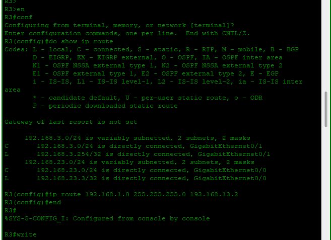
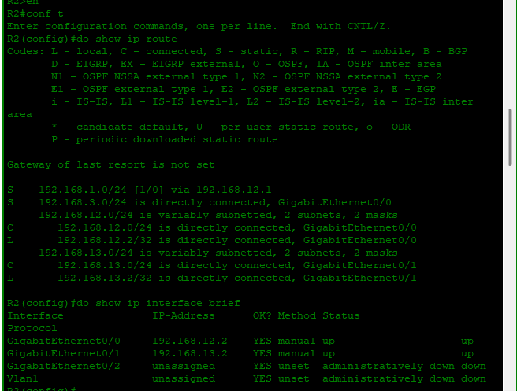
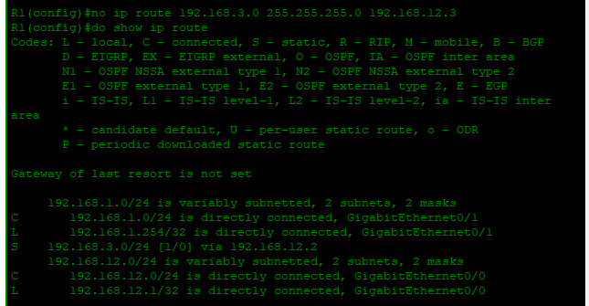
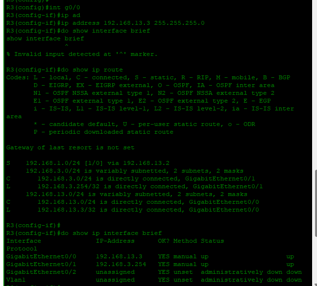
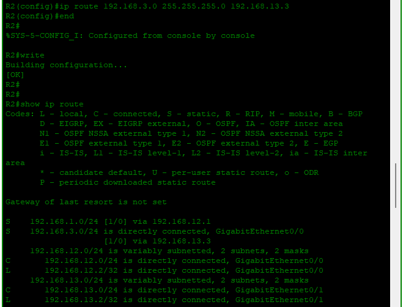
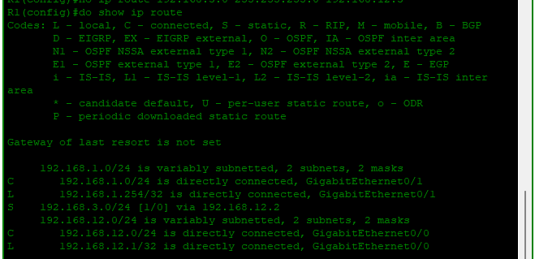
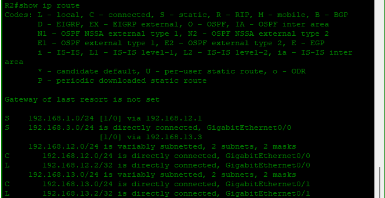
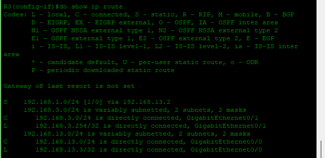

# Dia 11 - Troubleshooting

## 1. Problemas Identificados

**R1:**  
- Ruta estática hacia 192.168.3.0/24 configurada con next-hop incorrecto:  
  ```text
  ip route 192.168.3.0 255.255.255.0 192.168.12.3  (incorrecta)


* La IP `192.168.12.3` no era alcanzable desde R1.
* Resultado: la ruta no funcionaba correctamente.


**R3:**

* Interface GigabitEthernet0/0 tenía IP incorrecta:

  ```text
  192.168.23.3/24  (incorrecta)
  ```

  * No estaba en la subred de interconexión con R2 (`192.168.13.0/24`).
  * Resultado: rutas estáticas hacia redes adyacentes no se instalaban.



**R2:**

* Inicialmente no se había configurado la ruta estática hacia 192.168.3.0/24 a través de R3.



---

## 2. Soluciones Aplicadas

**R1:**

* Se corrigió la ruta estática:

  ```text
  no ip route 192.168.3.0 255.255.255.0 192.168.12.3
  ip route 192.168.3.0 255.255.255.0 192.168.12.2
  ```

  * Ahora el next-hop apunta a la IP correcta de R2 (`192.168.12.2`).


**R3:**

* Se configuró la IP correcta en GigabitEthernet0/0:

  ```text
  interface GigabitEthernet0/0
  ip address 192.168.13.3 255.255.255.0
  no shutdown
  ```

  * La interfaz quedó up/up y en la subred correcta para la interconexión R2–R3.


**R2:**


* Se configuró la ruta estática hacia 192.168.3.0/24 a través de R3:

  ```text
  ip route 192.168.3.0 255.255.255.0 192.168.13.3
  ```



---

## 3. Resultados Verificados

* Todas las interfaces relevantes quedaron **up/up**.
* Las rutas estáticas correctas se instalaron y son visibles en la tabla de enrutamiento (`show ip route`).
* Conectividad entre redes: R1 ↔ R2 ↔ R3 funcionando correctamente.
* Mensajes de `%SYS-5-CONFIG_I` confirman que los cambios fueron guardados con `write`.


## Tabla de rutas final

A continuación se muestra la tabla de rutas final de los routers R1, R2 y R3 después de la corrección de rutas estáticas e interfaces.

### **R1 – Tabla de rutas final**

| Red destino       | Tipo   | Next-hop / Interfaz           |
|------------------|:------:|-----------------------------|
| 192.168.1.0/24    | C      | GigabitEthernet0/1           |
| 192.168.1.254/32  | L      | GigabitEthernet0/1           |
| 192.168.3.0/24    | S      | 192.168.12.2                 |
| 192.168.12.0/24   | C      | GigabitEthernet0/0           |
| 192.168.12.1/32   | L      | GigabitEthernet0/0           |



---

### **R2 – Tabla de rutas final**

| Red destino       | Tipo   | Next-hop / Interfaz           |
|------------------|:------:|-----------------------------|
| 192.168.1.0/24    | S      | 192.168.12.1                 |
| 192.168.3.0/24    | S      | 192.168.13.3                 |
| 192.168.12.0/24   | C      | GigabitEthernet0/0           |
| 192.168.12.2/32   | L      | GigabitEthernet0/0           |
| 192.168.13.0/24   | C      | GigabitEthernet0/1           |
| 192.168.13.2/32   | L      | GigabitEthernet0/1           |



---

### **R3 – Tabla de rutas final**

| Red destino       | Tipo   | Next-hop / Interfaz           |
|------------------|:------:|-----------------------------|
| 192.168.1.0/24    | S      | 192.168.13.2                 |
| 192.168.3.0/24    | C      | GigabitEthernet0/1           |
| 192.168.3.254/32  | L      | GigabitEthernet0/1           |
| 192.168.13.0/24   | C      | GigabitEthernet0/0           |
| 192.168.13.3/32   | L      | GigabitEthernet0/0           |




---

## 4. Buenas prácticas destacadas

| Práctica                            |                                  Descripción                                  |
| ----------------------------------- | :---------------------------------------------------------------------------: |
| Verificar next-hop reachable        | Antes de configurar rutas estáticas, confirmar que el next-hop sea accesible. |
| Configurar IP en la subred correcta |     Asegura que las interfaces puedan comunicarse con routers adyacentes.     |
| Validar conectividad                | Usar `show ip route` y `show ip interface brief` después de configurar rutas. |
| Guardar configuración               |  Usar `write` tras cualquier cambio crítico para preservar la configuración.  |


