# Diseño de Red VLSM Ajustado

Este documento detalla el diseño, subnetting, configuración y verificación de una red utilizando VLSM (Variable Length Subnet Mask) y rutas estáticas para garantizar la conectividad total.

---

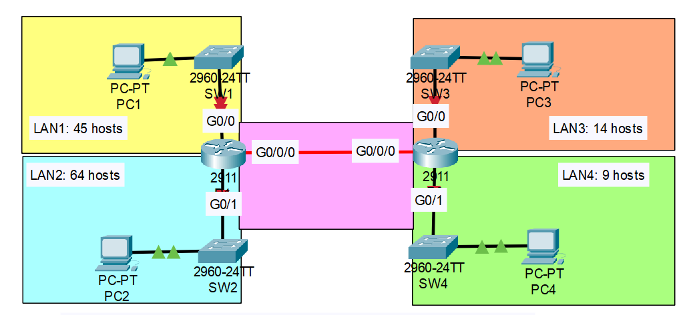


## Paso 1: LANs ordenadas por tamaño

Para optimizar el uso del espacio de direccionamiento IP, primero ordenamos las redes locales (LANs) de mayor a menor según la cantidad de hosts requeridos.

| LAN           | Hosts requeridos |
| ------------- | ---------------- |
| LAN 2         | 64               |
| LAN 1         | 45               |
| LAN 3         | 14               |
| LAN 4         | 9                |
| Punto a Punto | 2                |

---

## Paso 2: Subnetting

A partir de la red base `192.168.5.0`, calculamos las subredes necesarias para cada LAN.

### LAN 2 (64 hosts)

* Hosts requeridos: 64 → +2 (red y broadcast) → 66 → Se necesita una máscara que permita al menos 66 direcciones.
* Cálculo: $2^7 = 128$. Esto nos da una máscara de subred de `/25`.
* Rango: **192.168.5.0/25**
* **Primera IP (PCs):** 192.168.5.1
* **Última IP (Router):** 192.168.5.126
* Broadcast: 192.168.5.127

### LAN 1 (45 hosts)

* Hosts requeridos: 45 → +2 → 47 → Se necesita una máscara que permita al menos 47 direcciones.
* Cálculo: $2^6 = 64$. Esto nos da una máscara de subred de `/26`.
* Rango: **192.168.5.128/26**
* **Primera IP (PCs):** 192.168.5.129
* **Última IP (Router):** 192.168.5.190
* Broadcast: 192.168.5.191

### LAN 3 (14 hosts)

* Hosts requeridos: 14 → +2 → 16 → Se necesita una máscara que permita al menos 16 direcciones.
* Cálculo: $2^4 = 16$. Esto nos da una máscara de subred de `/28`.
* Rango: **192.168.5.192/28**
* **Primera IP (PCs):** 192.168.5.193
* **Última IP (Router):** 192.168.5.206
* Broadcast: 192.168.5.207

### LAN 4 (9 hosts)

* Hosts requeridos: 9 → +2 → 11 → Se necesita una máscara que permita al menos 11 direcciones.
* Cálculo: $2^4 = 16$. Esto nos da una máscara de subred de `/28`.
* Rango: **192.168.5.208/28**
* **Primera IP (PCs):** 192.168.5.209
* **Última IP (Router):** 192.168.5.222
* Broadcast: 192.168.5.223

### Punto a Punto (2 hosts)

* Hosts requeridos: 2 (para los dos extremos del router) → +2 → 4.
* Cálculo: $2^2 = 4$. Esto nos da una máscara de subred de `/30`.
* Rango: **192.168.5.224/30**
* **IP R2:** 192.168.5.225 (primera usable)
* **IP R1:** 192.168.5.226 (última usable)
* Broadcast: 192.168.5.227

---

## Paso 3: Resumen de Subredes

La siguiente tabla consolida el plan de direccionamiento IP para toda la red.

| Red       | Hosts Req. | Red              | Máscara         | Primera IP (PC)    | Última IP (Router) | Broadcast     |
| --------- | ---------- | ---------------- | --------------- | ------------------ | ------------------ | ------------- |
| LAN 2     | 64         | 192.168.5.0/25   | 255.255.255.128 | 192.168.5.1        | 192.168.5.126      | 192.168.5.127 |
| LAN 1     | 45         | 192.168.5.128/26 | 255.255.255.192 | 192.168.5.129      | 192.168.5.190      | 192.168.5.191 |
| LAN 3     | 14         | 192.168.5.192/28 | 255.255.255.240 | 192.168.5.193      | 192.168.5.206      | 192.168.5.207 |
| LAN 4     | 9          | 192.168.5.208/28 | 255.255.255.240 | 192.168.5.209      | 192.168.5.222      | 192.168.5.223 |
| Pto-a-Pto | 2          | 192.168.5.224/30 | 255.255.255.252 | 192.168.5.225 (R2) | 192.168.5.226 (R1) | 192.168.5.227 |


---

## Paso 4: Asignación a Routers

Asignación de las direcciones IP a las interfaces de cada router.

### Router 1 (R1)

| Interfaz | LAN/Enlace | IP               |
| -------- | ---------- | ---------------- |
| g0/0     | LAN 1      | 192.168.5.190/26 |
| g0/1     | LAN 2      | 192.168.5.126/25 |
| g0/0/0   | PtoP       | 192.168.5.226/30 |

### Router 2 (R2)

| Interfaz | LAN/Enlace | IP               |
| -------- | ---------- | ---------------- |
| g0/0     | LAN 3      | 192.168.5.206/28 |
| g0/1     | LAN 4      | 192.168.5.222/28 |
| g0/0/0   | PtoP       | 192.168.5.225/30 |

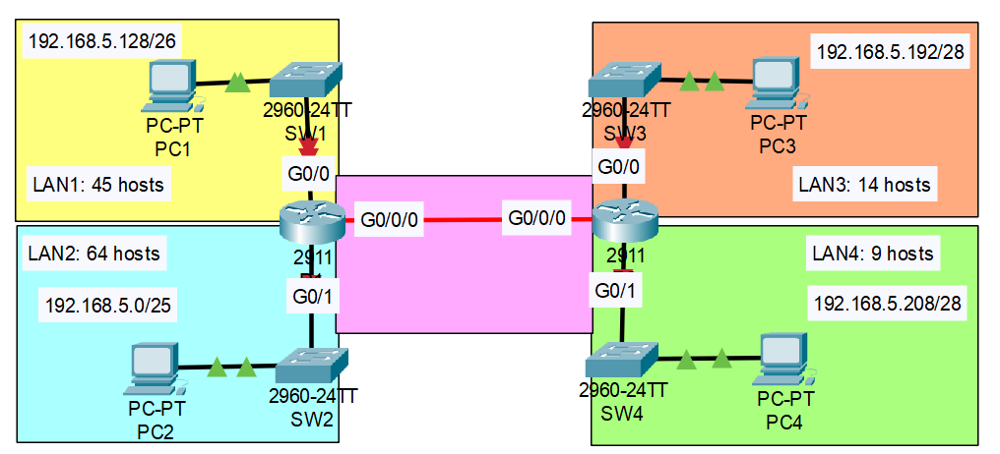

---

## Paso 5: Configuración mínima de routers

Configuraciones básicas de IOS para cada router, incluyendo las interfaces y las rutas estáticas.

### Router 1 (R1)

```ios
! Router 1 (R1)
enable
configure terminal

! Configuración de Interfaces
interface GigabitEthernet0/0
 description LAN1
 ip address 192.168.5.190 255.255.255.192
 no shutdown
 exit

interface GigabitEthernet0/1
 description LAN2
 ip address 192.168.5.126 255.255.255.128
 no shutdown
 exit

interface GigabitEthernet0/0/0
 description PtoP_R2
 ip address 192.168.5.226 255.255.255.252
 no shutdown
 exit

! Rutas estáticas hacia las redes conectadas a R2
ip route 192.168.5.192 255.255.255.240 192.168.5.225
ip route 192.168.5.208 255.255.255.240 192.168.5.225

end
````

### Router 2 (R2)

```ios
! Router 2 (R2)
enable
configure terminal

! Configuración de Interfaces
interface GigabitEthernet0/0
 description LAN3
 ip address 192.168.5.206 255.255.255.240
 no shutdown
interface GigabitEthernet0/1
 description LAN4
 ip address 192.168.5.222 255.255.255.240
 no shutdown
interface GigabitEthernet0/0/0
 description PtoP_R1
 ip address 192.168.5.225 255.255.255.252
 no shutdown
 exit
! Rutas estáticas hacia las redes conectadas a R1
ip route 192.168.5.0   255.255.255.128 192.168.5.226
ip route 192.168.5.128 255.255.255.192 192.168.5.226
end
write
```
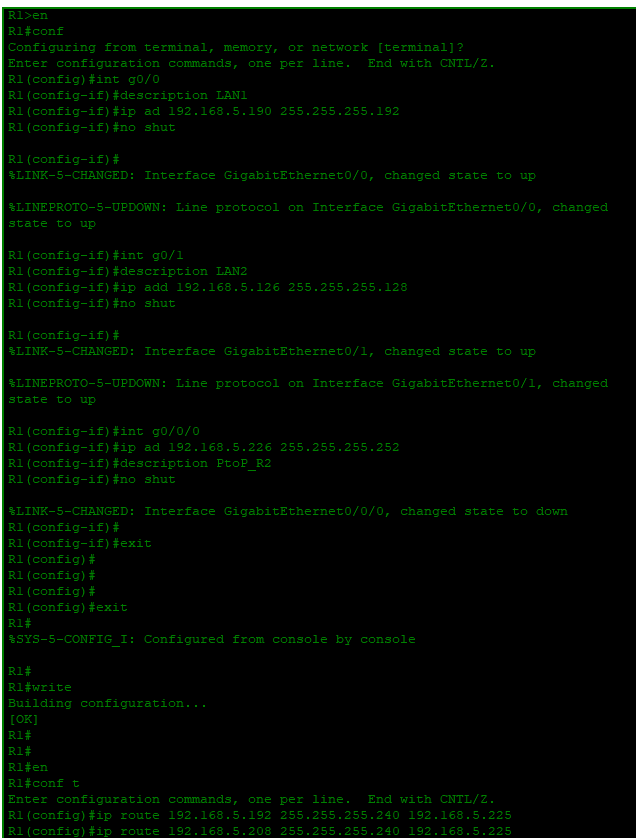
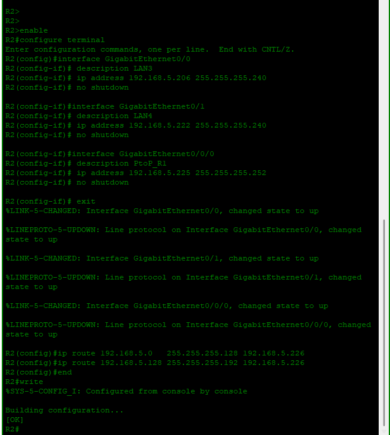

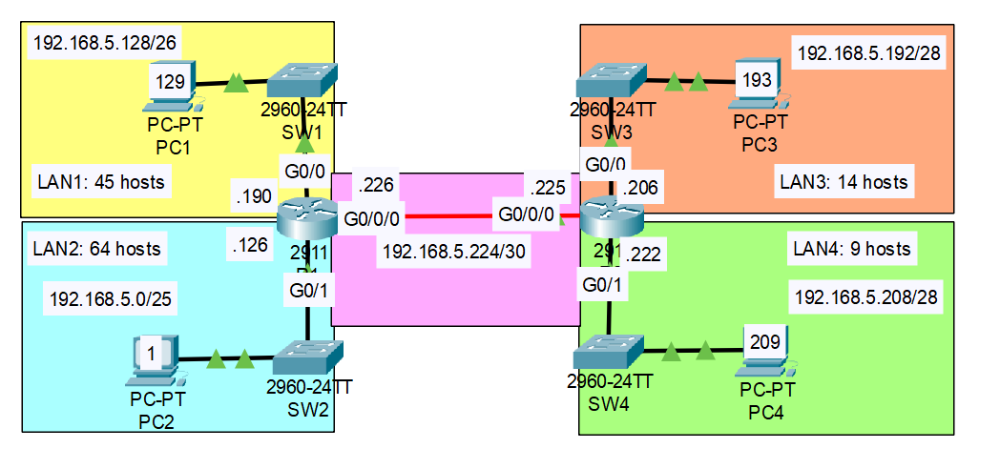
-----
## Paso 6: Configuración de Equipos Host (PCs)

Para que la red funcione, cada PC debe tener una configuración IP estática correcta. Según nuestro plan, cada PC usará la **primera dirección IP usable** de su subred y apuntará a la **última IP usable** (la interfaz del router en esa LAN) como su puerta de enlace predeterminada.

### PC en LAN 1 (PC1)

* **Dirección IP:** `192.168.5.129`
* **Máscara de Subred:** `255.255.255.192`
* **Puerta de Enlace (Gateway):** `192.168.5.190`

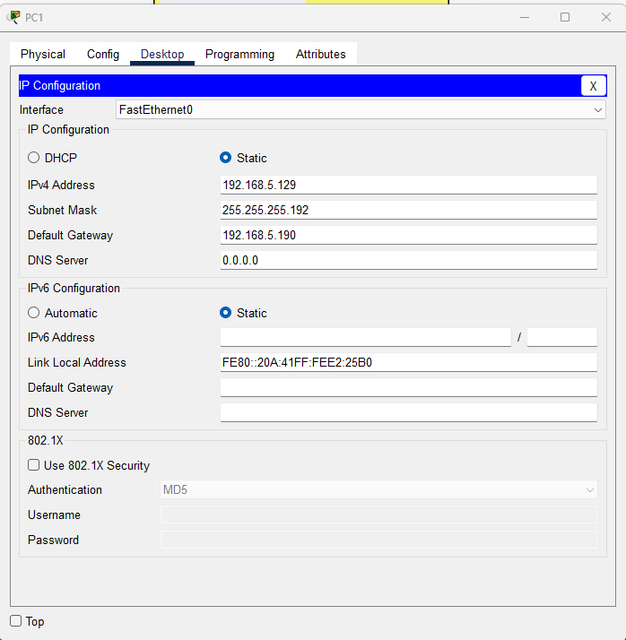

### PC en LAN 2 (PC2)

* **Dirección IP:** `192.168.5.1`
* **Máscara de Subred:** `255.255.255.128`
* **Puerta de Enlace (Gateway):** `192.168.5.126`

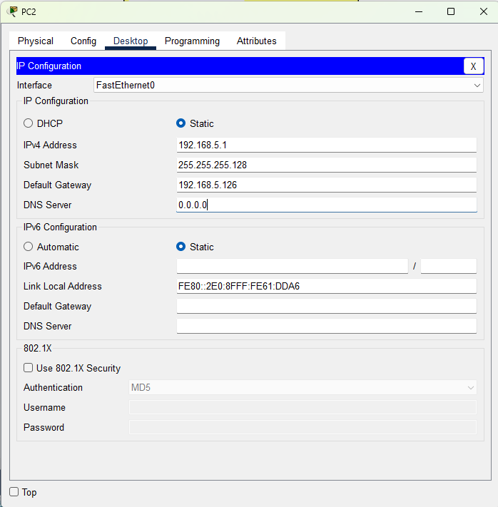

### PC en LAN 3 (PC3)

* **Dirección IP:** `192.168.5.193`
* **Máscara de Subred:** `255.255.255.240`
* **Puerta de Enlace (Gateway):** `192.168.5.206`

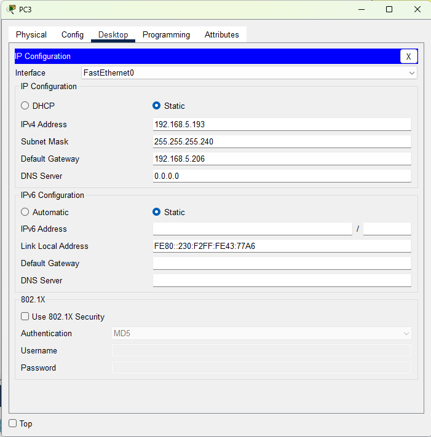

### PC en LAN 4 (PC4)

* **Dirección IP:** `192.168.5.209`
* **Máscara de Subred:** `255.255.255.240`
* **Puerta de Enlace (Gateway):** `192.168.5.222`

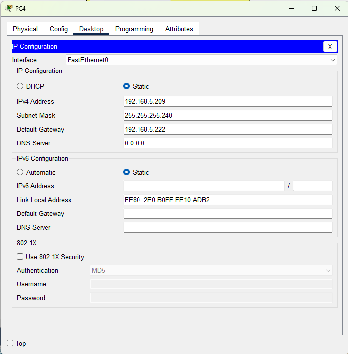

---

## Paso 7: Verificación y Pruebas de Conectividad

Una vez configurados los routers y los PCs, realizamos un conjunto de pruebas exhaustivas para verificar la conectividad local y remota, confirmando que el enrutamiento estático funciona correctamente.

---

### Pruebas desde PC1 (LAN 1)

#### **Prueba 1.1: Ping al Gateway Local (PC1 → R1)**

Verifica la conectividad básica entre el host y su router local. Es el primer paso para diagnosticar problemas.

```bash
# Desde la terminal de PC1 (192.168.5.129)
ping 192.168.5.190
```
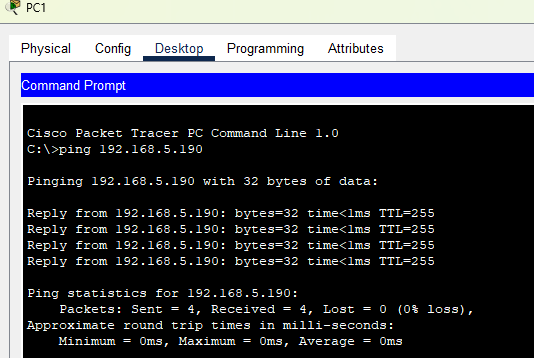

#### **Prueba 1.2: Ping a un PC en la misma zona (PC1 → PC2)**

Confirma la conectividad entre dos LANs conectadas al mismo router (R1).

```bash
# Desde la terminal de PC1 (192.168.5.129)
ping 192.168.5.1
```
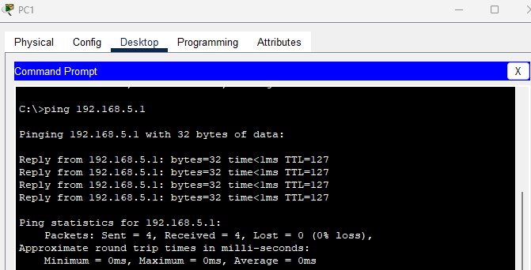

#### **Prueba 1.3: Ping a un PC en una red remota (PC1 → PC3)**

Esta es la prueba clave. Verifica que el enrutamiento estático entre R1 y R2 funciona, permitiendo la comunicación de extremo a extremo.

```bash
# Desde la terminal de PC1 (192.168.5.129)
ping 192.168.5.193
```
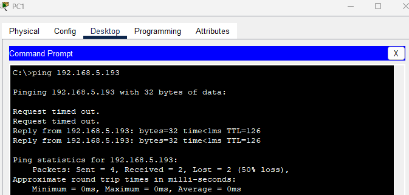

#### **Prueba 1.4: Trazado de Ruta a una red remota (PC1 → PC4)**

Muestra el camino exacto que toman los paquetes, permitiendo ver cada "salto" a través de los routers.

```bash
# Desde la terminal de PC1 (192.168.5.129)
tracert 192.168.5.209
```
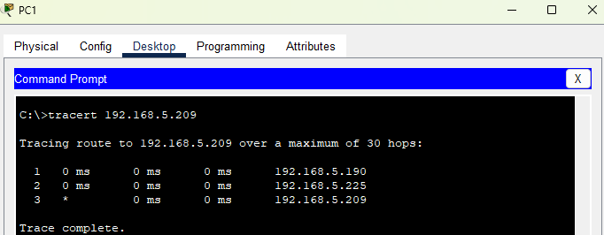

---

### Pruebas desde PC3 (LAN 3)

#### **Prueba 2.1: Ping a la IP del enlace del router opuesto (PC3 → R1)**

Confirma que se puede alcanzar la interfaz del router remoto, una excelente prueba de enrutamiento.

```bash
# Desde la terminal de PC3 (192.168.5.193)
ping 192.168.5.226
```
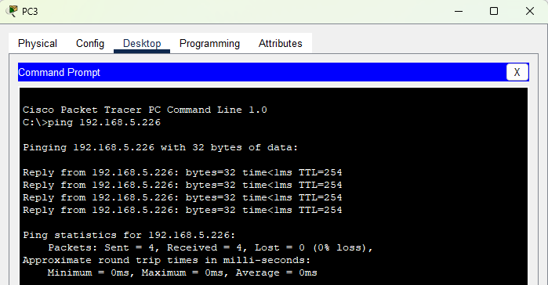

#### **Prueba 2.2: Ping de regreso a un PC remoto (PC3 → PC1)**

Verifica la comunicación en la dirección opuesta, asegurando que las rutas estáticas en R2 están funcionando correctamente.

```bash
# Desde la terminal de PC3 (192.168.5.193)
ping 192.168.5.129
```
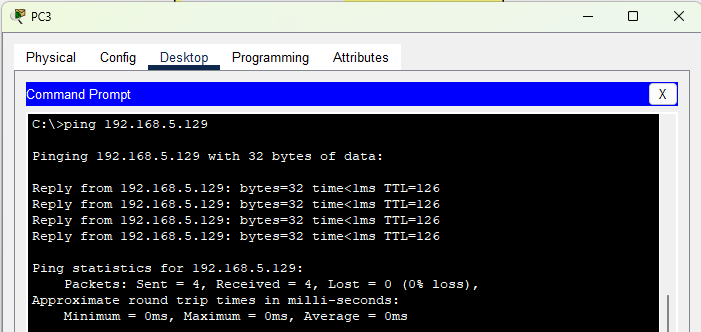

Con estas pruebas, se confirma que el diseño VLSM, la configuración de los routers con rutas estáticas y la configuración de los hosts son correctos, permitiendo la comunicación total en la red.

```
```