# 📡 Dia 16 - Laboratorio de VLANS (versión resumida)

## 📝 Instrucciones cumplidas
1. Se configuraron las **direcciones IP y máscaras** en cada PC.  
   - La **gateway** de cada PC corresponde a la **última dirección usable del subnet**.  
2. Se realizaron **tres conexiones entre el router R1 y el switch SW1**.  
   - Cada interfaz de R1 corresponde a una VLAN distinta.  
3. Se configuraron las **interfaces del switch SW1 en las VLANs correctas**.  
   - Se crearon y nombraron las VLANs:  
     - VLAN 10 → `Engineering`  
     - VLAN 20 → `HR`  
     - VLAN 30 → `Sales`  
4. Se verificó la conectividad entre PCs mediante **ping y broadcast ping** en Packet Tracer.  

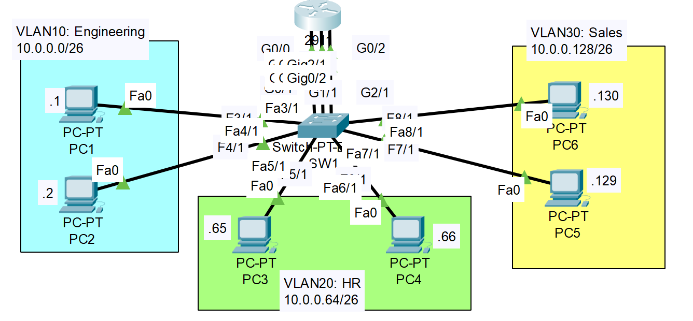

---

## 🌐 Direccionamiento de Red

| VLAN   | Subred          | Rango de Hosts          | Gateway (Router) | Interfaz R1  |
|--------|-----------------|--------------------------|------------------|--------------|
| VLAN10 | `10.0.0.0/26`   | 10.0.0.1 – 10.0.0.62    | 10.0.0.62        | g0/0         |
| VLAN20 | `10.0.0.64/26`  | 10.0.0.65 – 10.0.0.126  | 10.0.0.126       | g0/1         |
| VLAN30 | `10.0.0.128/26` | 10.0.0.129 – 10.0.0.190 | 10.0.0.190       | g0/2         |

## 💻 Asignación de IPs a PCs

| PC   | VLAN   | Dirección IP     | Máscara            | Gateway        |
|------|--------|------------------|--------------------|----------------|
| PC1  | VLAN10 | 10.0.0.1/26      | 255.255.255.192    | 10.0.0.62      |
| PC2  | VLAN10 | 10.0.0.2/26      | 255.255.255.192    | 10.0.0.62      |
| PC3  | VLAN20 | 10.0.0.65/26     | 255.255.255.192    | 10.0.0.126     |
| PC4  | VLAN20 | 10.0.0.66/26     | 255.255.255.192    | 10.0.0.126     |
| PC5  | VLAN30 | 10.0.0.129/26    | 255.255.255.192    | 10.0.0.190     |
| PC6  | VLAN30 | 10.0.0.130/26    | 255.255.255.192    | 10.0.0.190     |

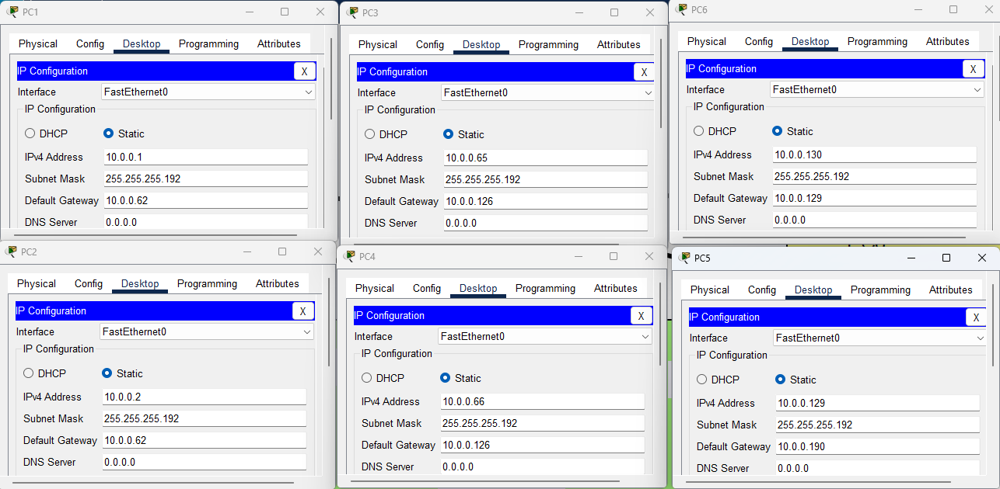
---

## 🖥️ Topología


---

## ⚙️ Configuración de SW1

```bash
SW1# configure terminal

! Crear VLANs con nombres
vlan 10
 name Engineering
vlan 20
 name HR
vlan 30
 name Sales
exit

! Asignar interfaces a VLAN 10
interface range g0/1, f3/1, f4/1
 switchport mode access
 switchport access vlan 10
exit

! Asignar interfaces a VLAN 20
interface range g1/1, f5/1, f6/1
 switchport mode access
 switchport access vlan 20
exit

! Asignar interfaces a VLAN 30
interface range g2/1, f7/1, f8/1
 switchport mode access
 switchport access vlan 30
exit

end
wr
```

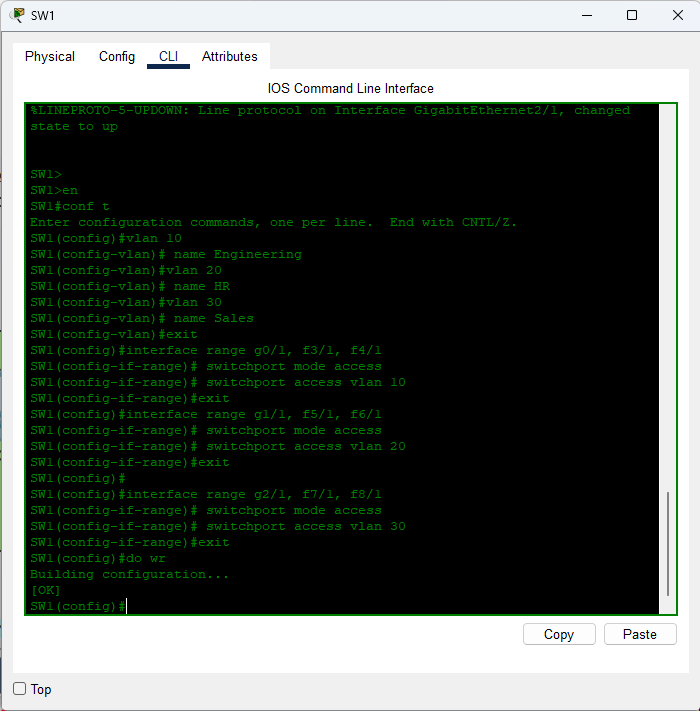

---

## ⚙️ Configuración de R1

```bash
R1# configure terminal

! VLAN 10 - Ingeniería
interface g0/0
 ip address 10.0.0.62 255.255.255.192
 no shutdown

! VLAN 20 - RRHH
interface g0/1
 ip address 10.0.0.126 255.255.255.192
 no shutdown

! VLAN 30 - Ventas
interface g0/2
 ip address 10.0.0.190 255.255.255.192
 no shutdown

end
wr
```

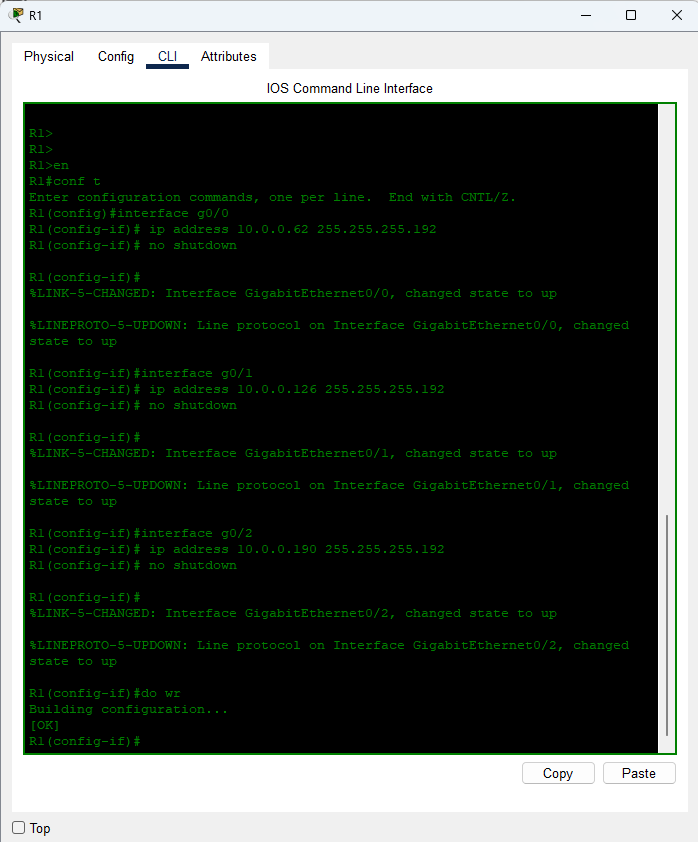

---

## ✅ Verificación

1. **Verificar VLANs en el Switch**

```

SW1# show vlan brief

```
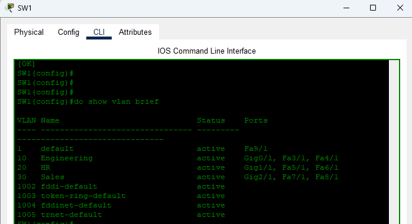

2. **Verificar interfaces en R1**

```

R1# show ip interface brief

```
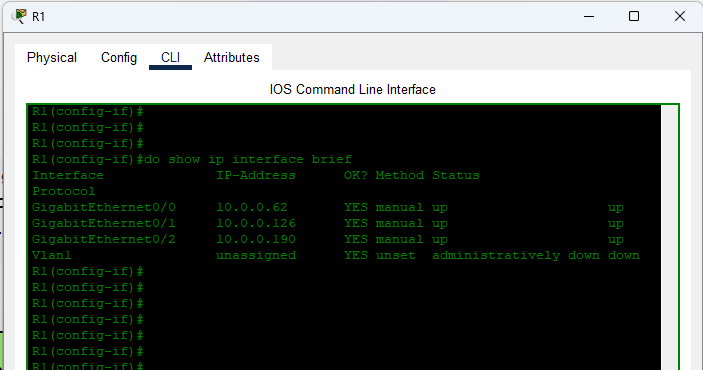

3. **Pruebas de conectividad (ICMP / pings)**

- **Ping gateway desde cada PC**
  * PC1 (VLAN10) → `ping 10.0.0.62`  — *esperado: respuesta (ICMP reply)*.  
  * PC2 (VLAN10) → `ping 10.0.0.62`  — *esperado: respuesta*.  
  * PC3 (VLAN20) → `ping 10.0.0.126` — *esperado: respuesta*.  
  * PC4 (VLAN20) → `ping 10.0.0.126` — *esperado: respuesta*.  
  * PC5 (VLAN30) → `ping 10.0.0.190` — *esperado: respuesta*.  
  * PC6 (VLAN30) → `ping 10.0.0.190` — *esperado: respuesta*.  
    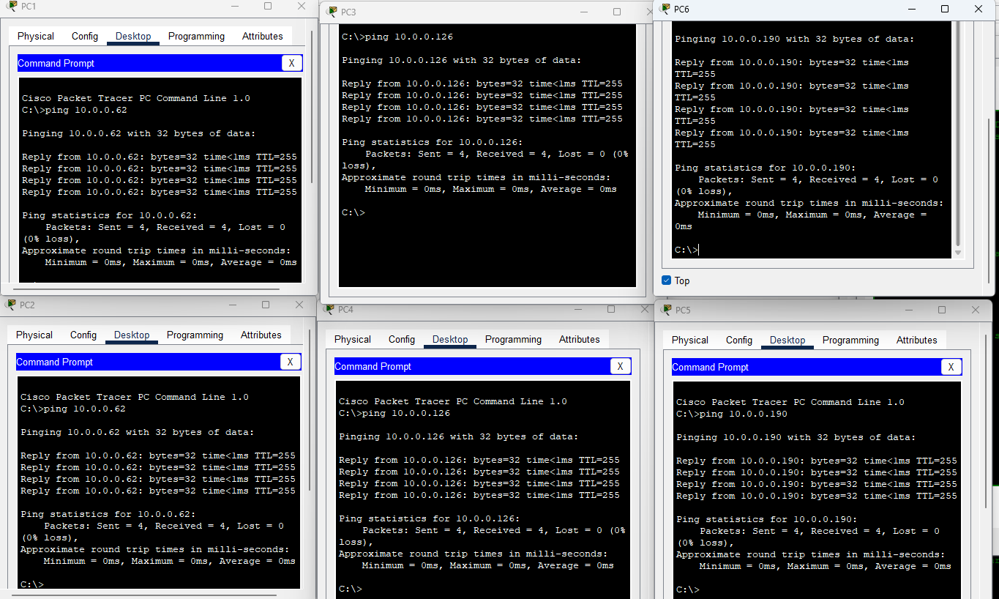

- **Ping entre PCs dentro de la misma VLAN (debería funcionar directamente L2 → L3 via gateway sólo si necesitan router)**
  * PC1 → PC2 (VLAN10): `ping 10.0.0.2` — *esperado: respuesta (misma VLAN).*  
  * PC3 → PC4 (VLAN20): `ping 10.0.0.66` — *esperado: respuesta (misma VLAN).*  
  * PC5 → PC6 (VLAN30): `ping 10.0.0.130` — *esperado: respuesta (misma VLAN).*  
    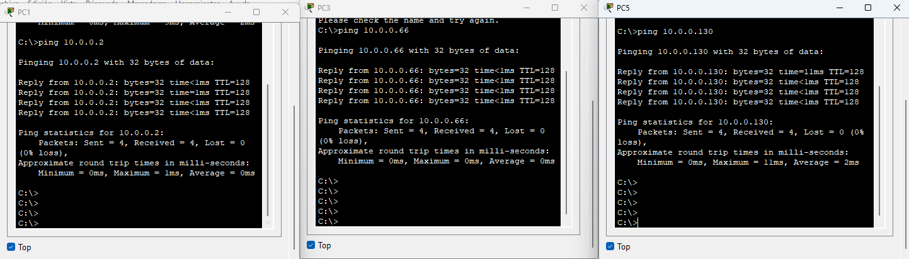

- **Ping entre PCs en VLANs distintas (deben pasar a través del router)**
  * PC1 (10.0.0.1) → PC3 (10.0.0.65): `ping 10.0.0.65` — *esperado: respuesta (enrutamiento habilitado en R1).*  
  * PC2 (10.0.0.2) → PC5 (10.0.0.129): `ping 10.0.0.129` — *esperado: respuesta.*  
  * PC3 (10.0.0.65) → PC5 (10.0.0.129): `ping 10.0.0.129` — *esperado: respuesta.*  
  * PC4 (10.0.0.66) → PC1 (10.0.0.1): `ping 10.0.0.129` — *esperado: respuesta.*  
  * PC5 (10.0.0.129) → PC1 (10.0.0.1): `ping 10.0.0.1` — *esperado: respuesta.*  
  * PC6 (10.0.0.130) → PC3 (10.0.0.65): `ping 10.0.0.65` — *esperado: respuesta.*  
    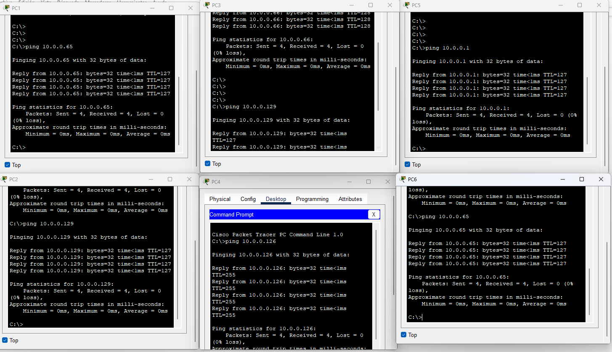

- **Ping desde el Router hacia los PCs**
  ```
  R1# ping 10.0.0.1
  R1# ping 10.0.0.65
  R1# ping 10.0.0.129
  ```
  *Esperado: respuestas para las IPs configuradas en los PCs (confirmar conectividad “router → host”).*  
  

- **Broadcast ping (en Packet Tracer / modo simulación)**
  * Enviar desde PC un ping a la dirección broadcast de su subred:
    - VLAN10 broadcast `10.0.0.63` → `ping 10.0.0.63`
    - VLAN20 broadcast `10.0.0.127` → `ping 10.0.0.127`
    - VLAN30 broadcast `10.0.0.191` → `ping 10.0.0.191`
  *Esperado: sólo los hosts dentro de la misma VLAN reciben y responden al broadcast.*  
  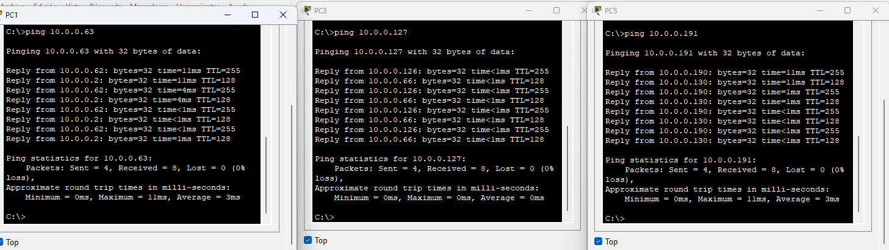
4. **Pruebas de diagnóstico (traceroute / tablas)**

- **Traceroute (rastrear ruta entre hosts distintos VLAN)**
  * Desde PC1 → `tracert 10.0.0.129` (o `traceroute` según OS) — *esperado: primer salto = gateway 10.0.0.62, segundo salto = destino o none si local).*  
    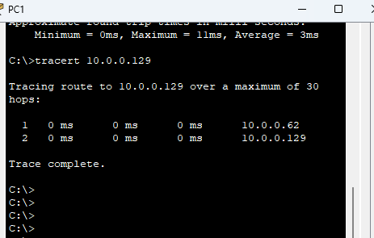

- **Comprobación ARP en PCs y Router**
  * En PC (o consola): `arp -a` — *esperado: entrada para su gateway.*  
    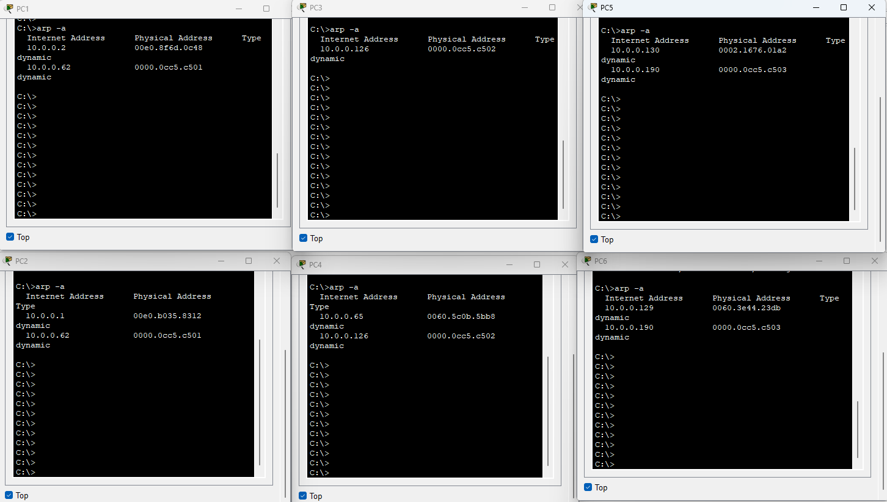
  * En R1: `show ip arp` — *esperado: ARP entries para hosts reachables.*  
    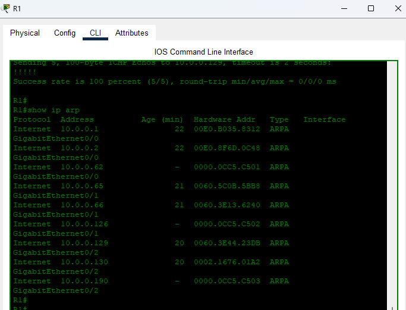

- **Comprobación de tabla MAC en el Switch**
  ```
  SW1# show mac address-table
  ```
  *Verifica que las MACs de los PCs aparecen en las interfaces correctas y asociadas a la VLAN correspondiente.*  
  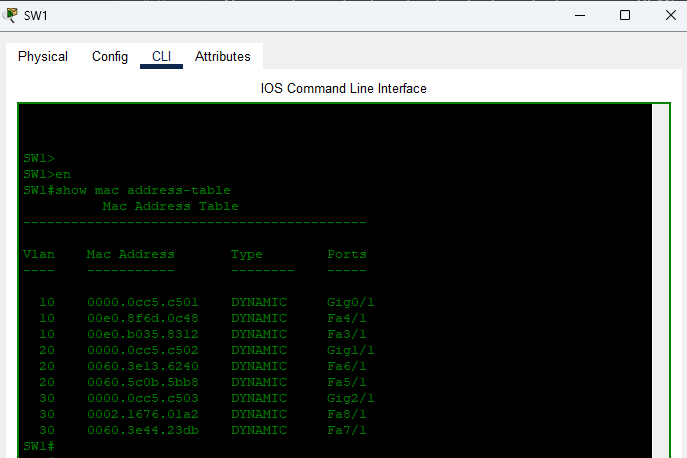

- **Comprobación de rutas en el Router**
  ```
  R1# show ip route
  ```
  *Verifica rutas directas a 10.0.0.0/26, 10.0.0.64/26 y 10.0.0.128/26 (interfaces conectadas).*  
  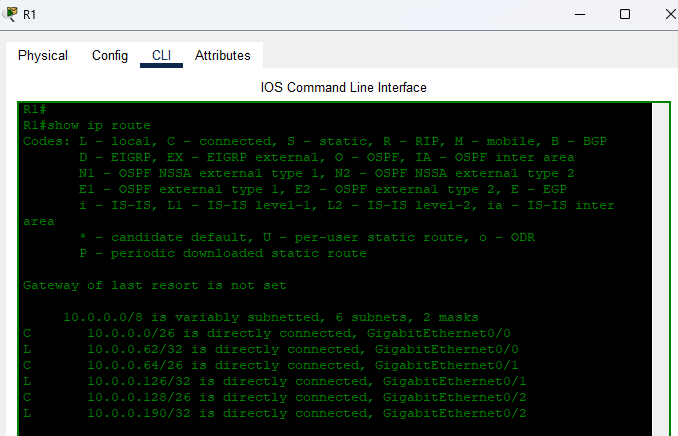

---

### Resultados esperados (rápido)
* Pings dentro de la misma VLAN → **OK** (L2).  
* Pings entre VLANs → **OK** (si R1 tiene las IPs y está up).  
* Broadcast pings → **llegan sólo a hosts de la misma VLAN**.  
* `show mac address-table` muestra MACs en las interfaces correctas por VLAN.  
* `show ip route` en R1 muestra rutas conectadas para las 3 subredes.