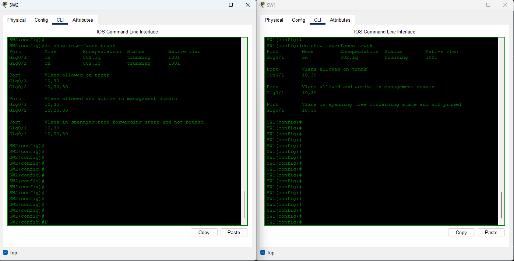

# Práctica de Laboratorio: Implementación de "Router on a Stick" con VLANs

## Introducción

En entornos de red modernos, la segmentación y la eficiencia son clave. Las Virtual LANs (VLANs) permiten agrupar dispositivos lógicamente, sin importar su ubicación física, mejorando la seguridad y la gestión del tráfico. Sin embargo, para que los dispositivos en diferentes VLANs puedan comunicarse entre sí, se requiere un mecanismo de enrutamiento. Aquí es donde entra en juego la configuración "Router on a Stick".


## Objetivos de la Práctica

Al finalizar esta práctica, serás capaz de:

* Configurar VLANs en switches Cisco.
* Asignar puertos a VLANs en modo acceso y configurar puertos troncales.
* Implementar el concepto de "Router on a Stick" utilizando subinterfaces en un router.
* Configurar direcciones IP y gateways en dispositivos finales (PCs).
* Verificar la conectividad entre dispositivos en diferentes VLANs.


## Topología de Red

A continuación, se presenta el diagrama de la topología que implementaremos. Este diagrama visualiza la distribución de VLANs, direcciones IP y conexiones entre los dispositivos.


---

## 1️⃣ Configuración de VLANs y Puertos en los Switches

El primer paso es definir las VLANs necesarias en ambos switches y configurar los puertos para que actúen como puertos de acceso (para los dispositivos finales) o puertos troncales (para la comunicación entre switches y hacia el router).

### Configuración en **SW1**

Este switch alojará las VLANs 10 y 30.

```bash
enable
configure terminal

! 1. Asignación de puertos de acceso a VLANs
interface range f0/1 - 2
 switchport mode access
 switchport access vlan 10
 % Access VLAN does not exist. Creating vlan 10
 description Puertos para PCs de Ventas

interface range f0/3 - 4
 switchport mode access
 switchport access vlan 30
 % Access VLAN does not exist. Creating vlan 30
 description Puertos para PCs de Administracion

! 2. Configuración del puerto troncal hacia SW2
interface g0/1
 switchport mode trunk
 switchport trunk allowed vlan 10,30
 switchport trunk native vlan 1001
 description Enlace Troncal a SW2

end
write memory
````

### Configuración en **SW2**

Este switch alojará las VLANs 10 y 20 y actuará como el punto de conexión troncal para el router.

```bash
enable
configure terminal


! 1. Asignación de puertos de acceso a VLANs
interface range f0/2 - 3
 switchport mode access
 switchport access vlan 10
 % Access VLAN does not exist. Creating vlan 10
 description Puertos para PCs de Ventas

interface f0/1
 switchport mode access
 switchport access vlan 20
 % Access VLAN does not exist. Creating vlan 20
 description Puerto para PC de Soporte

! 2. Configuración de puertos troncales
interface g0/1
 switchport mode trunk
 switchport trunk allowed vlan 10,30 ! VLAN 20 no necesita enviar tráfico a SW1 - No hay host de VLAN 20 en SW1
 switchport trunk native vlan 1001
 description Enlace Troncal a SW1
 vlan 30 ! Creamos la VLAN 30

interface g0/2
 switchport mode trunk   ! Conexión troncal hacia el Router R1
 switchport trunk allowed vlan 10,20,30
 switchport trunk native vlan 1001
 description Enlace Troncal a R1

end
write memory
```


-----

⚠️ **Nota Importante sobre VLAN Nativa:** La **VLAN 1001** se designa como la VLAN nativa en todos los enlaces troncales. Es una buena práctica de seguridad usar una VLAN separada y no utilizada para este propósito, evitando que el tráfico sin etiquetar se mezcle con las VLANs de datos.

-----

## 2️⃣ Configuración "Router on a Stick" en R1

El router **R1** es el encargado de enrutar el tráfico entre las diferentes VLANs. Esto se logra configurando subinterfaces en una única interfaz física, cada una encapsulando una VLAN específica y actuando como el gateway para esa VLAN.

Las subredes y gateways asignados son:

  * **VLAN 10** (10.0.0.0/26) → Gateway: `10.0.0.62`
  * **VLAN 20** (10.0.0.64/26) → Gateway: `10.0.0.126`
  * **VLAN 30** (10.0.0.128/26) → Gateway: `10.0.0.190`

<!-- end list -->

```bash
enable
configure terminal
! 1. Habilitar la interfaz física principal
interface g0/0
 no shutdown
 description Enlace Troncal a SW2 para Router on a Stick

! 2. Configuración de Subinterfaz para VLAN 10
interface g0/0.10
 encapsulation dot1Q 10
 ip address 10.0.0.62 255.255.255.192
 description Gateway para VLAN 10 (Ventas)

! 3. Configuración de Subinterfaz para VLAN 20
interface g0/0.20
 encapsulation dot1Q 20
 ip address 10.0.0.126 255.255.255.192
 description Gateway para VLAN 20 (Soporte)

! 4. Configuración de Subinterfaz para VLAN 30
interface g0/0.30
 encapsulation dot1Q 30
 ip address 10.0.0.190 255.255.255.192
 description Gateway para VLAN 30 (Administracion)


end
write memory
```


-----

## 3️⃣ Configuración de Dispositivos Finales (PCs)

Cada PC debe configurarse con una dirección IP estática que pertenezca a su VLAN asignada y debe apuntar a la dirección IP de la subinterfaz del router correspondiente como su **Gateway por defecto**.

| PC    | VLAN         | Dirección IP | Máscara de Subred | Gateway por Defecto |
| :---- | :----------- | :----------- | :---------------- | :------------------ |
| PC1   | 10 (Ventas)  | 10.0.0.1     | 255.255.255.192   | 10.0.0.62           |
| PC2   | 10 (Ventas)  | 10.0.0.2     | 255.255.255.192   | 10.0.0.62           |
| PC3   | 20 (Soporte) | 10.0.0.65    | 255.255.255.192   | 10.0.0.126          |
| PC4   | 30 (Admin)   | 10.0.0.129   | 255.255.255.192   | 10.0.0.190          |
| PC5   | 30 (Admin)   | 10.0.0.130   | 255.255.255.192   | 10.0.0.190          |
| PC6   | 10 (Ventas)  | 10.0.0.3     | 255.255.255.192   | 10.0.0.190          |
| PC7   | 10 (Ventas)  | 10.0.0.4     | 255.255.255.192   | 10.0.0.190          |


-----

## 4️⃣ Verificación de la Conectividad

Una vez que todas las configuraciones estén aplicadas, es crucial verificar que la red funcione como se espera.

### Verificación en los Switches

Utiliza los siguientes comandos para confirmar que las VLANs se han creado correctamente y que los enlaces troncales están operativos.

```bash
! Muestra las VLANs configuradas y sus puertos asociados
show vlan brief

! Muestra el estado de los enlaces troncales
show interfaces trunk
```




### Verificación en el Router

```bash
! Muestra las interfaces y subinterfaces con sus direcciones IP
show ip interface brief

! Muestra la tabla de enrutamiento
show ip route
```


### Prueba de Conectividad entre PCs

Desde cada PC, intenta hacer ping a otras PCs dentro de la misma VLAN y, lo más importante, a PCs en **diferentes VLANs**.

---

#### 1️⃣ Pings dentro de la misma VLAN

##### VLAN 10 (Ventas)

```bash
# Desde PC1
ping 10.0.0.2   # PC2


# Desde PC2
ping 10.0.0.4   # PC7
```

##### VLAN 20 (Soporte)

```bash
# Desde PC3
ping 10.0.0.65  #
```

##### VLAN 30 (Admin)

```bash
# Desde PC4
ping 10.0.0.130  # PC5
```

---


#### 2️⃣ Pings entre VLANs (requiere router / ROAS)

##### Desde VLAN 10 (Ventas) hacia VLAN 20 (Soporte) y 30 (Admin)

```bash
# Desde PC1
ping 10.0.0.130  # PC5 VLAN 30

# Desde PC2
ping 10.0.0.65   # PC3 VLAN 20
```

##### Desde VLAN 20 (Soporte) hacia VLAN 10 (Ventas) y 30 (Admin)

```bash
# Desde PC3
ping 10.0.0.130  # PC5 VLAN 30
```

##### Desde VLAN 30 (Admin) hacia VLAN 10 (Ventas) y 20 (Soporte)

```bash
# Desde PC4
ping 10.0.0.1    # PC1 VLAN 10


# Desde PC5
ping 10.0.0.65   # PC3 VLAN 20
```

---

## Conclusión

La configuración "Router on a Stick" es una solución eficiente y rentable para el enrutamiento inter-VLAN, especialmente en redes pequeñas y medianas donde no se justifica un router dedicado por cada VLAN o un switch de capa 3. Permite la segmentación de la red para mejorar la seguridad y el rendimiento, utilizando una infraestructura mínima.
