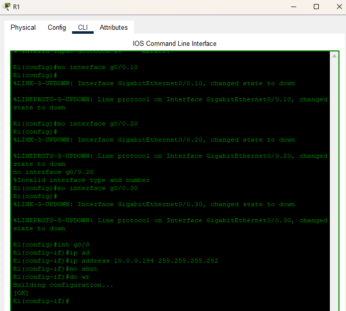
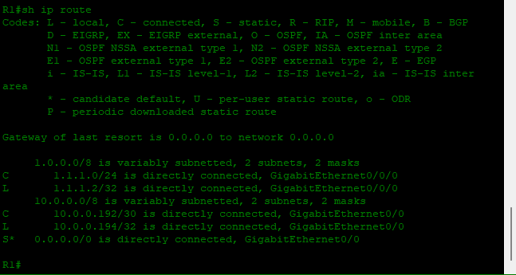
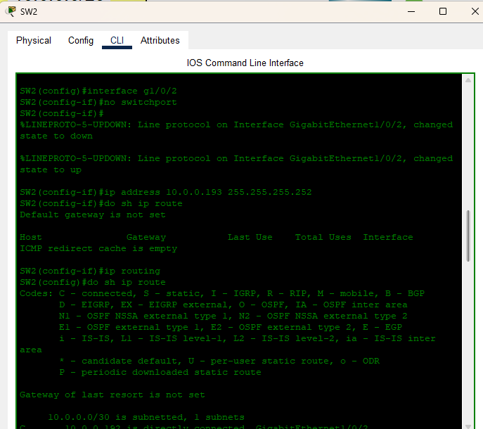
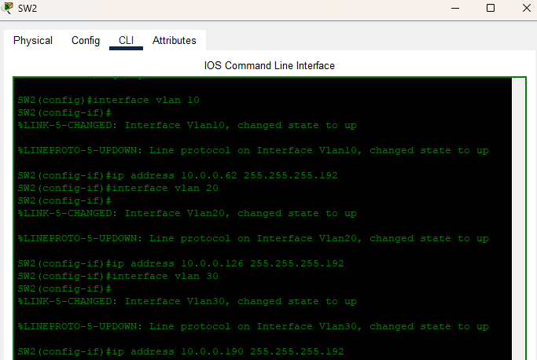
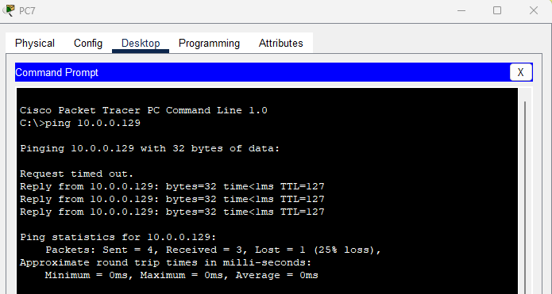
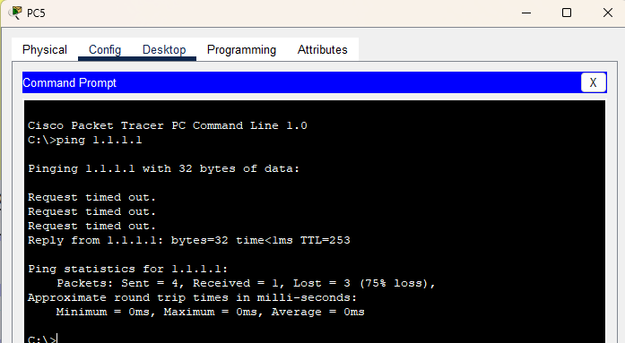

# Día 18: Reemplazo de ROAS por Enlace L3 y Configuración de SVIs

Este laboratorio se enfoca en modernizar una topología de red, reemplazando el método tradicional de **Router on a Stick (ROAS)** con una conexión de **Capa 3 punto a punto** entre un router y un switch multicapa. Además, se configurarán **Interfaces Virtuales de Switch (SVIs)** para habilitar el enrutamiento inter-VLAN directamente en el switch.

## Objetivos del Laboratorio

* Reemplazar la configuración ROAS con una conexión de Capa 3.  
* Configurar un puerto enrutado en un switch multicapa.  
* Habilitar el enrutamiento IP en un switch multicapa.  
* Configurar SVIs para que funcionen como gateways de VLAN.  
* Establecer una ruta por defecto para la conectividad a Internet.  
* Verificar el enrutamiento inter-VLAN y la conectividad externa.  

---

## Diagrama de la Red


---

## Tabla de Direccionamiento IP

| Dispositivo | Interfaz | Dirección IP | Máscara de Subred | Gateway Predeterminado |
| :--- | :--- | :--- | :--- | :--- |
| R1 | G0/0 | `10.0.0.194` | `255.255.255.252` | N/A |
| SW2 | G1/0/2 | `10.0.0.193` | `255.255.255.252` | `10.0.0.194` (Ruta estática) |
| SW2 | **Vlan10** | `10.0.0.62` | `255.255.255.192` | N/A |
| SW2 | **Vlan20** | `10.0.0.126` | `255.255.255.192` | N/A |
| PC5 | NIC | `10.0.0.65` | `255.255.255.192` | `10.0.0.126` |
| PC6 | NIC | `10.0.0.4` | `255.255.255.192` | `10.0.0.62` |
| PC7 | NIC | `10.0.0.3` | `255.255.255.192` | `10.0.0.62` |

---

## Pasos de Configuración

### 🔹 Paso 1 – Eliminar ROAS en R1 y Configurar el Enlace L3 en SW2

#### 🔹 Paso 1.1 – Eliminar ROAS en R1  
En R1, entra a configuración y borra las subinterfaces:

```cisco
R1# conf t
R1(config)# no interface g0/0.10
R1(config)# no interface g0/0.20
R1(config)# no interface g0/0.30
````

Configura la interfaz física `g0/0` con una sola IP L3 para el enlace punto a punto:

```cisco
R1(config)# interface g0/0
R1(config-if)# no shutdown
R1(config-if)# ip address 10.0.0.194 255.255.255.252
```



---
### 🔹 Paso 1.3 – Verificar en R1

Asegúrate de que R1 tenga ruta hacia la LAN:

```cisco
R1(config)# sh ip route
```



---
#### 🔹 Paso 1.2 – Configurar el enlace L3 en SW2

```cisco
SW2# conf t
SW2(config)# default int g1/0/2
SW2(config)# interface g1/0/2
SW2(config-if)# no switchport
SW2(config-if)# ip address 10.0.0.193 255.255.255.252
SW2(config-if)# no shutdown
SW2(config)# ip routing
SW2(config)# ip route 0.0.0.0 0.0.0.0 10.0.0.194
```



---

### 🔹 Paso 2 – Configurar las SVIs en SW2

Ejemplo de configuración de gateways para VLANs:

```cisco
SW2(config)# interface vlan 10
SW2(config-if)# ip address 10.0.0.62 255.255.255.192
SW2(config-if)# no shutdown

SW2(config)# interface vlan 20
SW2(config-if)# ip address 10.0.0.126 255.255.255.192
SW2(config-if)# no shutdown

SW2(config)# interface vlan 30
SW2(config-if)# ip address 10.0.0.190 255.255.255.192
SW2(config-if)# no shutdown
```

⚠️ Importante: confirma que los puertos de acceso están en las VLAN correctas con:

```cisco
show vlan brief
```



---


##  Paso 3 Prueba de Conectividad Inter-VLAN

Desde PC7 (VLAN 10), ejecutar:

```cisco
ping 10.0.0.129
```



---

## Paso 4 Prueba de Conectividad a Internet

Desde PC5 (VLAN 20), ejecutar:

```cisco
ping 1.1.1.1
```


