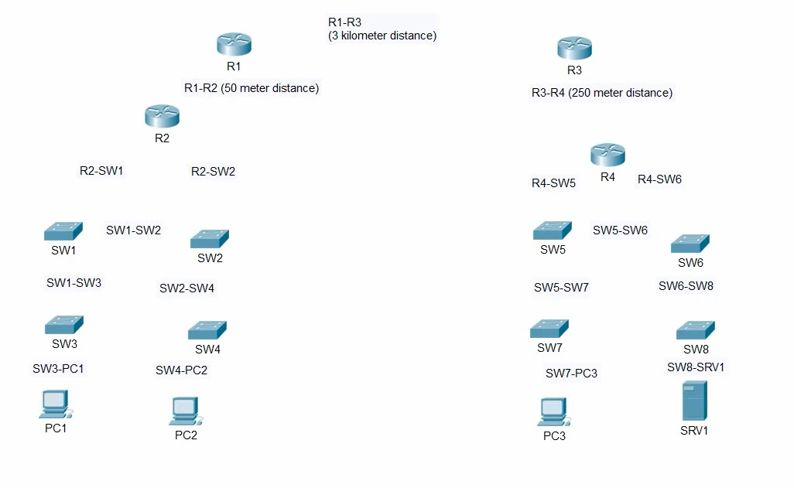
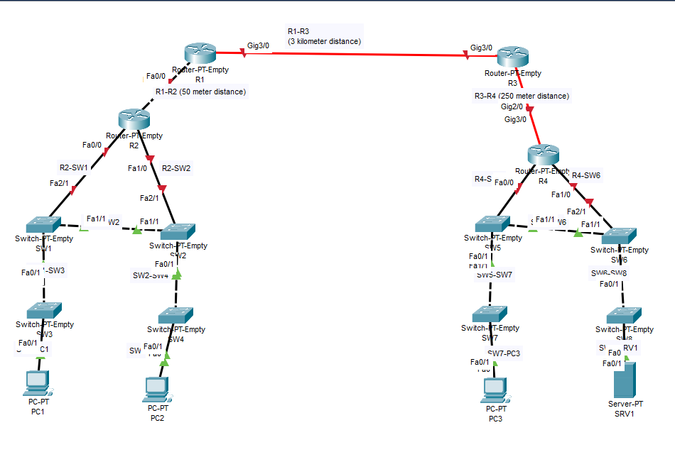

# 📝 Laboratorio Práctico: Conexión de Dispositivos de Red

En este laboratorio puse en práctica la conexión de distintos dispositivos de red usando el **cable adecuado**, partiendo de que la función **Auto MDI-X estaba deshabilitada**.  

---

## 📋 Pasos que seguí  

1. Abrí Packet Tracer y armé la topología de red.  
2. Fui conectando los dispositivos de acuerdo al diagrama, fijándome bien en el tipo de cable que correspondía.  
3. Usé **cable directo (Straight-through)** cuando conecté equipos de distinto tipo, por ejemplo: router a switch.  
4. Para equipos del mismo tipo, como router a router o switch a switch, utilicé **cable cruzado (Crossover)**.  
5. Consideré también que si la conexión fuese con fibra, Packet Tracer no diferencia el tipo (monomodo o multimodo), pero igual tuve en cuenta la diferencia teórica.  

---

## 📸 Evidencia del proceso  

### **Paso 1: Antes de conectar**  
  

### **Paso 2: Topología final con cableado correcto**  
  

---

## ✅ Conclusiones  

- Puse en práctica el uso de cables directos y cruzados según el tipo de dispositivos.  
- Reforcé la importancia de elegir bien el cable cuando no está disponible el **Auto MDI-X**.  
- Me di cuenta de que es fundamental primero asegurar la parte física de la red antes de pasar a la configuración lógica.  
