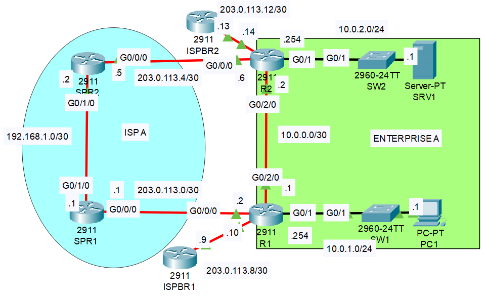
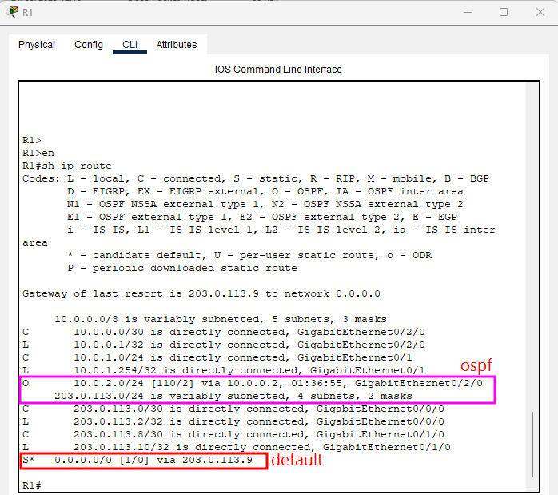
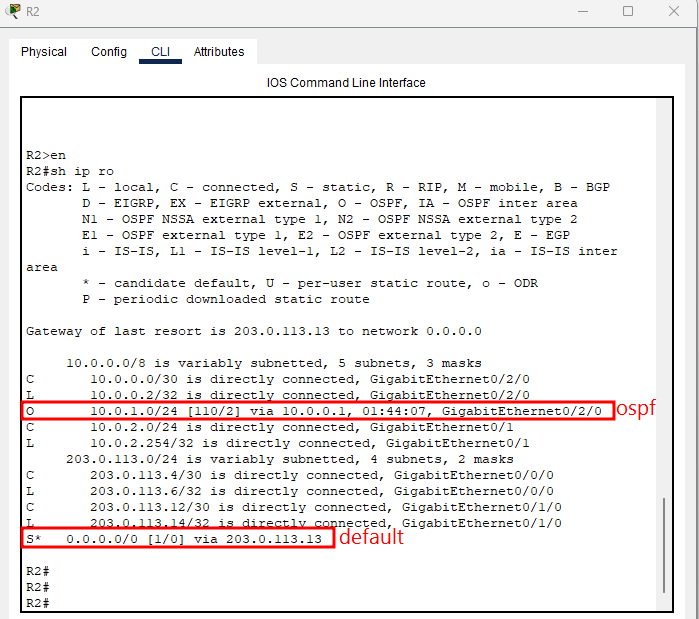
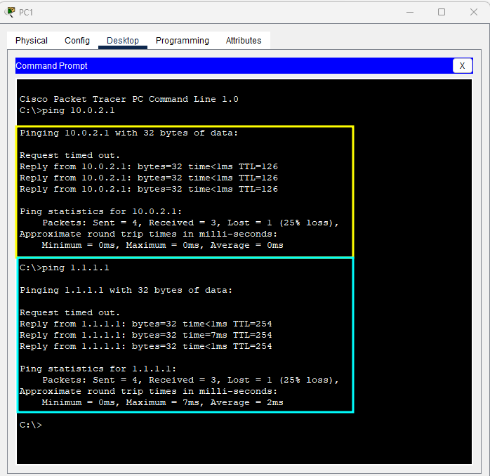
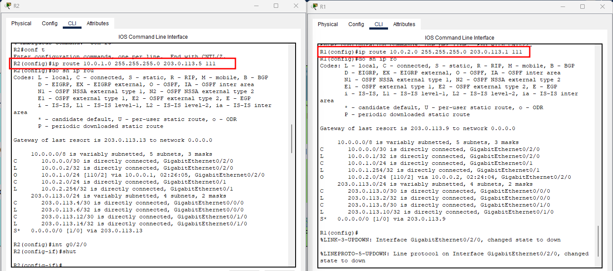
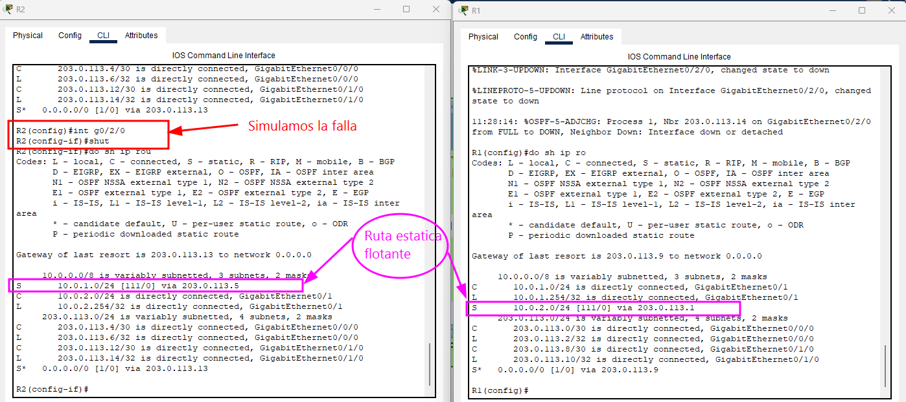
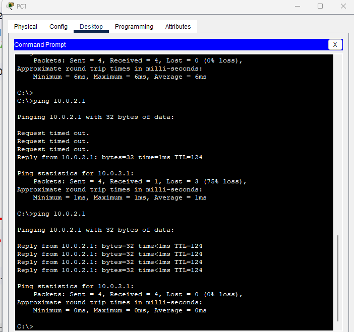
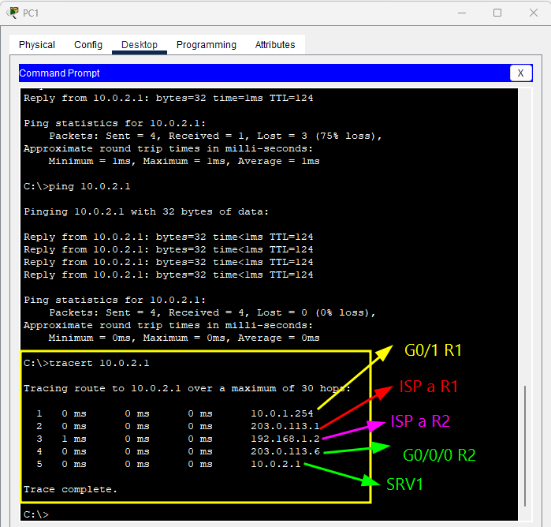

# Dia 25 - Laboratorio de Redes – Rutas Estáticas Flotantes  

---

## 🧭 Objetivo

Configurar y verificar **rutas estáticas flotantes** en los routers **R1** y **R2**, de manera que actúen como **rutas de respaldo** ante una falla en el enlace principal entre ambos routers.

---

## 🗺️ Topología de Red



La empresa **A** cuenta con dos redes LAN:
- **LAN 1:** `10.0.1.0/24` conectada a **R1**  
- **LAN 2:** `10.0.2.0/24` conectada a **R2**

Los routers **R1** y **R2** están conectados directamente mediante un enlace de fibra óptica.  
Ambos routers también tienen conexiones hacia dos ISP distintos (**ISP A** y **ISP B**) con las siguientes interfaces:

| Router | ISP | Interfaz | Dirección IP |
|---------|-----|-----------|---------------|
| R1 | ISP A | G0/0/0 | 203.0.113.1 |
| R1 | ISP B | G0/0/1 | 203.0.113.9 |
| R2 | ISP A | G0/0/0 | 203.0.113.5 |
| R2 | ISP B | G0/0/1 | 203.0.113.13 |

---

## 🔎 Paso 1: Verificación de Tablas de Enrutamiento

### En **R1**

```bash
enable
show ip route
````

**Resultado:**

* Rutas conectadas y locales.
* Ruta por defecto a `203.0.113.9` (ISP B).
* Ruta OSPF a `10.0.2.0/24` aprendida desde R2.

➡️ **Protocolo de enrutamiento dinámico:** `OSPF`

➡️ **Ruta hacia SRV1 (10.0.2.1):** vía OSPF hacia R2

➡️ **Ruta hacia 1.1.1.1 (Internet):** vía ruta por defecto → ISP B




### En **R2**

```bash
enable
show ip route
```

**Resultado:**

* Rutas conectadas y locales.
* Ruta por defecto a `203.0.113.13` (ISP B).
* Ruta OSPF a `10.0.1.0/24` aprendida desde R1.



---

## 💻 Pruebas de Conectividad Inicial

### Desde **PC1**

```bash
ping 10.0.2.1
ping 1.1.1.1
```

**Resultados esperados:**

* Ping a `10.0.2.1` (SRV1) exitoso por la ruta OSPF R1 → R2.
* Ping a `1.1.1.1` exitoso por la ruta por defecto hacia ISP B.



---

## 🛠️ Paso 2: Configuración de Rutas Estáticas Flotantes

### En **R1**

```bash
conf t
ip route 10.0.2.0 255.255.255.0 203.0.113.1 111
do show ip route
```

📌 **Explicación:**

* Se define una ruta estática hacia la red `10.0.2.0/24` (LAN de R2).
* El siguiente salto es `203.0.113.1` (ISP A R1).
* Se asigna **distancia administrativa (AD)** de `111` para que sea **menos preferida** que OSPF (AD=110).
* La ruta **no aparece aún** en la tabla porque la ruta OSPF tiene prioridad.

### En **R2**

```bash
conf t
ip route 10.0.1.0 255.255.255.0 203.0.113.5 111
do show ip route
```

📌 Igual que en R1, la ruta flotante se configura pero **no se instala** mientras la ruta OSPF esté activa.



---

## ⚙️ Paso 3: Simulación de Falla en el Enlace Directo

### Apagar la interfaz entre R1 y R2

En **R2:**

```bash
interface g0/2/0
shutdown
```

📋 **Efecto:**

* El enlace directo R1 ↔ R2 se cae.
* OSPF pierde la vecindad y elimina la ruta dinámica.

---

## 🔍 Verificación de Rutas Flotantes

### En **R2**

```bash
do show ip route
```

**Resultado:**

```
10.0.1.0/24 [111/0] via 203.0.113.5
```

### En **R1**

```bash
do show ip route
```

**Resultado:**

```
10.0.2.0/24 [111/0] via 203.0.113.1
```

➡️ Ahora las rutas estáticas flotantes **se activan automáticamente** como rutas de respaldo.



---

## 📡 Paso 4: Verificación de Conectividad con la Ruta de Respaldo

Desde **PC1**:

```bash
ping 10.0.2.1
```

**Resultado esperado:**

* El ping se completa correctamente.
* El tráfico ahora viaja por la ruta de respaldo:

  * R1 → ISP A (SPR1) → ISP A (SPR2) → R2 → SRV1



---

## 🧭 Paso 5: Verificación con `traceroute`

Desde **PC1**:

```bash
tracert 10.0.2.1
```

**Resultados:**

| Salto | IP          | Descripción  |
| ----- | ----------- | ------------ |
| 1     | 10.0.1.254  | G0/1 de R1   |
| 2     | 203.0.113.1 | ISP A R1     |
| 3     | 192.168.1.2 | ISP A R2     |
| 4     | 203.0.113.6 | G0/0/0 de R2 |
| 5     | 10.0.2.1    | SRV1         |

➡️ Se confirma que el tráfico ahora sigue la **ruta de respaldo** vía **ISP A**.



---

## 🧩 Conclusiones

* ✅ Las **rutas estáticas flotantes** fueron configuradas correctamente en **R1** y **R2**.
* ✅ La red conmutó automáticamente al **camino de respaldo** cuando el enlace principal falló.
* ✅ OSPF volvió a tomar prioridad al restablecer el enlace directo.
* ✅ Se comprobó la funcionalidad mediante **ping** y **traceroute**.

**Beneficio:**
Las rutas estáticas flotantes son una solución sencilla y efectiva para implementar **redundancia básica** sin depender exclusivamente de protocolos dinámicos.

---

## 📘 Comandos Utilizados (Resumen)

```bash
enable
show ip route
conf t
ip route <red> <máscara> <next-hop> <distancia>
interface <interfaz>
shutdown
no shutdown
ping <ip>
traceroute <ip>
show ip interface brief
```

---
