# DIA 25 - Laboratorio CCNA: Configuración Práctica de EIGRP

Este laboratorio guía la configuración práctica de **EIGRP** en una red de 4 routers.

---
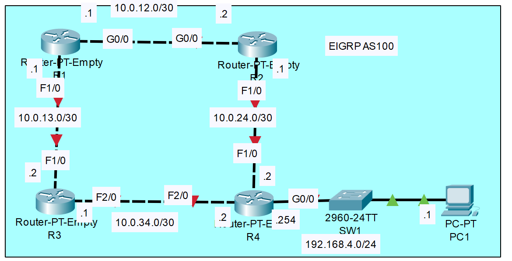
*Topología de red del laboratorio EIGRP.*

### 1. Preparación de routers

1. Configure los **hostnames** y las **direcciones IP** en cada router.
2. Habilite todas las interfaces de los routers.


---

#### Router R1

| Interfaz |  Dirección IP |
| :------: | :-----------: |
|   G0/0   | 10.0.12.1 /30 |
|   F1/0   | 10.0.13.1 /30 |

```bash
R1# configure terminal
R1(config)# hostname R1

R1(config)# interface GigabitEthernet0/0
R1(config-if)# ip address 10.0.12.1 255.255.255.252
R1(config-if)# no shutdown

R1(config-if)# interface FastEthernet1/0
R1(config-if)# ip address 10.0.13.1 255.255.255.252
R1(config-if)# no shutdown
R1(config-if)# end
R1# write
```


---

#### Router R2

| Interfaz |  Dirección IP |
| :------: | :-----------: |
|   G0/0   | 10.0.12.2 /30 |
|   F1/0   | 10.0.24.1 /30 |

```bash
R2# configure terminal
R2(config)# hostname R2

R2(config)# interface GigabitEthernet0/0
R2(config-if)# ip address 10.0.12.2 255.255.255.252
R2(config-if)# no shutdown

R2(config-if)# interface FastEthernet1/0
R2(config-if)# ip address 10.0.24.1 255.255.255.252
R2(config-if)# no shutdown
R2(config-if)# end
R2# write
```


---

#### Router R3

| Interfaz |  Dirección IP |
| :------: | :-----------: |
|   F1/0   | 10.0.13.2 /30 |
|   F2/0   | 10.0.34.1 /30 |

```bash
R3# configure terminal
R3(config)# hostname R3

R3(config)# interface FastEthernet1/0
R3(config-if)# ip address 10.0.13.2 255.255.255.252
R3(config-if)# no shutdown

R3(config-if)# interface FastEthernet2/0
R3(config-if)# ip address 10.0.34.1 255.255.255.252
R3(config-if)# no shutdown
R3(config-if)# end
R3# write
```


---

#### Router R4

| Interfaz |    Dirección IP   |
| :------: | :---------------: |
|   F1/0   |   10.0.24.2 /30   |
|   F2/0   |   10.0.34.2 /30   |
|   G0/0   | 192.168.4.254 /24 |

```bash
R4# configure terminal
R4(config)# hostname R4

R4(config)# interface FastEthernet1/0
R4(config-if)# ip address 10.0.24.2 255.255.255.252
R4(config-if)# no shutdown

R4(config-if)# interface FastEthernet2/0
R4(config-if)# ip address 10.0.34.2 255.255.255.252
R4(config-if)# no shutdown

R4(config-if)# interface GigabitEthernet0/0
R4(config-if)# ip address 192.168.4.254 255.255.255.0
R4(config-if)# no shutdown
R4(config-if)# end
R4# write
```


---

### Switch SW1

```bash
SW1# configure terminal
SW1(config)# hostname SW1
SW1(config)# end
SW1# write
```


---

### PC1

|     Parámetro    |            Valor            |
| :--------------: | :-------------------------: |
| **Dirección IP** |       **192.168.4.1**       |
|    **Máscara**   |   **255.255.255.0** (/24)   |
|    **Gateway**   | **192.168.4.254** (R4 G0/0) |


---


### Comando de verificación:
```bash
show ip interface brief
````

---

## 2. Configuración de interfaces Loopback

* Utilizar **máscara /32**.
* Loopback siempre como **pasiva** posteriormente.
* Loopback es una interfaz virtual en el Router y siempre esta activa, a menos que se deshabilite con *shutdown*. 

### R1

```bash
conf t
interface loopback0
 ip address 1.1.1.1 255.255.255.255
```

### R2

```bash
conf t
interface loopback0
 ip address 2.2.2.2 255.255.255.255
```

### R3

```bash
conf t
interface loopback0
 ip address 3.3.3.3 255.255.255.255
```

### R4

```bash
conf t
interface loopback0
 ip address 4.4.4.4 255.255.255.255
```

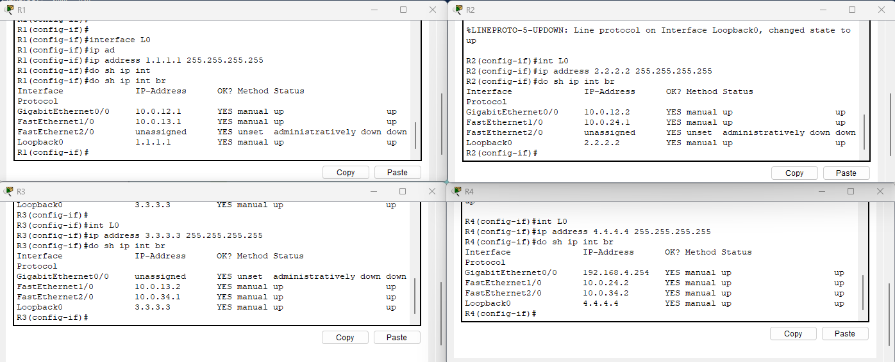
*Interfaces loopback de cada router configuradas.*

---

## 3. Configuración de EIGRP

* **Número de AS:** 100
* Desactivar resumen automático.
* Configurar interfaces pasivas (G0/0 y Loopback0).

### Ejemplo de configuración R1

```bash
router eigrp 100
 network 10.0.12.0 0.0.0.3
 network 10.0.13.0 0.0.0.3
 network 1.1.1.1 0.0.0.0
 no auto-summary
 passive-interface L0
 do show ip protocols
 do wr
```

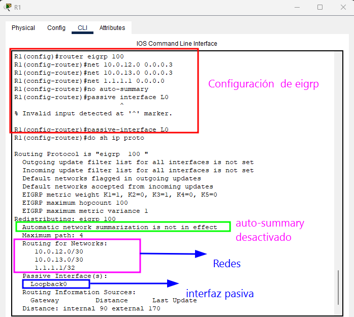

*Configuración de EIGRP en R1 con interfaces pasivas.*

### R2

```bash
router eigrp 100
 network 10.0.12.0 0.0.0.3
 network 10.0.24.0 0.0.0.3
 network 2.2.2.2 0.0.0.0
 no auto-summary
 passive-interface L0
 do show ip protocols
 do wr
```
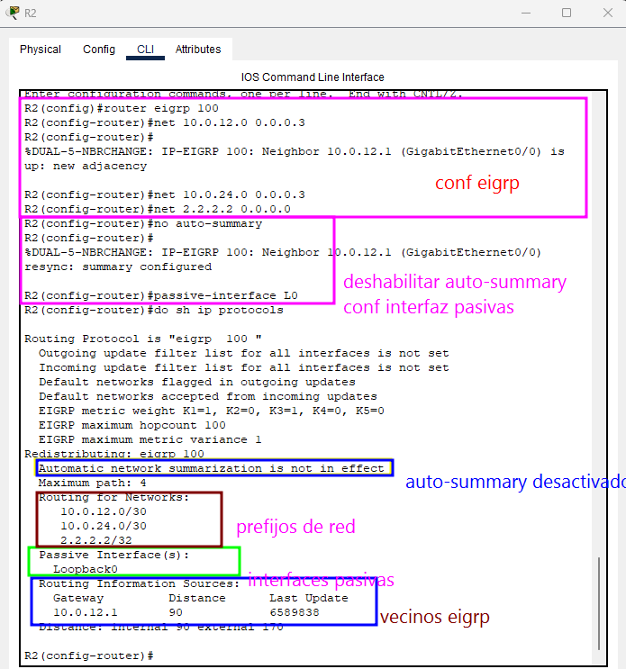

*Configuración de EIGRP en R2 con interfaces pasivas.*

### R3

```bash
router eigrp 100
 network 10.0.13.0 0.0.0.3
 network 10.0.34.0 0.0.0.3
 network 3.3.3.3 0.0.0.0
 no auto-summary
 passive-interface L0
 do show ip protocols
 do write
```
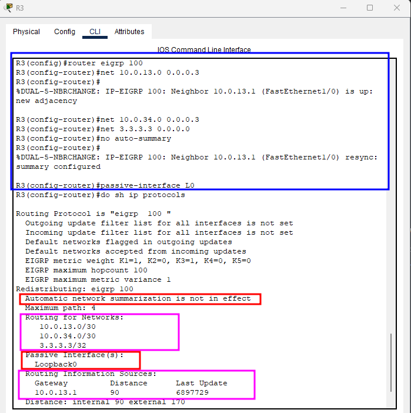

*Configuración de EIGRP en R3 con interfaces pasivas.*

### R4

```bash
router eigrp 100
 network 10.0.24.0 0.0.0.3
 network 10.0.34.0 0.0.0.3
 network 4.4.4.4 0.0.0.0
 network 192.168.4.0 0.0.0.255 
 no auto-summary
 passive-interface L0
 passive-interface g0/0
 do show ip protocols
 do write
```
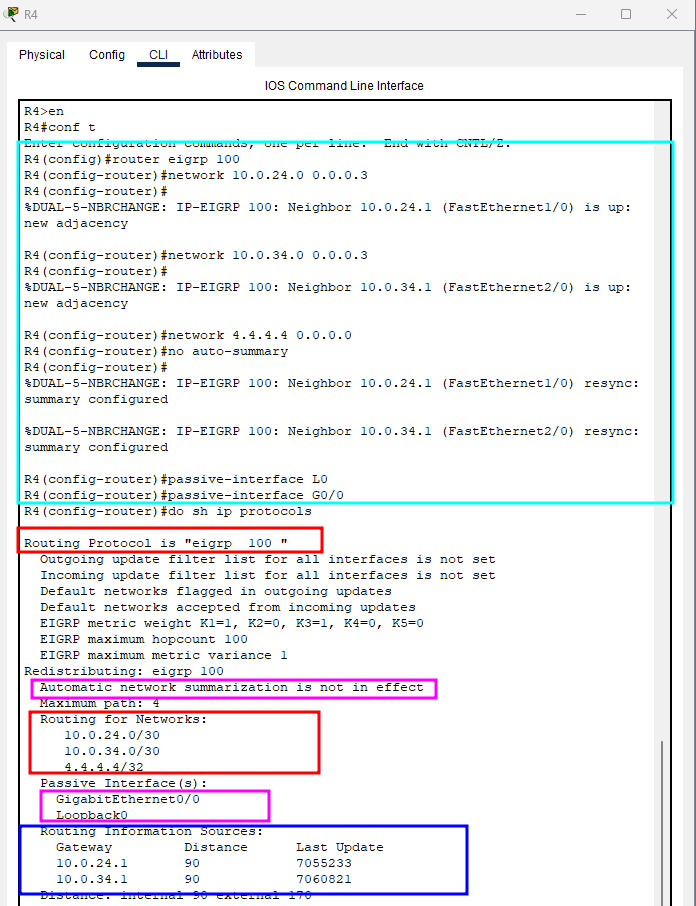

*Configuración de EIGRP en R4 con interfaces pasivas.*

### Verificación


```bash
show ip eigrp neighbors
```

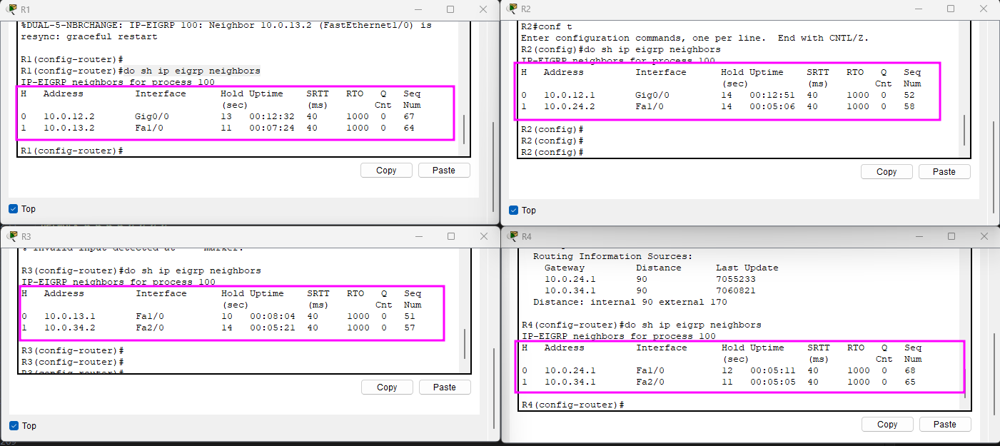
*Vecinos EIGRP*

```bash
do show ip route connected
```

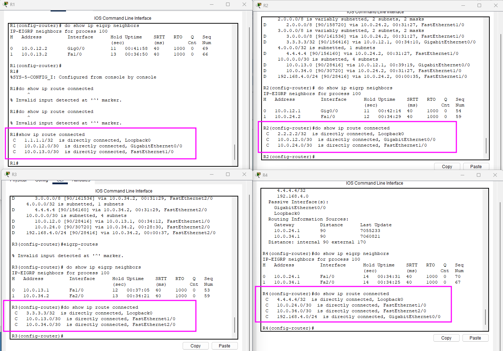
*Rutas directamente conectadas*

```bash
do show ip eigrp topology
```

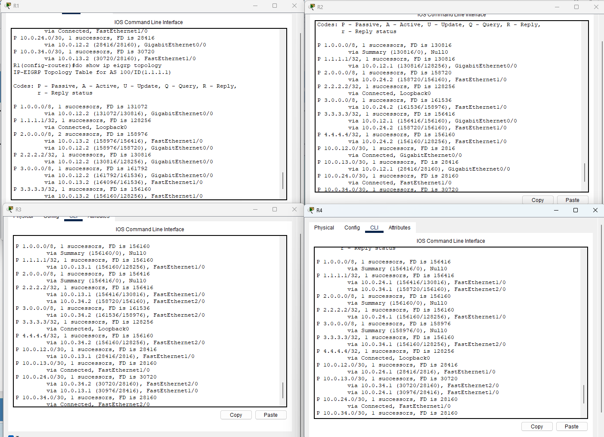
*Topología de EIGRP (tabla de sucesores y factibles)*

```bash
do show ip route eigrp
```

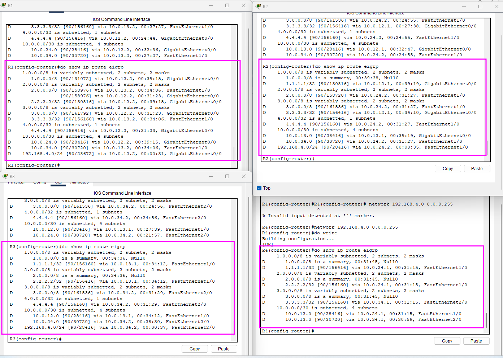
*Tabla de rutas aprendidas por EIGRP*

```bash
ping 10.0.12.1
tracert 10.0.12.1
```

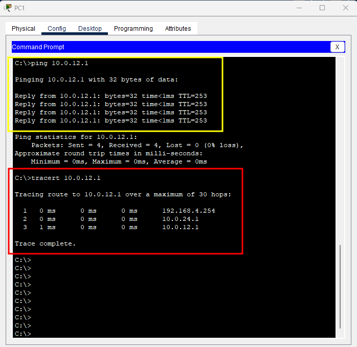

*Prueba de conectividad desde PC1 hacia R1 mediante **ping** y **traceroute***

---


## 4. Configuración de Load-Balancing en R1

* Habilitar **unequal-cost load-balancing** usando varianza:

```bash
router eigrp 100
 variance 2
```

* Solo rutas **Feasible Successors** se incluirán en la tabla de enrutamiento.

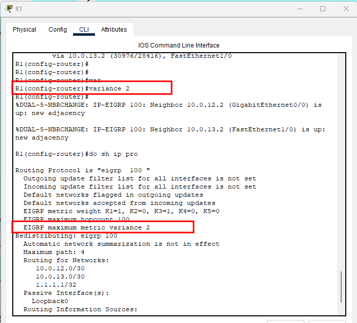

*Load-balancing en R1 usando rutas Feasible Successors.*

---

## 5. Comandos de Verificación

```bash
show ip protocols
show ip route eigrp
show ip eigrp neighbors
show ip route eigrp
show ip eigrp topology
```

* Verificar vecinos, rutas sucesoras y rutas alternativas.
* Confirmar interfaces pasivas y auto-summary desactivado.

---

## 6. Notas importantes

* Configuración de EIGRP en todas las interfaces **solo para laboratorios**, en producción usar prefijos exactos.
* Interfaces loopback siempre pasivas para ahorrar recursos.
* La condición de factibilidad **previene bucles de routing**.
* Varianza permite balanceo de carga desigual pero solo con rutas válidas.


