# Día 8 - Direccionamiento IPv4

---

## 📋 Tabla de Contenido
- [1. Configuración del Nombre de Host](#1-configuracion-del-nombre-de-host)
- [2. Verificación de Interfaces](#2-verificacion-de-interfaces)
- [3. Asignación de Direcciones IP](#3-asignacion-de-direcciones-ip)
- [4. Verificación de la Configuración](#4-verificacion-de-la-configuracion)
- [5. Guardado de la Configuración](#5-guardado-de-la-configuracion)
- [6. Configuración de Direcciones IP de PCs](#6-configuracion-de-direcciones-ip-de-pcs)
- [7. Verificación de Conectividad](#7-verificacion-de-conectividad)
- [Anexo: Diagrama de Topología](#anexo-diagrama-de-topologia)

---

## 1. Configuración del Nombre de Host
Este paso es crucial para identificar el dispositivo en una red.
- **Comando:**
```

hostname R1

```
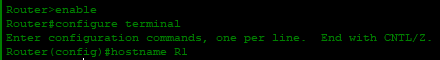

## 2. Verificación de Interfaces
Permite visualizar el estado y las direcciones IP de las interfaces del router.
- **Comando:**
```

show ip interface brief

```
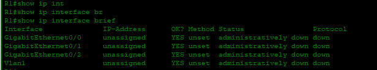

## 3. Asignación de Direcciones IP
Se asignan las direcciones IP a las interfaces del router y se habilitan para su funcionamiento.
- **Interfaces a configurar:**
    - **g0/0:** `15.255.255.254/8`
    - **g0/1:** `182.98.255.254/16`
    - **g0/2:** `201.191.20.254/24`
- **Comandos de ejemplo para g0/0:**
```

configure terminal
interface g0/0
ip address 15.255.255.254 255.0.0.0
no shutdown
description Conexión a SW1

```
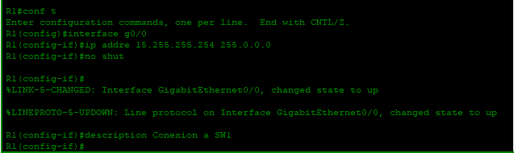

- **Comandos de ejemplo para g0/1:**
```

configure terminal
interface g0/1
ip address 182.98.255.254 255.255.0.0
no shutdown
description Conexión a SW2

```
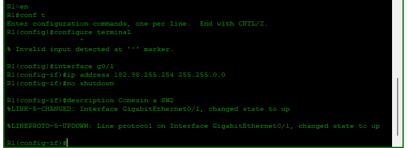

- **Comandos de ejemplo para g0/2:**
```

configure terminal
interface g0/2
ip address 201.192.20.254 255.255.255.0
no shutdown
description Conexión a SW3

```
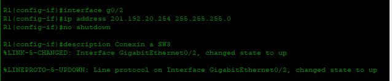

---
## 4. Verificación de la Configuración
Revisar el estado de las interfaces después de la configuración.
- **Comando:**
```

show ip interface brief

```
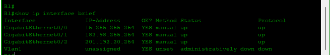

## 5. Confirmar configuración y guardarla
### 5.1 Ver la Configuración
Confirmar la información
```
show running-config

```
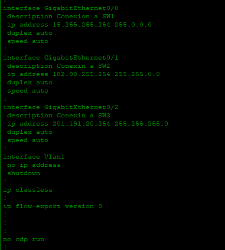

### 5.2 Guardar la Configuración
Guardar los cambios realizados en la configuración en la memoria no volátil.
- **Comando:**
```
copy running-config startup-config

```
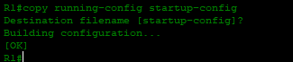

---

## 6. Configuración de Direcciones IP de PCs
Se asignan las direcciones IP a los dispositivos finales para que puedan comunicarse en la red.
- **PC1, PC2, PC3:** Configuración manual a través de la interfaz gráfica de **Packet Tracer**.
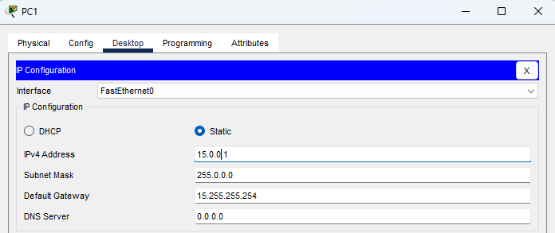
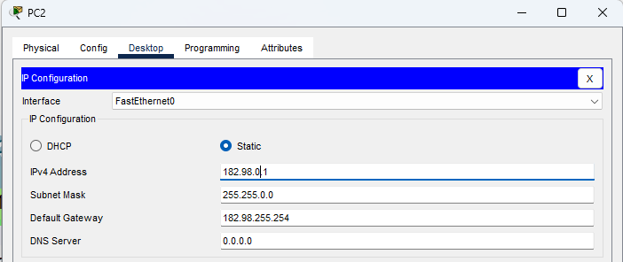
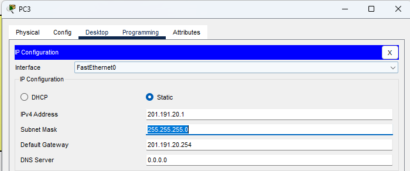
## 7. Verificación de Conectividad
Se realiza una prueba de conectividad de extremo a extremo.
- **Ping de PC1 a PC2 y PC3:**
```

ping 182.98.255.254 y ping 201.191.20.1

```
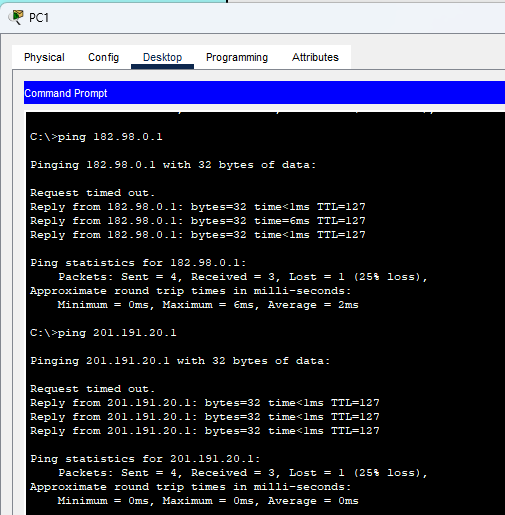

- **Ping de PC2 a PC1 y PC3:**
```

ping 182.98.255.254 y ping 201.191.20.1

```


- **Ping de PC3 a PC1 y PC2:**
```

ping 182.98.255.254 y ping 201.191.20.1

```


---
