# Configuración de Interfaces en Dispositivos Cisco

## Descripción de la práctica
En este laboratorio se configurará una red básica con un router Cisco 2911, dos switches Cisco 2960-24 y cuatro PCs conectadas a los switches.  
El objetivo es configurar correctamente los **hostnames**, **direcciones IP**, **velocidad y duplex** de las interfaces, **descripciones** y deshabilitar interfaces no utilizadas, siguiendo las buenas prácticas de redes.

### Topología de la red
- **R1 (Router 2911):** Conecta a SW1 por G0/0  
- **SW1 (Switch 2960-24):** Conecta a R1 G0/0 y SW2 G0/2, además a PC1 y PC2  
- **SW2 (Switch 2960-24):** Conecta a SW1 G0/1 y a PC3 y PC4  
- **PCs:**  
  - PC1 y PC2 conectadas a SW1  
  - PC3 y PC4 conectadas a SW2  

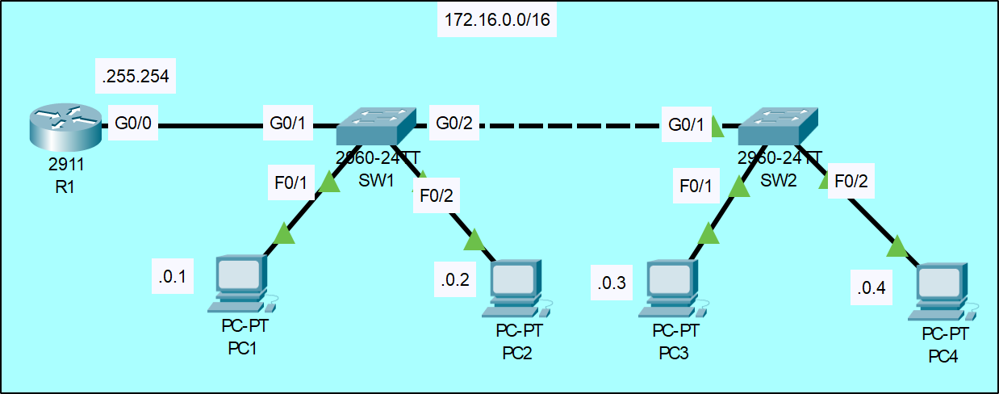

---

## 1. Configurar el hostname

### R1
```

R1> enable
R1# configure terminal
R1(config)# hostname R1
R1(config)# exit

```
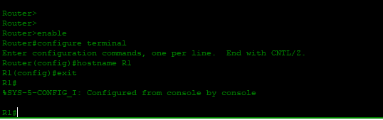

### SW1
```

SW1> enable
SW1# configure terminal
SW1(config)# hostname SW1
SW1(config)# exit

```
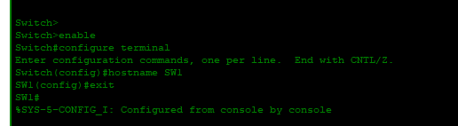

### SW2
```

SW2> enable
SW2# configure terminal
SW2(config)# hostname SW2
SW2(config)# exit

```
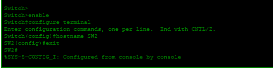

---

## 2. Configurar las direcciones IP

### R1
```

R1> enable
R1# configure terminal
R1(config)# interface g0/0
R1(config-if)# ip address 172.16.0.254 255.255.0.0
R1(config-if)# no shutdown
R1(config-if)# description Conexión a SW1
R1(config-if)# exit

```
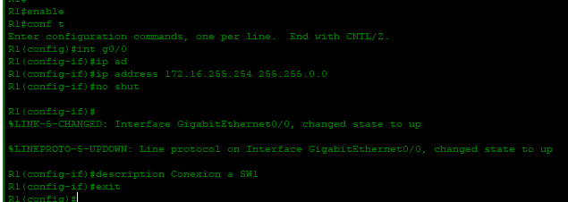

### PCs
Configura en cada PC:

- **PC1:** IP `172.16.0.1`, Máscara `255.255.0.0`, Gateway `172.16.0.254`  
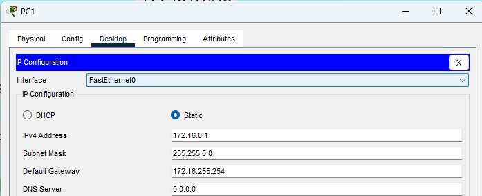

- **PC2:** IP `172.16.0.2`, Máscara `255.255.0.0`, Gateway `172.16.0.254`  
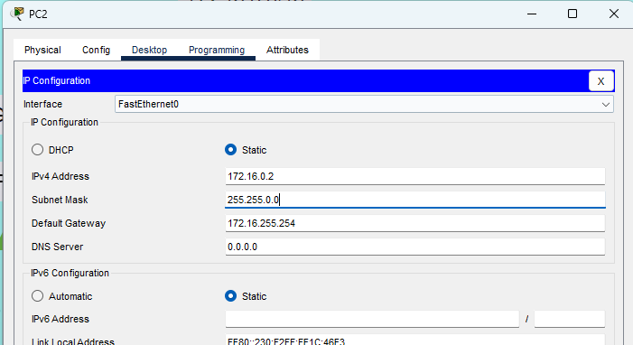

- **PC3:** IP `172.16.0.3`, Máscara `255.255.0.0`, Gateway `172.16.0.254`  
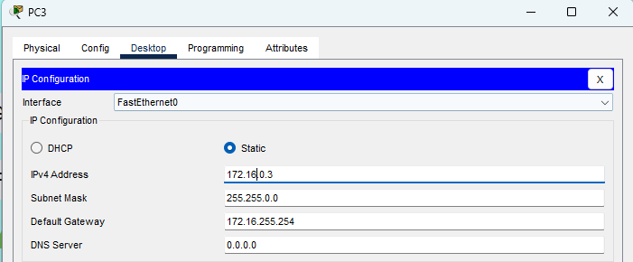

- **PC4:** IP `172.16.0.4`, Máscara `255.255.0.0`, Gateway `172.16.0.254`  
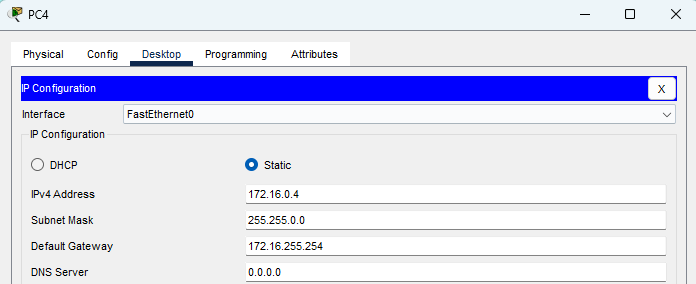

---

## 3. Configurar velocidad y duplex manualmente en interfaces entre dispositivos

### R1
```

R1# configure terminal
R1(config)# interface g0/0
R1(config-if)# speed 100
R1(config-if)# duplex full
R1(config-if)# exit
```
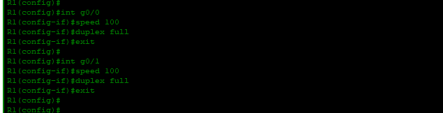
---

### SW1
```

SW1> enable
SW1# configure terminal

# Interface hacia R1

SW1(config)# interface g0/1
SW1(config-if)# speed 100
SW1(config-if)# duplex full
SW1(config-if)# exit

# Interface hacia SW2

SW1(config)# interface g0/2
SW1(config-if)# speed 100
SW1(config-if)# duplex full
SW1(config-if)# exit

```
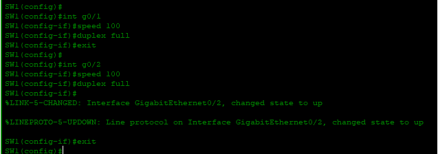
---

### SW2
```

SW2> enable
SW2# configure terminal

# Interface hacia SW1

SW2(config)# interface g0/1
SW2(config-if)# speed 100
SW2(config-if)# duplex full
SW2(config-if)# exit

```
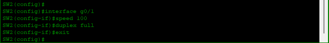
---

## 4. Configurar descripciones en cada interfaz

- **R1 G0/0:** Conexión a SW1  
- **SW1 F0/1:** Conexión a PC1  
- **SW1 F0/2:** Conexión a PC2  
- **SW1 G0/1:** Conexión a R1  
- **SW1 G0/2:** Conexión a SW2  
- **SW2 F0/1:** Conexión a PC3  
- **SW2 F0/2:** Conexión a PC4  
- **SW2 G0/1:** Conexión a SW1  

```

# Ejemplo en SW1

SW1(config)# interface g0/1
SW1(config-if)# description Conexión a R1

```
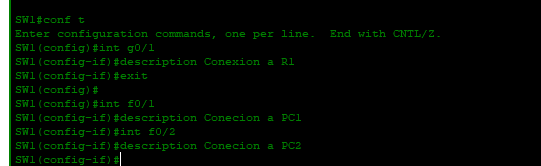

---

## 5. Deshabilitar interfaces no conectadas

### R1
```

R1(config)# interface g0/1-2
R1(config-if)# shutdown

```
---

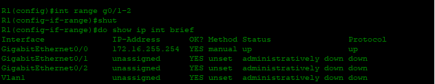
---


### SW1
```

SW1(config)# interface range f0/3 - 24
SW1(config-if-range)# shutdown

```
---

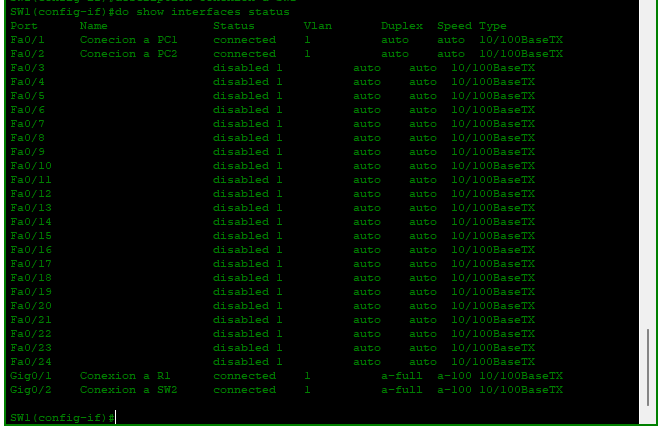
---
### SW2
```

SW2(config)# interface range f0/3 - 24
SW2(config-if-range)# shutdown

```
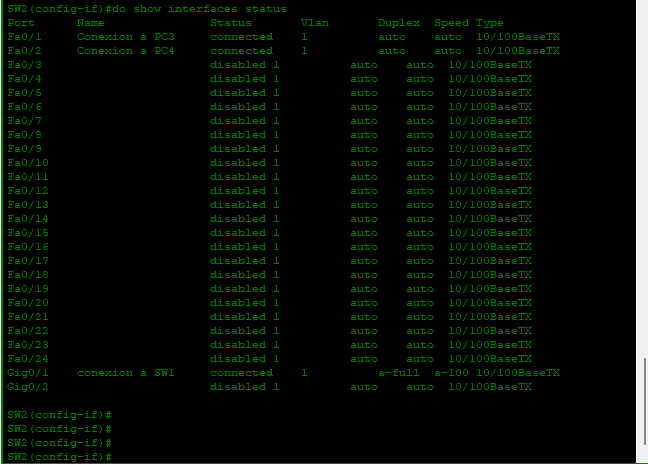

---

## 6. Verificar interfaces de R1
```

show ip interface brief

```
Debe mostrar **IP asignada y estado “up/up”** en g0/0.

---

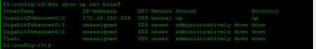

---
## 7. Guardar configuración
```

show running-config
copy running-config startup-config

```

---

## 8. Probar conectividad
### Desde **PC1** haz ping hacia **PC2, PC3 y PC4**:
```
ping 172.16.0.2
ping 172.16.0.3
ping 172.16.0.4
```

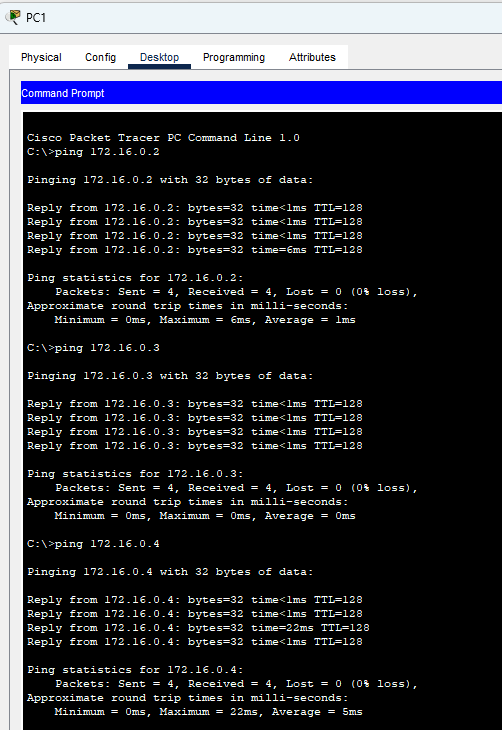
### Desde **PC2** haz ping hacia **PC1, PC3 y PC4**:
```
ping 172.16.0.1
ping 172.16.0.3
ping 172.16.0.4
```


### Desde **PC3** haz ping hacia **PC1, PC2 y PC4**:
```
ping 172.16.0.1
ping 172.16.0.2
ping 172.16.0.4
```


### Desde **PC4** haz ping hacia **PC1, PC2 y PC3**:
```
ping 172.16.0.1
ping 172.16.0.2
ping 172.16.0.3
```


