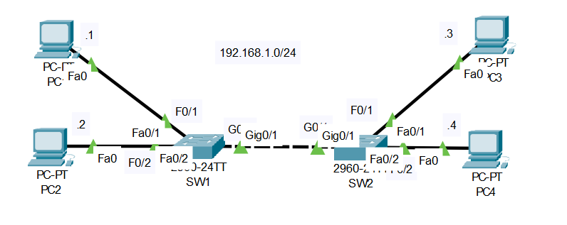
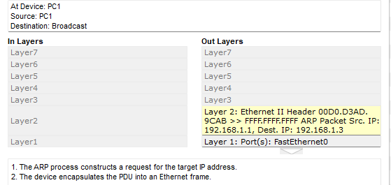
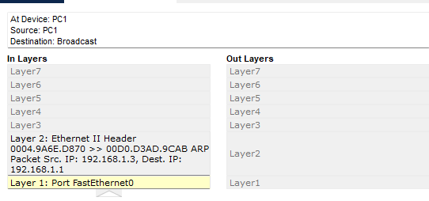
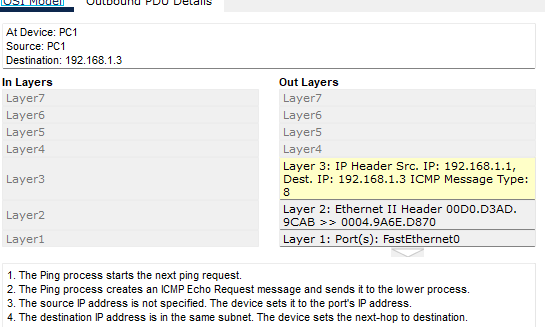
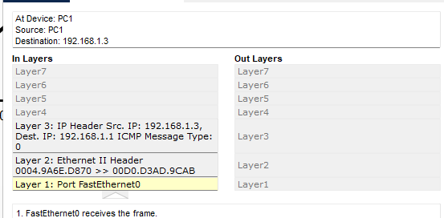

## Escenario

* **2 switches (S1 y S2)** vacíos (sin direcciones MAC aprendidas).
* **3 PCs (PC1, PC2, PC3)** con tabla ARP vacía.
* Queremos analizar qué ocurre con los mensajes y usar comandos para verificarlo.

### Topología del Laboratorio



---
## Desarrollo de la Actividad

### **1. Si PC1 hace ping a PC3…**

* Como la tabla ARP de PC1 está vacía, primero enviará un **ARP Request** (broadcast) para descubrir la dirección MAC de PC3.
* Ese mensaje ARP será enviado como **broadcast (ff:ff:ff:ff:ff:ff)** y lo recibirán:
    * Switch S1
    * Switch S2 (si están conectados)
    * PC2
    * PC3

* Solo **PC3** responderá con un **ARP Reply (unicast)** a PC1 con su dirección MAC.

* Una vez resuelto ARP, se enviará el **ICMP Echo Request (ping)** de PC1 a PC3 (unicast).

* PC3 contestará con **ICMP Echo Reply (unicast)** a PC1.


Resumen:
* Primeros mensajes = ARP Request (broadcast, todos lo ven).
* Después = ICMP Request/Reply (unicast, solo entre PC1 y PC3).

---
### **2. Verificación con Packet Tracer**

* Activa el **Simulation Mode** en Packet Tracer.
* Envía `ping` desde PC1 a PC3.
* Podrás ver los pasos: ARP request → ARP reply → ICMP echo request → ICMP echo reply.

---
### **3. Generar tráfico para que los switches aprendan las MAC**

* Realiza varios pings entre todos los PCs:

```bash
PC1> ping 192.168.1.2    # ping a PC2
PC1> ping 192.168.1.3    # ping a PC3
PC2> ping 192.168.1.3    # ping a PC3
````

Cada vez que pasa un frame, el switch aprende automáticamente la MAC de la interfaz origen y la guarda en su tabla.

-----

### **4. Ver las direcciones MAC en los switches**

En cada switch (modo CLI):

```bash
Switch> enable
Switch# show mac address-table
```

Verás las MAC de las PCs y a qué puerto están asociadas.

También puedes usar:

```bash
Switch# show mac address-table dynamic
```

-----

### **5. Borrar las direcciones MAC dinámicas**

En cada switch:

```bash
Switch> enable
Switch# clear mac address-table dynamic
```

Esto vacía la tabla de aprendizaje.

-----

### Resumen de Comandos Importantes

Ver tabla MAC:

```bash
show mac address-table
```

Ver solo dinámicas:

```bash
show mac address-table dynamic
```

Borrar tabla MAC:

```bash
clear mac address-table dynamic
```

```
```