#Día 26 — OSPF Parte 1


## 🧭 Introducción a OSPF (Open Shortest Path First)

**OSPF (Open Shortest Path First)** es un protocolo de enrutamiento dinámico de **estado de enlace** que utiliza el **algoritmo SPF (Shortest Path First)**, creado por el científico informático holandés **Edsger Dijkstra**.

Se trata del único protocolo de enrutamiento dinámico que se menciona explícitamente en el examen **CCNA 200-301**, y es esencial dominarlo para la certificación.

---

## 📚 Tipos de Protocolos de Enrutamiento Dinámico

| Tipo | Subtipo | Ejemplo | Algoritmo |
|------|----------|----------|------------|
| **IGP** (Interior Gateway Protocol) | Distance Vector | RIP | Bellman-Ford |
| | Link State | OSPF, IS-IS | Dijkstra |
| **EGP** (Exterior Gateway Protocol) | Path Vector | BGP | Path Vector |

---
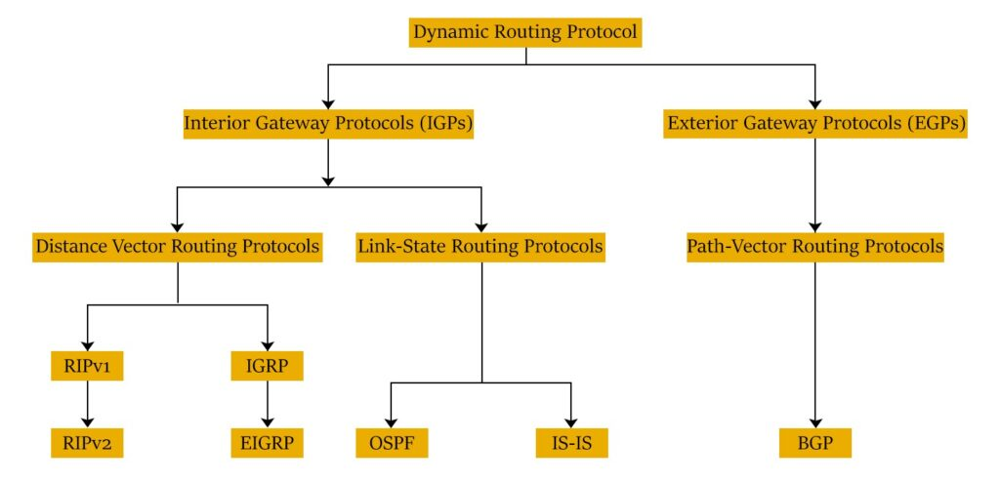
## 🔍 Protocolos de Estado de Enlace

Los **protocolos de estado de enlace** como OSPF y IS-IS funcionan de forma diferente a los de **vector de distancia** (como RIP o EIGRP):

1. Cada router **crea un mapa completo de la red**.
2. Los routers **anuncian sus enlaces** (interfaces y redes conectadas) a sus vecinos.
3. Los vecinos **replican esta información**, hasta que todos los routers tienen **la misma base de datos de estado de enlace (LSDB)**.
4. Cada router **calcula independientemente** las mejores rutas utilizando el **algoritmo SPF**.

**Ventajas:**
- Convergencia más rápida.
- Menor probabilidad de bucles de enrutamiento.

**Desventajas:**
- Mayor consumo de CPU y memoria.

---

## ⚙️ Versiones de OSPF

| Versión | Año | Uso | Descripción |
|----------|------|------|--------------|
| OSPFv1 | 1989 | Obsoleta | No se utiliza más. |
| **OSPFv2** | 1998 | IPv4 | Principal versión para redes IPv4. |
| **OSPFv3** | 2008 | IPv6 (y también IPv4) | Permite soporte multiprotocolo. |

---

## 🧩 Componentes Clave de OSPF

| Componente | Descripción |
|-------------|--------------|
| **LSA (Link State Advertisement)** | Mensaje que contiene información sobre enlaces, costos e identificadores de router. |
| **LSDB (Link State Database)** | Base de datos donde se almacenan todos los LSAs. |
| **SPF Algorithm (Dijkstra)** | Cálculo matemático para determinar la mejor ruta a cada destino. |

---

## 🌐 Ejemplo de Inundación de LSAs

Cuando un router habilita OSPF en una interfaz, crea un **LSA** para informar sobre la red conectada. Este LSA se **inunda por toda el área OSPF** hasta que todos los routers tengan una **LSDB idéntica**.

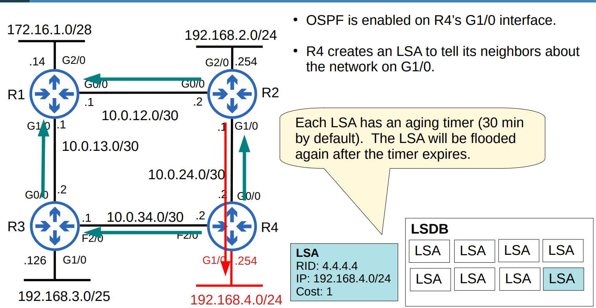

**Proceso resumido:**
1. R4 activa OSPF en G1/0.
2. R4 crea un LSA con:
   - **Router ID:** 4.4.4.4  
   - **Red:** 192.168.4.0/24  
   - **Costo:** 1
3. El LSA se **inunda** a través de la red.
4. Todos los routers actualizan su **LSDB**.
5. Cada router ejecuta **SPF** para calcular su mejor ruta.

---

## 🔁 Etapas del Proceso OSPF

1. **Formación de Vecindad (Neighbors):**  
   Los routers envían mensajes *Hello* para descubrir y establecer relaciones con otros routers OSPF del mismo segmento.

2. **Intercambio de LSAs:**  
   Los routers comparten información de topología para construir su LSDB.

3. **Cálculo de Rutas (SPF):**  
   Cada router ejecuta el algoritmo SPF y actualiza su tabla de enrutamiento.

---

## 🗺️ OSPF Areas (Áreas OSPF)

**OSPF (Open Shortest Path First)** utiliza **áreas** para dividir la red en secciones más pequeñas y manejables, mejorando la **eficiencia**, **escalabilidad** y **rendimiento** del protocolo.

En redes pequeñas, una sola área suele ser suficiente.  
Sin embargo, en redes grandes, un diseño de una sola área puede generar problemas de rendimiento, como:
- Mayor tiempo de cálculo del algoritmo **SPF**.  
- Mayor uso de **CPU** y **memoria** debido al tamaño de la **LSDB (Link-State Database)**.  
- Inundaciones constantes de **LSAs (Link-State Advertisements)** ante cualquier cambio en la red.

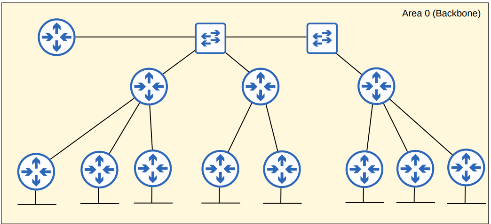

> 💡 **Solución:** Dividir la red OSPF en múltiples áreas más pequeñas para aislar los cambios y reducir la carga de procesamiento.
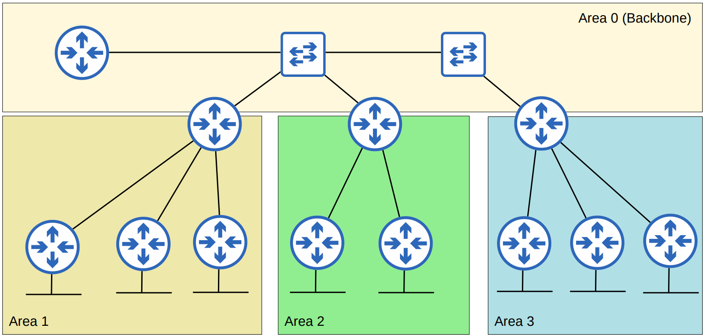
---

### ✅ Ventajas de usar áreas
- **Menor tamaño de la LSDB**, lo que agiliza los cálculos del algoritmo SPF.  
- **Menor carga de CPU**, ya que cada router procesa solo su área.  
- **Menor propagación de LSAs**, limitando el impacto de los cambios a su propia área.  
- **Mayor estabilidad y escalabilidad** en redes empresariales o de gran tamaño.  

---

### Terminología

| Término                                      | Imagen                                               | Descripción                                                                         |
| -------------------------------------------- | ---------------------------------------------------- | ----------------------------------------------------------------------------------- |
| **Área**                                     | 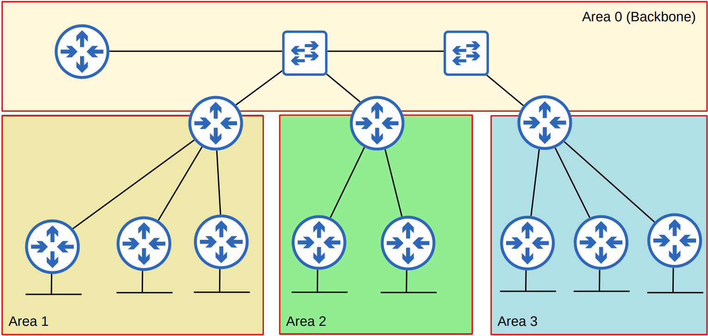                       | Conjunto de routers y enlaces que comparten la misma LSDB (Link State Database).    |
| **Área 0 (Backbone)**                        | 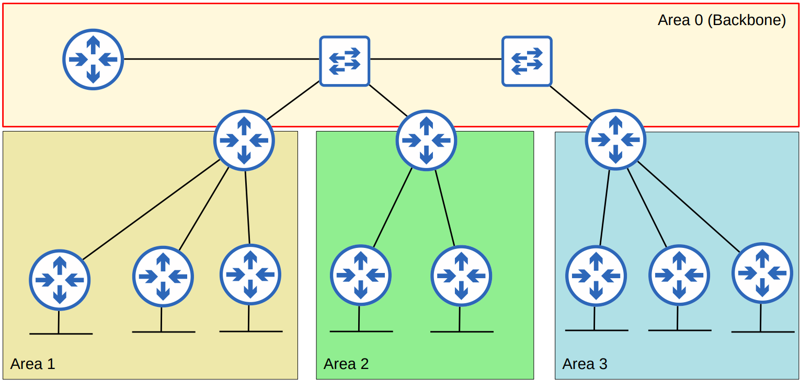          | Área central a la que deben conectarse todas las demás áreas.                       |
| **Router Interno**                           | 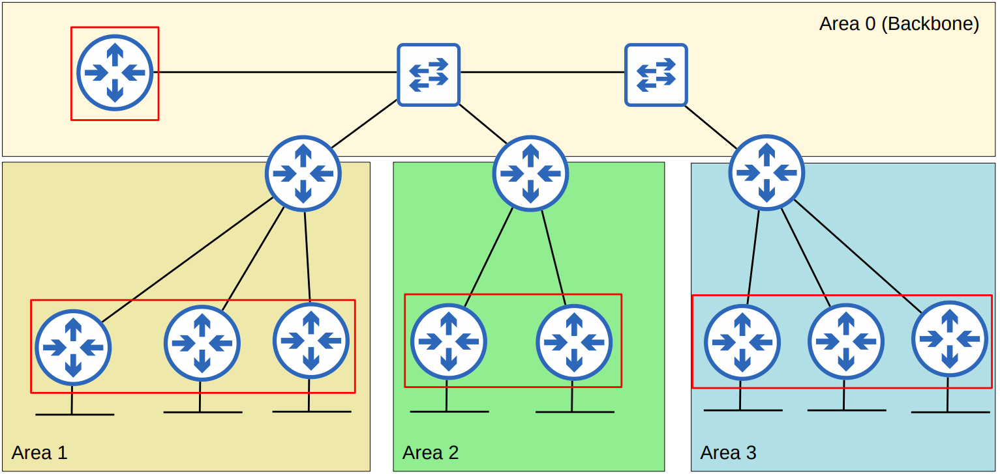   | Router con todas sus interfaces dentro de la misma área.                            |
| **ABR (Area Border Router)**                 | 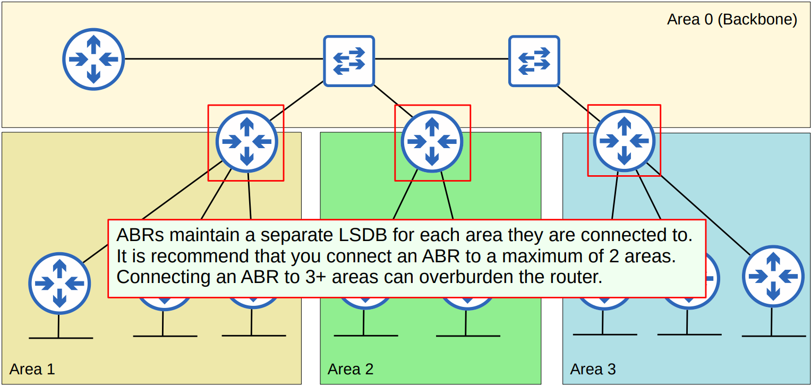                         | Router que conecta múltiples áreas OSPF y mantiene una LSDB separada por cada área. |
| **Backbone Router**                          | 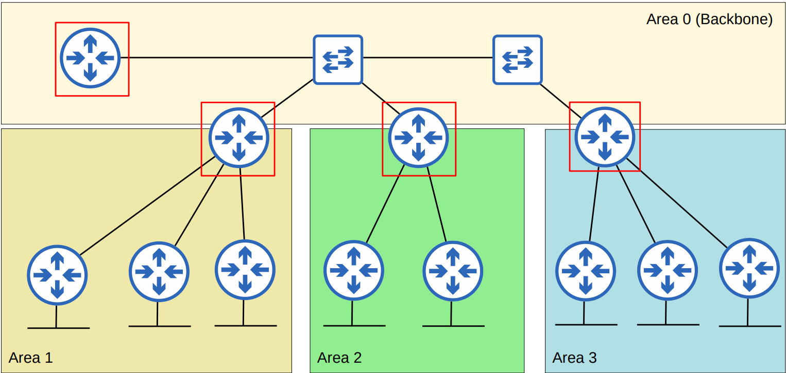 | Router con al menos una interfaz en el área 0.                                      |
| **ASBR (Autonomous System Boundary Router)** | 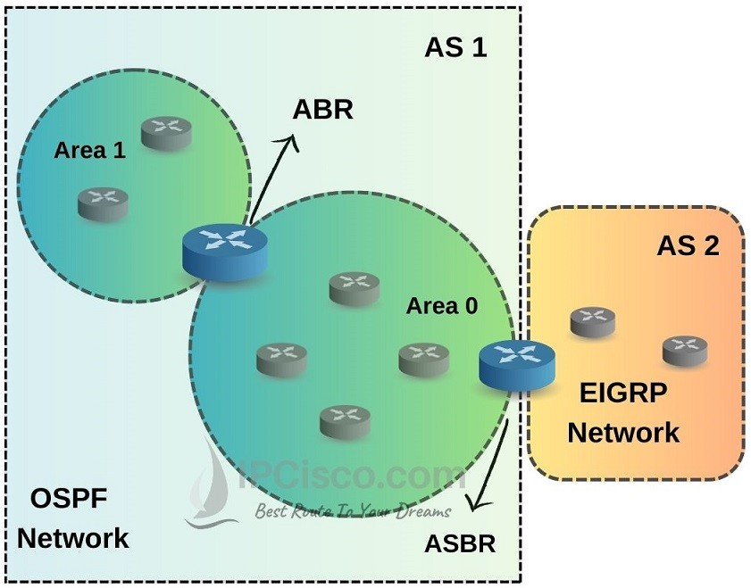                       | Router que conecta la red OSPF con redes externas (por ejemplo, Internet).          |
| **Ruta Intra-area**                          | 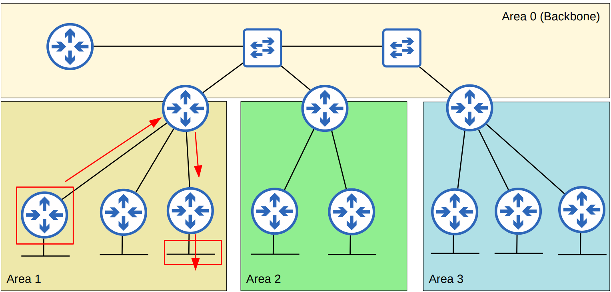           | Ruta hacia un destino dentro de la misma área OSPF.                                 |
| **Ruta Inter-area**                          | 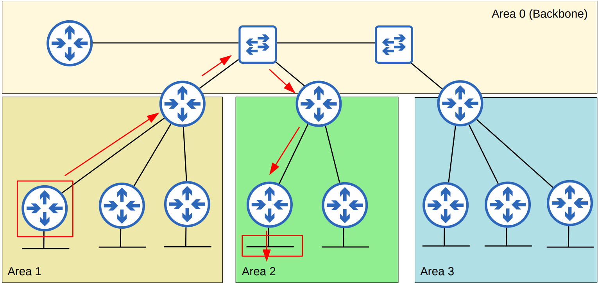           | Ruta hacia un destino en una área diferente.                                        |

---

## ⚠️ Reglas de Diseño de Áreas (con ejemplo visual)

| Regla                     | Imagen                                            | Descripción                                                          |
| ------------------------- | ------------------------------------------------- | -------------------------------------------------------------------- |
| **Áreas contiguas**       | 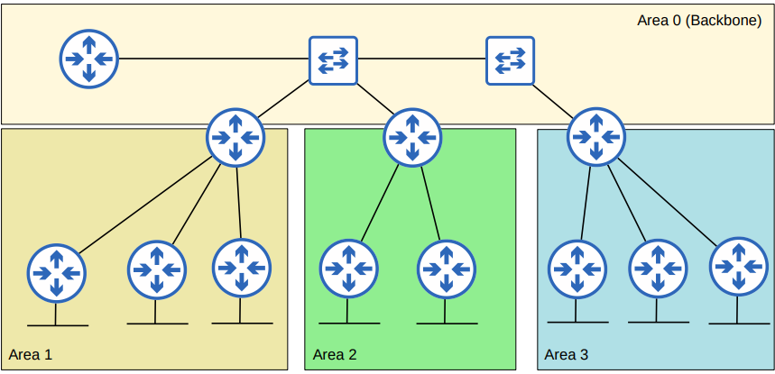   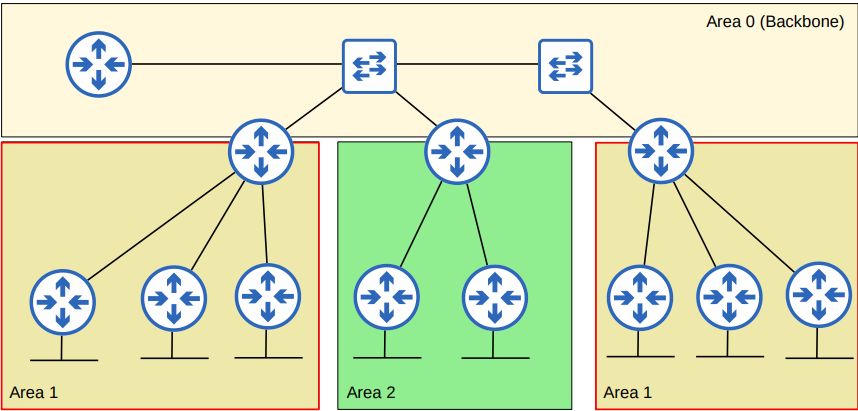  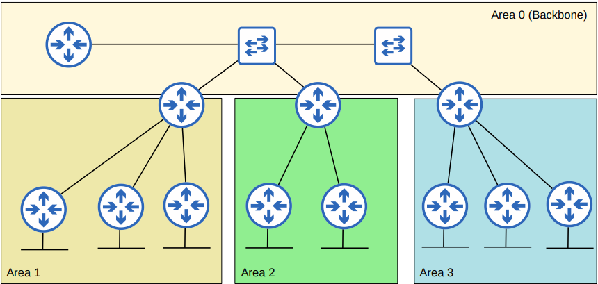  | Todas las áreas deben formar una topología continua.                 |
| **Conexión al Backbone**  | 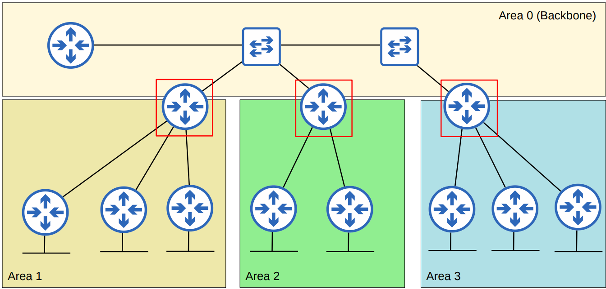  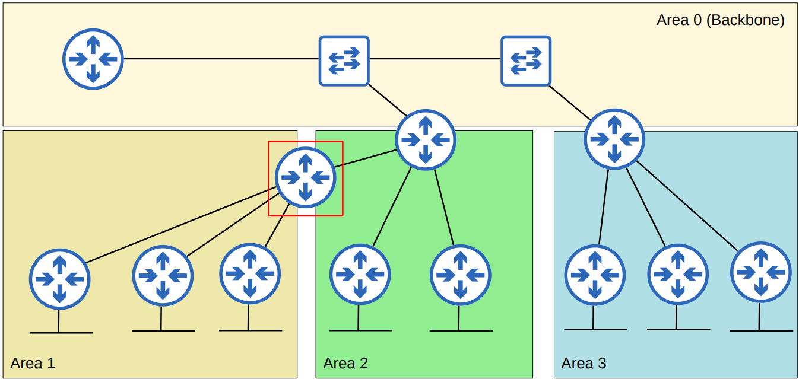 | Todas las áreas deben conectarse al área 0 mediante al menos un ABR. | 
| **Subred única por área** | 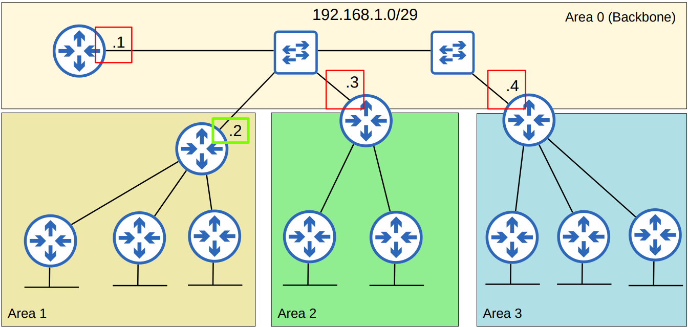     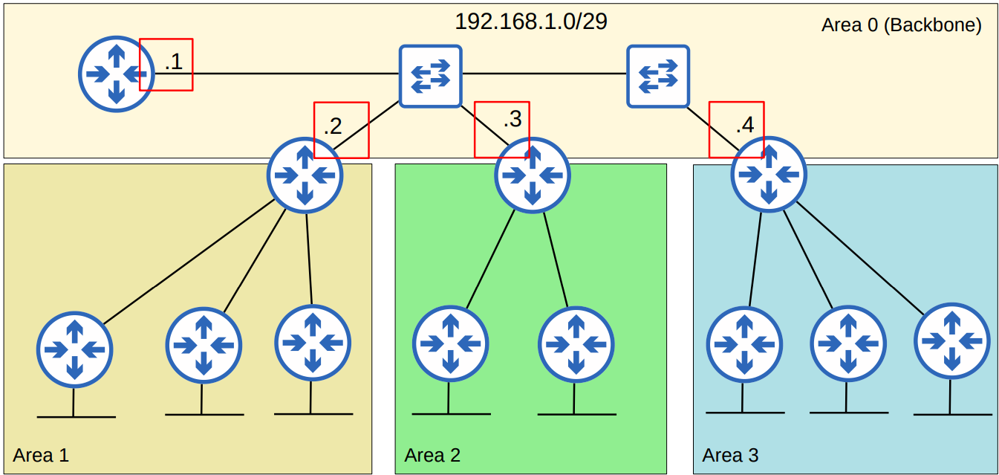         | Interfaces en la misma subred deben pertenecer a la misma área.      |
| **ABR no sobrecargado**   | 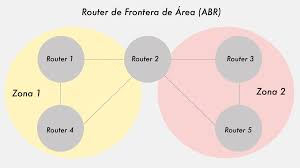  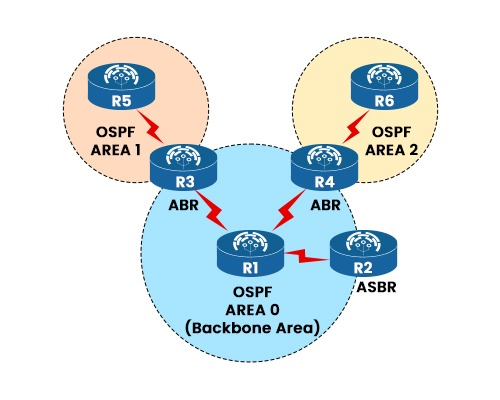         | Evitar conectar un ABR a más de 2 áreas.                             |


---

## 💻 Configuración Básica de OSPF (Single Area)

### Topología de ejemplo

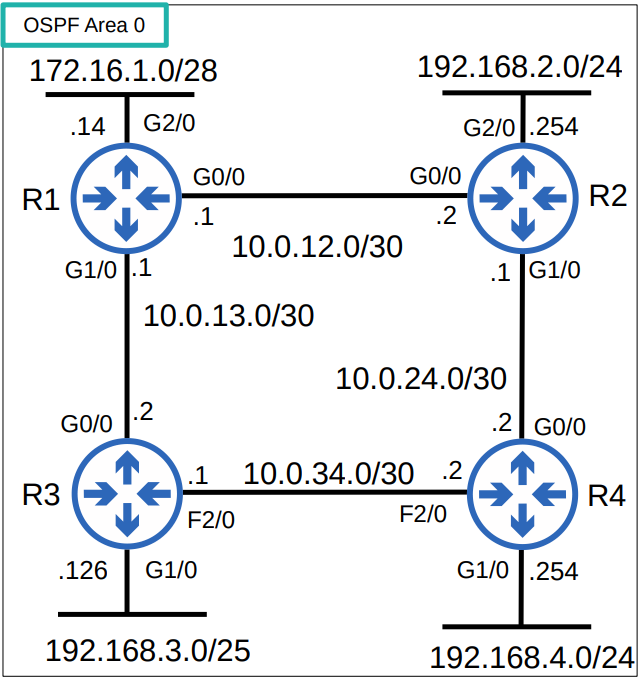

**Datos:**
- Área única: **Área 0**
- Router IDs automáticos o configurados manualmente.
- Objetivo: establecer adyacencias entre R1, R2, R3 y R4.

### Configuración de ejemplo

```bash
R1(config)# router ospf 1
R1(config-router)# network 10.0.12.0 0.0.0.3 area 0
R1(config-router)# network 10.0.13.0 0.0.0.3 area 0
R1(config-router)# network 172.16.1.0 0.0.0.15 area 0
````

**Notas:**

* El **Process ID** (`1`) es **localmente significativo**, distinto al número de área.
* Cada comando `network` debe especificar el número de **área** correspondiente.
* OSPF activará la interfaz y buscará vecinos OSPF en el área especificada.

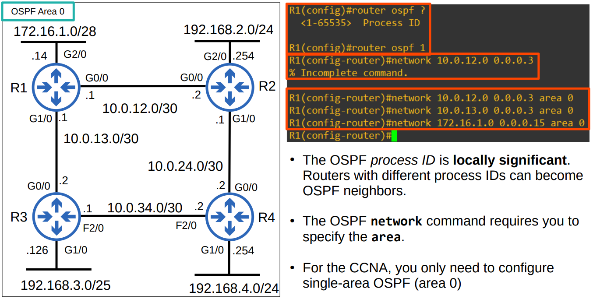

### Qué hace el comando `network`

El comando `network` en OSPF indica al router que:

- Busque todas las interfaces con una dirección IP dentro del rango especificado en el comando `network`.  
- Active OSPF en esas interfaces, asignándolas al área indicada.  
- El router intentará formar adyacencias con otros routers vecinos que tengan OSPF activado en las mismas interfaces.  


---

## 🧱 Comando `passive-interface`


Evita que la interfaz envíe **mensajes Hello**, pero sigue **anunciando la red** en los LSAs.

El comando `passive-interface` le indica al router que:

- Deje de enviar mensajes **Hello** de OSPF por esa interfaz.  
- Sin embargo, el router **seguirá anunciando la red** de esa interfaz en sus LSAs (Link State Advertisements).  
- **Debe usarse siempre** en interfaces que **no tengan vecinos OSPF** (por ejemplo, interfaces LAN hacia usuarios o servidores).  


```bash
R1(config-router)# passive-interface g2/0
```

**Uso recomendado:**
Aplicar en interfaces sin vecinos OSPF (ej. LAN de usuarios).


---

## 🌍 Publicar una Ruta por Defecto en OSPF

Un **ASBR** puede anunciar una ruta por defecto para todo el dominio OSPF.

```bash
R1(config)# ip route 0.0.0.0 0.0.0.0 203.0.113.2
R1(config)# router ospf 1
R1(config-router)# default-information originate
```

Esto convierte a R1 en un **ASBR**, distribuyendo la ruta por defecto en el área.

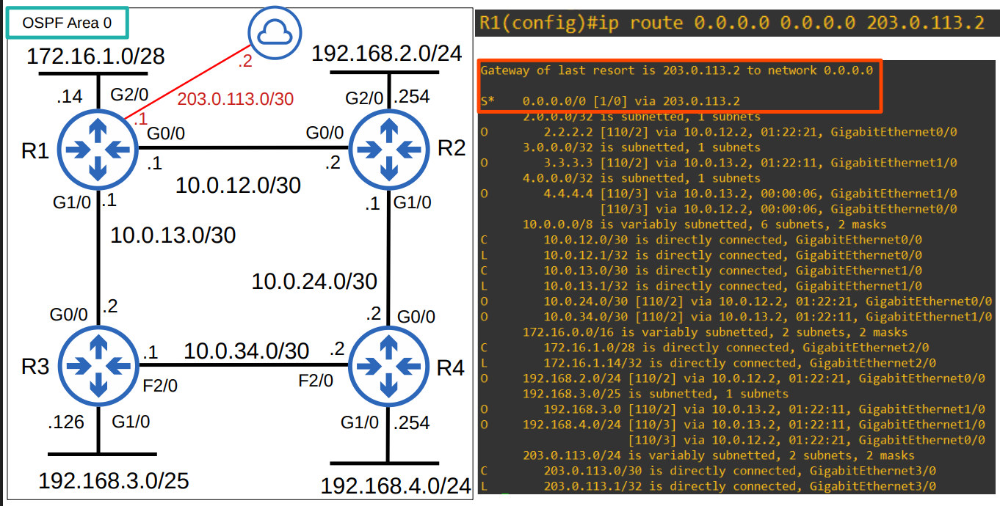


---

## 🧠 Orden de Selección del Router ID (RID)

1. Configurado manualmente con `router-id`.
2. IP más alta en una **interfaz loopback**.
3. IP más alta en una **interfaz física**.

```bash
R1(config-router)# router-id 1.1.1.1
```

**Nota:** Después de cambiar el router-id, usar `clear ip ospf process` para aplicar el cambio.

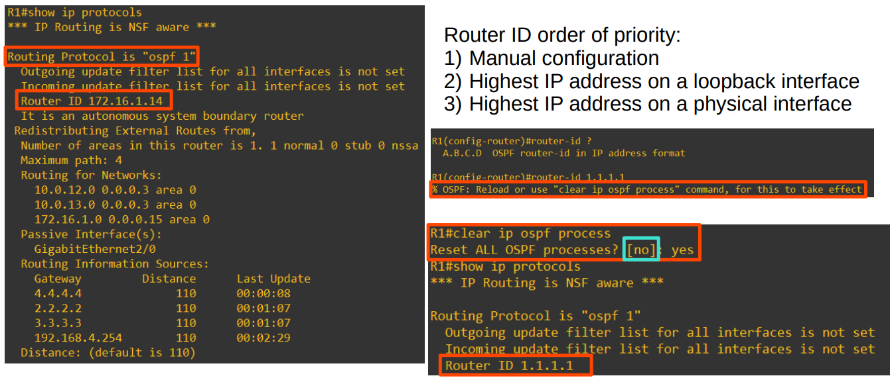

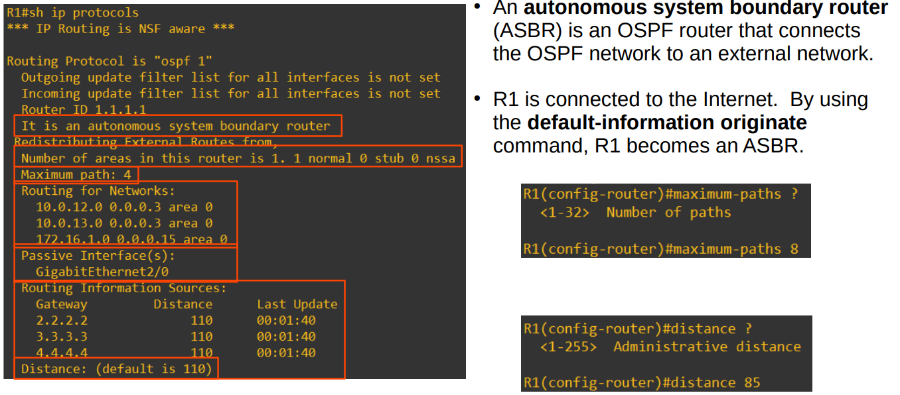

---

## 🧩 Comandos de Verificación

```bash
R1# show ip ospf neighbor
R1# show ip ospf database
R1# show ip protocols
R1# show ip route ospf
```

---

## 🧾 Resumen del Día

- ✅ Conceptos básicos de OSPF  
- ✅ Áreas y jerarquía de red  
- ✅ Configuración básica (Área Única)  
- ✅ `passive-interface`  
- ✅ Ruta por defecto y ASBR  
- ✅ Router ID  

---

## 🧠 Quiz de Repaso

### **Quiz 1**

¿Cuáles afirmaciones sobre OSPF **no son correctas**? (Selecciona dos)

a) En redes multiárea, todas las áreas no backbone deben tener un ABR conectado al área 0.
b) OSPF de área única debe usar el área 0.
c) Dos routers OSPF con diferentes Process IDs pueden ser vecinos.
d) El área OSPF debe especificarse en el comando `network`.
e) Un ASBR conecta la red OSPF interna con redes externas.
f) El Process ID de OSPF debe coincidir con el número de área. ✅

**Respuestas correctas:** B y F

---

### **Quiz 2**

Activar OSPF en interfaces `G0/1` y `G0/2` de R1 con un solo comando:

IPs:

* G0/1 → 10.0.12.1/28
* G0/2 → 10.0.13.1/26

✅ Comando correcto:

```bash
R1(config-router)# network 10.0.8.0 0.0.3.255 area 0
```

---

### **Quiz 3**

Sobre la red OSPF:

1. ¿Cuántos backbone routers hay? → 4
2. ¿Cuántos ABRs hay? → 3
3. ¿Cuántos ASBRs hay? → 1

---

### **Quiz 4**

Comando para convertir a R1 en ASBR:

✅ Correcto:

```bash
R1(config)# ip route 0.0.0.0 0.0.0.0 203.0.113.2
R1(config)# router ospf 1
R1(config-router)# default-information originate
```

---

### **Quiz 5**

Configurar manualmente el Router ID:

✅ Correcto:

```bash
R1(config-router)# router-id 1.1.1.1
```

---

## 🧩 Conceptos Clave
* El **Process ID** es **localmente significativo**; no debe coincidir con el área.
* El comando `network` activa OSPF en interfaces dentro del rango especificado y asigna área.
* `passive-interface` detiene mensajes Hello, pero sigue anunciando LSAs.
* `default-information originate` permite que un ASBR anuncie la ruta por defecto.
* El **Router ID** puede configurarse manualmente o se selecciona automáticamente según IP más alta (loopback → física).
* Para aplicar cambios de router-id, usar `clear ip ospf process`.
* OSPF soporta **ECMP** con hasta 4 rutas por defecto (configurable con `maximum-paths`).

---
