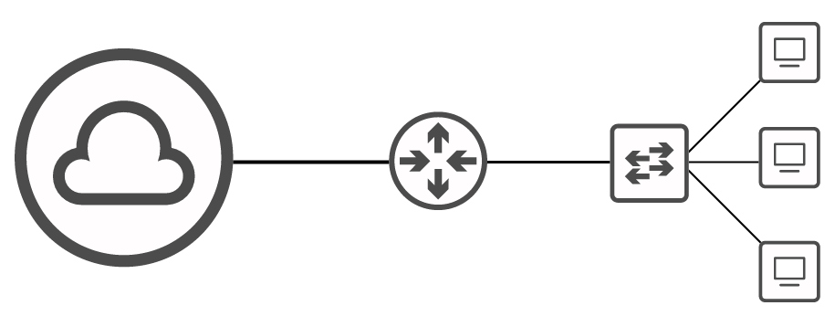
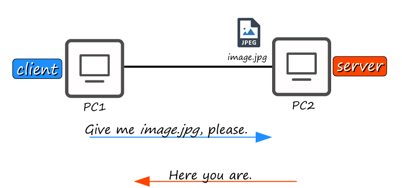
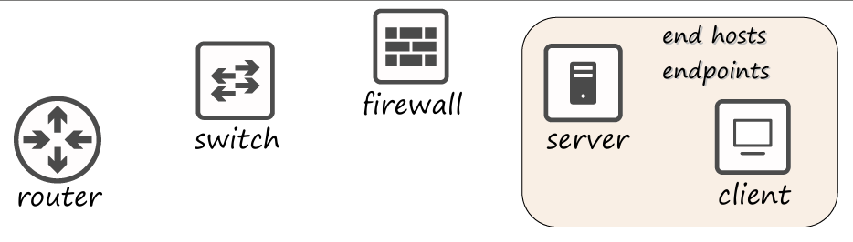
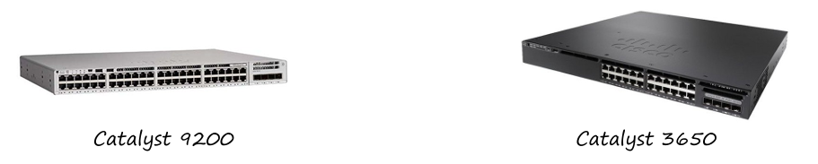
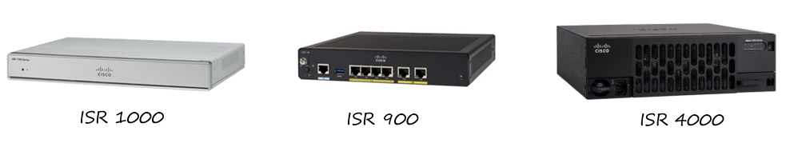
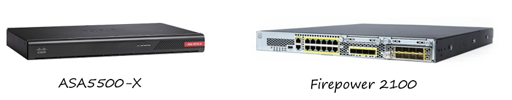

# Resumen: CCNA 200-301 - Parte 1

## 📚 ¿Para quién es este curso?

Este curso está diseñado para cualquiera que quiera:
* Aprender sobre redes de computadoras.

No se requiere experiencia previa; solo una familiaridad básica con computadoras.

---

## 💻 ¿Qué es una red?

Una red de computadoras es una red de telecomunicaciones digital que permite a los nodos (dispositivos) **compartir recursos**. Los principales componentes que la conforman son:

* **Dispositivos finales (End Hosts / Endpoints):** Son los dispositivos que los usuarios finales usan para acceder a la red. Pueden ser:
    * **Clientes:** Dispositivos que acceden a un servicio (ej. tu computadora al ver un video en YouTube).
    * **Servidores:** Dispositivos que proporcionan un servicio (ej. el servidor de YouTube que envía el video).
    
    
    
    Un mismo dispositivo puede funcionar como cliente y servidor en diferentes situaciones.

* **Dispositivos de red:**
     
    * **Switches:** Conectan a los dispositivos finales dentro de una misma **LAN (Local Area Network)**. Tienen múltiples puertos (24+) para conectar PCs, servidores, etc.
        
    * **Routers:** Conectan redes separadas (LANs) entre sí y envían datos a través de Internet. Tienen menos interfaces que los switches.
     
    * **Firewalls:** Controlan y monitorean el tráfico de la red basándose en reglas. Pueden ser dispositivos de hardware que filtran el tráfico entre redes (`Network Firewalls`) o software que se ejecuta en una computadora (`Host-based Firewalls`). Los que tienen funciones avanzadas se conocen como **Next-Generation Firewalls**.
     

---

## ✅ Preguntas de Repaso

1.  **Pregunta:** ¿Qué dispositivo de red usarías para conectar 30 PCs en el mismo departamento?
    * **Respuesta:** Un **Switch**, ya que están diseñados para conectar muchos dispositivos finales en la misma LAN.
    

    
2.  **Pregunta:** Si envías un archivo desde tu celular a otro usando AirDrop, ¿qué rol cumple tu celular?
    * **Respuesta:** Un **Servidor**, ya que está proveyendo un servicio (el archivo) a otro dispositivo.

3.  **Pregunta:** ¿Qué rol cumple tu computadora mientras ves este video?
    * **Respuesta:** Un **Cliente**, ya que está recibiendo un servicio del servidor de la plataforma de videos.

4.  **Pregunta:** ¿Qué dispositivo usarías para conectar redes separadas?
    * **Respuesta:** Un **Router**, ya que su propósito principal es enrutar el tráfico entre diferentes redes.
    
   
    
5.  **Pregunta:** Si tu empresa quiere un firewall con capacidades avanzadas, ¿qué tipo debería comprar?
    * **Respuesta:** Un **Next-Generation Firewall**, que combina las funciones tradicionales con características de filtrado más modernas.
    
   