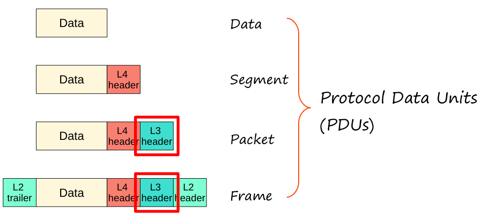
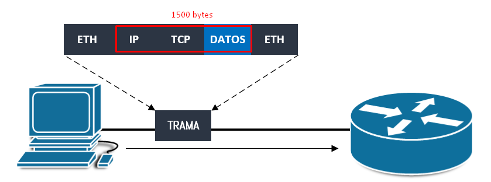
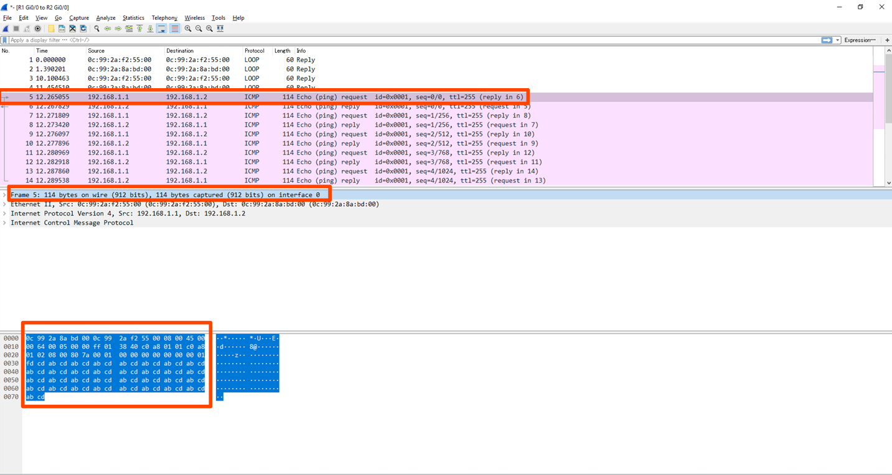
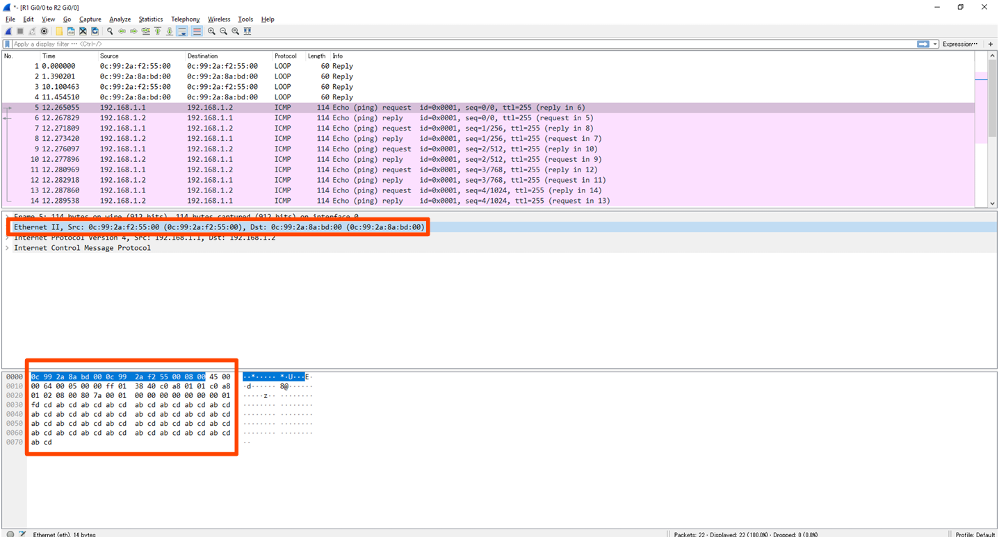
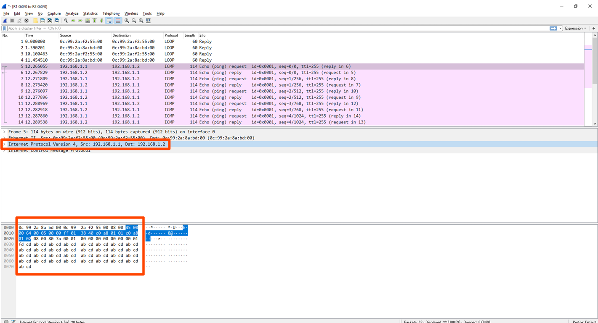
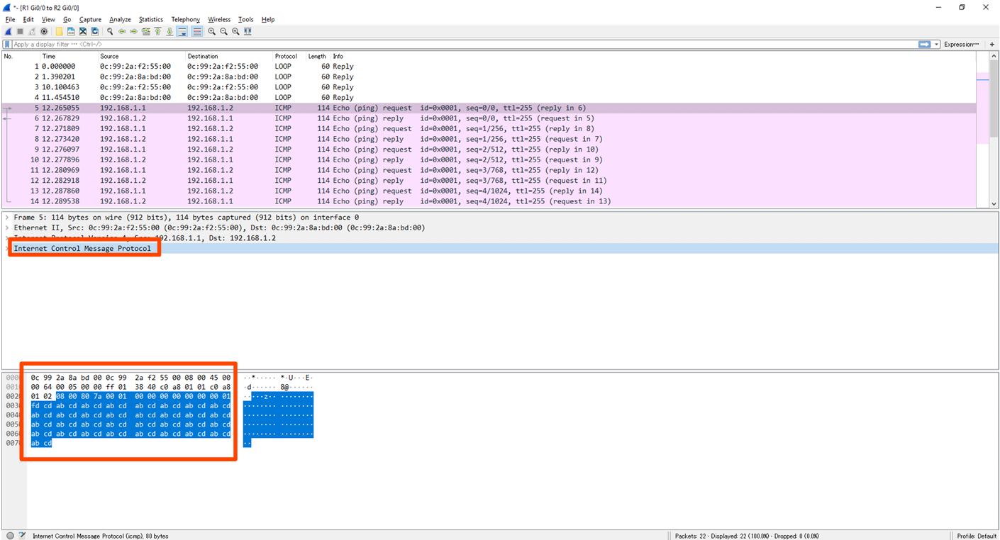
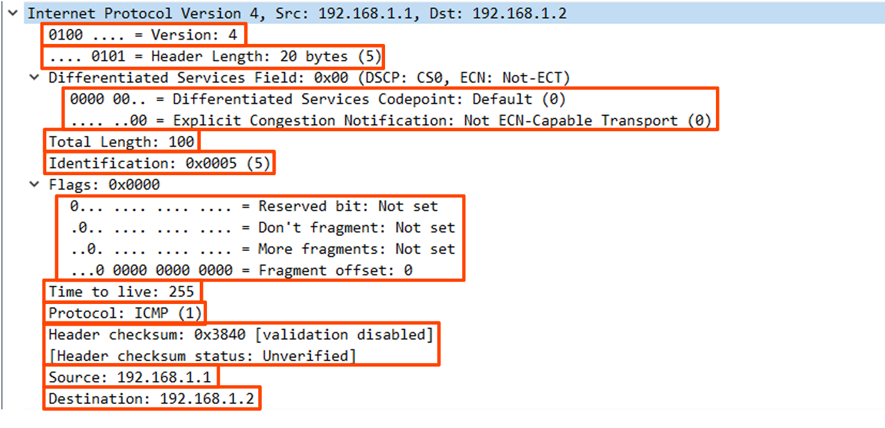
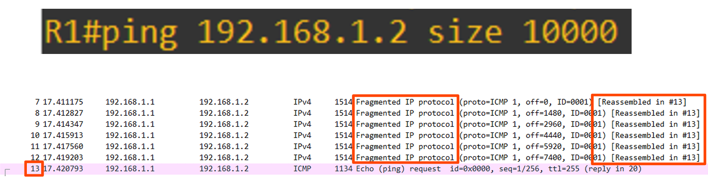
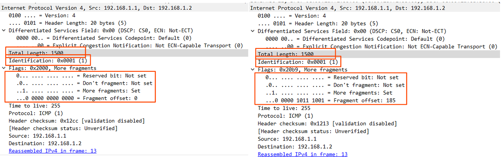

# CCNA 200-301: Día 10 - Encabezado IPv4

### Protocol Data Units (PDUs)

El modelo **OSI** describe cómo los datos se encapsulan a medida que viajan a través de las capas de la red. A nivel de **Capa 3 (Red)**, la PDU se conoce como **Paquete**. Este paquete está compuesto por un encabezado de **Capa 3** (en este caso, IPv4) y la PDU de la **Capa 4** (Segmento).

## Campos del Encabezado IPv4

El encabezado IPv4 es crucial para el enrutamiento y la fragmentación de paquetes. A continuación, se detallan sus campos más importantes:

| Campo | Longitud | Descripción |
| :--- | :--- | :--- |
| **Versión** | 4 bits | Indica la versión de IP; para IPv4, su valor es **4 (0100)**. |
| **IHL** | 4 bits | **Internet Header Length**. Mide la longitud del encabezado en incrementos de 4 bytes. El valor mínimo es 5 (20 bytes) y el máximo es 15 (60 bytes). |
| **DSCP** | 6 bits | **Differentiated Services Code Point**. Utilizado para **Calidad de Servicio (QoS)** para priorizar datos sensibles al retraso. |
| **ECN** | 2 bits | **Explicit Congestion Notification**. Permite la notificación de congestión sin descartar paquetes. |
| **Longitud Total** | 16 bits | Mide la longitud total del paquete (encabezado + datos) en bytes. El valor máximo es 65,535. |
| **Identificación** | 16 bits | Se utiliza para identificar fragmentos de un paquete original, permitiendo su reensamblaje. |
| **Flags** | 3 bits | Controla la fragmentación:   - **Don't Fragment (DF)**: No fragmentar el paquete.  - **More Fragments (MF)**: Indica que hay más fragmentos. |
| **Fragment Offset** | 13 bits | Indica la posición del fragmento dentro del paquete original. |
| **Time To Live (TTL)** | 8 bits | Evita bucles infinitos. Se reduce en 1 en cada salto de router. Si llega a 0, el paquete se descarta. |
| **Protocolo** | 8 bits | Identifica el protocolo encapsulado de la Capa 4 (ej. **6 para TCP**, **17 para UDP**). |
| **Header Checksum**| 16 bits | Utilizado para detectar errores **solo en el encabezado IPv4**. |
| **Direcciones IP** | 32 bits (c/u) | **Dirección IP de origen** y **Dirección IP de destino**. |
| **Opciones** | 0-320 bits | Campo opcional, rara vez usado. |

### Fragmentación y Reensamblaje

Los paquetes IPv4 pueden ser fragmentados si su tamaño supera la **Unidad Máxima de Transmisión (MTU)** de una red, que es típicamente **1500 bytes** para Ethernet. Los campos **Identificación**, **Flags** y **Fragment Offset** son clave en este proceso. Todos los fragmentos de un mismo paquete tienen el mismo valor en el campo **Identificación**, lo que permite a la máquina receptora reensamblarlos.

### Comprobación de Errores

El **Header Checksum** del encabezado IPv4 solo verifica la integridad del propio encabezado. La detección de errores en los datos encapsulados depende del protocolo de la Capa 4. Por ejemplo, **TCP** y **UDP** tienen sus propios campos de checksum para esta finalidad.

### Detalles Clave
- **IHL**: Valor mínimo 5 (20 bytes), máximo 15 (60 bytes).
- **TTL**: Se decrementa en cada salto. Si llega a 0, el paquete se descarta.
- **Checksum**: Solo verifica el encabezado. Los errores en datos los detectan TCP/UDP.
- **Fragmentación**: Ocurre si el paquete supera el MTU (ej. 1500 bytes en Ethernet).

## Capturas de Wireshark
  

  

  

  

  

  

  

## Quiz
1. **¿Cuál es el valor binario del primer campo de un encabezado IPv4?**  
   - d) 0100 (IPv4 = 4 en binario).

2. **¿Qué campo hace que el paquete se descarte si su valor es 0?**  
   - a) TTL (Time To Live).

3. **¿Cómo se detectan errores en los datos encapsulados?**  
   - b) El protocolo encapsulado (TCP/UDP) detecta errores.

4. **¿Qué campo del encabezado IPv4 es de longitud variable?**  
   - a) Opciones.

5. **¿Qué bit estará en 1 en todos los fragmentos de un paquete excepto el último?**  
   - b) More Fragments (MF).