# Día 11 - Routing Fundamentals

## Resumen del Tema

El enrutamiento, o **routing**, es el proceso que los **routers** utilizan para determinar la mejor ruta que deben seguir los paquetes IP para llegar a su destino.

 Los routers almacenan la información de las rutas en una **tabla de enrutamiento**. Cuando un router recibe un paquete, consulta esta tabla para encontrar la mejor ruta y reenviar el paquete.

Existen dos métodos principales para que los routers aprendan rutas:
- **Enrutamiento dinámico**: Los routers utilizan protocolos de enrutamiento (como OSPF) para compartir información de forma automática y construir sus tablas.
- **Enrutamiento estático**: Un administrador de red configura manualmente las rutas en el router.

Una **ruta** le dice al router a dónde enviar un paquete para un destino específico. Si el destino está directamente conectado, el paquete se envía directamente. Si es la propia dirección IP del router, el paquete se recibe para sí mismo.

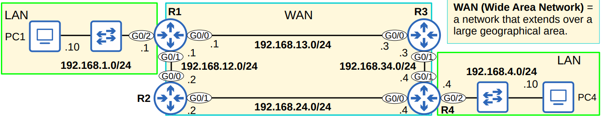

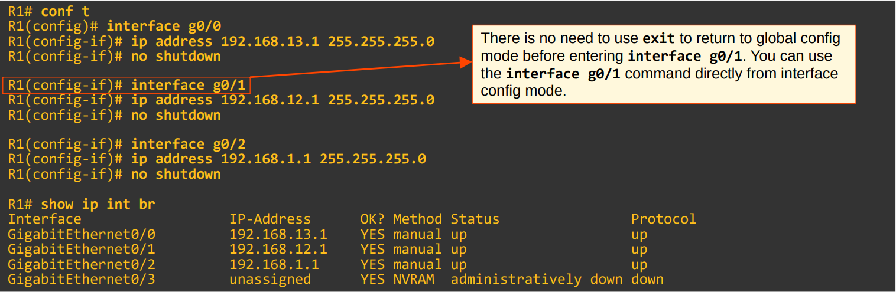


### WAN (Wide Area Network) = red que se extiende sobre un área geográfica extensa.

## Tabla de Enrutamiento (show ip route)

El comando `show ip route` muestra la tabla de enrutamiento de un router. El resultado incluye una leyenda de códigos que identifican los tipos de rutas, como:

- **C - connected**: Una ruta a la red a la que la interfaz está conectada.
- **L - local**: Una ruta a la dirección IP exacta configurada en la interfaz, con una máscara de subred /32.

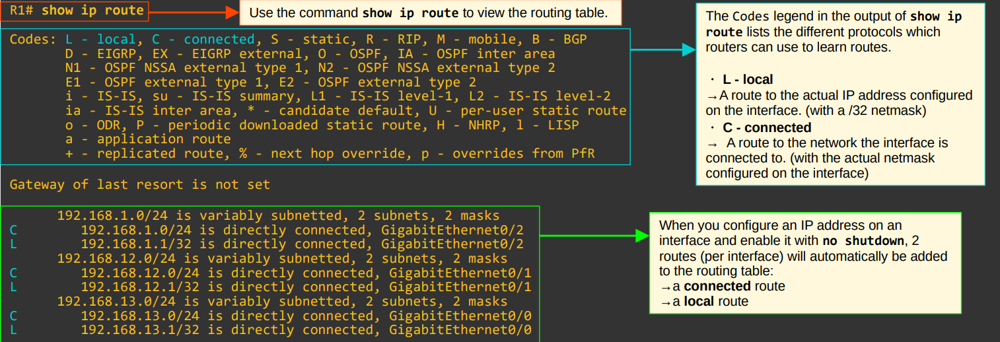

Cuando se configura una dirección IP en una interfaz y se habilita con `no shutdown`, dos rutas se añaden automáticamente a la tabla de enrutamiento: una **ruta conectada (C)** y una **ruta local (L)**.

## Rutas Conectadas y Locales

| Tipo de Ruta | Código | Descripción | Ejemplo |
|:---:|:---:|:---:|:---:|
| **Ruta Conectada** | `C` | Una ruta a la red directamente conectada a la interfaz. | Si la interfaz tiene `192.168.1.1/24`, la ruta conectada es a `192.168.1.0/24`. |
| **Ruta Local** | `L` | Una ruta a la dirección IP exacta de la interfaz. | Si la interfaz tiene `192.168.1.1/24`, la ruta local es a `192.168.1.1/32`. |

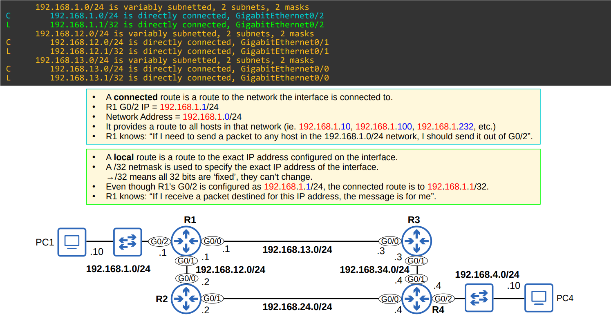
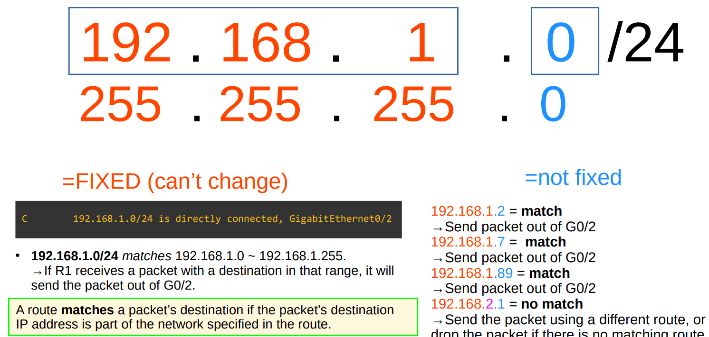
### Selección de Ruta

Si un paquete tiene un destino que coincide con varias rutas en la tabla, el router elegirá la **ruta más específica**. La ruta más específica es aquella con la **mayor longitud de prefijo** (la máscara de subred más larga). Por ejemplo, un paquete destinado a `192.168.1.1` coincidirá tanto con la ruta `192.168.1.0/24` como con la `192.168.1.1/32`. El router seleccionará la ruta `/32` por ser más específica, y así sabrá que el paquete es para él mismo.
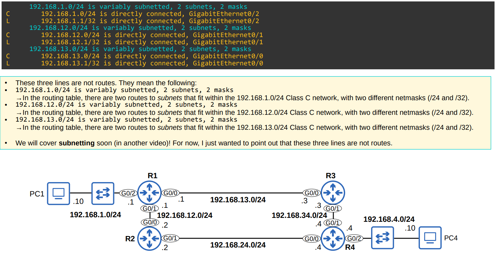
## Comportamiento del Router

- Si un router recibe un paquete y **no tiene una ruta** para su destino, el paquete es **descartado**. ⛔️
- Esto contrasta con los **switches**, que inundan (flood) las tramas si no tienen una entrada en la tabla de direcciones MAC para el destino.

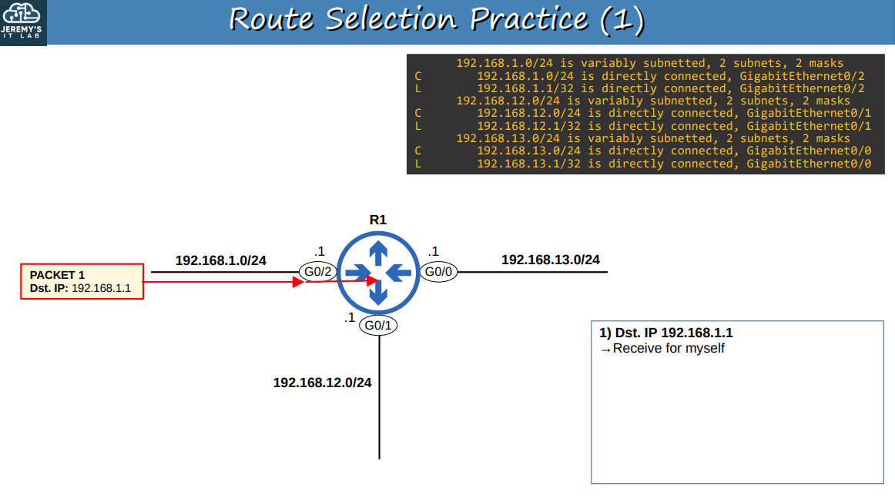


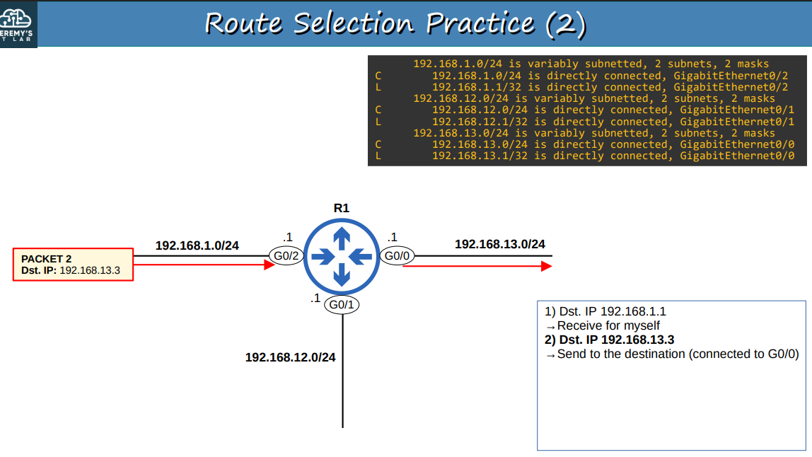


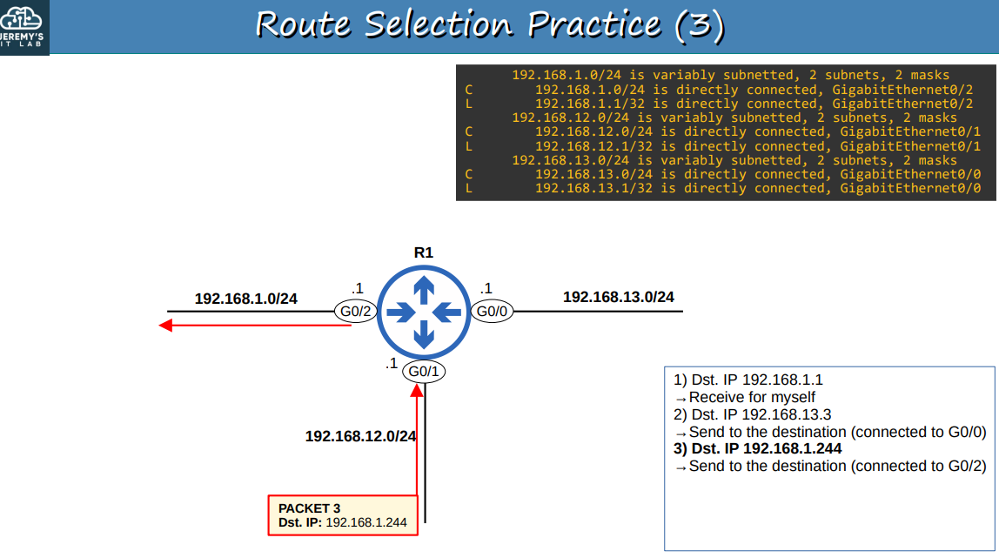


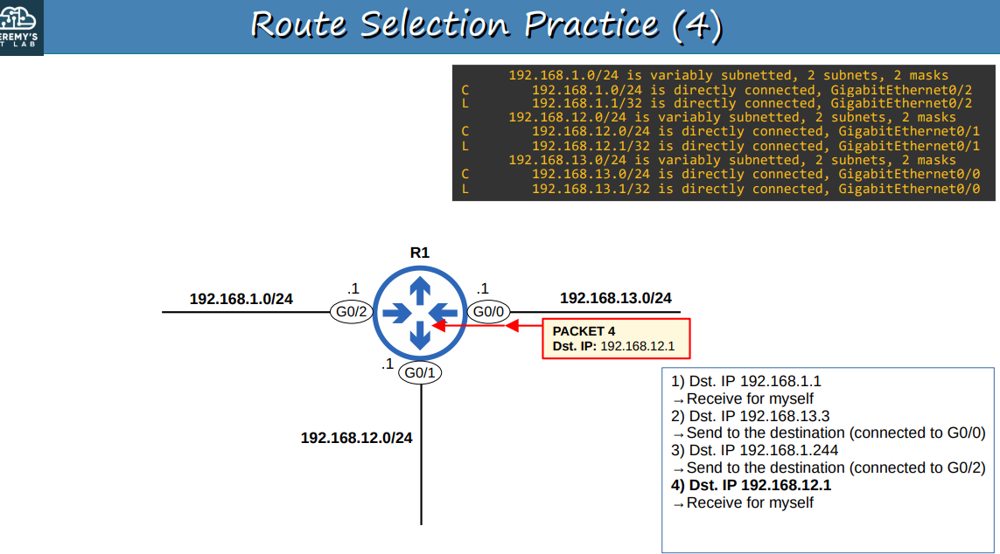


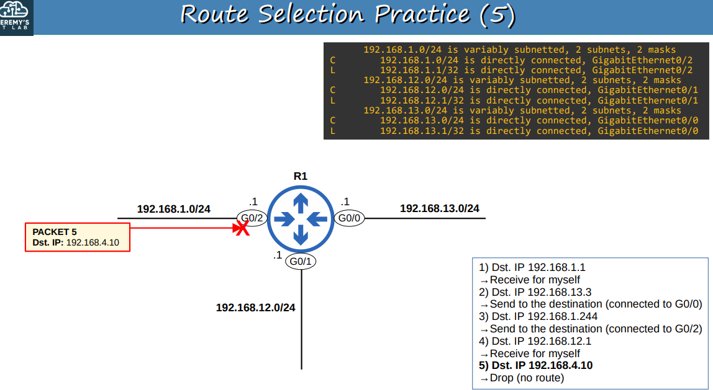


## Resumen

- Los routers almacenan información sobre destinos que conocen en su **tabla de enrutamiento**.  
  → Cuando reciben paquetes, buscan en la tabla de enrutamiento la mejor ruta para reenviar el paquete.  

- Cada ruta en la tabla de enrutamiento es una instrucción:  
  → Para llegar a destinos en la red **X**, envía el paquete al **siguiente salto (Y)** (el siguiente router en el camino al destino).  
  → Si el destino está **directamente conectado** (Connected route), envía el paquete directamente al destino.  
  → Si el destino es tu **propia dirección IP** (Local route), recibe el paquete tú mismo.  

*Veremos cómo funcionan los siguientes saltos en el próximo video sobre rutas estáticas.*  

- Cuando configuras una dirección IP en una interfaz y habilitas la interfaz, se agregan automáticamente **dos rutas** a la tabla de enrutamiento:  

  - **Ruta conectada** (código **C** en la tabla de enrutamiento): una ruta hacia la red conectada a la interfaz.  
    → Ejemplo: si la IP de la interfaz es `192.168.1.1/24`, la ruta será hacia `192.168.1.0/24`.  
    → Le indica al router: “Para enviar un paquete a un destino en esta red, envíalo por la interfaz especificada en la ruta”.  

  - **Ruta local** (código **L** en la tabla de enrutamiento): una ruta hacia la dirección IP exacta configurada en la interfaz.  
    → Ejemplo: si la IP de la interfaz es `192.168.1.1/24`, la ruta será hacia `192.168.1.1/32`.  
    → Le indica al router: “Los paquetes hacia este destino son para ti. Debes recibirlos tú mismo (no reenviarlos)”.  

- Una ruta coincide con un destino si la **dirección IP de destino** del paquete forma parte de la red especificada en la ruta.  
  → Ejemplo: un paquete hacia `192.168.1.60` coincide con la ruta `192.168.1.0/24`, pero no con la ruta `192.168.0.0/24`.  

- Si un router recibe un paquete y no tiene una ruta que coincida con el destino del paquete, **lo descartará**.  
  → Esto es diferente de los switches, que envían tramas a todos los puertos (flooding) si no tienen una entrada en la tabla MAC para el destino.  

- Si un router recibe un paquete y tiene **múltiples rutas que coinciden**, usará la **ruta más específica** para reenviar el paquete.  
  → La ruta más específica = la ruta coincidente con la **longitud de prefijo más larga**.  
  → Esto es diferente de los switches, que buscan una coincidencia exacta en la tabla MAC para reenviar tramas.  


## Temas que cubrimos

- ¿Qué es el **enrutamiento**?  
- La **tabla de enrutamiento** en un router Cisco  
  → Rutas **Conectadas** y **Locales**  
- Fundamentos del enrutamiento (**selección de rutas**)  


## Quiz

### 1. La dirección IP configurada en una interfaz de router aparecerá en la tabla de enrutamiento como qué tipo de ruta?

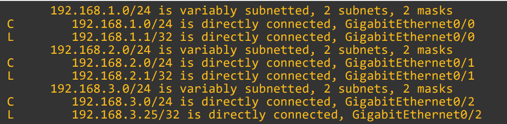
**c) Local**

### 2. ¿Qué hará R1 cuando reciba un paquete destinado a `192.168.3.25`?

```

C 192.168.1.0/24 is directly connected, GigabitEthernet0/0
L 192.168.1.1/32 is directly connected, GigabitEthernet0/0
C 192.168.2.0/24 is directly connected, GigabitEthernet0/1
L 192.168.2.1/32 is directly connected, GigabitEthernet0/1
C 192.168.3.0/24 is directly connected, GigabitEthernet0/2
L 192.168.3.25/32 is directly connected, GigabitEthernet0/2

```
**b) Recibirá el paquete para sí mismo.**

### 3. ¿Cuáles de las siguientes afirmaciones sobre el comportamiento de routers y switches son verdaderas? (selecciona dos)
**b) Los switches inundan las tramas con un destino desconocido.**
**c) Los routers descartan los paquetes con un destino desconocido.**

### 4. ¿Qué dos tipos de rutas se añaden automáticamente a la tabla de enrutamiento cuando se configura una dirección IP en una interfaz y se habilita?
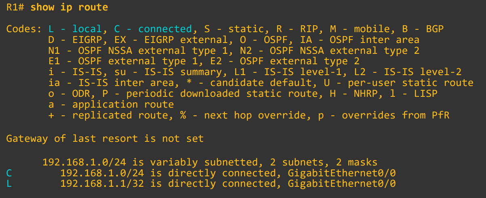
**a) C, L**

### 5. Si R1 recibe un paquete destinado a `10.0.1.23`, ¿cuántas rutas coinciden con ese destino y cuál es la más específica?
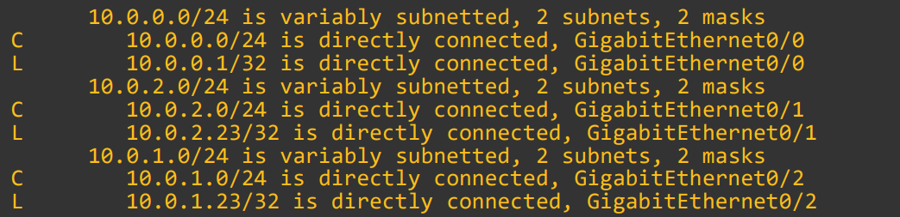
```

C 10.0.0.0/24 is directly connected, GigabitEthernet0/0
L 10.0.0.1/32 is directly connected, GigabitEthernet0/0
C 10.0.2.0/24 is directly connected, GigabitEthernet0/1
L 10.0.2.23/32 is directly connected, GigabitEthernet0/1
C 10.0.1.0/24 is directly connected, GigabitEthernet0/2
L 10.0.1.23/32 is directly connected, GigabitEthernet0/2

```
**c) Dos rutas coincidentes: `10.0.1.0/24`, `10.0.1.23/32`. La más específica: `10.0.1.23/32`.**
```


