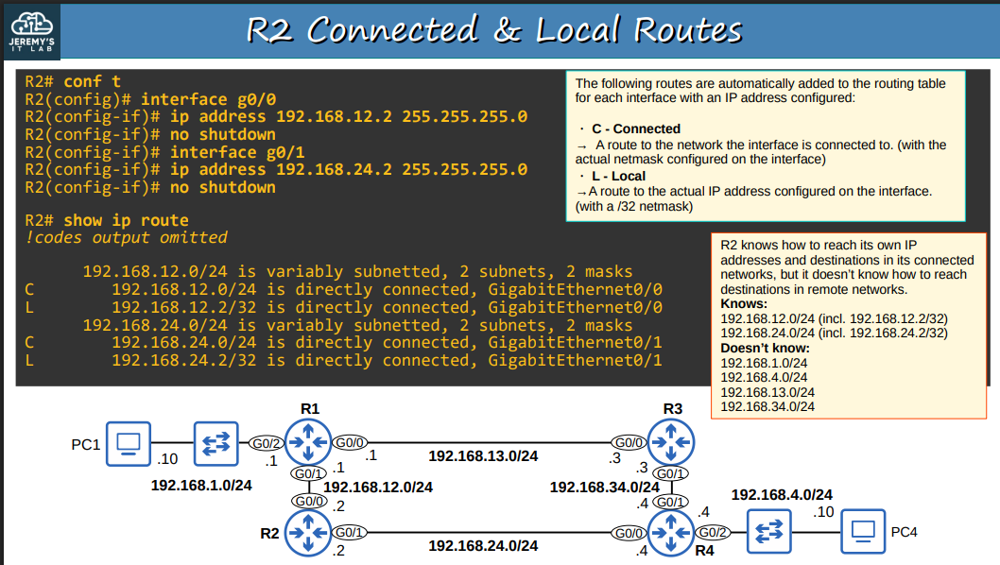
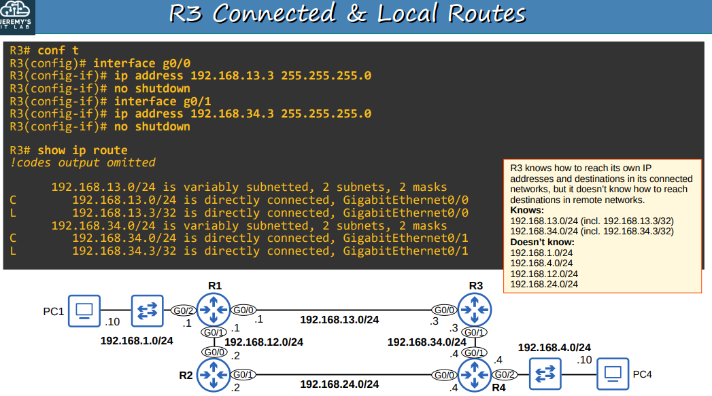
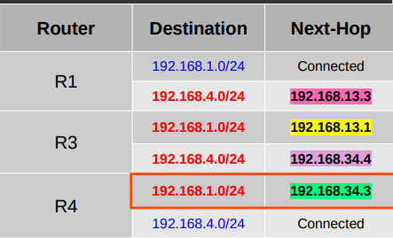
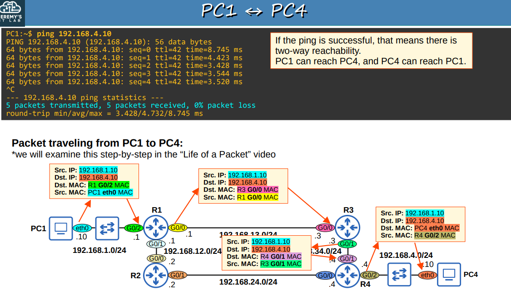

# Día 11 - Static Routing

## Resumen del Tema

Este módulo cubre los **fundamentos del enrutamiento estático**, incluyendo la revisión de rutas conectadas y locales, la introducción a las rutas estáticas, su configuración y el uso de rutas por defecto.

### Revisión: Rutas Conectadas y Locales

Los routers, al igual que en sesiones anteriores, automáticamente añaden dos tipos de rutas a su tabla de enrutamiento por cada interfaz configurada con una dirección IP y habilitada:
- **Rutas Conectadas (C)**: Representan la red a la que la interfaz está directamente conectada.
- **Rutas Locales (L)**: Representan la dirección IP específica de la interfaz, identificada con una máscara de subred /32.

Estos routers (R2, R3 y R4 en el diagrama) conocen sus redes directamente conectadas y sus propias direcciones IP, pero **no conocen las redes remotas**.







### Introducción a las Rutas Estáticas

Las **rutas estáticas** son configuradas manualmente por un administrador de red. Son instrucciones explícitas que le dicen al router cómo alcanzar una red de destino específica, especificando el **siguiente salto (next-hop)** o la **interfaz de salida** por la que se debe reenviar el paquete.

**Para permitir la comunicación entre PC1 y PC4**, es necesario configurar rutas estáticas en los routers intermedios (R1, R3 y R4) para que cada uno sepa cómo llegar a las redes de origen y destino.

## Configuración de Rutas Estáticas

Las rutas estáticas se configuran usando el comando `ip route` en el modo de configuración global del router. Hay varias formas de especificar la ruta:

1.  **Destino, Máscara y Siguiente Salto:**
    ```bash
    Router(config)# ip route <direccion-ip-destino> <mascara-subred> <ip-siguiente-salto>
    ```
    * Ejemplo en R1 para alcanzar la red de PC4 (`192.168.4.0/24`) a través de R3 (`192.168.13.3`):
        ```bash
        R1(config)# ip route 192.168.4.0 255.255.255.0 192.168.13.3
        ```
    * Ejemplo en R3 para alcanzar la red de PC1 (`192.168.1.0/24`) a través de R1 (`192.168.13.1`):
        ```bash
        R3(config)# ip route 192.168.1.0 255.255.255.0 192.168.13.1
        ```
    * Ejemplo en R3 para alcanzar la red de PC4 (`192.168.4.0/24`) a través de R4 (`192.168.34.4`):
        ```bash
        R3(config)# ip route 192.168.4.0 255.255.255.0 192.168.34.4
        ```

2.  **Destino, Máscara e Interfaz de Salida:**
    ```bash
    Router(config)# ip route <direccion-ip-destino> <mascara-subred> <interfaz-salida>
    ```
    * Esta configuración depende del **Proxy ARP** y generalmente se prefiere especificar el siguiente salto.

3.  **Destino, Máscara, Interfaz de Salida y Siguiente Salto:**
    ```bash
    Router(config)# ip route <direccion-ip-destino> <mascara-subred> <interfaz-salida> <ip-siguiente-salto>
    ```



### Rutas por Defecto (Default Routes)

Una **ruta por defecto** (default route) es una ruta que se utiliza cuando no existe una ruta más específica en la tabla de enrutamiento para el destino de un paquete. Se representa con `0.0.0.0/0`.

-   **Configuración:**
    ```bash
    Router(config)# ip route 0.0.0.0 0.0.0.0 <ip-siguiente-salto-o-interfaz>
    ```
    * Ejemplo para dirigir todo el tráfico desconocido a Internet a través de `203.0.113.2`:
        ```bash
        R1(config)# ip route 0.0.0.0 0.0.0.0 203.0.113.2
        ```
-   Las rutas por defecto son las **menos específicas** posibles, ya que cubren todas las direcciones IP. Se utilizan comúnmente para enviar tráfico hacia redes externas, como Internet, mientras que las rutas más específicas manejan el tráfico interno.


## Tablas de Enrutamiento después de la Configuración

Después de configurar las rutas estáticas necesarias, las tablas de enrutamiento de los routers se actualizan para reflejar el conocimiento de las redes remotas.

**Tabla de R1 (ejemplo):**
```bash
Gateway of last resort is not set
S 192.168.4.0/24 [1/0] via 192.168.13.3
```

R1 ahora sabe cómo alcanzar la red `192.168.4.0/24` enviando los paquetes a `192.168.13.3`.

**Tabla de R3 (ejemplo):**
```bash
Gateway of last resort is not set
S 192.168.1.0/24 [1/0] via 192.168.13.1
S 192.168.4.0/24 [1/0] via 192.168.34.4
```
R3 sabe cómo alcanzar ambas redes remotas (`192.168.1.0/24` y `192.168.4.0/24`) a través de sus respectivos siguientes saltos.

**Tabla de R4 (ejemplo):**
```

Gateway of last resort is not set
S 192.168.1.0/24 [1/0] via 192.168.34.3

```
R4 ahora sabe cómo alcanzar la red `192.168.1.0/24` enviando los paquetes a `192.168.34.3`.

## Prueba de Conectividad

Una vez configuradas las rutas estáticas, la comunicación entre PC1 y PC4 debería ser exitosa. El comando `ping` desde PC1 a PC4 (`ping 192.168.4.10`) debería mostrar una pérdida de paquetes del 0%.



## Puntos Clave Cubiertos

-   **Revisión de Rutas Conectadas y Locales:** Cómo los routers aprenden sobre sus redes adyacentes.
-   **Introducción a las Rutas Estáticas:** La necesidad de configurar manualmente rutas para redes remotas.
-   **Configuración de Rutas Estáticas:** Uso del comando `ip route` con diferentes opciones (siguiente salto, interfaz de salida).
-   **Rutas por Defecto:** Configuración y propósito de la ruta `0.0.0.0/0` para tráfico externo.

## Quizzes

### Quiz 1
¿Cuál de los siguientes comandos configura una ruta por defecto en un router Cisco?
**a) R1(config)# ip route 0.0.0.0 0.0.0.0 10.1.1.255**

### Quiz 2
Examina la tabla de enrutamiento de R1. ¿Qué interfaz utilizará para reenviar paquetes destinados a 8.8.8.8?
```

S\* 0.0.0.0/0 [1/0] via 203.0.113.2
S 10.0.0.0/8 [1/0] via 192.168.12.2
S 172.16.0.0/16 [1/0] via 192.168.13.3
C 192.168.12.0/24 is directly connected, GigabitEthernet0/1
L 192.168.12.1/32 is directly connected, GigabitEthernet0/1
C 192.168.13.0/24 is directly connected, GigabitEthernet0/0
L 192.168.13.1/32 is directly connected, GigabitEthernet0/0
C 203.0.113.0/24 is directly connected, GigabitEthernet0/2
L 203.0.113.1/32 is directly connected, GigabitEthernet0/2

```
**a) GigabitEthernet0/0** (Porque 8.8.8.8 no coincide con las redes C o S más específicas, por lo que se usa la ruta por defecto `S* 0.0.0.0/0 [1/0] via 203.0.113.2` que apunta a G0/2, pero el siguiente salto es el IP `203.0.113.2`. **Corrección:** La ruta por defecto `S* 0.0.0.0/0 [1/0] via 203.0.113.2` implica que el siguiente salto está en la red `203.0.113.0/24`, que está conectada a `GigabitEthernet0/2`. Por lo tanto, el paquete saldrá por `GigabitEthernet0/2` hacia `203.0.113.2`.)

### Quiz 3
Examina el siguiente diagrama de red. Completa el gráfico con las rutas estáticas necesarias para permitir que PC1 y PC4 se comuniquen entre sí.

Router | Destination | Next-Hop
------- | -------- | --------
R1 | 192.168.1.0/24 | Connected
R1 | 192.168.4.0/24 | 192.168.13.3
R2 | 192.168.1.0/24 | 192.168.12.1
R2 | 192.168.4.0/24 | 192.168.24.4
R4 | 192.168.1.0/24 | 192.168.24.2
R4 | 192.168.4.0/24 | Connected


### Quiz 4
Examina la siguiente ruta estática en la tabla de enrutamiento de R1. ¿Qué comando se utilizó para configurar esta ruta?
```

S 172.20.0.0/16 is directly connected, GigabitEthernet0/1

```
**d) R1(config)# ip route 172.20.0.0 255.255.0.0 g0/1**
*(Nota: La opción 'a' y 'c' no especifican la máscara de subred correcta, y la opción 'b' es para configurar una interfaz, no una ruta estática.)*

### Quiz 5
Examina el siguiente diagrama. ¿Cuántas rutas estáticas tendrías que configurar en R3 para que conozca todas las demás redes de destino que se muestran en el diagrama?


R3 conoce cómo llegar a sus propias direcciones IP y a los destinos en sus redes conectadas, pero no conoce las redes remotas.
- Conoce: `192.168.13.0/24` y `192.168.34.0/24`.
- No conoce: `192.168.1.0/24`, `192.168.4.0/24`, `192.168.12.0/24`, `192.168.24.0/24`.

Para que R3 conozca las redes remotas que no están directamente conectadas, necesita rutas estáticas para:
1.  `192.168.1.0/24` (para PC1)
2.  `192.168.4.0/24` (para PC4)
3.  `192.168.12.0/24` (conectada a R2)
4.  `192.168.24.0/24` (conectada a R2)

Por lo tanto, se necesitan **cuatro** rutas estáticas.
**d) Cuatro rutas**
```