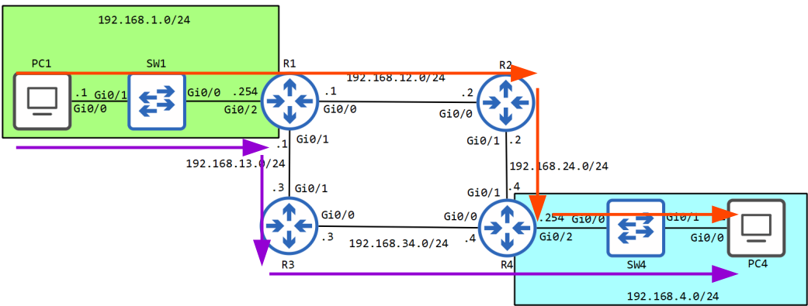
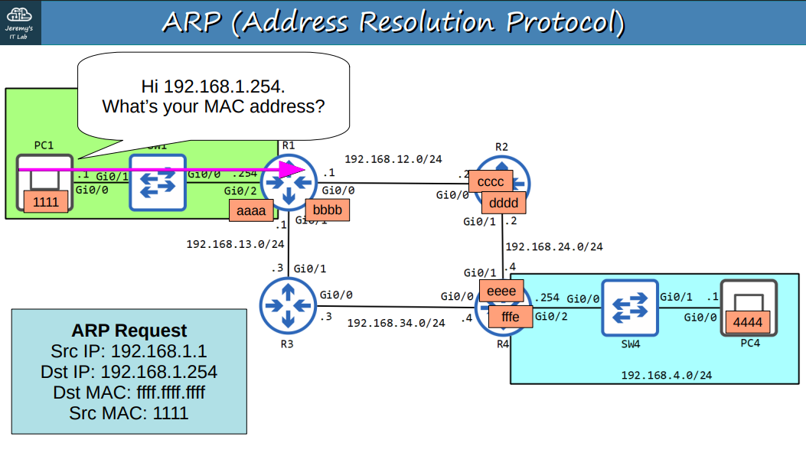
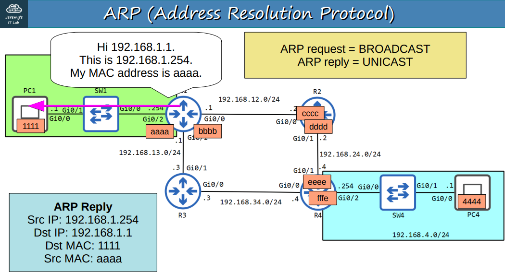
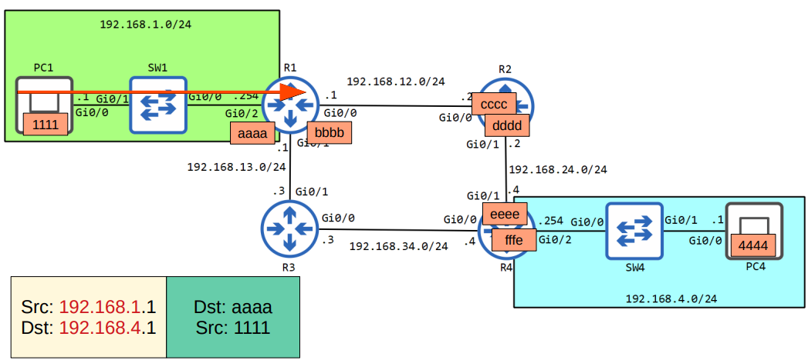
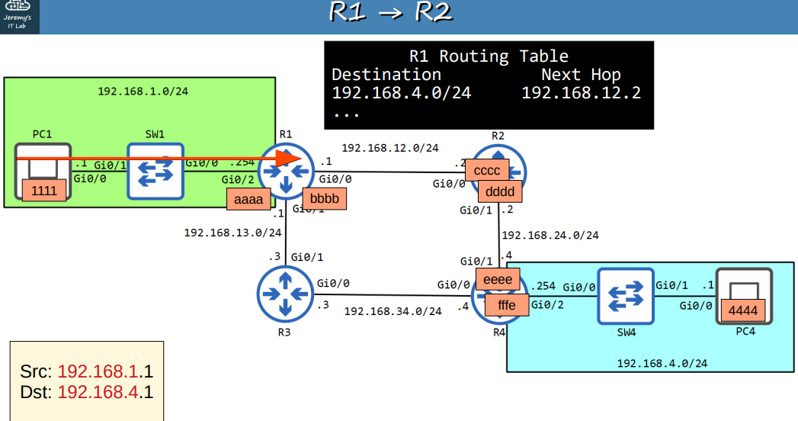
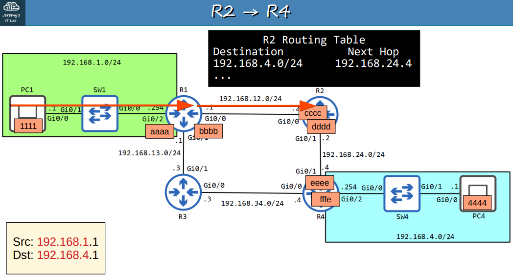
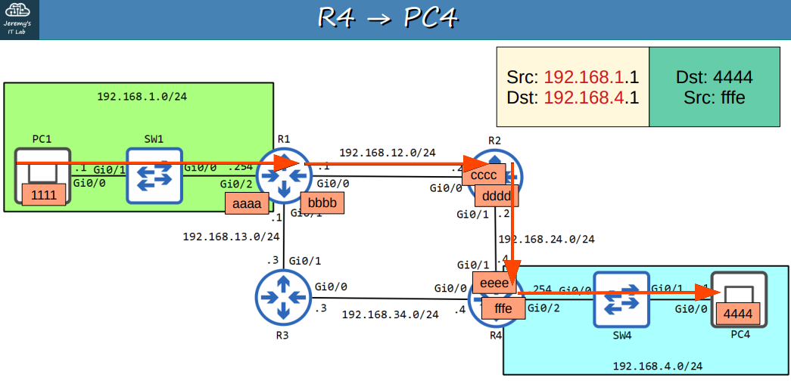

# CCNA 200-301: Día 12 - La vida de un paquete 📦

## Introducción
Este documento resume el proceso completo que sigue un paquete IP para viajar desde una **fuente** hasta un **destino remoto**, cubriendo conceptos clave como **ARP**, **encapsulamiento** y **desencapsulamiento**.

---

## Topología de Red

Se utiliza la siguiente topología para ilustrar el flujo del paquete, con direcciones IP y MAC predefinidas para cada dispositivo.

---

## El proceso de ARP (Address Resolution Protocol)

El protocolo ARP es fundamental para resolver la dirección MAC de un dispositivo en la misma red local a partir de su dirección IP.

### 1. ARP Request (Broadcast)
El dispositivo de origen (PC1) envía una solicitud ARP en broadcast (`ffff.ffff.ffff`) a todos los dispositivos en su red local para encontrar la MAC de su *gateway* (R1).

### 2. ARP Reply (Unicast)
El *gateway* (R1) responde con un mensaje unicast, proporcionando su dirección MAC al dispositivo de origen.

---

## Flujo del paquete (PC1 -> R4)

### 1. PC1 a R1
* **Origen**: PC1 (192.168.1.1)
* **Destino**: PC4 (192.168.4.1)
El paquete se encapsula con las MAC de origen (1111) y destino (aaaa) para cruzar el primer salto.

### 2. R1 a R2
R1 busca la red de destino (`192.168.4.0/24`) en su tabla de enrutamiento y encuentra que el siguiente salto es **192.168.12.2** (R2). Realiza un nuevo proceso ARP para obtener la MAC de R2 (cccc).

### 3. R2 a R4
De manera similar, R2 busca la red de destino en su tabla de enrutamiento y determina que el siguiente salto es **192.168.24.4** (R4). Realiza un proceso ARP para obtener la MAC de R4 (eeee).

### 4. R4 a PC4
Finalmente, R4 reconoce que la red de destino (`192.168.4.0/24`) está directamente conectada a su interfaz. Envía un ARP Request para obtener la MAC de PC4 (4444) y, una vez obtenida, desencapsula y re-encapsula el paquete con las MAC de origen (fffe) y destino (4444) para entregarlo al destino final.

---

## Quiz y respuestas clave

| Pregunta                                                                           | Respuesta |
|------------------------------------------------------------------------------------|:----------|
| ¿Cuál es la MAC de destino cuando PC4 envía un paquete a PC1?                      | `fffe`    |
| ¿Cuál es la MAC de origen cuando el paquete de PC4 es recibido en la interfaz Gi0/0 de R1? | `cccc`    |
| ¿Cuál es la MAC de origen cuando el paquete de PC4 es enviado desde la interfaz Gi0/1 de SW1? | `aaaa`    |
| ¿Cuál es la dirección IP de destino cuando el paquete es enviado desde la interfaz Gi0/1 de R4? | `192.168.1.1` |
| ¿Cuál es la dirección IP de origen cuando el paquete es recibido en la interfaz Gi0/0 de R1? | `192.168.4.1` |