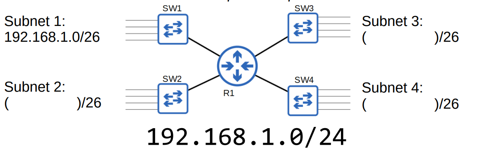

La corrección ha sido aplicada. A continuación se genera el archivo .md corregido, con las máscaras de subred incluidas y el formato de las fórmulas ajustado.

-----

ccna-dia-13-subnetting-parte-1.md

-----

# CCNA 200-301 - Día 13: Subnetting (Parte 1) 🌐

En este día, exploramos los conceptos fundamentales del **subnetting** en redes IPv4, una habilidad esencial para cualquier profesional de redes. Cubrimos el sistema de direccionamiento "classful" que se usaba en el pasado, la transición al **Classless Inter-Domain Routing (CIDR)** y cómo calcular subredes eficientes.

-----

## El Problema del Direccionamiento IPv4 "Classful"

Originalmente, las direcciones IPv4 se asignaban en clases (A, B y C) basadas en el primer octeto de la dirección. Esto llevó a un desperdicio significativo de direcciones IP. Por ejemplo, una empresa que necesitaba 5,000 hosts no podía usar una red de **Clase C** (254 hosts utilizables) y, por lo tanto, se le asignaba una de **Clase B** (aproximadamente 65,000 hosts utilizables), desperdiciando casi 60,000 direcciones.

| Clase | Rango del Primer Octeto (Decimal) | Longitud del Prefijo | Máscara de Subred |
| :--- | :--- | :--- | :--- |
| A | 0 - 127 | /8 | 255.0.0.0 |
| B | 128 - 191 | /16 | 255.255.0.0 |
| C | 192 - 223 | /24 | 255.255.255.0 |

La **IANA (Internet Assigned Numbers Authority)** era responsable de asignar estas direcciones. Este sistema de clases, aunque simple, resultó ser insostenible a medida que el internet crecía. Un ejemplo ilustrativo de desperdicio es el de una red **punto a punto** que conecta dos routers; una red de clase C con 254 direcciones utilizables se asignaría, pero solo se usarían dos, desperdiciando las 252 restantes.

> 

-----

## CIDR (Classless Inter-Domain Routing)

Para resolver el problema del desperdicio de direcciones IP, el **IETF (Internet Engineering Task Force)** introdujo **CIDR** en 1993. CIDR eliminó las reglas de clases, permitiendo dividir redes grandes en redes más pequeñas, conocidas como **subredes**. Esto trajo una eficiencia mucho mayor en la asignación de direcciones.

La notación CIDR, o longitud del prefijo (`/longitud`), indica la cantidad de bits de la dirección IP que pertenecen a la porción de red. La máscara de subred se puede determinar a partir de esta notación. La fórmula para calcular el número de direcciones utilizables en una subred es:

`2^n - 2 = direcciones utilizables`

Donde `n` es el número de bits de host. Los `-2` se restan para la dirección de red y la dirección de broadcast, que no se pueden asignar a los hosts.

### Ejercicios de Práctica

Calculemos las direcciones utilizables para diferentes longitudes de prefijo:

| Prefijo CIDR | Bits de Host (`n`) | Cálculo de Direcciones | Direcciones Utilizables | Máscara de Subred |
| :--- | :--- | :--- | :--- | :--- |
| /25 | 7 | 2^7 - 2 | 126 | 255.255.255.128 |
| /26 | 6 | 2^6 - 2 | 62 | 255.255.255.192 |
| /27 | 5 | 2^5 - 2 | 30 | 255.255.255.224 |
| /28 | 4 | 2^4 - 2 | 14 | 255.255.255.240 |
| /29 | 3 | 2^3 - 2 | 6 | 255.255.255.248 |
| /30 | 2 | 2^2 - 2 | 2 | 255.255.255.252 |

Las redes `/31` y `/32` son casos especiales. Una red `/31` tiene 0 direcciones utilizables (2^1 - 2 = 0$), pero se utiliza para enlaces punto a punto. Una red `/32` es una dirección de host única y no tiene una dirección de broadcast, por lo que a menudo se usa para direcciones de loopback o direcciones de host individuales.

> 

### Ejemplo de Subnetting

Dividamos la red **192.168.1.0/24** en cuatro subredes para acomodar 47 hosts cada una.

1.  **Requerimiento:** 47 hosts por subred.

2.  **Cálculo:** Necesitamos una potencia de 2 que, al restarle 2, sea mayor o igual a 47.

      - 2^5 - 2 = 30 (demasiado pequeño)
      - 2^6 - 2 = 62 (suficiente)

3.  **Bits de host:** Necesitamos 6 bits de host.

4.  **Longitud de prefijo:** El prefijo total es de 32 bits, así que $32 - 6 = 26$. Por lo tanto, el nuevo prefijo es `/26`.

5.  **Máscara de subred:**

    ```
    11111111.11111111.11111111.11000000
    255.255.255.192
    ```

6.  **Cálculo de las subredes:** Con 6 bits de host, la red tiene un salto de 2^{6}$ = 64 en el último octeto.

      - **Subred 1:** 192.168.1.0/26 (Broadcast: 192.168.1.63)
      - **Subred 2:** 192.168.1.64/26 (Broadcast: 192.168.1.127)
      - **Subred 3:** 192.168.1.128/26 (Broadcast: 192.168.1.191)
      - **Subred 4:** 192.168.1.192/26 (Broadcast: 192.168.1.255)


      