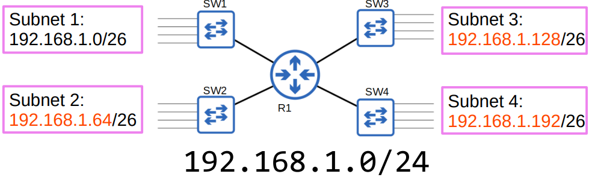

---

# CCNA 200-301: Día 14 - Subnetting (Parte 2)

## Temas Cubiertos

* Práctica de Subnetting (Redes Clase C).
* Subnetting de redes **Clase B**.

---

## Subnetting en Redes Clase C

### Ejercicio Práctico

Divide la red **192.168.1.0/24** en cuatro subredes para acomodar el número de hosts requerido.




| Subred   | Dirección de Red   | Rango de Hosts                  |
| -------- | ------------------ | ------------------------------- |
| Subred 1 | `192.168.1.0/26`   | `192.168.1.1 - 192.168.1.62`    |
| Subred 2 | `192.168.1.64/26`  | `192.168.1.65 - 192.168.1.126`  |
| Subred 3 | `192.168.1.128/26` | `192.168.1.129 - 192.168.1.190` |
| Subred 4 | `192.168.1.192/26` | `192.168.1.193 - 192.168.1.254` |

**Truco de Subnetting:**
El truco consiste en entender que cada bit que tomas prestado de la **Host Portion** para la **Network Portion** duplica el número de subredes posibles.

* Tomar prestados **2 bits** (`/26`) nos permite crear **4 subredes** (2^2 = 4).
* Los bits prestados determinan la dirección de inicio de cada subred.


* `00` = `192.168.1.0`
* `01` = `192.168.1.64`
* `10` = `192.168.1.128`
* `11` = `192.168.1.192`

---

### Ejemplo 2

Divida la red **192.168.255.0/24** en cinco subredes del mismo tamaño. Identifique las cinco subredes.

### Paso 0 — Diagrama inicial


---

### Paso 1 — ¿Cuántos bits prestar?

* Necesitamos al menos **5** subredes.
* Buscar `n` tal que $2^n >= 5$.

  * $2^2 = 4$ (insuficiente)
  * $2^3 = 8$ (suficiente)
* **Prestamos 3 bits**.


---

### Paso 2 — Nueva máscara y representación binaria

* Máscara original: `/24` → `255.255.255.0`
* Prestando 3 bits → nueva máscara: **`/27` → `255.255.255.224`**
* Último octeto en binario (máscara /27): `11100000` = 224

```bash
Dirección base: 192.168.255.0
Mask /24:      255.255.255.0   -> 11111111.11111111.11111111.00000000
Mask /27:      255.255.255.224 -> 11111111.11111111.11111111.11100000
```


---

### Paso 3 — Tamaño del bloque y hosts por subred

* Bloque (incremento) = `256 - 224 = 32` → **incremento = 32** en el último octeto.
* Bits de host = `32 - 27 = 5`.
* Direcciones por subred = `2^5 = 32`.
* Hosts utilizables por subred = `32 - 2 = 30`.


---

### Paso 4 — Enumerar subredes /27 (incremento 32)

Cada subred /27 avanza en pasos de 32 en el último octeto. Aquí las subredes en el `/24`:

1. **192.168.255.0/27**

   * Rango usable: `192.168.255.1` → `192.168.255.30`
   * Broadcast: `192.168.255.31`

2. **192.168.255.32/27**

   * Rango usable: `192.168.255.33` → `192.168.255.62`
   * Broadcast: `192.168.255.63`

3. **192.168.255.64/27**

   * Rango usable: `192.168.255.65` → `192.168.255.94`
   * Broadcast: `192.168.255.95`

4. **192.168.255.96/27**

   * Rango usable: `192.168.255.97` → `192.168.255.126`
   * Broadcast: `192.168.255.127`

5. **192.168.255.128/27**

   * Rango usable: `192.168.255.129` → `192.168.255.158`
   * Broadcast: `192.168.255.159`

> **Observación:** dentro del /24 hay 8 subredes /27 en total: `.0, .32, .64, .96, .128, .160, .192, .224`. Usamos las primeras 5 para tu requerimiento.

---

### Paso 5 — Respuesta directa (las 5 subredes pedidas)

* **Subnet 1:** `192.168.255.0/27`  — usable: `.1` → `.30`, broadcast `.31`
* **Subnet 2:** `192.168.255.32/27` — usable: `.33` → `.62`, broadcast `.63`
* **Subnet 3:** `192.168.255.64/27` — usable: `.65` → `.94`, broadcast `.95`
* **Subnet 4:** `192.168.255.96/27` — usable: `.97` → `.126`, broadcast `.127`
* **Subnet 5:** `192.168.255.128/27`— usable: `.129` → `.158`, broadcast `.159`


---

## Identificar la subred — ejercicios resueltos

### Ejercicio 1 — ¿A qué subred pertenece `192.168.5.57/27`?

**Host:** `192.168.5.57/27`
**Objetivo:** hallar el **Subnet ID**.

#### Paso 1 — Máscara y tamaño de bloque

* `/27` → **máscara:** `255.255.255.224`
* Último octeto de la máscara en binario: `11100000`
* Tamaño del bloque = `256 - 224 = 32` → subredes en saltos de 32.


#### Paso 2 — Último octeto del host en binario

* `57` decimal → en binario (último octeto): `00111001`
* Operación bitwise AND (host & máscara):

```
00111001  (57)
11100000  (mask /27)
--------------------
00100000  (resultado)
```

* `00100000` binario = `32` decimal → **Subnet ID (último octeto) = 32**

#### Resultado

* **Subnet ID:** `192.168.5.32/27`
* **Rango usable:** `192.168.5.33` — `192.168.5.62`
* **Broadcast:** `192.168.5.63`

**Respuesta (campo):** `Subnet ID: 192.168.5.32/27`

---

### Ejercicio 2 — ¿A qué subred pertenece `192.168.29.219/29`?

**Host:** `192.168.29.219/29`
**Objetivo:** hallar el **Subnet ID**.

#### Paso 1 — Máscara y tamaño de bloque

* `/29` → **máscara:** `255.255.255.248`
* Último octeto de la máscara en binario: `11111000`
* Tamaño del bloque = `256 - 248 = 8` → subredes en saltos de 8.


#### Paso 2 — Último octeto del host en binario

* `219` decimal → en binario (último octeto): `11011011`
* Operación bitwise AND (host & máscara):

```
11011011  (219)
11111000  (mask /29)
--------------------
11011000  (resultado)
```

* `11011000` binario = `216` decimal → **Subnet ID (último octeto) = 216**

#### Resultado

* **Subnet ID:** `192.168.29.216/29`
* **Rango usable:** `192.168.29.217` — `192.168.29.222`
* **Broadcast:** `192.168.29.223`

**Respuesta (campo):** `Subnet ID: 192.168.29.216/29`

---

### Tabla rápida — Prefijos (Clase C)

| Prefijo | Número de subredes (en /24) |                      Hosts por subred (utilizables) |
| ------: | --------------------------: | --------------------------------------------------: |
|     /25 |                           2 |                                                 126 |
|     /26 |                           4 |                                                  62 |
|     /27 |                           8 |                                                  30 |
|     /28 |                          16 |                                                  14 |
|     /29 |                          32 |                                                   6 |
|     /30 |                          64 |                                                   2 |
|     /31 |                         128 | 0 (2 direcciones, usado para enlaces punto a punto) |
|     /32 |                         256 |                            0 (dirección host única) |

---

## Subnetting en Redes Clase B

### Principios Fundamentales

El proceso de subnetting para redes **Clase A**, **B** y **C** es **exactamente el mismo**. La única diferencia es el número de bits disponibles en la porción de host.

### Ejercicio 1: Creación de Subredes

Se nos asigna la red **172.16.0.0/16** y se nos pide crear **80 subredes**.

* 2^x >= 80
* 2^6 = 64 (no es suficiente)
* 2^7 = 128 (es suficiente)

Necesitamos tomar prestados **7 bits** del **Host Portion**.
La nueva longitud de prefijo (`/`) será: **16 + 7 = /23**.

| Longitud Prefijo | Subredes | Máscara de Subred |
| ---------------- | -------- | ----------------- |
| `/16` (Original) | 1        | `255.255.0.0`     |
| `/17`            | 2        | `255.255.128.0`   |
| `/18`            | 4        | `255.255.192.0`   |
| `/19`            | 8        | `255.255.224.0`   |
| `/20`            | 16       | `255.255.240.0`   |
| `/21`            | 32       | `255.255.248.0`   |
| `/22`            | 64       | `255.255.252.0`   |
| `/23`            | **128**  | `255.255.254.0`   |
| `/24`            | 256      | `255.255.255.0`   |

---

#### Dirección base

```bash
1 0 1 0 1 1 0 0 . 0 0 0 1 0 0 0 0 . 0 0 0 0 0 0 0 0 . 0 0 0 0 0 0 0 0
172 . 16 . 0 . 0   /23
```

---

#### Primera subred

```bash
1 0 1 0 1 1 0 0 . 0 0 0 1 0 0 0 0 . 0 0 0 0 0 0 1 0 . 0 0 0 0 0 0 0 0
172 . 16 . 2 . 0
```

---

#### Segunda subred

```bash
1 0 1 0 1 1 0 0 . 0 0 0 1 0 0 0 0 . 0 0 0 0 0 1 0 0 . 0 0 0 0 0 0 0 0
172 . 16 . 4 . 0
```

---

#### Tercera subred

```bash
1 0 1 0 1 1 0 0 . 0 0 0 1 0 0 0 0 . 0 0 0 0 0 1 1 0 . 0 0 0 0 0 0 0 0
172 . 16 . 6 . 0
```

---

#### Cuarta subred

```bash
1 0 1 0 1 1 0 0 . 0 0 0 1 0 0 0 0 . 0 0 0 0 1 0 0 0 . 0 0 0 0 0 0 0 0
172 . 16 . 8 . 0
```

---

### Ejercicio 2: Crear Subred

Se le ha asignado la red **172.22.0.0/16**.
Debe dividirla en **500 subredes** independientes.
¿Qué longitud de prefijo debería usar?

**172.22.0.0/16**


---


### Ejercicio 3: Crear Subredes
Se le ha asignado la red 172.18.0.0/16. Su empresa requiere 250 subredes con la misma cantidad de hosts por subred. ¿Qué longitud de prefijo debería usar?


### Ejercicio 4: Identificar la Subred de un Host

¿A qué subred pertenece el host **172.25.217.192/21**?

1. Convertir la dirección IP a binario.
   `172.25.217.192` → `10101100.00011001.11011001.11000000`
2. Aplicar la máscara `/21`. Los primeros 21 bits son la porción de red.
   `10101100.00011001.11011000.00000000`
3. Convertir la dirección de red binaria de vuelta a decimal.
   `172.25.216.0`

La subred es **172.25.216.0/21**.


---

## Resumen de Subnets/Hosts

| Prefijo `/` | Subredes | Hosts (Clase C) |
| ----------- | -------- | --------------- |
| /25         | 2        | 126             |
| /26         | 4        | 62              |
| /27         | 8        | 30              |
| /28         | 16       | 14              |
| /29         | 32       | 6               |
| /30         | 64       | 2               |
| /31         | 128      | 0 (2)           |
| /32         | 256      | 0 (1)           |

| Prefijo `/` | Subredes | Hosts (Clase B) |
| ----------- | -------- | --------------- |
| /17         | 2        | 32,766          |
| /18         | 4        | 16,382          |
| /19         | 8        | 8,190           |
| /20         | 16       | 4,094           |
| /21         | 32       | 2,046           |
| /22         | 64       | 1,022           |
| /23         | 128      | 510             |
| /24         | 256      | 254             |
| /25         | 512      | 126             |
| /26         | 1,024    | 62              |
| /27         | 2,048    | 30              |
| /28         | 4,096    | 14              |
| /29         | 8,192    | 6               |
| /30         | 16,384   | 2               |
| /31         | 32,768   | 0 (2)           |
| /32         | 65,536   | 0 (1)           |

---

¿Quieres que también lo convierta a **formato limpio tipo PDF o DOCX** para que te quede como apunte listo para imprimir/estudiar?
