# CCNA 200-301 - Día 15: Subneteo (Parte 3)

## 📌 Contenido del Día

- Respuestas a las preguntas del cuestionario del Día 14.
- Subneteo de redes **Clase A**.
- **VLSM** (Variable-Length Subnet Masks).
- Recursos adicionales para practicar el subneteo.

---

## 📝 Respuestas del Cuestionario del Día 14

### **Pregunta 1**

Dada la red `172.30.0.0/16`, se requieren **100 subredes** con al menos **500 hosts** por subred.

- **Bits prestados:** Para 100 subredes, necesitamos 7 bits (`2^7 = 128` subredes).
- **Longitud del prefijo:** `/23`.
- **Máscara de subred:** `255.255.254.0`.

### **Pregunta 2**

¿A qué subred pertenece el host `172.21.111.201/20`?

- **ID de subred:** `172.21.96.0/20`

### **Pregunta 3**

¿Cuál es la dirección de *broadcast* de la red a la que pertenece `192.168.91.78/26`?

- **Dirección de *broadcast*:** `192.168.91.127/26`

### **Pregunta 4**

Se divide la red `172.16.0.0/16` en **4 subredes** de igual tamaño. Identifique las direcciones de red y *broadcast* de la **segunda subred**.

- **Bits prestados:** 2 bits (`2^2 = 4` subredes).
- **ID de la segunda subred:** `172.16.64.0/18`
- **Dirección de *broadcast*:** `172.16.127.255/18`

### **Pregunta 5**

Se divide la red `172.30.0.0/16` en subredes de **1000 hosts** cada una. ¿Cuántas subredes se pueden crear?

- **Bits para hosts:** 10 bits (`2^10 - 2 = 1022` hosts).
- **Bits prestados:** 6 bits (`16 + 6 = 22`).
- **Número de subredes:** `2^6 = 64` subredes.

---

## 🧠 Subneteo de Redes Clase A

El proceso de subnetear redes **Clase A, B y C** es **exactamente el mismo**.

### Ejemplo de Subneteo Clase A

**Escenario:** Se nos da la red `10.0.0.0/8` y se deben crear **2000 subredes**.

- **Cálculo:** Se necesitan **11 bits** para las subredes (`2^11 = 2048`).
- **Longitud del prefijo:** `/19`.
- **Hosts por subred:** Con 13 bits restantes para hosts (`32-19=13`), se tienen `2^13 - 2 = 8190` hosts por subred.

---

## ⚡ VLSM (Variable-Length Subnet Masks)

- A diferencia de **FLSM** (Fixed-Length Subnet Masks), donde todas las subredes tienen el mismo tamaño, **VLSM** permite crear subredes de **diferentes tamaños** para un uso más eficiente de las direcciones de red.
- **Paso a paso de VLSM:**
  1. Asignar la subred más grande al inicio del espacio de direcciones.
  2. Asignar la segunda subred más grande a continuación.
  3. Repetir el proceso hasta que todas las subredes sean asignadas.

## Ejemplo de VLSM — Subnetting paso a paso  
**Red inicial:** `192.168.1.0/24`  
**Requisitos de subredes (ordenados por tamaño):**
- **Tokyo LAN A:** 110 hosts
- **Toronto LAN B:** 45 hosts
- **Toronto LAN A:** 29 hosts
- **Tokyo LAN B:** 8 hosts
- **Point-to-point:** 2 hosts

**Red inicial:** `192.168.1.0/24`

| LAN | Requerimiento de Hosts | Prefijo VLSM | Rango de Dirección de Red |
| :--- | :---: | :---: | :---: |
| Tokyo LAN A | 110 | **/25** | `192.168.1.0 - 192.168.1.127` |
| Toronto LAN B | 45 | **/26** | `192.168.1.128 - 192.168.1.191` |
| Toronto LAN A | 29 | **/27** | `192.168.1.192 - 192.168.1.223` |
| Tokyo LAN B | 8 | **/28** | `192.168.1.224 - 192.168.1.239` |
| P-to-P | 2 | **/30** | `192.168.1.240 - 192.168.1.243` |

---

#### Espacio para diagrama / imagen
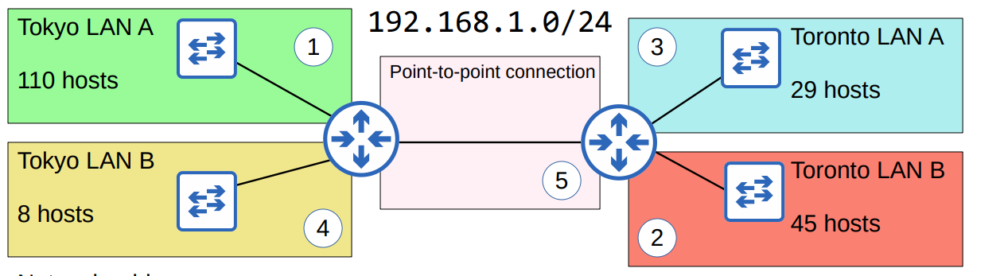  
<!-- Ejemplo con URL pública:

-->

---

#### Regla práctica VLSM
1. Ordena subredes por número de hosts requeridos (mayor → menor).  
2. Asigna la subred más grande al inicio del espacio de direcciones.  
3. Para cada subred: elige el prefijo que entregue al menos `(hosts_requeridos + 2)` direcciones totales (network + broadcast), es decir, busca el menor `n` tal que `2^n - 2 >= hosts_requeridos`.  
4. La siguiente subred comienza en la dirección `broadcast + 1` de la subred anterior.  
5. Repite hasta asignar todas las subredes.

---

## Asignación paso a paso

###### 1) **Tokyo LAN A — 110 hosts**
- Hosts requeridos: `110`  
- Buscar `n` (bits de host):  
  - `2^6 = 64` → `64 - 2 = 62` (insuficiente)  
  - `2^7 = 128` → `128 - 2 = 126` (suficiente)  
- Bits de host = `7` → **prefijo = 32 - 7 = `/25`**  
- Máscara: `255.255.255.128`  
- **Dirección de red:** `192.168.1.0/25`  
  - (en binario última octeto: `00000000`)  
- **Broadcast:** `192.168.1.127`  
  - (último octeto: `01111111` → 127)  
- **Primera usable:** `192.168.1.1`  
- **Última usable:** `192.168.1.126`  
- **Direcciones totales en la subred:** `2^7 = 128`  
- **Hosts utilizables:** `128 - 2 = 126`

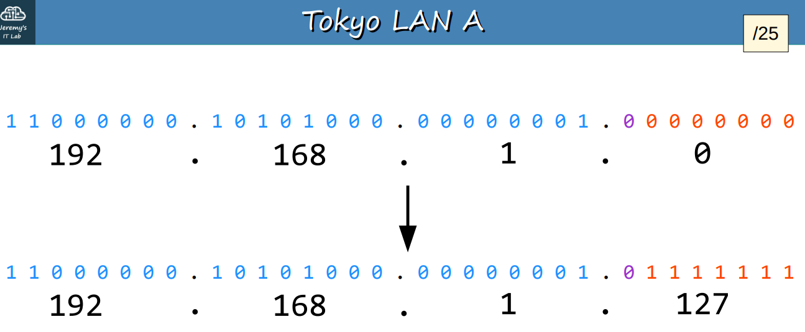  

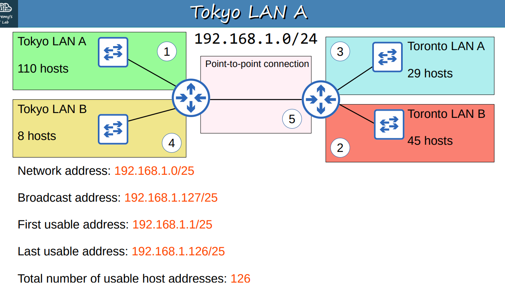  
---

###### 2) **Toronto LAN B — 45 hosts**
- Inicio disponible (siguiente dirección): `192.168.1.128`  
- Hosts requeridos: `45`  
- Buscar `n`:  
  - `2^5 = 32` → `32 - 2 = 30` (insuficiente)  
  - `2^6 = 64` → `64 - 2 = 62` (suficiente)  
- Bits de host = `6` → **prefijo = `/26`**  
- Máscara: `255.255.255.192`  
- **Dirección de red:** `192.168.1.128/26`  
  - (último octeto inicio binario: `10000000` = 128)  
- **Broadcast:** `192.168.1.191`  
  - (último octeto: `10111111` = 191)  
- **Primera usable:** `192.168.1.129`  
- **Última usable:** `192.168.1.190`  
- **Direcciones totales:** `2^6 = 64` → **Hosts utilizables:** `62`

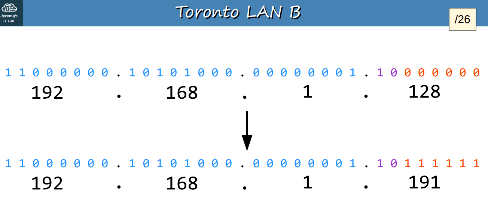  

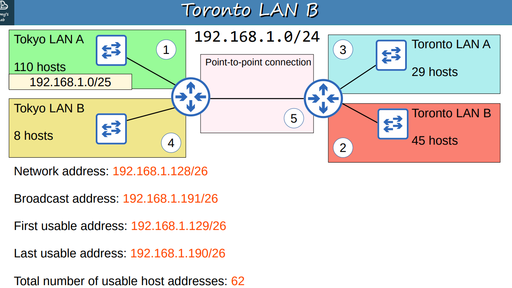  
---

###### 3) **Toronto LAN A — 29 hosts**
- Inicio disponible: `192.168.1.192`  
- Hosts requeridos: `29`  
- Buscar `n`:  
  - `2^4 = 16` → `14` (insuficiente)  
  - `2^5 = 32` → `30` (suficiente)  
- Bits de host = `5` → **prefijo = `/27`**  
- Máscara: `255.255.255.224`  
- **Dirección de red:** `192.168.1.192/27`  
- **Broadcast:** `192.168.1.223`  
- **Primera usable:** `192.168.1.193`  
- **Última usable:** `192.168.1.222`  
- **Direcciones totales:** `2^5 = 32` → **Hosts utilizables:** `30`

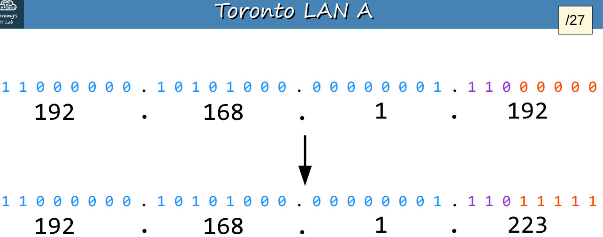  

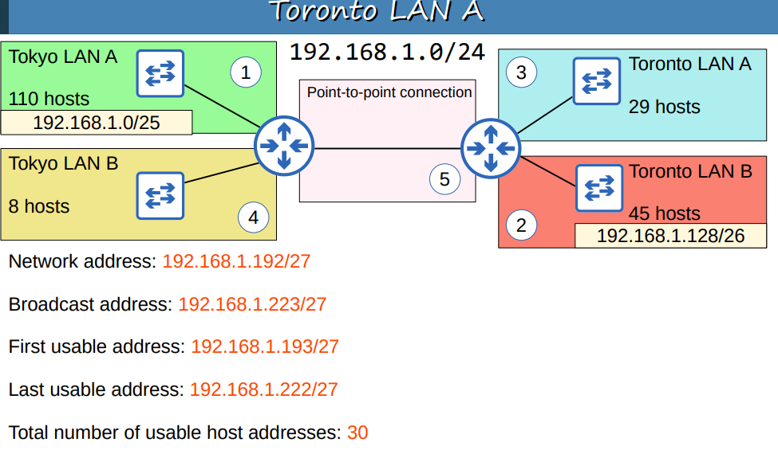  
---

###### 4) **Tokyo LAN B — 8 hosts**
- Inicio disponible: `192.168.1.224`  
- Hosts requeridos: `8`  
- Buscar `n`:  
  - `2^3 = 8` → `8 - 2 = 6` (insuficiente)  
  - `2^4 = 16` → `16 - 2 = 14` (suficiente)  
- Bits de host = `4` → **prefijo = `/28`**  
- Máscara: `255.255.255.240`  
- **Dirección de red:** `192.168.1.224/28`  
- **Broadcast:** `192.168.1.239`  
- **Primera usable:** `192.168.1.225`  
- **Última usable:** `192.168.1.238`  
- **Direcciones totales:** `2^4 = 16` → **Hosts utilizables:** `14`

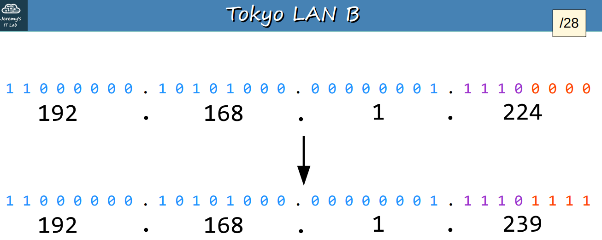  

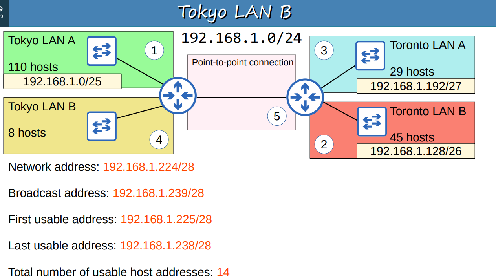  
---

###### 5) **Point-to-point — 2 hosts**
- Inicio disponible: `192.168.1.240`  
- Hosts requeridos: `2`  
- Buscar `n`:  
  - `2^1 = 2` → `2 - 2 = 0` (insuficiente)  
  - `2^2 = 4` → `4 - 2 = 2` (suficiente)  
- Bits de host = `2` → **prefijo = `/30`**  
- Máscara: `255.255.255.252`  
- **Dirección de red:** `192.168.1.240/30`  
- **Broadcast:** `192.168.1.243`  
- **Primera usable:** `192.168.1.241`  
- **Última usable:** `192.168.1.242`  
- **Direcciones totales:** `2^2 = 4` → **Hosts utilizables:** `2`

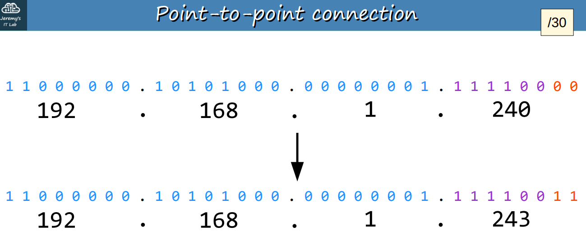  

  
---

#### Tabla resumen (rapida)

| Subred | Network / Prefijo | Máscara | Broadcast | Primera usable | Última usable | Hosts utilizables |
|---|---:|---|---:|---:|---:|---:|
| Tokyo LAN A | `192.168.1.0/25` | `255.255.255.128` | `192.168.1.127` | `192.168.1.1` | `192.168.1.126` | 126 |
| Toronto LAN B | `192.168.1.128/26` | `255.255.255.192` | `192.168.1.191` | `192.168.1.129` | `192.168.1.190` | 62 |
| Toronto LAN A | `192.168.1.192/27` | `255.255.255.224` | `192.168.1.223` | `192.168.1.193` | `192.168.1.222` | 30 |
| Tokyo LAN B | `192.168.1.224/28` | `255.255.255.240` | `192.168.1.239` | `192.168.1.225` | `192.168.1.238` | 14 |
| Point-to-point | `192.168.1.240/30` | `255.255.255.252` | `192.168.1.243` | `192.168.1.241` | `192.168.1.242` | 2 |
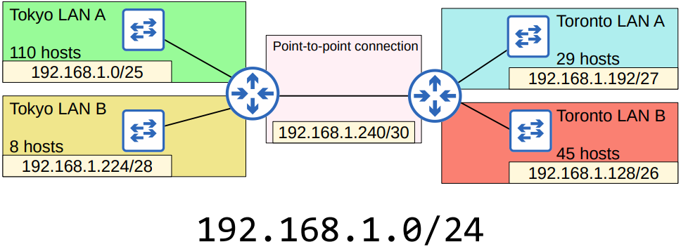  
---

#### Comprobaciones rápidas
- Cada subred empieza en la dirección siguiente al broadcast de la anterior.  
  - `/25` termina en `.127` → siguiente `.128` → `/26` → termina `.191` → siguiente `.192` → `/27` → etc.  
- Todos los requisitos de host están cubiertos con el menor desperdicio posible usando VLSM.  
- Quedan direcciones libres: `192.168.1.244` → `192.168.1.255`.

---

---

## 🌐 Recursos Adicionales

Practicar es **fundamental** para dominar el subneteo. Se recomienda usar los siguientes recursos:

- [Subnetting Questions](http://www.subnettingquestions.com/)
- [Subnetting.org](http://subnetting.org/)
- [Subnetting Practice](https://subnettingpractice.com/)

---