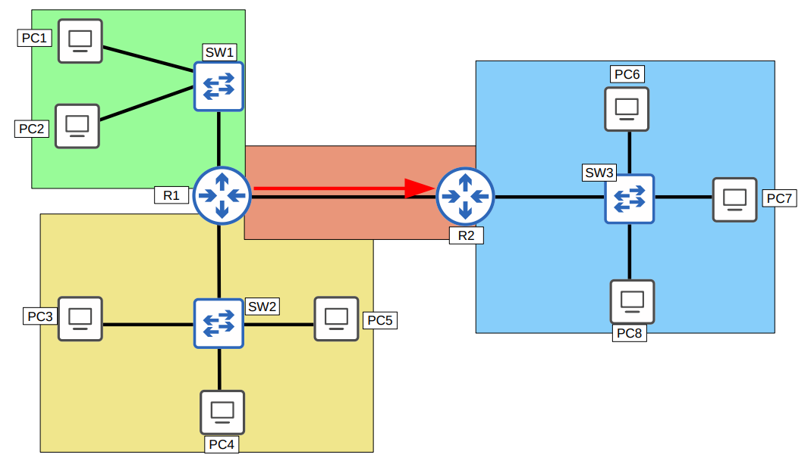
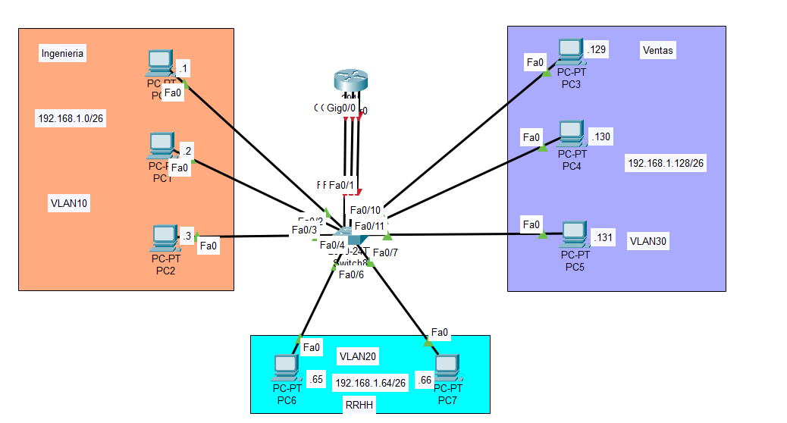
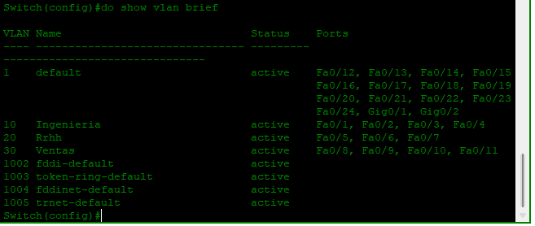
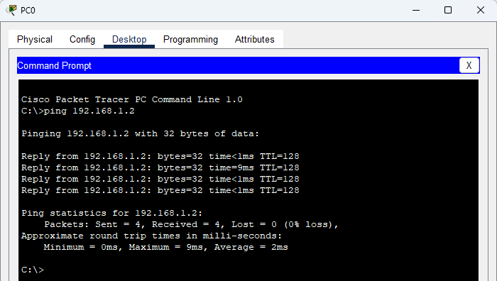
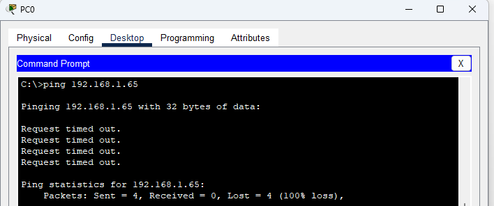

# CCNA 200-301: Día 16 - VLANs (Parte 1)
## Temas a Cubrir

* ¿Qué es una LAN?
* Dominios de broadcast
* ¿Qué es una VLAN?
* Propósito de las VLANs
* Cómo configurar VLANs en switches Cisco

---

## ¿Qué es una LAN y un Dominio de Broadcast?

Una **LAN (Local Area Network)** se define de forma más precisa como un **único dominio de broadcast**.

Un **dominio de broadcast** es el conjunto de dispositivos que recibirán una trama de broadcast (con dirección MAC de destino `FFFF.FFFF.FFFF`) enviada por cualquiera de los miembros. Los routers son los dispositivos que, por defecto, delimitan y no reenvían estos broadcasts, creando así dominios separados.



---

## ¿Qué es una VLAN y cuál es su propósito?

Una **VLAN (Virtual LAN)** es una forma de segmentar lógicamente una red física en múltiples dominios de broadcast. Aunque los dispositivos estén conectados al mismo switch, si pertenecen a VLANs diferentes, se comportarán como si estuvieran en redes separadas.

Los propósitos principales de usar VLANs son:

* **Seguridad**: Limita el acceso entre diferentes grupos de usuarios (ej. Ingeniería, Ventas, RRHH) al forzar que el tráfico entre ellos pase por un dispositivo de Capa 3 (como un router o firewall) donde se pueden aplicar políticas de seguridad.
* **Rendimiento**: Reduce el tráfico de broadcast innecesario en la red, ya que las tramas de broadcast solo se propagan dentro de su propia VLAN, mejorando el rendimiento general.

**Importante**: Un switch **NO** reenviará tráfico directamente entre VLANs diferentes. Para que los dispositivos en VLANs distintas se comuniquen, es necesario un proceso llamado **enrutamiento inter-VLAN**, que se realiza en un router o un switch de Capa 3.



---

## Configuración de VLANs en Switches Cisco

Las VLANs se configuran en los switches asignando las interfaces a una VLAN específica. Una interfaz configurada para pertenecer a una única VLAN se denomina **puerto de acceso (access port)**.

### Tabla de Comandos Básicos

| Comando                       | Descripción                                                                 |
| ----------------------------- | :-------------------------------------------------------------------------- |
| `vlan [vlan-id]`              | Entra al modo de configuración de VLAN o la crea si no existe.              |
| `name [nombre-vlan]`          | Asigna un nombre descriptivo a la VLAN.                                     |
| `interface [tipo/número]`     | Entra al modo de configuración de una interfaz específica.                  |
| `switchport mode access`      | Configura el puerto para que opere en modo de acceso.                       |
| `switchport access vlan [id]` | Asigna el puerto a la VLAN especificada. La crea si no existe previamente. |
| `show vlan brief`             | Muestra un resumen de las VLANs configuradas y los puertos asignados.       |

### Ejemplo de Configuración 

```

SW1\# configure terminal
Enter configuration commands, one per line.  End with CNTL/Z.

\! Crear VLAN 10 para Ingeniería
SW1(config)\# vlan 10
SW1(config-vlan)\# name Ingenieria
SW1(config-vlan)\# exit

\! Crear VLAN 20 para RRHH
SW1(config)\# vlan 20
SW1(config-vlan)\# name Rrhh
SW1(config-vlan)\# exit


\! Crear VLAN 30 para Ventas
SW1(config)\# vlan 30
SW1(config-vlan)\# name Ventas
SW1(config-vlan)\# exit


! Asignar interfaces a la VLAN 10
SW1(config)# interface range FastEthernet 0/1 - 4
SW1(config-if-range)# switchport mode access
SW1(config-if-range)# switchport access vlan 10
SW1(config-if-range)# exit

! Asignar interfaces a la VLAN 20
SW1(config)# interface range FastEthernet 0/5 - 7
SW1(config-if-range)# switchport mode access
SW1(config-if-range)# switchport access vlan 20
SW1(config-if-range)# exit

! Asignar interfaces a la VLAN 30
SW1(config)# interface range FastEthernet 0/8 - 11
SW1(config-if-range)# switchport mode access
SW1(config-if-range)# switchport access vlan 30
SW1(config-if-range)# exit

```




## Pruebas de Conectividad entre VLANS
###  PC0 ----> PC1



###  PC0 ----> PC1
