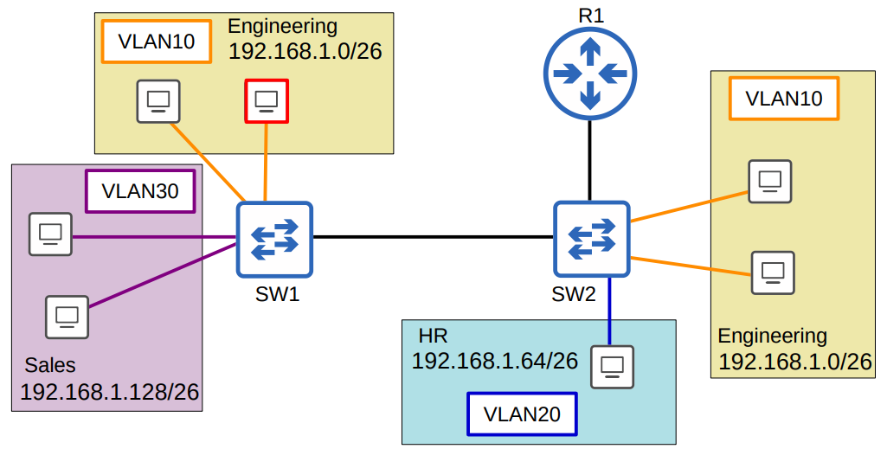
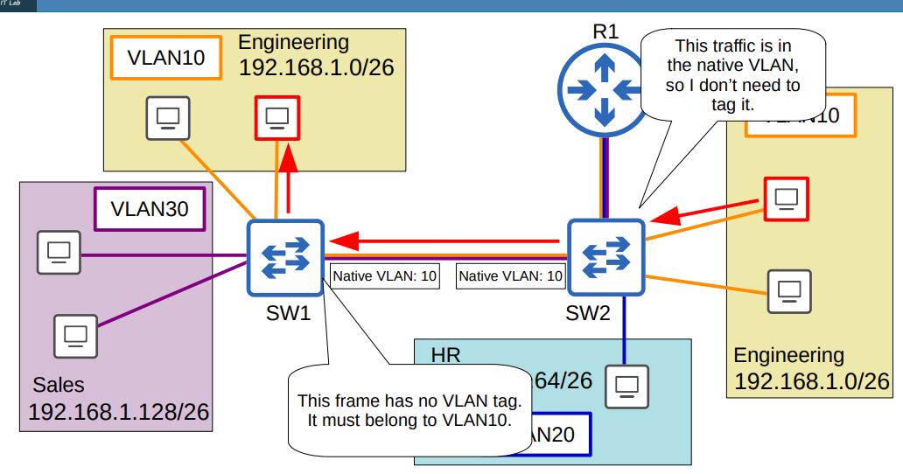
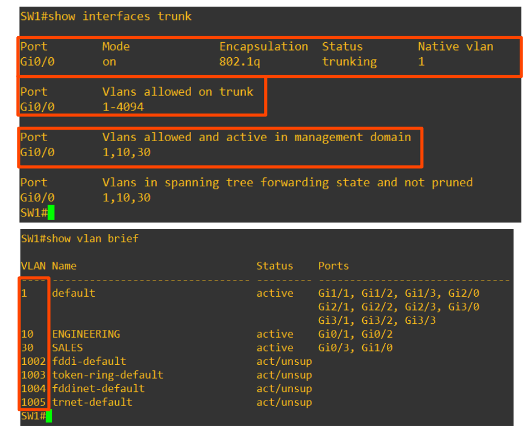
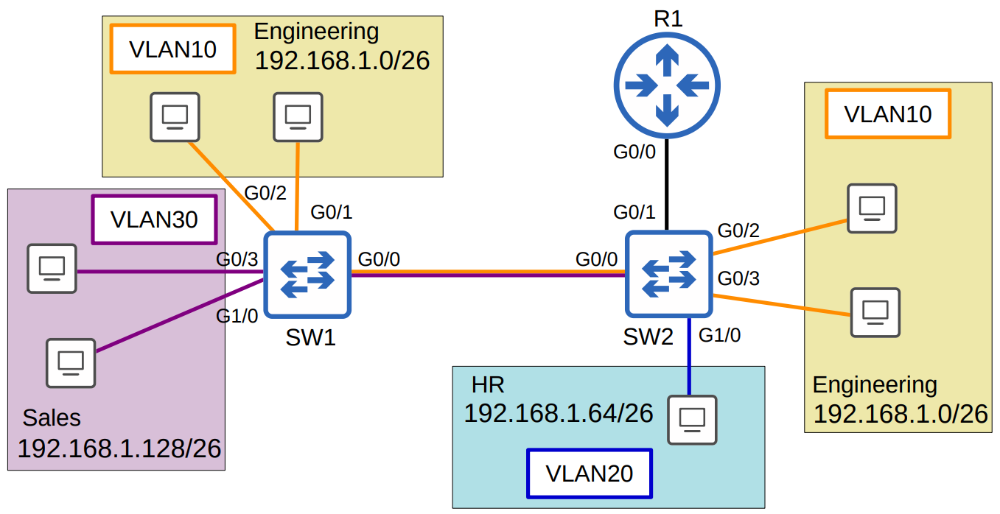
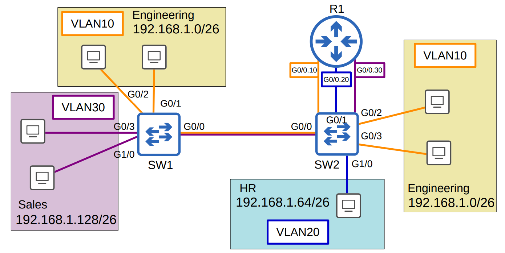

# Día 17: VLANs (Parte 2) - Trunks y Router on a Stick

## Puertos Trunk (Trunk Ports)

Un **puerto trunk** es un enlace que puede transportar tráfico de múltiples VLANs simultáneamente. En lugar de usar un cable físico por cada VLAN para conectar switches entre sí o con un router, se utiliza un único enlace trunk. Esto optimiza el uso de puertos y es una solución escalable para redes con muchas VLANs.

Los switches "etiquetan" las tramas que envían a través de un enlace troncal para que el switch receptor sepa a qué VLAN pertenece cada trama.

- **Puertos Trunk**: Puertos "etiquetados" (tagged).
- **Puertos de Acceso**: Puertos "no etiquetados" (untagged).



---

## Encapsulación 802.1Q (dot1q)

**IEEE 802.1Q** es el estándar de la industria para el etiquetado de VLANs en redes Ethernet. Inserta una etiqueta de 4 bytes en la trama Ethernet original, entre la dirección MAC de origen y el campo de Tipo/Longitud. El antiguo protocolo propietario de Cisco, **ISL**, ya no se utiliza en equipos modernos.

La etiqueta 802.1Q contiene información crucial para identificar la VLAN y priorizar el tráfico.


### Campos de la Etiqueta 802.1Q


| Campo                          | Tamaño   | Descripción                                                                 |
|--------------------------------|----------|-----------------------------------------------------------------------------|
| **TPID (Tag Protocol Identifier)** | 16 bits | Valor fijo (0x8100 en Ethernet) que indica que la trama lleva etiqueta 802.1Q. |
| **PCP (Priority Code Point)**  | 3 bits   | Define la prioridad del tráfico (QoS, IEEE 802.1p). Valores de 0 a 7 (8 niveles). |
| **DEI (Drop Eligible Indicator)** | 1 bit | Señala si la trama es elegible para ser descartada en caso de congestión (0 = no, 1 = sí). |
| **VID (VLAN Identifier)**      | 12 bits  | Identifica la VLAN a la que pertenece el frame. Valores válidos: 1–4094. (0 = sin VLAN, solo prioridad; 4095 = reservado). |
| **TCI (Tag Control Information)** | 16 bits | Conjunto de los campos PCP, DEI y VID (3 + 1 + 12 bits). Contiene la información de control de la VLAN. |
### VLAN Range
* El rango total de VLAN es **1 – 4094**.
* Se dividen en:

  * **VLAN normales:** 1 – 1005
  * **VLAN extendidas:** 1006 – 4094
* En dispositivos antiguos no siempre funcionan las VLAN extendidas.
* Los **switches modernos sí las soportan**.

### Native VLAN

La **Native VLAN** es una característica de 802.1Q. Por defecto es la **VLAN 1**. Las tramas que pertenecen a la Native VLAN se envían **sin etiqueta** a través del puerto trunk. Si un switch recibe una trama sin etiqueta en un puerto trunk, asume que pertenece a la Native VLAN.

**¡Importante!** La configuración de la Native VLAN debe ser la misma en ambos extremos del enlace troncal para evitar problemas de comunicación y seguridad.



---

## Configuración de Puertos Trunk

Para configurar un puerto como troncal en un switch Cisco, se utilizan los siguientes comandos:

1.  **Seleccionar la interfaz:** `interface <nombre_interfaz>`
2.  **Establecer encapsulación (en switches antiguos):** `switchport trunk encapsulation dot1q`
3.  **Configurar el modo trunk:** `switchport mode trunk`
4.  **(Opcional) Configurar la Native VLAN:** `switchport trunk native vlan <vlan_id>`
5.  **(Opcional) Limitar las VLANs permitidas:** `switchport trunk allowed vlan <lista_de_vlans>`


## Ejemplo Completo de Configuración y Verificación

### Configuración de la Interfaz en Modo Trunk

```bash
SW1# configure terminal
SW1(config)# interface g0/0
SW1(config-if)# switchport trunk encapsulation dot1q
SW1(config-if)# switchport mode trunk
```

Verificamos el modo trunk:

```bash
SW1# show interfaces trunk
```



---

## Opciones del Comando `switchport trunk allowed vlan ?`
Por defecto, el trunk permite todas las VLANs (1–4094), pero podemos restringir, agregar, quitar o excluir VLANs específicas con el comando:
Cuando ejecutamos:

```bash
SW1(config-if)# switchport trunk allowed vlan ?
```

Aparece:

```
  WORD     VLAN IDs of the allowed VLANs when this port is in trunking mode
  add      Add VLANs to the current list
  all      All VLANs
  except   All VLANs except the following
  none     No VLANs
  remove   Remove VLANs from the current list
```

---

### 1. **WORD → Definir lista manual de VLANs**

```bash
SW1(config-if)# switchport trunk allowed vlan 10,30
```

Verificación:

```bash
SW1# show interfaces trunk
Port      Vlans allowed on trunk
Gi0/0     10,30
```

---

### 2. **add → Agregar VLANs a la lista actual**

```bash
SW1(config-if)# switchport trunk allowed vlan add 20
```

Verificación:

```bash
SW1# show interfaces trunk
Port      Vlans allowed on trunk
Gi0/0     10,20,30

Port      Vlans allowed and active in management domain
Gi0/0     10,30
```

### 3. **all → Permitir todas las VLANs**

```bash
SW1(config-if)# switchport trunk allowed vlan all
```

Verificación:

```bash
SW1# show interfaces trunk
Port      Vlans allowed on trunk
Gi0/0     1-4094
```


---

---

## 4. **except → Todas excepto algunas**

```bash
SW1(config-if)# switchport trunk allowed vlan except 1-5,10
```

Verificación:

```bash
SW1# show interfaces trunk
Port      Vlans allowed on trunk
Gi0/0     6-9,11-4094
```

---

### 5. **none → No permitir ninguna VLAN**

```bash
SW1(config-if)# switchport trunk allowed vlan none
```

Verificación:

```bash
SW1# show interfaces trunk
Port      Vlans allowed on trunk
Gi0/0     none
```

---

### 6. **remove → Quitar VLANs de la lista actual**

```bash
SW1(config-if)# switchport trunk allowed vlan remove 20
```

Verificación:

```bash
SW1# show interfaces trunk
Port      Vlans allowed on trunk
Gi0/0     10,30
```

---

### 📊 Tabla Resumen

| Comando                                        | Efecto                            | Salida esperada en `show interfaces trunk` |
| ---------------------------------------------- | --------------------------------- | ------------------------------------------ |
| `switchport trunk allowed vlan 10,20,30,99`    | Define lista manual de VLANs      | `10,20,30,99`                              |
| `switchport trunk allowed vlan add 40,50`      | Agrega VLANs a la lista existente | `10,20,30,40,50,99`                        |
| `switchport trunk allowed vlan all`            | Permite todas las VLANs           | `1-4094`                                   |
| `switchport trunk allowed vlan except 100,200` | Permite todas excepto 100 y 200   | `6-9,11-4094`                   |
| `switchport trunk allowed vlan none`           | Bloquea todas las VLANs           | `none`                                     |
| `switchport trunk allowed vlan remove 30,40`   | Quita VLANs de la lista actual    | `10,30`                              |

El comando show vlan brief muestra los puertos de acceso asignados a cada VLAN, no los puertos trunk que permiten pasar cada VLAN.
Para verificar los puertos trunk, usa show interfaces trunk.


**show vlan brief** → puertos de acceso por VLAN.

**show interfaces trunk**→ puertos trunk y VLANs que permiten.

Por motivos de seguridad, es recomendable cambiar la VLAN nativa a una VLAN que no se esté usando.
Asegúrate de que la VLAN nativa coincida entre los switches.

---


## Router on a Stick (ROAS)

**Router on a Stick (ROAS)** es una técnica para enrutar tráfico entre diferentes VLANs usando una única interfaz física del router. El enlace entre el switch y el router se configura como un puerto trunk.

En el router, la interfaz física se divide en **subinterfaces lógicas**, una por cada VLAN que se desea enrutar. A cada subinterfaz se le asigna:
- Una encapsulación 802.1Q con el ID de la VLAN correspondiente.
- Una dirección IP que funcionará como el *default gateway* para los dispositivos de esa VLAN.


Funcionamiento:

El router interpreta que las tramas entrantes con una etiqueta VLAN específica pertenecen a la subinterfaz configurada con esa VLAN.

Al enviar tramas, el router etiqueta cada trama según la VLAN configurada en la subinterfaz correspondiente.
### Ejemplo de Configuración ROAS en el Router

```

R1\# configure terminal
R1(config)\# interface GigabitEthernet0/0
R1(config-if)\# no shutdown 
R1(config-if)\# interface GigabitEthernet0/0.10
R1(config-subif)\# encapsulation dot1q 10
R1(config-subif)\# ip address 192.168.1.62 255.255.255.192
R1(config-subif)\# exit
R1(config)\# interface GigabitEthernet0/0.20
R1(config-subif)\# encapsulation dot1q 20
R1(config-subif)\# ip address 192.168.1.126 255.255.255.192
R1(config-subif)\# exit
R1(config)\# interface GigabitEthernet0/0.30
R1(config-subif)\# encapsulation dot1q 30
R1(config-subif)\# ip address 192.168.1.190 255.255.255.192
R1(config-subif)\# exit

```