# CCNA 200-301 - Día 18: VLANs (Virtual Local Area Networks) Parte 3

## Introducción

En esta sesión, continuaremos explorando las VLANs, profundizando en configuraciones avanzadas y protocolos clave. Aprenderemos cómo un **router** maneja las **VLAN nativas** en el contexto de **Router on a Stick (ROAS)**, cómo los **switches de capa 3** revolucionan el enrutamiento entre VLANs y la importancia de **DTP** y **VTP** en la administración de redes.

---

## VLAN Nativa en un Router (ROAS)
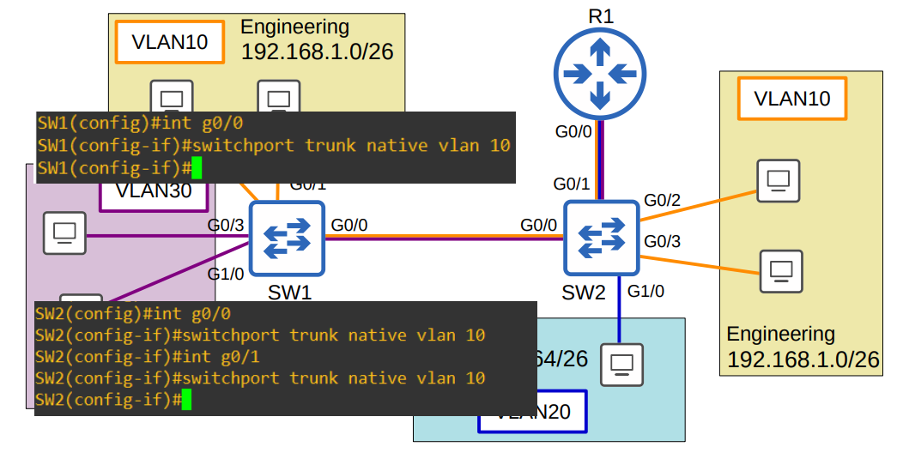
En una configuración de **Router on a Stick (ROAS)**, un solo enlace de router a switch maneja el tráfico de múltiples VLANs a través de subinterfaces. La **VLAN nativa** es especial porque su tráfico no se etiqueta con un encabezado **802.1Q**.

Existen dos métodos principales para configurar la VLAN nativa en un router:

1.  **En la subinterfaz:** Se usa el comando `encapsulation dot1q vlan-id native` en la subinterfaz del router. Esta es la forma más común y explícita.
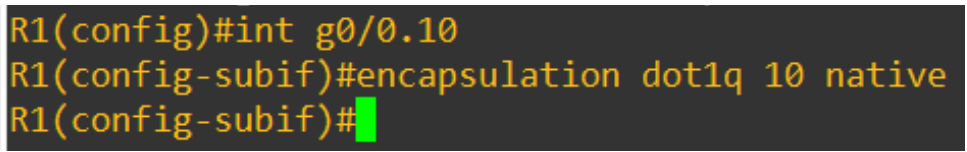    
2.  **En la interfaz física:** Se asigna la dirección IP de la VLAN nativa directamente a la interfaz física del router. En este caso, no se necesita el comando `encapsulation dot1q`.
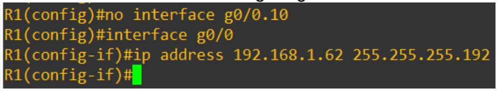    
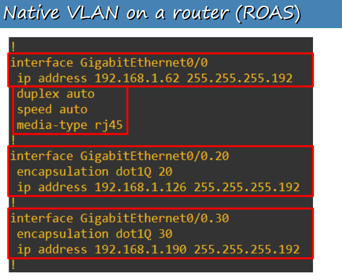    
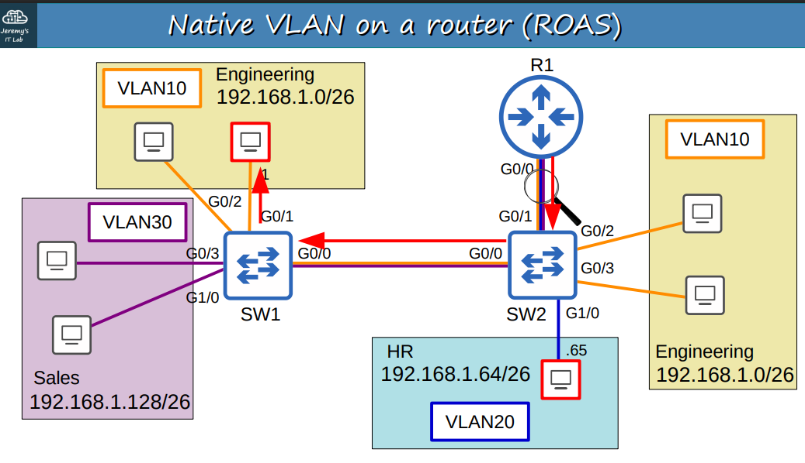    

---

## Wireshark Analysis

Al capturar el tráfico entre un switch y un router en una configuración **ROAS**, se puede observar el comportamiento de la **VLAN nativa**. Los paquetes de la **VLAN nativa** aparecen **sin etiquetas 802.1Q**, mientras que el tráfico de las demás VLANs tiene la etiqueta **802.1Q** claramente visible. Esto confirma que el tráfico nativo no se encapsula con la etiqueta de VLAN.

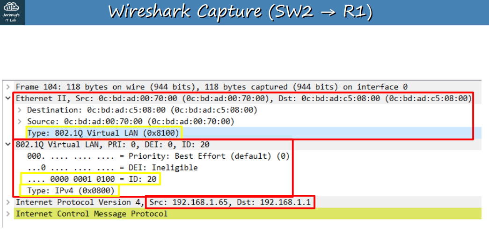
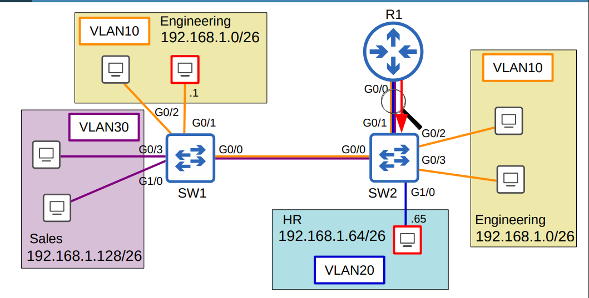
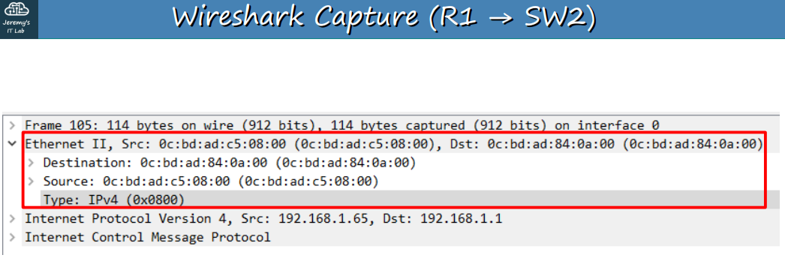
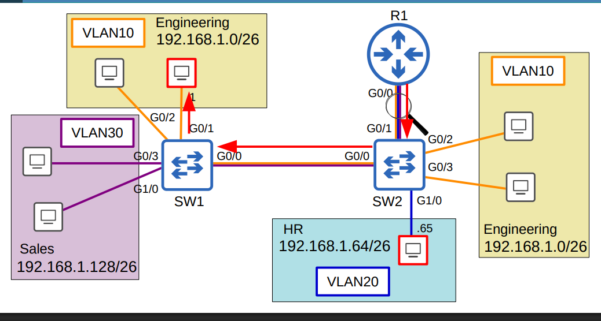
---

## Switches de Capa 3 (Multilayer)

Un **switch de capa 3** (también conocido como **multilayer switch**) combina la funcionalidad de un **switch de capa 2** y un **router**. Son "conscientes de la capa 3", lo que significa que pueden:

-   Asignar **direcciones IP** a sus interfaces.
-   Crear **interfaces virtuales (SVIs)** para cada VLAN.
-   Configurar **rutas estáticas o dinámicas**, al igual que un router.

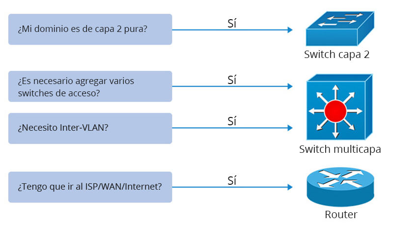

---

## Enrutamiento Inter-VLAN a través de SVI (Switch Virtual Interface)

El **enrutamiento inter-VLAN** se puede realizar de manera eficiente directamente en un switch de capa 3 utilizando **Switch Virtual Interfaces (SVIs)**.

### Conceptos Clave
-   **SVIs:** Son interfaces lógicas en un switch de capa 3 que representan una VLAN. Se les asigna una dirección IP para servir como **gateway predeterminado** para los dispositivos en esa VLAN.
-   **Ventajas:** Elimina la necesidad de un router externo para el enrutamiento inter-VLAN, lo que reduce la latencia y simplifica la topología de la red.

### Requisitos para un SVI 'up/up'
Para que una **SVI** esté en estado **up/up**, se deben cumplir cuatro condiciones:
1.  La **VLAN** debe existir en la base de datos del switch.
2.  Debe haber al menos un **puerto de acceso** en la VLAN en estado **up/up**, **O** al menos un **puerto troncal** que permita la VLAN y esté en estado **up/up**.
3.  La **VLAN** no debe estar en estado `shutdown`.
4.  La **SVI** no debe estar en estado `shutdown`.

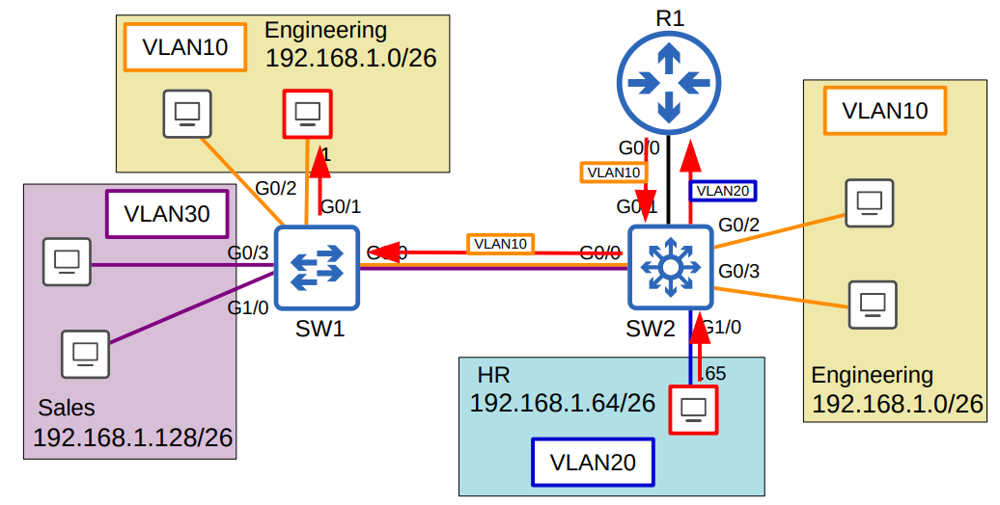

### Comandos Importantes
| Comando | Descripción |
| :--- | :--- |
| `ip routing` | Habilita la capacidad de enrutamiento de la capa 3 en el switch. ¡Es un paso crucial! |
| `no switchport` | Convierte una interfaz de switch de capa 2 en un **puerto enrutado** de capa 3. |
| `interface vlan [vlan-id]` | Crea la **SVI** para la VLAN especificada. |
| `no shutdown` | Habilita la **SVI**, ya que vienen desactivadas por defecto. |

---

## DTP (Dynamic Trunking Protocol) y VTP (VLAN Trunking Protocol)

Estos protocolos son esenciales para la gestión automatizada de troncales y VLANs, respectivamente.

### DTP (Dynamic Trunking Protocol)
DTP es un protocolo de **Cisco** que gestiona la formación de **enlaces troncales**. Permite que un puerto negocie dinámicamente el modo troncal con el dispositivo conectado.

### VTP (VLAN Trunking Protocol)
VTP es un protocolo de **Cisco** que propaga la información de las **VLANs** a través de la red, lo que permite a los administradores de red centralizar la creación, eliminación y modificación de VLANs en un solo switch (servidor VTP).

---

## Resumen de Comandos

| Comando | Función |
| :--- | :--- |
| `encapsulation dot1q [vlan-id] native` | Configura la VLAN nativa en una subinterfaz de router. |
| `ip routing` | Habilita el enrutamiento en un switch de capa 3. |
| `no switchport` | Convierte un puerto de switch a un puerto enrutado (Layer 3). |
| `interface vlan [vlan-id]` | Crea una SVI. |
| `show ip route` | Muestra la tabla de enrutamiento del switch. |

---

## Próximo Video

El próximo video cubrirá **DTP** y **VTP** en mayor profundidad.

---

## Cuestionario

### Pregunta 1
¿Cuáles son las dos opciones válidas para configurar la VLAN nativa en un router en una configuración **ROAS**?
-   b) `R1(config-subif)# encapsulation dot1q 112 native` seguido de la asignación de IP.
-   c) `R1(config-if)# ip address 192.168.1.1 255.255.255.0` en la interfaz física.

### Pregunta 2
Creas una SVI para VLAN225 y le asignas una dirección IP, pero permanece `down/down`. ¿Cuáles son dos posibles causas?
-   a) La **VLAN225** no existe en el switch.
-   d) No hay interfaces en la **VLAN225** que estén en estado `up/up`.

### Pregunta 3
¿Qué comando se utiliza para configurar una interfaz de switch como un puerto enrutado?
-   a) `no switchport`