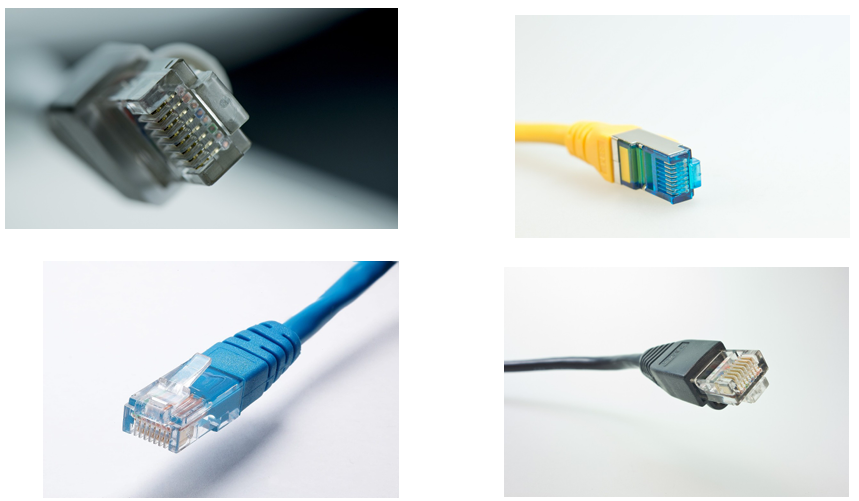
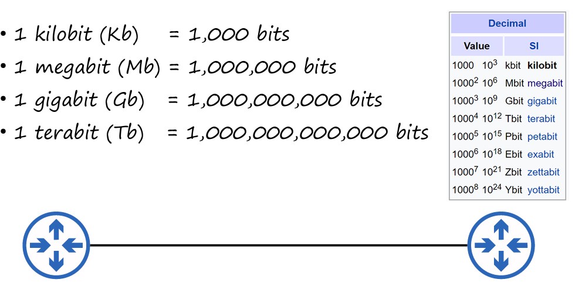
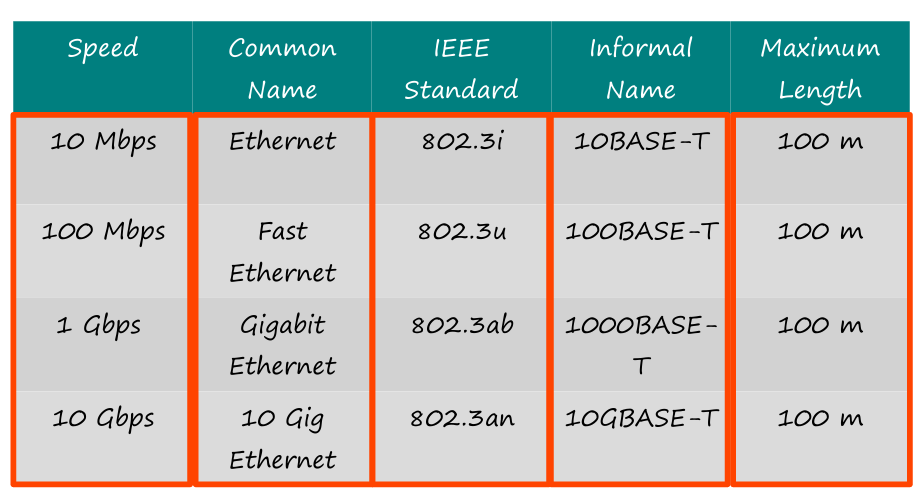
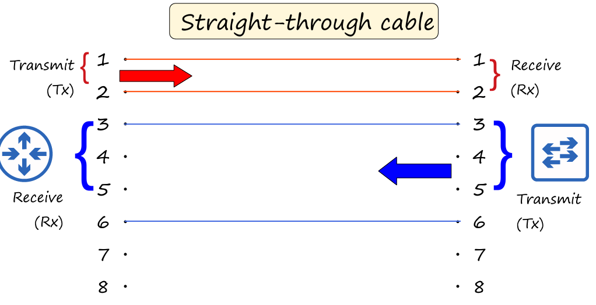
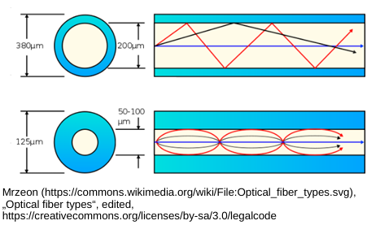
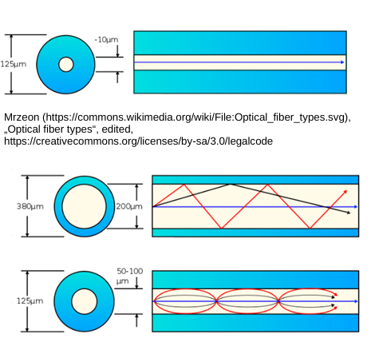
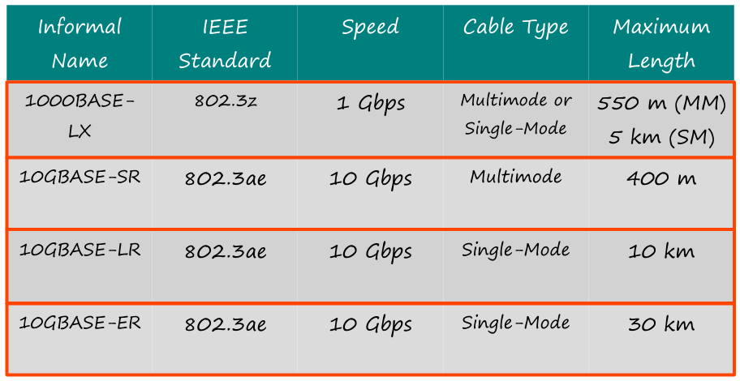
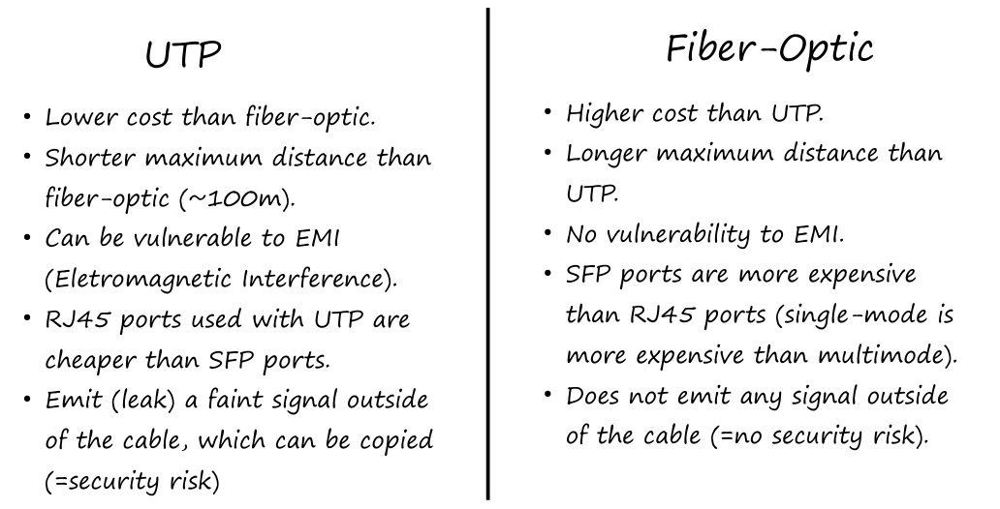

## 📝 Resumen: CCNA 200-301 - Día 2

Este día se centra en los fundamentos de las interfaces y cables de red.

---

### 🔌 Conceptos Clave

#### **1. Conectores RJ-45**
El conector **RJ-45 (Registered Jack-45)** es el conector estándar para cables Ethernet de cobre.

#### **2. Bits y Bytes**
- Un **bit (b)** es la unidad más pequeña de datos (0 o 1).
- Un **byte (B)** equivale a 8 bits.
- La velocidad de red se mide en **bits por segundo** (Kbps, Mbps, Gbps), no en bytes por segundo.

#### **3. Estándares Ethernet (Cobre)**
Definidos por el estándar **IEEE 802.3**, los cables de cobre de **par trenzado sin blindaje (UTP)** son el tipo de cable más común para redes LAN. Su distancia máxima es de 100 metros.

#### **4. Tipos de Cableado UTP**
- Son el tipo de cable de cobre más común para redes Ethernet.
- Su distancia máxima es de **100 metros**.
- Los cables UTP pueden ser de dos tipos:
    - **Straight-through (Cable directo):** Se usa para conectar dispositivos de **diferente tipo** (ej. PC a switch).
    - **Crossover (Cable cruzado):** Se usa para conectar dispositivos del **mismo tipo** (ej. switch a switch).
- La mayoría de los dispositivos modernos tienen la función **Auto MDI-X**, que detecta automáticamente el tipo de cable y se ajusta para funcionar, eliminando la necesidad de usar cables cruzados.

#### **5. Conexiones de Fibra Óptica**
Los cables de fibra óptica usan luz para transmitir datos, lo que les permite alcanzar distancias mucho mayores y ser inmunes a las interferencias electromagnéticas (EMI).
- **Multimodo (Multimode Fiber):** Usa luz LED y tiene un núcleo más ancho. Es más barato y se usa para distancias de hasta **550 metros**.
- **Monomodo (Single-Mode Fiber):** Usa luz láser y tiene un núcleo más estrecho. Es más caro, pero puede transmitir datos a distancias de hasta **30 kilómetros**.

| **Tipo** | **Velocidad** | **Distancia Máxima** | **Costo** | **Resistencia a EMI** |
| :---: | :---: | :---: | :---: | :---: |
| UTP | 10 Mbps - 10 Gbps | 100m | Bajo | Baja |
| Multimodo | 1 Gbps - 10 Gbps | 550m - 400m | Medio | Alta |
| Monomodo | 1 Gbps - 10 Gbps | 5km - 30km | Alto | Alta |

---

### ❓ Preguntas de Repaso

1.  **Pregunta:** Conectas dos routers viejos con un cable UTP y no funcionan. ¿Cuál es el problema?
    * **Respuesta:** Probablemente uses un cable **directo**. Los dispositivos antiguos del mismo tipo requieren un cable **cruzado** si no tienen **Auto MDI-X**.

2.  **Pregunta:** Para conectar dos edificios a 150 metros, ¿qué cable usarías para optimizar el costo?
    * **Respuesta:** **Fibra multimodo**. El UTP no alcanza la distancia, y la fibra monomodo es más cara de lo necesario.

3.  **Pregunta:** ¿Qué tipo de cable usarías para conectar dos oficinas a 3 kilómetros?
    * **Respuesta:** **Fibra monomodo**. Es la única opción para esta distancia.

4.  **Pregunta:** Un switch con **Auto MDI-X** se conecta a otro switch con un cable directo. ¿Qué pasa?
    * **Respuesta:** Funcionan **normalmente**, ya que el switch se ajusta automáticamente.

5.  **Pregunta:** ¿Qué cable usarías para conectar muchos PCs a un switch en la misma oficina?
    * **Respuesta:** **UTP**, ya que es el estándar para conexiones de corta distancia y el más rentable para esta aplicación.