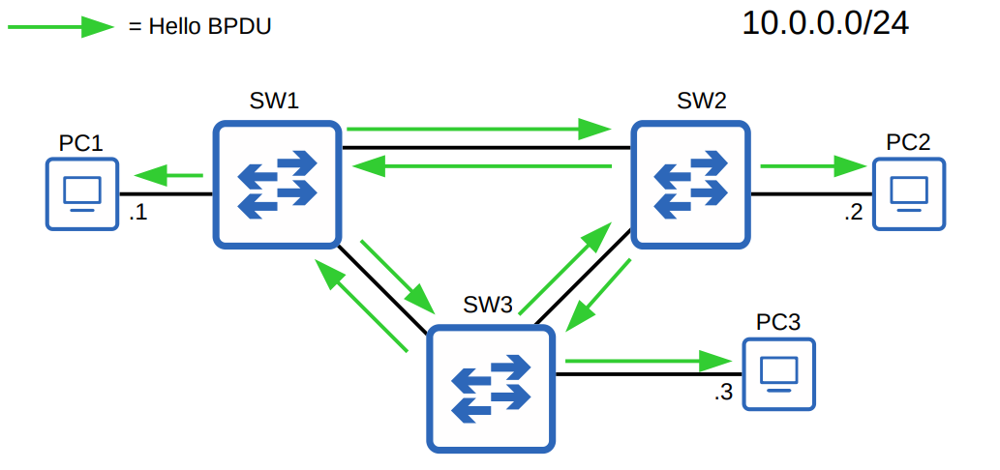

# Día 20 - Spanning Tree Protocol (STP)

En esta sesión se aborda la **redundancia de red** y el **Protocolo Spanning Tree (STP)**, una solución clave para prevenir bucles de capa 2 que pueden ocurrir en topologías de red redundantes.

---

## 1. Redundancia de red y sus desafíos

La **redundancia** es un pilar fundamental en el diseño de redes modernas para garantizar la disponibilidad continua. Las redes actuales se espera que funcionen 24/7/365, por lo que si un componente falla, otros deben tomar su lugar con mínima o nula interrupción.


El problema surge cuando se introducen enlaces redundantes entre **switches**. Aunque previenen fallos, pueden crear **bucles de capa 2**, causando dos problemas principales:

1.  **Tormentas de Broadcast**: Un `ARP Request` (un frame de broadcast) se reenviará indefinidamente en un bucle. Como los `frames` de Ethernet no tienen un campo `TTL` (Time to Live), no se eliminan, saturando la red y dejándola inútil para el tráfico legítimo.

2.  **MAC Address Flapping**: La tabla de direcciones MAC del switch se actualizará constantemente con la misma dirección MAC de origen, ya que los frames con dicha dirección llegan por diferentes interfaces. Esto desestabiliza la red.

---

## 2. Spanning Tree Protocol (STP)

El **Protocolo Spanning Tree (STP)**, definido por el estándar **IEEE 802.1D**, fue creado para prevenir los bucles de capa 2.

* STP funciona en la capa 2 (Enlace de datos) del modelo OSI.
* **Todos los switches modernos ejecutan STP por defecto.**
* STP evita los bucles al colocar los puertos redundantes en un **estado de bloqueo**. Estos puertos actúan como **backups** y solo entran en un estado de reenvío si un puerto activo falla.
* Los puertos en estado de reenvío (`forwarding`) se comportan normalmente, mientras que los puertos en estado de bloqueo (`blocking`) solo envían y reciben mensajes STP, llamados **BPDUs** (`Bridge Protocol Data Units`).

> **Nota**: Aunque el estándar utiliza el término "puente" (`bridge`), en las redes modernas se refiere a un **switch**.


---

## 3. Funcionamiento de STP

STP sigue un proceso definido para determinar qué puertos deben estar en estado de reenvío y cuáles en estado de bloqueo.

### 3.1. Elección del Root Bridge (Puente Raíz)

El primer paso es elegir un **Root Bridge** (puente raíz).

* El switch con el **ID de Puente más bajo** (`Bridge ID`) se convierte en el Root Bridge.
* **Todos los puertos en el Root Bridge están en estado de reenvío** (`forwarding`), es decir, son `Designated Ports`.

El **`Bridge ID`** está compuesto por dos campos:

`Bridge ID` = `Prioridad de Puente` (16 bits) + `Dirección MAC` (48 bits)

* La prioridad por defecto en todos los switches es `32768`.
* En caso de empate en la prioridad (que es lo común), se usa la **dirección MAC más baja** como desempate.

### 3.2. Prioridad de Puente y Extended System ID

Los switches Cisco utilizan una versión de STP llamada **PVST** (`Per-VLAN Spanning Tree`), que ejecuta una instancia de STP separada para cada VLAN. El `Bridge ID` en PVST es ligeramente diferente:

`Bridge ID` = `Prioridad de Puente` (4 bits) + `Extended System ID` (12 bits) + `Dirección MAC` (48 bits)

El **`Extended System ID`** es el **ID de la VLAN**, por lo que la prioridad total del puente es la `prioridad configurada` + `ID de la VLAN`.

* La prioridad por defecto es `32768`. Para la VLAN 1, la prioridad total es `32768 + 1 = 32769`.
* Las prioridades configurables solo se pueden cambiar en incrementos de `4096`.

---

## 4. Roles de los puertos STP

Una vez que se elige el Root Bridge, los otros switches definen el rol de sus puertos para crear una topología sin bucles.

### 4.1. Root Port (Puerto Raíz)

Cada switch que no es el Root Bridge debe seleccionar **un solo puerto raíz**.

* El **Root Port** es el puerto con el **costo de ruta más bajo** para llegar al Root Bridge.
* El costo de STP depende de la velocidad del enlace, por lo que una mayor velocidad tiene un costo más bajo.

| Velocidad del enlace | Costo STP |
|----------------------|-----------|
| 10 Mbps              | 100       |
| 100 Mbps             | 19        |
| 1 Gbps               | 4         |
| 10 Gbps              | 2         |

El costo total de la ruta es la suma de los costos de los enlaces desde el switch hasta el Root Bridge.

> **Regla de desempate del Root Port**: Si hay dos o más puertos con el mismo costo, se utiliza el **ID de Puente del vecino** más bajo. Si sigue habiendo empate, se usa el **ID de Puerto del vecino** más bajo.

### 4.2. Designated Port (Puerto Designado)

* Todo el Root Bridge tiene sus puertos en el rol de **Designated Port** (`D`).
* Cada segmento de red (o dominio de colisión) debe tener un único **Designated Port**.
* Si un switch no es el Root Bridge y su puerto está conectado al Root Port de otro switch, ese puerto será `Designated` (`D`).

> **Regla de desempate del Designated Port**: Si dos puertos están en el mismo segmento y no son el Root Port de un switch, eligen el `Designated Port` basándose en:
> 1.  El switch con el **costo de ruta más bajo**.
> 2.  Si el costo es el mismo, el switch con el **ID de Puente más bajo**.

### 4.3. Non-designated Port (Puerto No Designado)

* Este puerto es el que queda en estado de **bloqueo (`Blocking`)**.
* Generalmente, es el puerto del enlace redundante que STP desactiva para prevenir bucles.

---

## 5. Resumen de las reglas de STP

1.  **Elección del Root Bridge:**
    * `1er` Criterio: El Bridge ID más bajo.
    * **Todos los puertos en el Root Bridge son `Designated Ports` (`D`)**.

2.  **Elección del Root Port (para switches no-raíz):**
    * `1er` Criterio: El costo de ruta más bajo.
    * `2do` Criterio: El ID de Puente del vecino más bajo.
    * `3er` Criterio: El ID de Puerto del vecino más bajo.
    * **El Root Port está en estado de reenvío (`Forwarding`).**

3.  **Elección del Designated Port (para cada segmento de red):**
    * `1er` Criterio: El costo de ruta más bajo.
    * `2do` Criterio: El Bridge ID más bajo.
    * **El Designated Port está en estado de reenvío (`Forwarding`).**

4.  **Puerto No Designado:**
    * Cualquier puerto que no sea un Root Port ni un Designated Port pasa a un estado de **bloqueo (`Blocking`)**.

A continuación, un ejemplo visual de una topología STP resuelta:



---

## 6. Verificación y comandos

Para verificar el estado de STP en un switch Cisco, se utilizan comandos de la **CLI**.

```bash
# Ver el estado de STP
show spanning-tree

# Ver detalles de una interfaz
show spanning-tree interface <interface-id>

# Configurar la prioridad del switch para que sea el root bridge
spanning-tree vlan <vlan-id> root primary

# Configurar la prioridad manualmente (ejemplo)
spanning-tree vlan <vlan-id> priority 24576