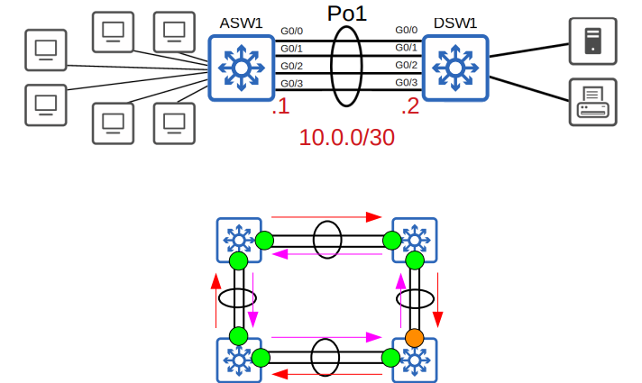

# CCNA 200-301 - Día 23  
## EtherChannel

---

## Contenido del día
* ¿Qué es **EtherChannel** y qué problemas resuelve?  
* Configuración de **EtherChannel** en Capa 2 y Capa 3  

---

## Introducción a EtherChannel

Cuando la capacidad de los enlaces entre el **switch de acceso (ASW1)** y el **switch de distribución (DSW1)** no es suficiente para soportar todos los hosts conectados, ocurre **congestión**.  

Este escenario se denomina **oversubscription**, y si es demasiado alto puede causar pérdida de rendimiento.  


---

## Problema con enlaces múltiples y STP

* Si conectamos varios enlaces entre dos switches, **Spanning Tree Protocol (STP)** deshabilitará todos menos uno.  
* Esto ocurre para evitar bucles en Capa 2 y **tormentas de broadcast**.  
* Los enlaces adicionales solo se activan si el principal falla.  


---

## ¿Qué es EtherChannel?

* Permite **agrupar múltiples interfaces físicas** y tratarlas como una sola interfaz lógica.  
* STP considera el grupo como **una sola interfaz**, evitando bloqueos innecesarios.  
* El tráfico se **balancea** entre los enlaces físicos mediante algoritmos de carga.  
* También es conocido como:  
  * **Port Channel**  
  * **LAG (Link Aggregation Group)**  


---

## Balanceo de carga en EtherChannel

* El balanceo se realiza en función de **flujos de comunicación**.  
* Un flujo = comunicación entre dos nodos de la red.  
* Los paquetes de un mismo flujo siempre usarán la **misma interfaz física** para evitar problemas de **orden de llegada**.  

Inputs posibles para la selección de interfaz:  
* Dirección MAC origen/destino  
* Dirección IP origen/destino  
* Combinaciones de las anteriores  


---

## Métodos de configuración de EtherChannel

Existen tres métodos principales en switches Cisco:  

1. **PAgP (Port Aggregation Protocol)**  
   * Propietario de Cisco.  
   * Negocia dinámicamente la creación/mantenimiento del EtherChannel.  

2. **LACP (Link Aggregation Control Protocol)**  
   * Estándar IEEE 802.3ad.  
   * Negocia dinámicamente como PAgP.  

3. **Estático**  
   * Sin protocolos de negociación.  
   * Los puertos se configuran manualmente.  

> Un EtherChannel puede tener hasta **8 interfaces activas** (LACP permite 16, de las cuales 8 quedan en espera).  


---

## Configuración básica

### PAgP
* `auto + auto` = No se forma EtherChannel  
* `desirable + auto` = Se forma EtherChannel  
* `desirable + desirable` = Se forma EtherChannel  

```

SW(config-if)# channel-group 1 mode desirable

```

### LACP
* `passive + passive` = No se forma EtherChannel  
* `active + passive` = Se forma EtherChannel  
* `active + active` = Se forma EtherChannel  

### Estático
* `on` solo funciona con `on`  
* No se combina con modos dinámicos  


---

## Requisitos de configuración

Las interfaces miembro deben tener configuraciones iguales:  
* **Misma velocidad**  
* **Mismo dúplex**  
* **Mismo modo de switchport (access/trunk)**  
* **Mismas VLANs permitidas y VLAN nativa** (en caso de trunk)  

Si no coinciden, la interfaz será **excluida del grupo**.  

---

## Verificación de EtherChannel

Comandos útiles:  

```

SW# show etherchannel summary
SW# show etherchannel port-channel
SW# show spanning-tree
SW# show etherchannel load-balance

```


---

## EtherChannel en Capa 3

También se puede configurar un **EtherChannel de Capa 3** (enrutamiento).  
Esto implica que el grupo tendrá una **dirección IP** y actuará como interfaz de red.  



---

## Quiz

**Pregunta 1:**  
¿Cuáles de las siguientes combinaciones forman un EtherChannel? (elige tres)  
a) on - on  
b) passive - passive  
c) desirable - auto  
d) auto - auto  
e) active - desirable  
f) on - desirable  
g) active - active  

---

**Pregunta 2:**  
En el comando `show etherchannel summary`, si una interfaz aparece con la marca **(P)**, significa que:  
a) Está en modo LACP Passive.  
b) Está unida al port-channel.  
c) Está pausada hasta que el otro switch configure EtherChannel.  
d) Es un EtherChannel de Capa 2.  

---

**Pregunta 3:**  
¿Qué parámetros deben coincidir para formar un EtherChannel? (elige dos)  
a) ID de la interfaz  
b) Dirección IP  
c) Velocidad de la interfaz  
d) Modo de switchport (access/trunk)  
```

---

¿Quieres que también te genere las **respuestas correctas del Quiz** al final del archivo, o prefieres que quede como ejercicio abierto?
