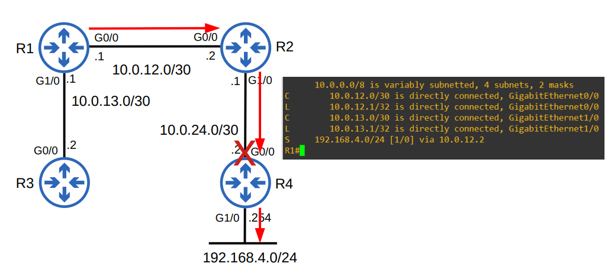
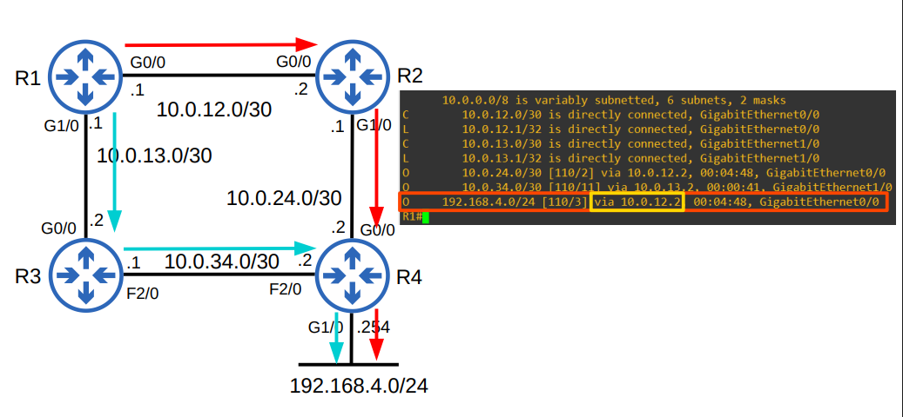
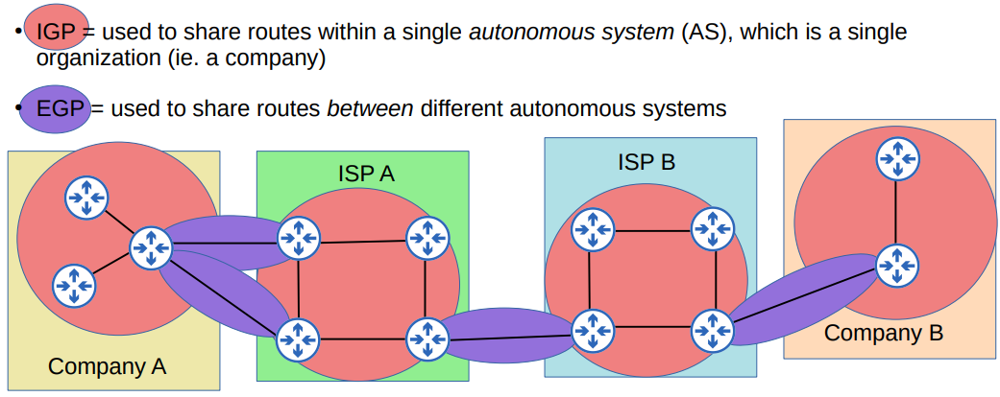
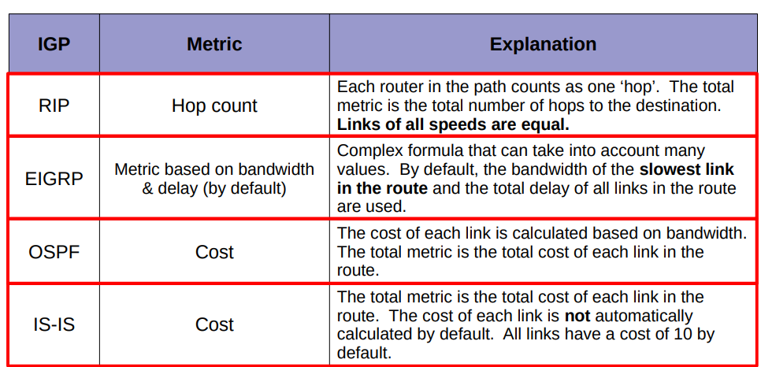
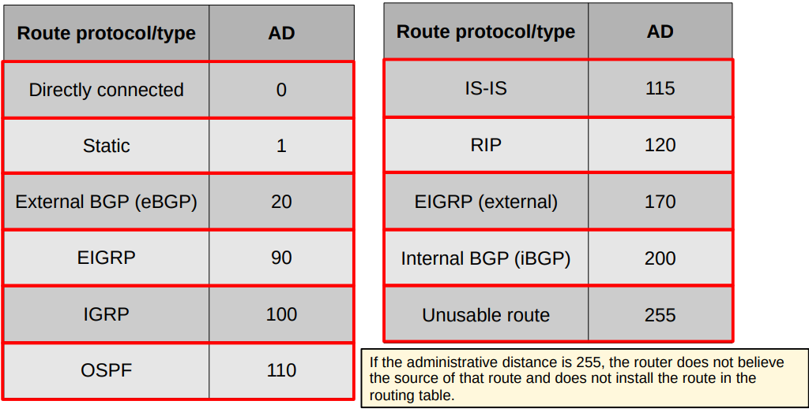

# Dia 24 - Enrutamiento dinámico
## Enrutamiento Estático

El **enrutamiento estático** es un método en el que las rutas de red se configuran **manualmente** en los routers por un administrador de red. A diferencia del enrutamiento dinámico, que se adapta automáticamente, las rutas estáticas son fijas y no cambian a menos que sean modificadas por el administrador.

---

### Características clave

* **Configuración manual**: El administrador define explícitamente el camino que deben seguir los paquetes.
* **Simple y eficiente**: No consume recursos de CPU ni ancho de banda, lo que lo hace ideal para redes pequeñas o con pocos cambios en la topología.
* **No es adaptable**: No detecta fallos en la red ni se ajusta automáticamente a los cambios. El administrador debe intervenir para corregir o actualizar las rutas.
* **Mayor seguridad**: No se anuncian las rutas a la red, lo que reduce la posibilidad de ataques o errores de configuración.

---

### Usos comunes

Las rutas estáticas se utilizan principalmente para:

* Conectar redes pequeñas y simples o redes tipo **"stub"** (con una sola salida).
* Configurar una **ruta por defecto** para dirigir todo el tráfico no especificado a un router de salida.
* Crear **rutas de respaldo** (floating static routes) que se activan solo si la ruta principal, aprendida dinámicamente, falla.

## Enrutamiento Dinámico

### Conceptos Clave

El enrutamiento dinámico permite a los routers anunciar información sobre las rutas que conocen a otros routers. Para lograrlo, los routers forman adyacencias o relaciones de vecino con routers adyacentes para intercambiar esta información.

Si un router aprende múltiples rutas hacia el mismo destino, utiliza el valor de la **métrica** para determinar cuál es la mejor ruta. La ruta con la métrica más baja es considerada la superior y se agrega a la tabla de enrutamiento.

### Tipos de Protocolos de Enrutamiento Dinámico

Los protocolos de enrutamiento dinámico se pueden dividir en dos categorías principales:

* **IGP (Interior Gateway Protocol)**: Se utilizan para compartir rutas dentro de un único sistema autónomo (AS), que generalmente es una sola organización. Ejemplos incluyen **EIGRP**, **RIP**, **OSPF** e **IS-IS**.
* **EGP (Exterior Gateway Protocol)**: Se utilizan para compartir rutas entre diferentes sistemas autónomos. El principal ejemplo es el **Border Gateway Protocol (BGP)**.

Los protocolos IGP también se clasifican por el tipo de algoritmo que utilizan:

* **Distance Vector**: Envían sus redes de destino y sus métricas a los vecinos directamente conectados. Este método es conocido como **"routing by rumor"** (enrutamiento por rumores) porque el router solo conoce la información que le dicen sus vecinos. RIP y EIGRP son ejemplos de protocolos de vector de distancia.
* **Link State**: Cada router crea un "mapa de conectividad" de la red y lo comparte con otros routers hasta que todos tienen el mismo mapa. OSPF e IS-IS son ejemplos de protocolos de estado de enlace.

### Métrica de los Protocolos de Enrutamiento

Cada protocolo de enrutamiento usa una métrica diferente para determinar la mejor ruta:

* **RIP**: Usa el **recuento de saltos** (hop count). Cada router en la ruta cuenta como un salto.
* **EIGRP**: La métrica se basa en el **ancho de banda y el retardo** por defecto.
* **OSPF**: La métrica se conoce como **costo**, que se calcula por el ancho de banda del enlace.
* **IS-IS**: La métrica se basa en el **costo** del enlace, que por defecto es 10 para todos los enlaces.

### Distancia Administrativa (AD)

Cuando un router aprende rutas al mismo destino a través de diferentes protocolos de enrutamiento, no puede comparar sus métricas porque son valores totalmente diferentes. Para resolver esto, se utiliza la **distancia administrativa (AD)** para determinar qué protocolo es el preferido. Un AD más bajo es preferido e indica que el protocolo es más confiable.

| Protocolo de Ruta / Tipo | AD |
| :----------------------- | :- |
| Directamente conectado | **0** |
| Estática | **1** |
| BGP externo (eBGP) | **20** |
| EIGRP | **90** |
| IGRP | **100** |
| OSPF | **110** |
| IS-IS | **115** |
| RIP | **120** |
| EIGRP (externo) | **170** |
| BGP interno (iBGP) | **200** |
| Ruta no utilizable | **255** |

Una **ruta estática flotante** es una ruta estática a la que se le asigna un AD más alto (generalmente mayor que 1). Esto la hace menos preferida que una ruta aprendida por un protocolo de enrutamiento dinámico, por lo que solo se activa y se coloca en la tabla de enrutamiento si la ruta principal se pierde.
