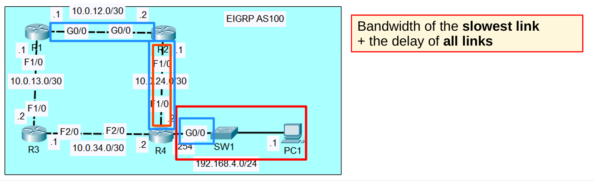
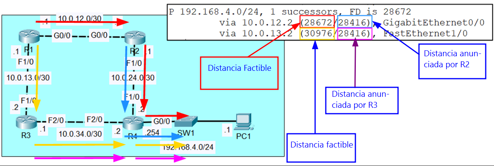
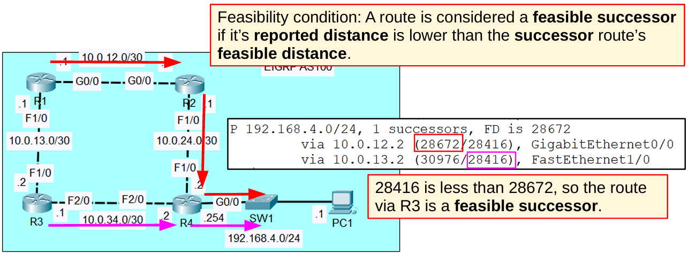
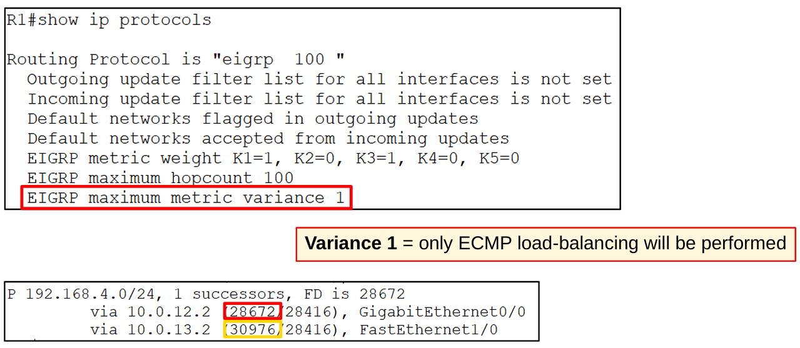
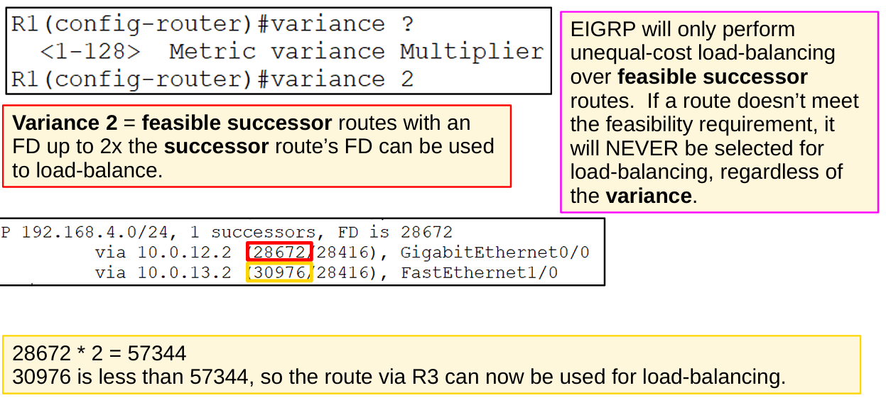
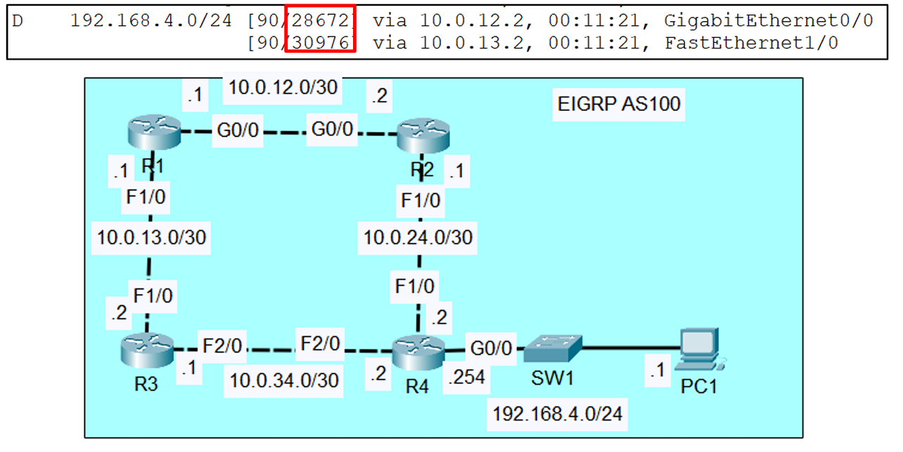

# Dia 25 - extra EIGRP: Métrica y Terminología

En este documento se resumen los conceptos y configuraciones básicas de **EIGRP (Enhanced Interior Gateway Routing Protocol)** según los slides proporcionados.

---

## 1. Métrica de EIGRP

EIGRP utiliza **ancho de banda y retardo (delay)** para calcular la métrica de las rutas por defecto.

### Fórmula de Métrica

```

([K1 * bandwidth + (K2 * bandwidth) / (256 - load) + K3 * delay] * [K5 / (reliability + K4)]) * 256

```

- **Valores por defecto de K**:  
  - K1 = 1  
  - K2 = 0  
  - K3 = 1  
  - K4 = 0  
  - K5 = 0  

**Simplificación:**  

```

Métrica = Bandwidth del enlace más lento + Retardo total de todos los enlaces
Métrica = Bandwidth + delay

```

> Esto significa que EIGRP selecciona rutas considerando tanto la velocidad de los enlaces como su retardo total.


*Representación de la fórmula de métrica EIGRP.*

---

## 2. Terminología de EIGRP

| Término                  | Definición                                                                 |
|---------------------------|---------------------------------------------------------------------------|
| **Feasible Distance (FD) [Distancia Factible]** | Métrica del router actual hacia el destino de la ruta.                   |
| **Reported Distance (RD) [Distancia Comunicada]** | Métrica que un vecino reporta hacia el destino.                           |
| **Successor [Sucesors]**             | Ruta con la métrica más baja hacia el destino (la mejor ruta).            |
| **Feasible Successor [Sucesor Factible]**    | Ruta alternativa que cumple la **condición de factibilidad**.             |



### Condición de factibilidad
Una ruta se considera **Feasible Successor [Sucesor Factible]** si:

```

Reported Distance < Feasible Distance de la Successor Route

```

**Ejemplo numérico:**


```

FD del sucesor: 28672
RD de R3: 28416

```

Como `28416 < 28672`, la ruta vía R3 es una **Feasible Successor**.



*Distancia factible y distancia reportada entre routers.*

---

## 3. Load-Balancing con EIGRP

### 3.1 Equal-Cost Multi-Path (ECMP)

- **Variance 1**: Solo se realiza balanceo de carga entre rutas de igual costo.




### 3.2 Unequal-Cost Load-Balancing

- **Variance 2**: Se pueden usar rutas Feasible Successor cuyo FD sea hasta **2 veces** la FD de la Successor Route.

**Ejemplo numérico:**

```

FD del sucesor: 28672
Valor máximo permitido con variance 2: 28672 * 2 = 57344
FD de ruta vía R3: 30976

```

Como `30976 < 57344`, la ruta vía R3 **puede ser usada** para load-balancing.

> Nota: EIGRP solo realiza load-balancing sobre rutas que cumplen la condición de factibilidad.





*Ejemplo de balanceo de carga con variance en EIGRP.*

---

## 4. Comandos de Verificación

* `show ip route` → Ver las rutas activas y sucesores.
* `show ip protocols` → Ver redes anunciadas y métricas.
* `show ip eigrp topology` → Revisar sucesores y feasible successors.

---

## 5. Notas importantes

* La **condición de factibilidad** es clave para evitar **loops de routing**.
* **Variance** permite balanceo de carga con rutas de diferente costo, pero solo sobre **Feasible Successors**.
* EIGRP por defecto considera **bandwidth y delay**, ignorando load y reliability.