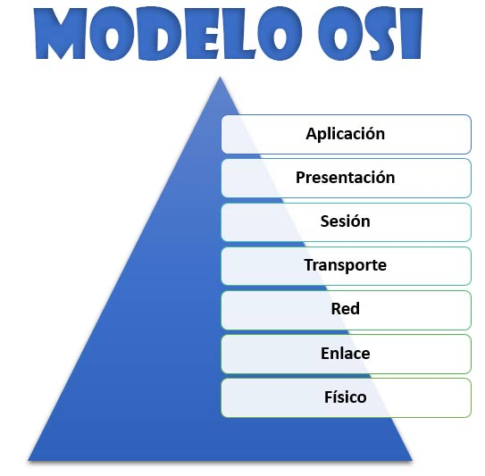
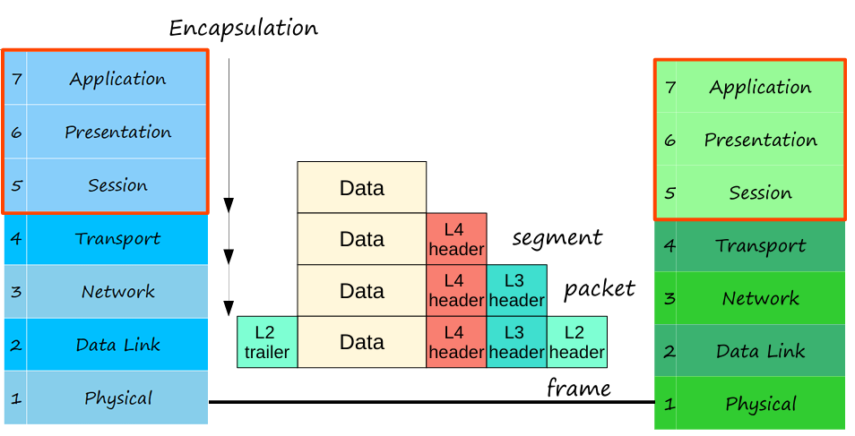
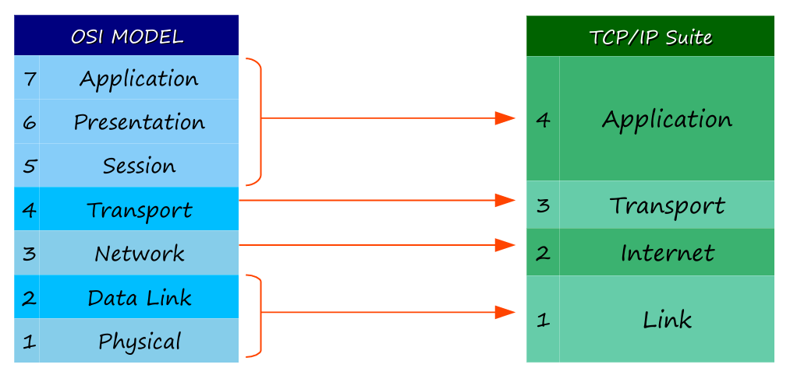

## 📝 Resumen: CCNA 200-301 - Día 3

Este día se centra en los modelos de red, en particular el **Modelo OSI** y la **Suite TCP/IP**, que proporcionan la estructura lógica para las comunicaciones de red.

---

### 🔌 Conceptos Clave

#### **1. El Modelo OSI**

El **Modelo OSI (Open Systems Interconnection)** es un modelo conceptual de 7 capas que estandariza las funciones de red. Las capas trabajan juntas a través de la **interacción entre capas adyacentes** y la **interacción en la misma capa** para permitir la comunicación.

#### **2. Las 7 Capas del Modelo OSI**
- **Capa 7 - Aplicación:** La capa más cercana al usuario final. Interactúa con aplicaciones de software como navegadores web (HTTP, HTTPS).
- **Capa 6 - Presentación:** Se encarga de la traducción y el formato de los datos para que las aplicaciones los entiendan, incluyendo la encriptación y desencriptación.
- **Capa 5 - Sesión:** Controla las sesiones de comunicación entre hosts, estableciendo, gestionando y terminando las conexiones.
- **Capa 4 - Transporte:** Proporciona comunicación de **host a host**. Segmenta los datos grandes en partes más pequeñas para su transmisión.
- **Capa 3 - Red:** Se encarga del enrutamiento entre redes (fuera de la LAN). Utiliza **direcciones IP** y los **routers** operan en esta capa.
- **Capa 2 - Enlace de Datos:** Proporciona conectividad de **nodo a nodo** (ej. PC a switch). Formatea los datos para su transmisión física y los **switches** operan en esta capa.
- **Capa 1 - Física:** Define las características físicas de la conexión, como los voltajes, conectores y el tipo de cable. Los bits se convierten en señales eléctricas o de radio.

#### **3. Encapsulación y Unidades de Datos (PDUs)**
La **encapsulación** es el proceso de agregar encabezados (y a veces un tráiler) a los datos a medida que se mueven por las capas, de arriba hacia abajo. La **desencapsulación** es el proceso inverso.

| **PDU** | **Capa OSI** |
| :---: | :---: |
| Datos | 7 (Aplicación), 6 (Presentación), 5 (Sesión) |
| Segmento | 4 (Transporte) |
| Paquete | 3 (Red) |
| Trama (Frame) | 2 (Enlace de Datos) |
| Bit | 1 (Física) |

#### **4. La Suite TCP/IP**

- Es el modelo conceptual y el conjunto de protocolos utilizado en redes modernas.
- A diferencia del modelo OSI, tiene solo **cuatro capas**. Las funciones de las capas superiores del OSI se combinan en la capa de **Aplicación** de TCP/IP, y las capas de **Enlace de Datos** y **Física** de OSI se combinan en la capa de **Enlace** de TCP/IP.
- Los ingenieros de red se centran en las capas de **Transporte, Internet y Enlace** del modelo TCP/IP.

---

### ❓ Preguntas de Repaso

1.  **Pregunta:** ¿Qué capa del modelo OSI es la más relevante para los ingenieros de red?
    * **Respuesta:** Las capas **4 (Transporte), 3 (Red), 2 (Enlace de Datos) y 1 (Física)**.

2.  **Pregunta:** ¿Cuál es el nombre correcto para una PDU que ha sido encapsulada con tres encabezados y un tráiler?
    * **Respuesta:** Una **Trama (Frame)**, que es la PDU de la Capa 2 (Enlace de Datos).

3.  **Pregunta:** ¿Qué capa del modelo TCP/IP es equivalente a las capas de Enlace de Datos y Física del modelo OSI?
    * **Respuesta:** La capa de **Enlace (Link)** de TCP/IP.

4.  **Pregunta:** ¿Qué capa del modelo OSI proporciona comunicación de host a host?
    * **Respuesta:** La capa **4 (Transporte)**.

5.  **Pregunta:** Cuando los datos HTTP de un servidor de YouTube se muestran en tu navegador, ¿qué tipo de interacción se produce entre el servidor y el navegador?
    * **Respuesta:** **Interacción en la misma capa**, ya que ambos operan en la Capa 7 (Aplicación).