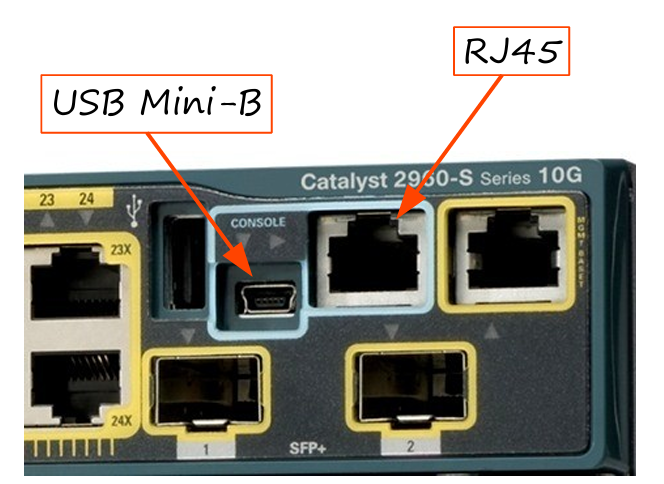
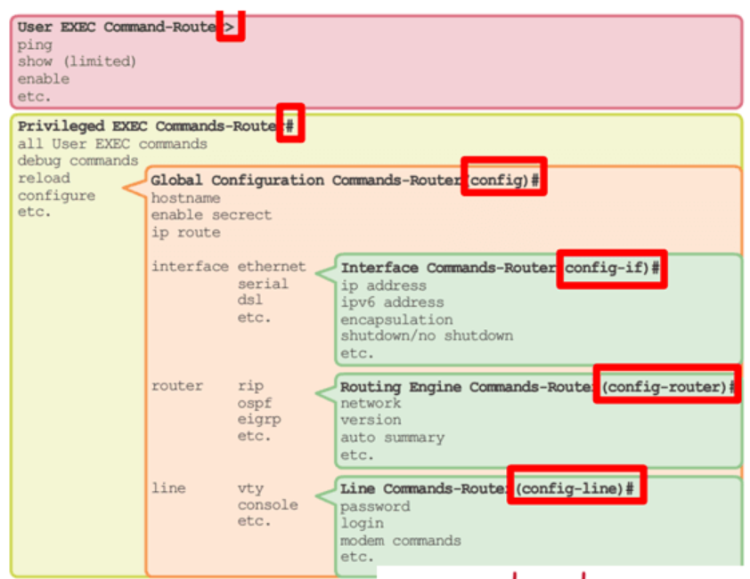

## 📝 Resumen: CCNA 200-301 - Día 4

Este día se centra en la introducción a la interfaz de línea de comandos (CLI) de Cisco IOS y sus diferentes modos de operación.

---

### 🔌 Conceptos Clave

#### **1. Conexión a un Dispositivo Cisco**
- La interfaz principal para configurar dispositivos Cisco es la **CLI (Command-line interface)**.
- Para acceder a la CLI, se utiliza el puerto de consola. Existen dos tipos de puertos de consola: RJ-45 y USB Mini-B.
- El cable utilizado para la conexión al puerto de consola RJ-45 es un **cable rollover**.
- Se requiere un emulador de terminal (como PuTTy) para acceder a la CLI desde una computadora.

#### **2. Modos de Operación de la CLI**
La CLI de Cisco IOS tiene una jerarquía de modos, cada uno con diferentes niveles de acceso:
- **Modo EXEC de Usuario** (`Router>`): Es el modo por defecto y tiene acceso muy limitado. Solo permite ver información básica, pero no hacer cambios de configuración.
- **Modo EXEC Privilegiado** (`Router#`): Permite ver la configuración completa y ejecutar comandos de mantenimiento. Se accede a él con el comando `enable` desde el modo de usuario.
- **Modo de Configuración Global** (`Router(config)#`): Permite cambiar la configuración del dispositivo. Se accede a él con el comando `configure terminal` o `conf t`.

#### **3. Comandos Esenciales y Archivos de Configuración**
- **Archivos de Configuración:**
    - `running-config`: Es el archivo de configuración actual y activo en el dispositivo. Los cambios se realizan aquí.
    - `startup-config`: Es el archivo de configuración guardado que se carga cuando el dispositivo se reinicia.
- **Guardar la Configuración:** Los cambios en el `running-config` se guardan en el `startup-config` con comandos como `copy running-config startup-config` o simplemente `write`.
- **Comandos de Contraseña:**
    - `enable password [contraseña]`: Configura una contraseña en texto plano para el modo EXEC privilegiado.
    - `service password-encryption`: Cifra las contraseñas en el `running-config`, pero con una encriptación débil.
    - `enable secret [contraseña]`: Configura una contraseña cifrada con MD5 para el modo EXEC privilegiado, siendo la forma más segura. Si `enable secret` y `enable password` están configurados, el dispositivo usará la `enable secret`.

---

### ❓ Preguntas de Repaso

1.  **Pregunta:** ¿Qué tipo de cable se usa para conectar al puerto de consola RJ-45 de un dispositivo Cisco?
    * **Respuesta:** Un **cable rollover**.

2.  **Pregunta:** Si intentas acceder al modo EXEC privilegiado y la contraseña no funciona, ¿qué podría ser el problema?
    * **Respuesta:** La contraseña distingue entre mayúsculas y minúsculas. Es posible que el **bloqueo de mayúsculas** (`Caps Lock`) esté activado.

3.  **Pregunta:** ¿Cuál es el método más seguro para proteger el acceso al modo EXEC privilegiado?
    * **Respuesta:** El comando **`enable secret`**, ya que utiliza una encriptación MD5 más fuerte.

4.  **Pregunta:** Si se configuran tanto `enable password` como `enable secret`, ¿qué contraseña se debe usar para acceder al modo EXEC privilegiado?
    * **Respuesta:** Se debe usar la contraseña del comando **`enable secret`**.

5.  **Pregunta:** ¿Cuál es la versión completa del comando `conf t`?
    * **Respuesta:** **`configure terminal`**.