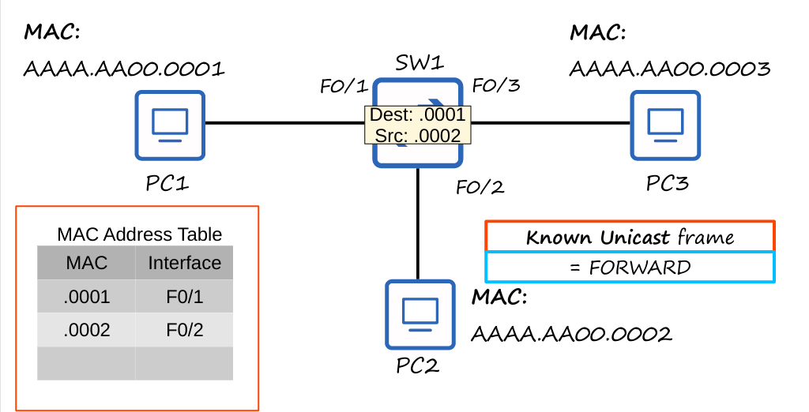

# Día 5: Ethernet LAN Switching 

Este resumen cubre conceptos clave de la conmutación Ethernet LAN, incluyendo los modelos OSI de las capas 1 y 2, la estructura de la trama Ethernet, las direcciones MAC y el funcionamiento de un switch.

---

## Modelo OSI: Capas 1 y 2 

### **Capa 1: Capa Física**
La **Capa Física** es la capa más baja del modelo OSI y se encarga de las características físicas del medio de transmisión.

- Define el voltaje, las distancias de transmisión, los conectores y las especificaciones de los cables.
- Convierte los bits digitales en señales eléctricas (cables) o de radio (inalámbricas).
- Ejemplos incluyen los cables UTP, fibra óptica, conectores RJ-45, etc.

### **Capa 2: Capa de Enlace de Datos**
La **Capa de Enlace de Datos** es la segunda capa del modelo OSI, responsable de la conectividad de nodo a nodo y la transferencia de datos.

- Define el formato de los datos para su transmisión sobre un medio físico.
- Detecta y, en algunos casos, corrige errores de la Capa Física.
- Utiliza **direcciones de Capa 2** (direcciones MAC), que son distintas de las direcciones de Capa 3 (direcciones IP).
- Los **switches** operan en esta capa.

---

## Unidades de Datos de Protocolo (PDUs)

Cada capa del modelo OSI tiene su propia PDU.

- **Capa 4 (Transporte):** Segmentos
- **Capa 3 (Red):** Paquetes
- **Capa 2 (Enlace de Datos):** Tramas
- **Capa 1 (Física):** Bits

---

## La Trama Ethernet

La trama Ethernet es el formato en que los datos se encapsulan para su transmisión.

- **Preámbulo (7 bytes):** Sincroniza los relojes del remitente y el receptor, con una secuencia de bits alternados `10101010`.
- **SFD (Start Frame Delimiter) (1 byte):** Marca el final del preámbulo y el inicio de la trama, con la secuencia `10101011`.
- **Dirección MAC de Destino y Origen (6 bytes cada una):** Identifican los dispositivos que envían y reciben la trama.
- **Tipo/Longitud (2 bytes):** Indica el tipo de paquete encapsulado (ej. IPv4 o IPv6).
- **Paquete de Datos:** La información real a transmitir.
- **FCS (Frame Check Sequence) (4 bytes):** Detecta errores mediante un algoritmo CRC (Cyclic Redundancy Check) en la trama recibida.

El tamaño total del encabezado y el tráiler de una trama Ethernet es de **26 bytes**.

---

## Direcciones MAC 

Una **dirección MAC** (Media Access Control) es una dirección física de 6 bytes (48 bits) asignada globalmente a cada dispositivo de red durante su fabricación.

- También conocida como **Burned-In Address (BIA)**.
- Se representa en **12 caracteres hexadecimales** (ej. `E8BA.7011.2874`).
- Los primeros **3 bytes (24 bits)** son el **OUI (Organizationally Unique Identifier)**, que identifica al fabricante del dispositivo.
- Los últimos **3 bytes** son únicos para cada dispositivo de ese fabricante.

### **Sistemas Numéricos: Decimal vs. Hexadecimal**

| Decimal (DEC) | Hexadecimal (HEX) |
|---------------|-------------------|
| 0-9           | 0-9               |
| 10            | A                 |
| 11            | B                 |
| 12            | C                 |
| 13            | D                 |
| 14            | E                 |
| 15            | F                 |

---

## Funcionamiento del Switch y la Tabla MAC

Los switches utilizan la **dirección MAC de origen** de las tramas recibidas para poblar su **tabla de direcciones MAC**. Esta tabla asocia una dirección MAC con la interfaz por la que se recibió, lo que permite al switch aprender la ubicación de los dispositivos en la red.

| MAC Address | Interface |
|---|---|
| AAAA.AA00.0001 | F0/1 |
| AAAA.AA00.0002 | F0/2 |

- **Tramas Unicast Conocidas:** Cuando el switch conoce la dirección MAC de destino en su tabla, **reenvía** la trama solo a la interfaz correcta.

- **Tramas Unicast Desconocidas:** Cuando la dirección MAC de destino no está en la tabla, el switch **inunda** la trama, enviándola por todas las interfaces excepto la de origen.
- Las entradas de la tabla MAC se eliminan después de **5 minutos de inactividad**.

---

## Cuestionario de Repaso 

**P1:** ¿Cuál es la longitud en bits de una dirección MAC?
- a) 32 bytes
- b) 32 bits
- c) 48 bytes
- d) **48 bits** ✅

**P2:** ¿Qué parte de una dirección MAC identifica al fabricante?
- a) Los últimos 3 bytes
- b) **El OUI (primeros 3 bytes)** ✅
- c) Toda la dirección MAC
- d) Los últimos 12 caracteres hexadecimales

**P3:** ¿Qué hace un switch con una trama unicast cuya dirección de destino no conoce?
- a) La descarta
- b) La reenvía
- c) La inunda por todas las interfaces
- d) **La inunda por todas las interfaces excepto la de origen** ✅