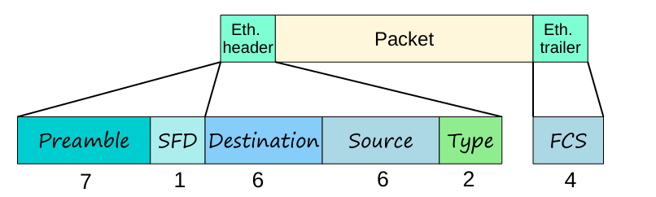
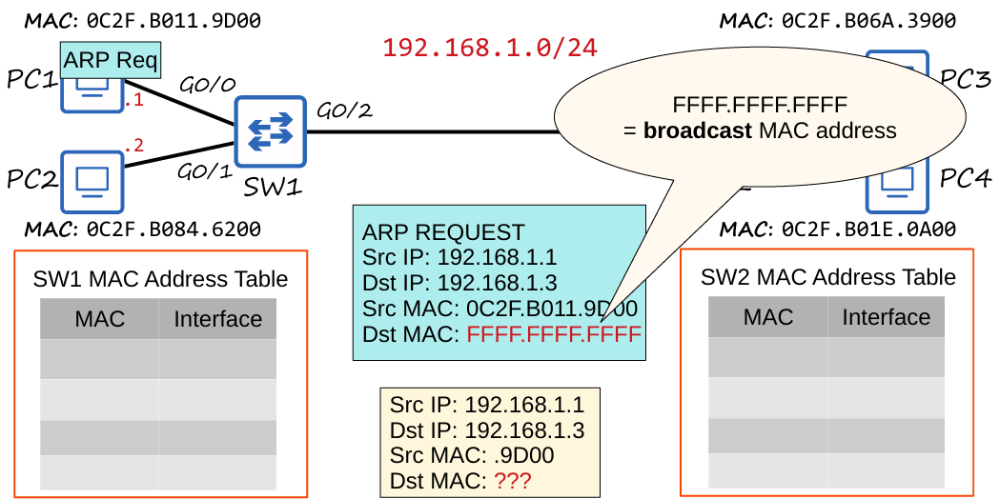
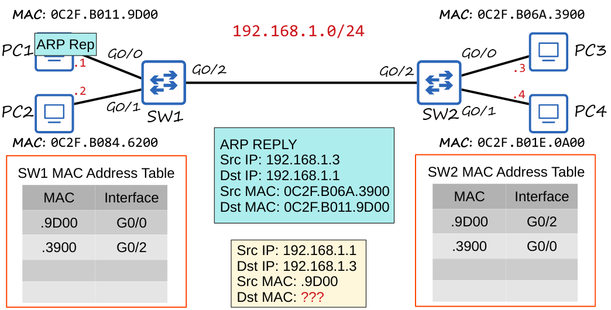
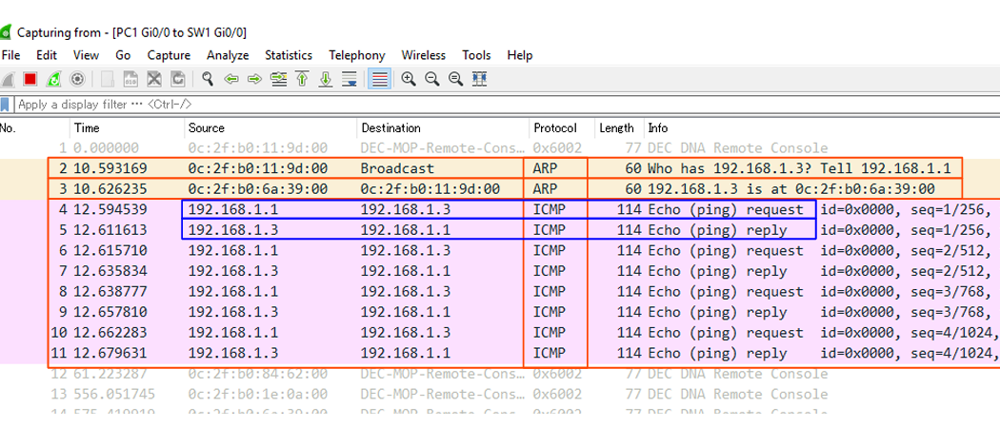

# Día 6: Ethernet LAN Switching (Parte 2) 

Este resumen profundiza en la conmutación Ethernet, cubriendo el tamaño de la trama, el Protocolo de Resolución de Direcciones (ARP) y su funcionamiento, y el uso de la tabla de direcciones MAC.

---

## Trama Ethernet: Tamaño y Padding 

El tamaño de la trama Ethernet se refiere a la suma del encabezado, el paquete (payload) y el tráiler.

- El **encabezado + tráiler** de la trama Ethernet es de **18 bytes** (sin incluir el preámbulo y el SFD).
- El tamaño **mínimo** de una trama Ethernet es de **64 bytes**.
- El **tamaño mínimo del payload (paquete)** es de **46 bytes** (64 bytes - 18 bytes).
- Si el paquete es menor de 46 bytes, se añaden **bytes de relleno (padding)** para alcanzar este tamaño mínimo.

---

## Protocolo de Resolución de Direcciones (ARP) 

**ARP** (Address Resolution Protocol) es un protocolo crucial para la comunicación en redes locales. Se utiliza para descubrir la **dirección de Capa 2 (MAC)** de un dispositivo a partir de su **dirección de Capa 3 (IP)**.

- **ARP Request:**
  - Es un mensaje de **broadcast** (enviado a todos los hosts en la red).
  - La dirección MAC de destino es `FFFF.FFFF.FFFF`.
  - El propósito es preguntar: "Quien tiene la IP `X.X.X.X`?".
  - El switch **inunda** esta trama.

- **ARP Reply:**
  - Es un mensaje de **unicast** (enviado a un solo host).
  - Contiene la dirección MAC del host solicitado.
  - El switch **reenvía** esta trama directamente al remitente original.

### **Tabla ARP**
La tabla ARP almacena las asociaciones entre direcciones IP y MAC.
- Se puede ver en Windows, macOS o Linux usando el comando `arp -a`.
- Las entradas pueden ser de tipo **estático** (configuradas manualmente) o **dinámico** (aprendidas mediante ARP).

---

## Comandos y Funcionamiento del Switch 

### **Tabla de Direcciones MAC**
El comando `show mac address-table` en un switch Cisco muestra la tabla de direcciones MAC, que asocia las direcciones MAC con las interfaces.

- **Columnas comunes:** VLAN, MAC Address, Type, Ports.
- **`Type`** indica si la dirección fue aprendida **dinámicamente** o es **estática**.

### **Ping (ICMP)**
La utilidad `ping` se usa para probar la conectividad de red y el tiempo de viaje de los paquetes.
- Utiliza dos mensajes **unicast**: `ICMP Echo Request` (enviado) e `ICMP Echo Reply` (recibido).
- Por defecto, un Cisco IOS envía **5 solicitudes/respuestas ICMP** con un tamaño de **100 bytes**.

- Un **punto (.)** representa un ping fallido.

- Un **signo de exclamación (!)** representa un ping exitoso.

# Comandos útiles en Cisco IOS (modo EXEC privilegiado)

### `PC1# show arp`
Muestra la tabla ARP de los hosts.

---

### `SW1# show mac address-table`
Muestra la tabla MAC del switch.

- **Columnas:** VLAN – MAC Address – Type – Ports (interfaces).  
- **VLAN (Virtual Local Area Network):** red lógica en la que está segmentado el switch.

---

### `SW1# clear mac address-table dynamic`
Borra toda la tabla MAC dinámica del switch.  

> Si se especifica una MAC en particular, elimina solo esa entrada.

---

### `SW1# clear mac address-table dynamic interface <interface-id>`
Borra las entradas de la tabla MAC de un switch asociadas a una **interfaz específica**.

### **Tipos de Trama y Comportamiento del Switch**
- **Tramas de Broadcast (`FFFF.FFFF.FFFF`) y Unicast Desconocidas:** El switch las **inunda** por todas las interfaces, excepto la de origen.
- **Tramas Unicast Conocidas:** El switch las **reenvía** solo a la interfaz de destino.

---

## Cuestionario de Repaso 

**P1:** ¿Qué campo del paquete Ethernet es llenado por el switch cuando la trama es un unicast desconocido?
- a) La dirección MAC de origen
- b) **La dirección MAC de destino** ✅
- c) El FCS
- d) El campo de tipo

**P2:** ¿Qué tipo de mensaje de ARP se envía a todos los hosts en la red local?
- a) **ARP Request** ✅
- b) ARP Reply
- c) Ambos
- d) Ninguno

**P3:** ¿Cuál es el tamaño mínimo del payload de una trama Ethernet?
- a) 18 bytes
- b) **46 bytes** ✅
- c) 64 bytes
- d) 26 bytes

**P4:** ¿Qué comando se usa en un switch Cisco para borrar todas las direcciones MAC dinámicas en una interfaz específica?
- a) `clear mac address-table interface interface-id`
- b) `clear mac-address-table dynamic interface interface-id`
- c) `clear mac-address table dynamic interface interface-id`
- d) `clear mac address-table dynamic interface interface-id`

**Respuesta a P4:** La respuesta correcta es `clear mac-address-table dynamic interface interface-id` (opción B), ya que es la sintaxis correcta en el IOS de Cisco.