# Día 8 - Direccionamiento IPv4 (Parte 2)

## Objetivos del Día

- **Clases de direcciones IPv4** (repaso y aclaración)
- **Encontrar el** número máximo de hosts, dirección de red, dirección de broadcast, primera dirección utilizable, última dirección utilizable de una red particular
- **Configurar direcciones IP** en dispositivos Cisco

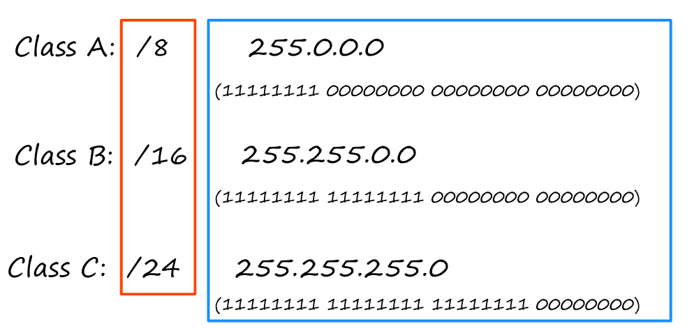

## Clases de Direcciones IPv4

### Tabla de Clases IPv4

| Clase | Primer Octeto | Rango Numérico |
|-------|---------------|----------------|
| A     | 0xxxxxxx      | 0-127          |
| B     | 10xxxxxx      | 128-191        |
| C     | 110xxxxx      | 192-223        |
| D     | 1110xxxx      | 224-239        |
| E     | 1111xxxx      | 240-255        |

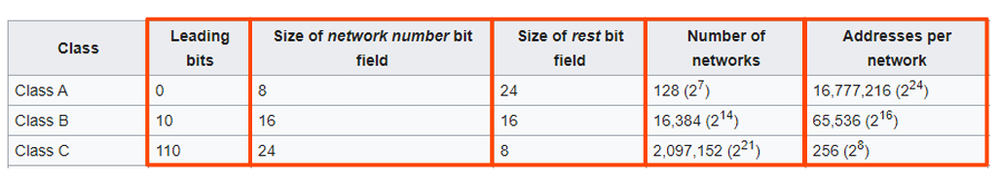

## Cálculo de Hosts por Red

### Fórmula General
**Máximo de hosts por red = 2^n - 2**
(n = número de bits de host)

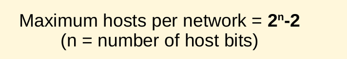

### Ejemplos de Cálculo

#### Clase C (/24)
- **Red:** 192.168.1.0/24 → 192.168.1.255/24
- **Porción de host:** 8 bits = 2^8 = 256
- **Dirección de red:** Porción de host todo 0s (192.168.1.0)
- **Dirección de broadcast:** Porción de host todo 1s (192.168.1.255)
- **Máximo de hosts:** 2^8 - 2 = **254**

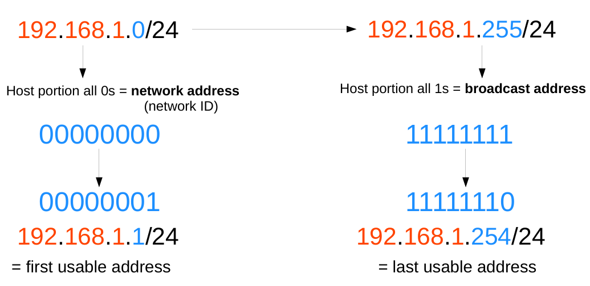

#### Clase B (/16)
- **Red:** 172.16.0.0/16 → 172.16.255.255/16
- **Porción de host:** 16 bits = 2^16 = 65,536
- **Dirección de red:** 172.16.0.0
- **Dirección de broadcast:** 172.16.255.255
- **Máximo de hosts:** 2^16 - 2 = **65,534**

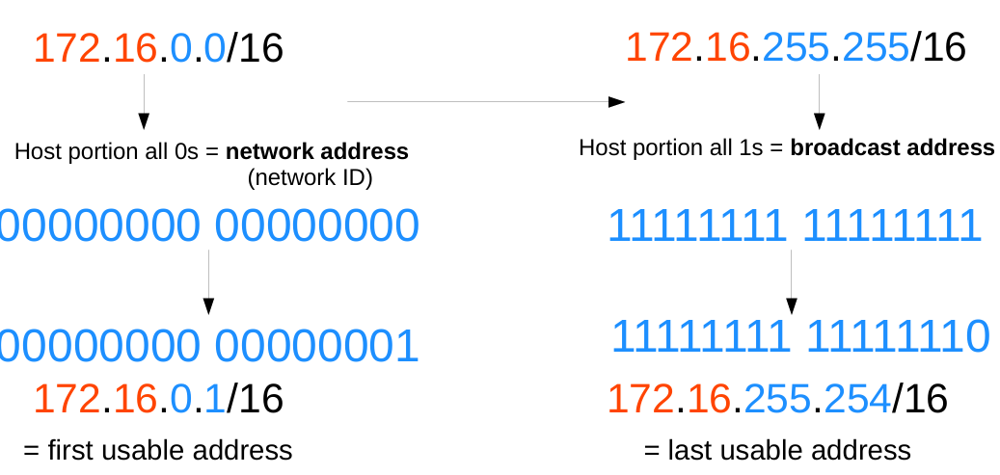

#### Clase A (/8)
- **Red:** 10.0.0.0/8 → 10.255.255.255/8
- **Porción de host:** 24 bits = 2^24 = 16,777,216
- **Dirección de red:** 10.0.0.0
- **Dirección de broadcast:** 10.255.255.255
- **Máximo de hosts:** 2^24 - 2 = **16,777,214**

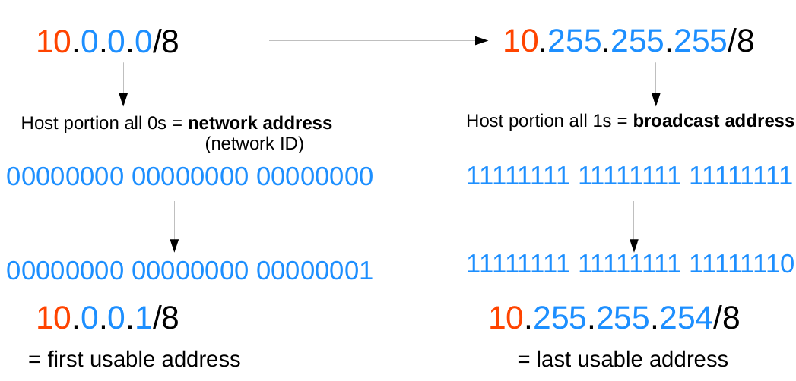

## Direcciones Utilizables (Primera/Última Dirección Utilizable)

### Reglas Importantes
- **Porción de host todo 0s** = dirección de red (network ID)
- **Porción de host todo 1s** = dirección de broadcast
- **Primera dirección utilizable** = dirección de red + 1
- **Última dirección utilizable** = dirección de broadcast - 1

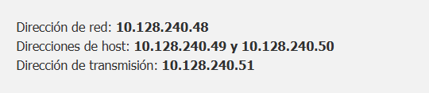

### Ejemplos Prácticos

#### Red 192.168.1.0/24
- **Dirección de red:** 192.168.1.0
- **Dirección de broadcast:** 192.168.1.255
- **Primera utilizable:** 192.168.1.1 (00000001 en binario)
- **Última utilizable:** 192.168.1.254 (11111110 en binario)

#### Red 172.16.0.0/16
- **Dirección de red:** 172.16.0.0
- **Dirección de broadcast:** 172.16.255.255
- **Primera utilizable:** 172.16.0.1 (00000000 00000001 en binario)
- **Última utilizable:** 172.16.255.254 (11111111 11111110 en binario)

#### Red 10.0.0.0/8
- **Dirección de red:** 10.0.0.0
- **Dirección de broadcast:** 10.255.255.255
- **Primera utilizable:** 10.0.0.1 (00000000 00000000 00000001 en binario)
- **Última utilizable:** 10.255.255.254 (11111111 11111111 11111110 en binario)

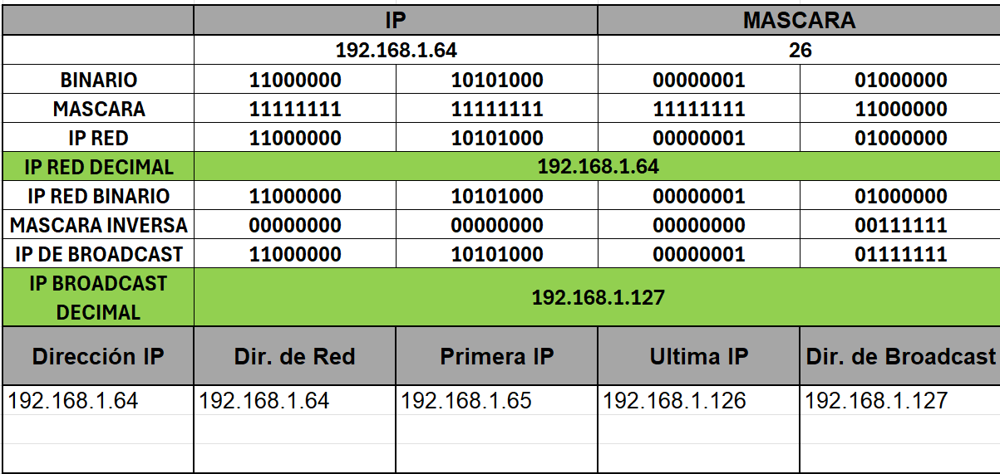

## Configuración de Direcciones IP en Dispositivos Cisco

### Topología de Red

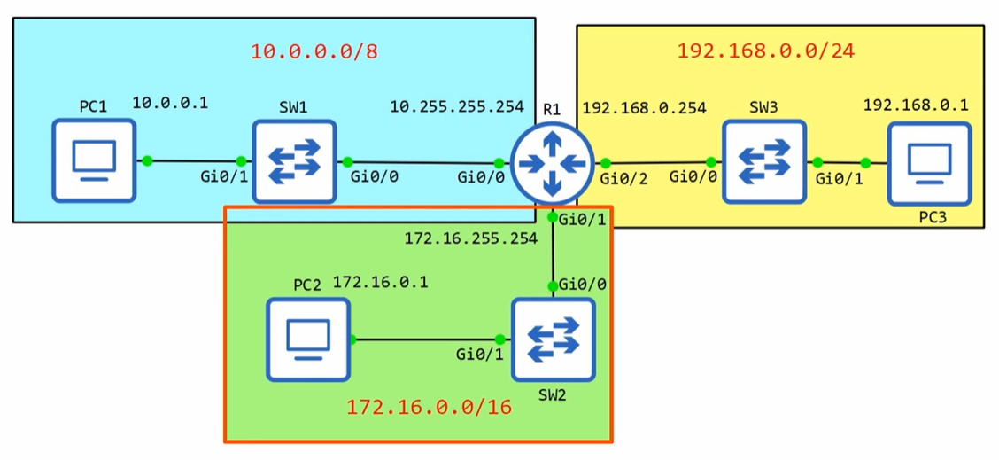

### Estados de Interfaces
- **Administrativamente down:** La interfaz ha sido deshabilitada con el comando 'shutdown'
- **Estado por defecto:** Las interfaces de router Cisco están administrativamente down por defecto
- **Interfaces de switch:** NO están administrativamente down por defecto

### Estados de Capa 1 y Capa 2

| Estado Capa 1 | Estado Capa 2 | Descripción |
|---------------|---------------|-------------|
| UP | UP | Interfaz funcionando correctamente |
| DOWN | DOWN | Problema físico o cable desconectado |
| UP | DOWN | Problema de Capa 2 (protocolo) |
| Administratively DOWN | DOWN | Interfaz deshabilitada manualmente |

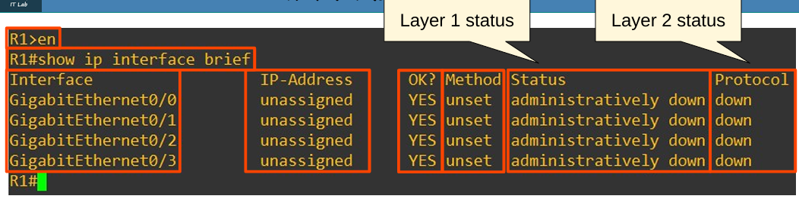

## Comandos de Configuración y Verificación

### Configuración Básica de IP

```cisco
Router> enable
Router# configure terminal
Router(config)# interface gigabitethernet 0/0
Router(config-if)# ip address 10.255.255.254 255.0.0.0
Router(config-if)# no shutdown
Router(config-if)# description "to SW1"
Router(config-if)# exit
```

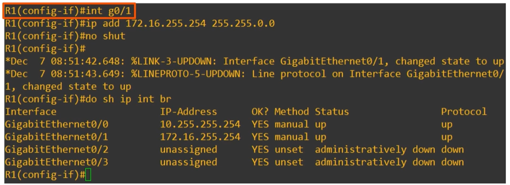

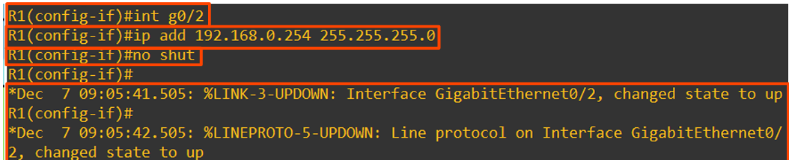

### Comandos de Verificación

#### show interfaces
```cisco
Router# show interfaces
```
- Muestra información detallada de todas las interfaces
- Incluye estadísticas de tráfico, errores, estado físico y lógico


#### show interfaces [interface]
```cisco
Router# show interfaces gigabitethernet 0/0
```
- Muestra información específica de una interfaz
- Útil para troubleshooting de interfaces específicas

#### show interfaces description
```cisco
Router# show interfaces description
```
- Muestra un resumen de todas las interfaces con sus descripciones
- Vista condensada ideal para identificación rápida

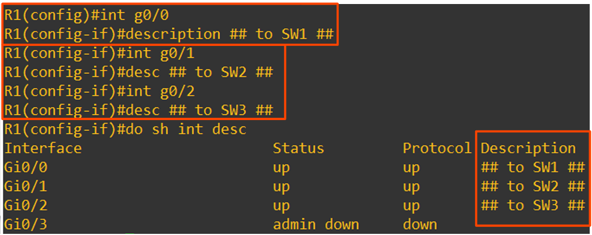

#### show ip interface brief
```cisco
Router# show ip interface brief
```
- Muestra resumen de configuración IP de todas las interfaces
- Comando más utilizado para verificación rápida

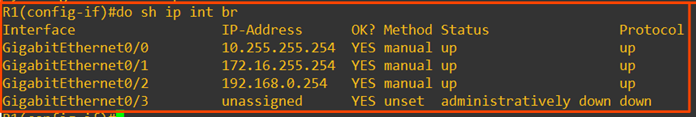


## Ejercicios de Práctica

### Pregunta 1
**PC1 tiene una dirección IP de 43.109.23.12/8**

- **Dirección de red:** 43.0.0.0
- **Máximo de hosts:** 16,777,214
- **Dirección de broadcast:** 43.255.255.255
- **Primera utilizable:** 43.0.0.1
- **Última utilizable:** 43.255.255.254

### Pregunta 2
**PC4 tiene una dirección IP de 129.221.23.13/16**

- **Dirección de red:** 129.221.0.0
- **Máximo de hosts:** 65,534
- **Dirección de broadcast:** 129.221.255.255
- **Primera utilizable:** 129.221.0.1
- **Última utilizable:** 129.221.255.254

### Pregunta 3
**PC8 tiene una dirección IP de 209.211.3.22/24**

- **Dirección de red:** 209.211.3.0
- **Máximo de hosts:** 254
- **Dirección de broadcast:** 209.211.3.255
- **Primera utilizable:** 209.211.3.1
- **Última utilizable:** 209.211.3.254

### Pregunta 4
**PC5 tiene una dirección IP de 2.71.209.233/8**

- **Dirección de red:** 2.0.0.0
- **Máximo de hosts:** 16,777,214
- **Dirección de broadcast:** 2.255.255.255
- **Primera utilizable:** 2.0.0.1
- **Última utilizable:** 2.255.255.254

### Pregunta 5
**PC6 tiene una dirección IP de 155.200.201.141/16**

- **Dirección de red:** 155.200.0.0
- **Máximo de hosts:** 65,534
- **Dirección de broadcast:** 155.200.255.255
- **Primera utilizable:** 155.200.0.1
- **Última utilizable:** 155.200.255.254


## Conceptos Clave para Recordar

1. **Estado Capa 1 vs Capa 2** en interfaces - diferentes problemas requieren diferentes soluciones
2. **Fórmula de cálculo:** 2^n - 2 para máximo de hosts donde n = bits de host
3. **Direcciones reservadas:** Dirección de red (todo 0s) y broadcast (todo 1s) no son utilizables
4. **Estados por defecto** diferentes entre routers (administratively down) y switches (up)
5. **Comandos de verificación** esenciales para troubleshooting y configuración
6. **Comando 'no shutdown'** necesario para activar interfaces en routers
7. **Descripciones de interfaz** ayudan en la documentación y troubleshooting


## Troubleshooting Común

### Problemas Frecuentes
- **Interface administratively down:** Usar `no shutdown`
- **IP address incorrect:** Verificar con `show ip interface brief`
- **Subnet mask incorrecta:** Revisar configuración con `show running-config`
- **Descripción faltante:** Añadir con `description "texto"`
