# CCNA 200-301 Day 9 - Switch Interfaces

## Tabla de Contenidos
| Temas Cubiertos |
|-----------------|
| **Velocidad y duplex de interfaces** |
| **Autonegociación de velocidad y duplex** |
| **Estados de interfaces** |
| **Contadores y errores de interfaces** |

## Topología
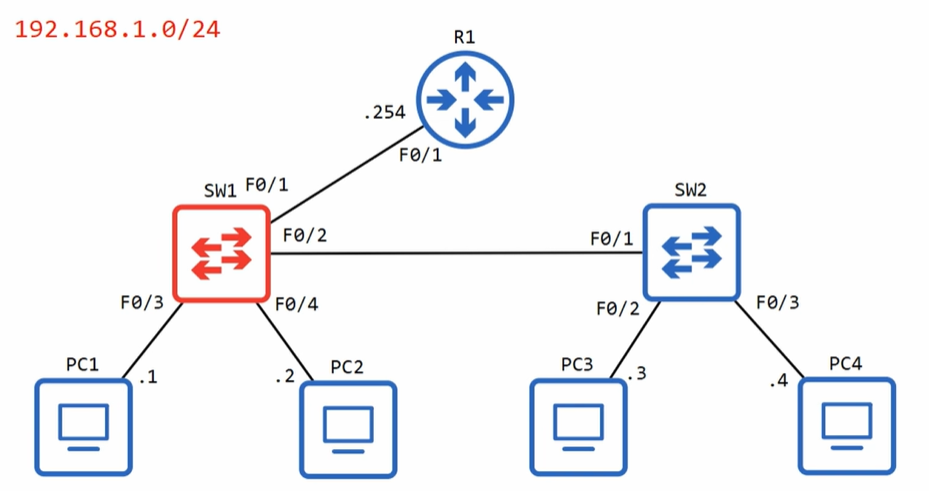

## Interfaces de Switch


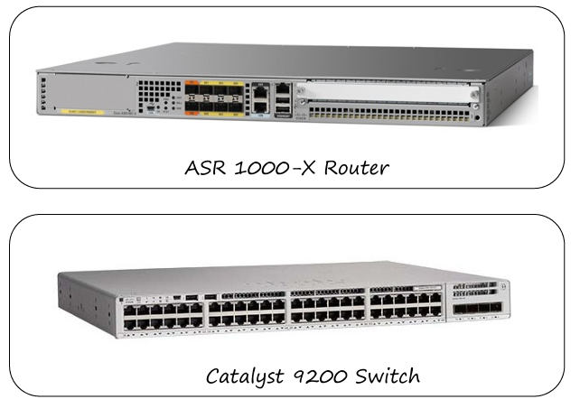

Los switches Catalyst y routers ASR tienen diferentes comportamientos por defecto en sus interfaces:

- **Interfaces de Router**: Tienen el comando `shutdown` aplicado por defecto (estado administratively down/down)
- **Interfaces de Switch**: NO tienen el comando `shutdown` aplicado por defecto
  - Estado **up/up** si están conectadas a otro dispositivo
  - Estado **down/down** si no están conectadas

## Comandos de Verificación

### show ip interface brief
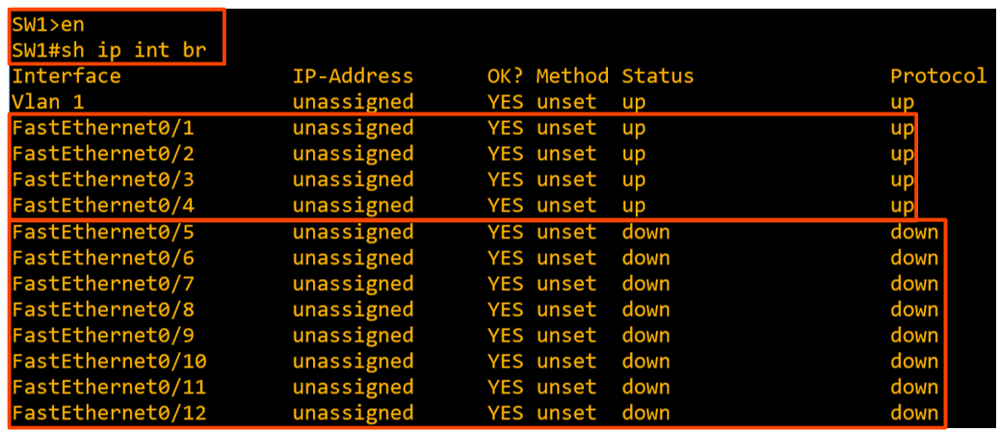

Muestra el estado básico de todas las interfaces del dispositivo.

### show interfaces status
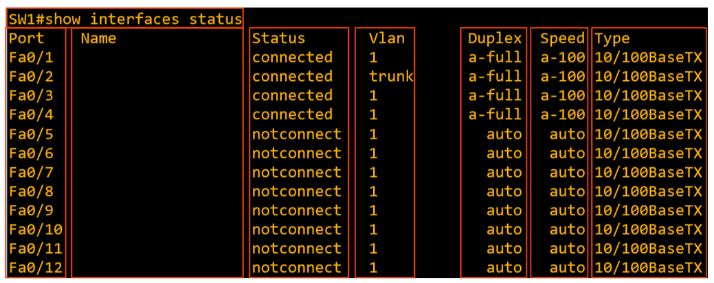

Proporciona información detallada sobre el estado, velocidad, duplex y VLAN de las interfaces.

## Configuración de Velocidad y Duplex

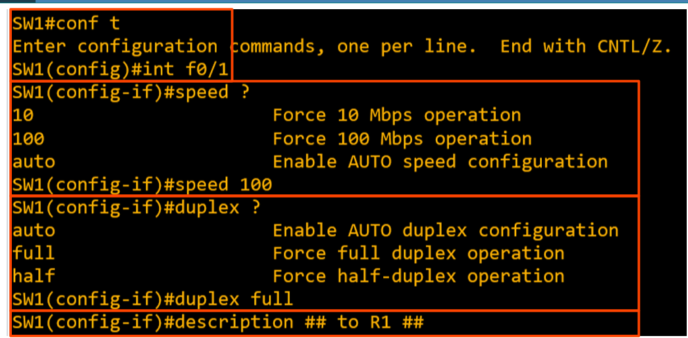

### Comandos de Configuración:
```bash
SW1(config)# interface f0/1
SW1(config-if)# speed 100
SW1(config-if)# duplex full
```

### Configuración en Rango de Interfaces:
```bash
SW1(config)# interface range f0/5-12
SW1(config-if-range)# speed 100
SW1(config-if-range)# duplex full
```

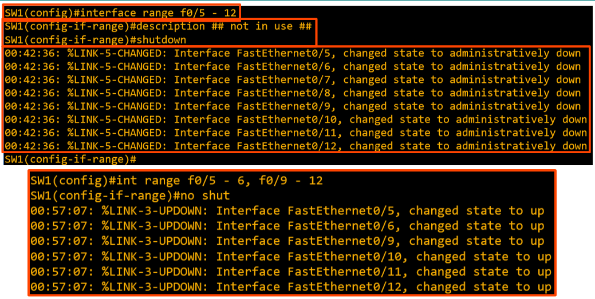

## Full Duplex vs Half Duplex


| **Half Duplex** | **Full Duplex** |
|-----------------|-----------------|
| No puede enviar y recibir datos simultáneamente | Puede enviar y recibir datos simultáneamente |
| Debe esperar antes de enviar si está recibiendo | No necesita esperar |
| Requerido en **hubs** | Soportado en **switches** |

### Hubs LAN y Dominios de Colisión

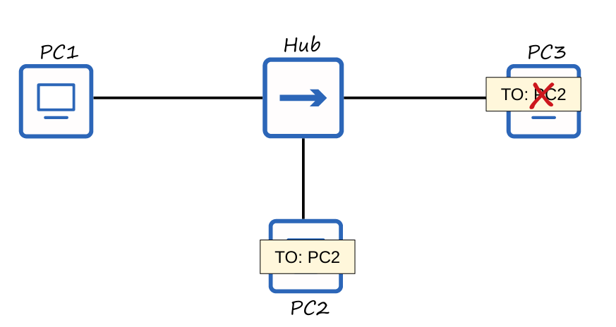

Los hubs crean un **dominio de colisión único** donde todos los dispositivos comparten el mismo medio de comunicación, causando colisiones cuando múltiples dispositivos transmiten simultáneamente.

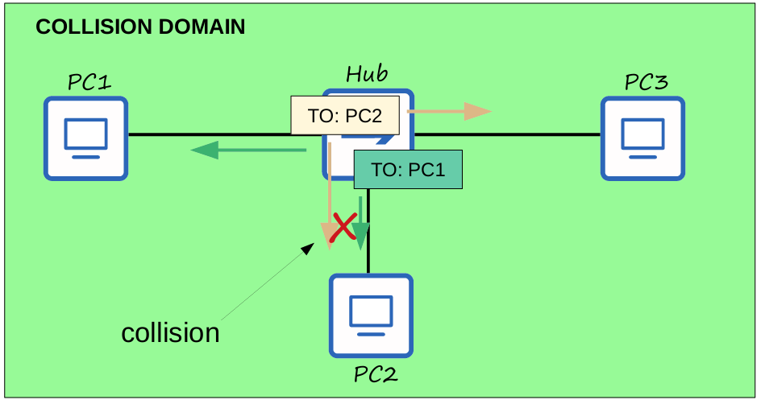

## CSMA/CD (Carrier Sense Multiple Access with Collision Detection)

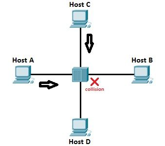

**Proceso CSMA/CD:**
1. Los dispositivos "escuchan" el dominio de colisión antes de transmitir
2. Si ocurre una colisión, se envía una señal de interferencia (jamming signal)
3. Cada dispositivo espera un tiempo aleatorio antes de retransmitir
4. El proceso se repite

## Autonegociación de Velocidad/Duplex

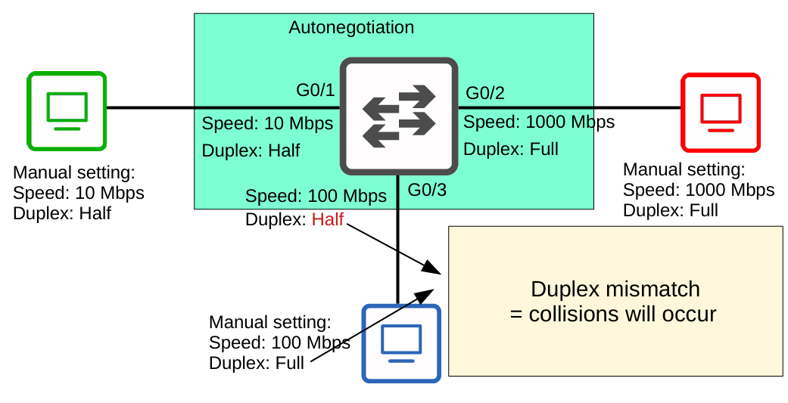

### Configuración por Defecto:
- Interfaces con múltiples velocidades tienen `speed auto` y `duplex auto`
- Las interfaces "anuncian" sus capacidades al dispositivo vecino
- Negocian la mejor configuración de velocidad y duplex que ambos soporten

### Cuando la Autonegociación está Deshabilitada:

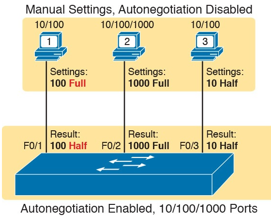

**VELOCIDAD**: El switch intenta detectar la velocidad del otro dispositivo
- Si falla, usa la velocidad más lenta soportada (ej. 10 Mbps)

**DUPLEX**: 
- Si la velocidad es 10 o 100 Mbps → **Half duplex**
- Si la velocidad es 1000 Mbps o mayor → **Full duplex**

### Duplex Mismatch

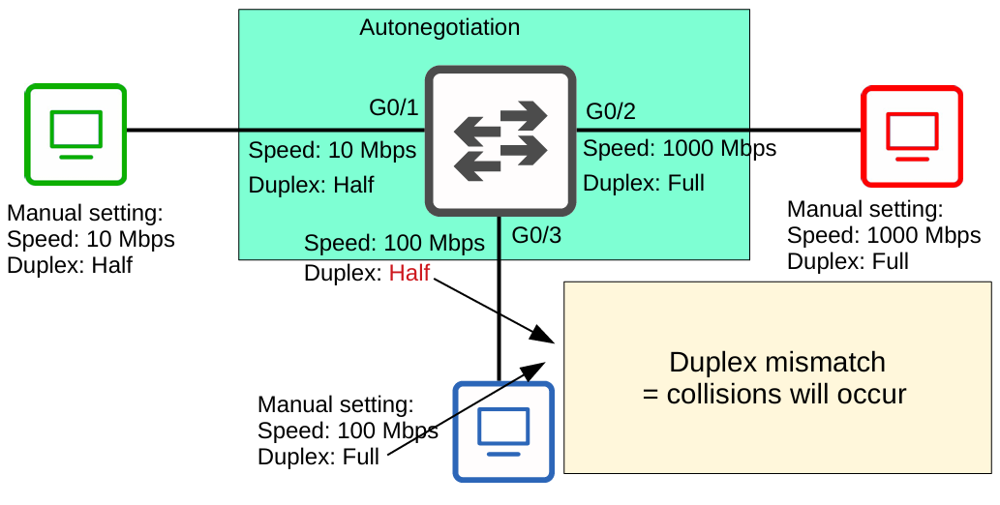

Un **duplex mismatch** ocurre cuando un lado está configurado en full duplex y el otro en half duplex, resultando en colisiones.

## Errores de Interface

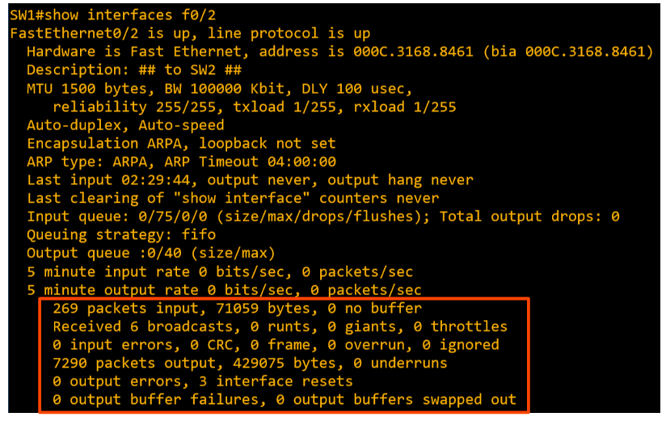

### Tipos de Errores Comunes:

| **Error** | **Descripción** |
|-----------|-----------------|
| **Runts** | Frames menores al tamaño mínimo (64 bytes) |
| **Giants** | Frames mayores al tamaño máximo (1518 bytes) |
| **CRC** | Frames que fallaron la verificación CRC (en el trailer FCS de Ethernet) |
| **Frame** | Frames con formato incorrecto debido a errores |
| **Input errors** | Total de varios contadores, incluyendo los cuatro anteriores |
| **Output errors** | Frames que el switch intentó enviar pero falló debido a errores |

### Comando para Ver Errores:
```bash
SW1# show interfaces
```

## Resumen de Comandos Clave

| **Comando** | **Propósito** |
|-------------|---------------|
| `show ip interface brief` | Muestra estado básico de interfaces |
| `show interfaces status` | Muestra estado detallado, velocidad, duplex y VLAN |
| `show interfaces` | Muestra contadores detallados y errores |
| `speed {auto\|10\|100\|1000}` | Configura velocidad de interface |
| `duplex {auto\|half\|full}` | Configura modo duplex de interface |
| `interface range` | Configura múltiples interfaces simultáneamente |

## Conceptos Clave Recordados

✅ **Diferencias entre router y switch interfaces por defecto**  
✅ **Configuración de velocidad y duplex**  
✅ **Autonegociación y sus limitaciones**  
✅ **Estados de interfaces y su interpretación**  
✅ **Tipos de errores de interface y troubleshooting**