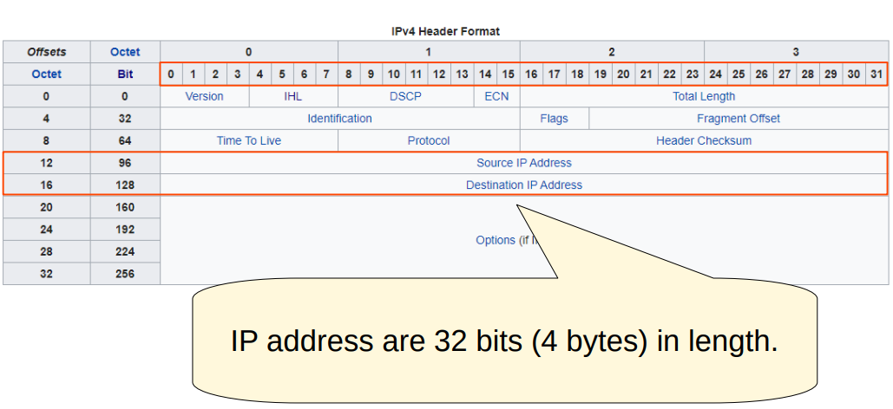

# 📚 CCNA 200-301: Día 7 - Direccionamiento IPv4 y Capa de Red

---

## 🌐 Capa de Red (Layer 3) del Modelo OSI

**Funciones principales:**

- Conectividad entre dispositivos en **diferentes redes** (fuera de la LAN)  
- Uso de **direcciones lógicas (IP)**  
- **Selección de rutas** entre origen y destino  
- Los **routers** operan en esta capa

```

OSI Model:
7 - Application
6 - Presentation
5 - Session
4 - Transport
3 - Network  <-- Layer 3
2 - Data Link
1 - Physical

```

---

## 💻 Enrutamiento (Routing)

- Los **switches (Capa 2)** no separan redes; conectan dispositivos dentro de la misma LAN  
- Al agregar un **router** entre dos switches, se crean **redes separadas**, cada una con su propio rango IP  

**Ejemplo de redes separadas:**  
- 192.168.1.0/24 (255.255.255.0)  
- 192.168.2.0/24 (255.255.255.0)  


- Los routers tienen **IP únicas en cada interfaz** dependiendo de la red a la que están conectados  
  - G0/0 → 192.168.1.254/24  
  - G0/1 → 192.168.2.254/24  

- Todos los hosts de una LAN comparten la **porción de red** del IP, pero el **host ID** es único  
  - Ejemplo: 192.168.1.100, 192.168.1.105, 192.168.1.205 → mismos primeros 3 octetos → misma red  

- Los mensajes de **broadcast** no atraviesan routers; permanecen dentro de la LAN local

---

## 📝 IPv4 Header

- **IP** es el protocolo principal de capa 3  
- IPv4 utiliza **32 bits (4 bytes)** por dirección  
- Cada octeto se representa en **binario**  
- Los encabezados contienen:  
  - IP de **origen**  
  - IP de **destino**

**Ejemplo:**  
- 192.168.1.254 → binario: `11000000.10101000.00000001.11111110`  
- Cada grupo de 8 bits se llama **OCTETO**  




---

## 🔢 Conversión Binario ↔ Decimal

**Binario → Decimal**:  
```

10001111 = 128 + 8 + 4 + 2 + 1 = 143
01110110 = 64 + 32 + 16 + 4 + 2 = 118
11101100 = 128 + 64 + 32 + 8 + 4 = 236

```

**Decimal → Binario (ejemplo con 221):**  
- Restamos de izquierda a derecha según los valores de los bits:  
```

221 - 128 = 93 → 1
93 - 64 = 29 → 1
29 - 32 = no → 0
29 - 16 = 13 → 1
13 - 8 = 5 → 1
5 - 4 = 1 → 1
1 - 2 = no → 0
1 - 1 = 0 → 1
Resultado: 11011101

```

**Otro ejemplo: 127 → 01111111**  
**Otro ejemplo: 207 → 11001111**  


---

## 🏷️ Clases de Direcciones IPv4

| Clase | Primer Octeto | Prefijo | Máscara      | Notas                      |
|-------|---------------|---------|-------------|----------------------------|
| A     | 0-127         | /8      | 255.0.0.0   | Redes grandes; 127 = loopback |
| B     | 128-191       | /16     | 255.255.0.0 | Redes medianas             |
| C     | 192-223       | /24     | 255.255.255.0 | Redes pequeñas            |
| D     | 224-239       | N/A     | N/A         | Multicast                  |
| E     | 240-255       | N/A     | N/A         | Reservadas / experimentales |

**Ejemplo:**  
- 12.128.251.23/8 → Clase A → Network: 12, Host: 128.251.23  
- 154.78.111.32/16 → Clase B → Network: 154.78, Host: 111.32  
- 192.168.1.254/24 → Clase C → Network: 192.168.1, Host: 254  


---

## 🧮 Netmask y Prefijo

- La **netmask** indica qué parte de la IP es red y qué parte es host  
- Se representa en **dotted decimal** o **prefijo /n**  

| Clase | Prefijo | Netmask           |
|-------|---------|-----------------|
| A     | /8      | 255.0.0.0       |
| B     | /16     | 255.255.0.0     |
| C     | /24     | 255.255.255.0   |

---

## 📌 Direcciones de Red y Broadcast

- **Network Address:** host todos 0 → identifica la red → no se asigna a host  
- **Broadcast Address:** host todos 1 → envía mensaje a toda la red → no se asigna a host  

**Ejemplo: 192.168.1.0/24**  
```

Network: 192.168.1.0
Hosts:   192.168.1.1 - 192.168.1.254
Broadcast: 192.168.1.255

```


---

## 🧮 Ejemplos de Conversión IPv4

**Binario → Decimal**

| Binario                        | Decimal       |
|--------------------------------|---------------|
| 00111111 00111000 11100111 00010011 | 63.56.231.19  |
| 11110011 01111111 01100010 00000001 | 243.127.98.1  |
| 01101111 00000110 01011001 11000111 | 111.6.89.199  |
| 11001111 11000110 00101111 01001100 | 207.198.47.76 |
| 01100100 11001001 00100001 11111101 | 100.201.33.253 |

**Decimal → Binario**

| Decimal         | Binario                          |
|----------------|----------------------------------|
| 88.46.90.91     | 01011000 00101110 01011010 01011011 |
| 221.234.246.163 | 11011101 11101010 11110110 10100011 |
| 3.41.143.222    | 00000011 00101001 10001111 11011110 |
| 10.200.231.91   | 00001010 11001000 11100111 01011011 |
| 248.87.255.152  | 11111000 01010111 11111111 10011000 |

---

## ❓ Quiz de Conversión IPv4

**Binario → Decimal**

1. `00111111 00111000 11100111 00010011` → 63.56.231.19  
2. `11110011 01111111 01100010 00000001` → 243.127.98.1  
3. `01101111 00000110 01011001 11000111` → 111.6.89.199  
4. `11001111 11000110 00101111 01001100` → 207.198.47.76  
5. `01100100 11001001 00100001 11111101` → 100.201.33.253  

**Decimal → Binario**

6. `88.46.90.91` → 01011000 00101110 01011010 01011011  
7. `221.234.246.163` → 11011101 11101010 11110110 10100011  
8. `3.41.143.222` → 00000011 00101001 10001111 11011110  
9. `10.200.231.91` → 00001010 11001000 11100111 01011011  
10. `248.87.255.152` → 11111000 01010111 11111111 10011000
```


