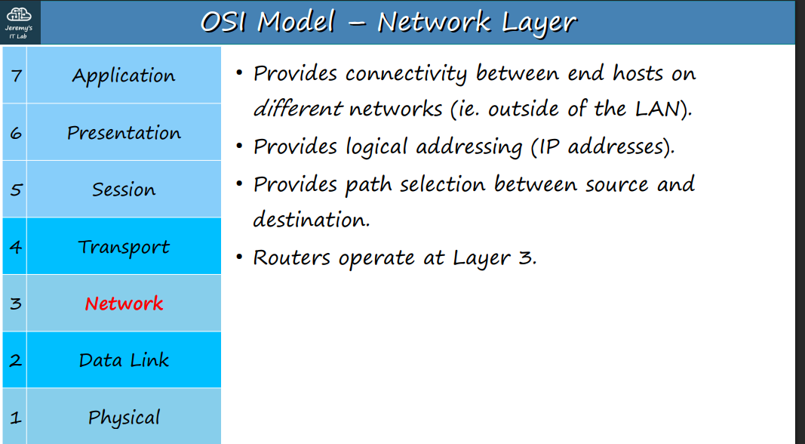
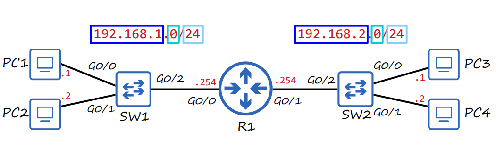
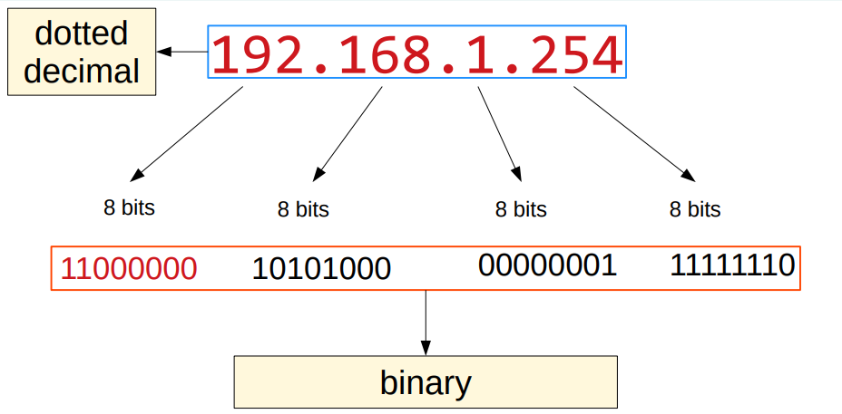
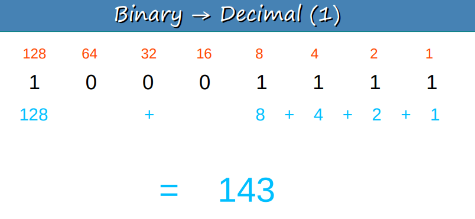

# 📚 CCNA 200-301: Día 7 - Direccionamiento IPv4 y Capa de Red

---

## 🌐 Capa de Red (Layer 3) del Modelo OSI

La **Capa de Red** es fundamental para la comunicación entre redes.

-   Proporciona conectividad entre dispositivos finales en **diferentes redes** (fuera de la LAN).
-   Utiliza **direcciones lógicas (IP)** para el enrutamiento.
-   Permite la **selección de rutas** entre origen y destino.
-   Los **routers** operan en esta capa.

---

## 💻 Enrutamiento (Routing)

El enrutamiento es el proceso de enviar paquetes de una red a otra. Un router utiliza la dirección IP de destino para determinar la mejor ruta.

---

## 🔢 Direccionamiento IPv4

Una dirección IPv4 es una dirección lógica de **32 bits (4 bytes)**.

### Conversión entre Binario y Decimal

Cada octeto (8 bits) se convierte a un valor decimal. Para convertir, se suman las potencias de 2 (128, 64, 32, 16, 8, 4, 2, 1) donde el bit es `1`.

-   **Ejemplo de Binario a Decimal:** `11000000` = (1\*128) + (1\*64) = **192**.

-   **Ejemplo de Decimal a Binario:** Para 168: `128` cabe en `168` (168-128=40), `64` no cabe en `40`, `32` sí (40-32=8), `16` no, `8` sí (8-8=0), y el resto no. Por lo tanto, `10101000`.

---

### Clases de Direcciones IPv4

Las direcciones IPv4 se dividen en clases, que determinan la porción de red y de host por defecto.

| Clase | Rango Numérico (Primer Octeto) | Longitud del Prefijo por Defecto | Máscara de Red (Netmask) por Defecto |
| :---- | :----------------------------- | :------------------------------- | :----------------------------------- |
| **A** | 0-127 | `/8` | `255.0.0.0` |
| **B** | 128-191 | `/16` | `255.255.0.0` |
| **C** | 192-223 | `/24` | `255.255.255.0` |
| **D** | 224-239 | `N/A` | `N/A (Multicast)` |
| **E** | 240-255 | `N/A` | `N/A (Reservada)` |

* **Direcciones de Loopback:** Rango `127.0.0.0` a `127.255.255.255`. Se usan para probar la pila de red localmente.
* **Direcciones Multicast:** Rango `224.0.0.0` a `239.255.255.255`. Usadas para comunicación de grupo.

---

## 📌 Direcciones de Red y Broadcast

Dentro de cada red, hay dos direcciones reservadas que no se pueden asignar a un host:

* **Dirección de Red:** Es la primera dirección de la red. La porción de host de la dirección está en **todos ceros**.

* **Dirección de Broadcast:** Es la última dirección de la red. La porción de host de la dirección está en **todos unos**.
    

---

## 🧠 Quiz de Conversión de Direcciones

### Preguntas de Conversión a Decimal

**1. Convierte la siguiente dirección IPv4 a notación decimal:**
`00111111 00111000 11100111 00010011`
**Respuesta:** `63.56.231.19`

**2. Convierte la siguiente dirección IPv4 a notación decimal:**
`11110011 01111111 01100010 00000001`
**Respuesta:** `243.127.98.1`

**3. Convierte la siguiente dirección IPv4 a notación decimal:**
`01101111 00000110 01011001 11000111`
**Respuesta:** `111.6.89.199`

**4. Convierte la siguiente dirección IPv4 a notación decimal:**
`11001111 11000110 00101111 01001100`
**Respuesta:** `207.198.47.76`

**5. Convierte la siguiente dirección IPv4 a notación decimal:**
`01100100 11001001 00100001 11111101`
**Respuesta:** `100.201.33.253`

### Preguntas de Conversión a Binario

**6. Convierte la siguiente dirección IPv4 a notación binaria:**
`88.46.90.91`
**Respuesta:** `01011000 00101110 01011010 01011011`

**7. Convierte la siguiente dirección IPv4 a notación binaria:**
`221.234.246.163`
**Respuesta:** `11011101 11101010 11110110 10100011`

**8. Convierte la siguiente dirección IPv4 a notación binaria:**
`3.41.143.222`
**Respuesta:** `00000011 00101001 10001111 11011110`

**9. Convierte la siguiente dirección IPv4 a notación binaria:**
`10.200.231.91`
**Respuesta:** `00001010 11001000 11100111 01011011`

**10. Convierte la siguiente dirección IPv4 a notación binaria:**
`248.87.255.152`
**Respuesta:** `11111000 01010111 11111111 10011000`